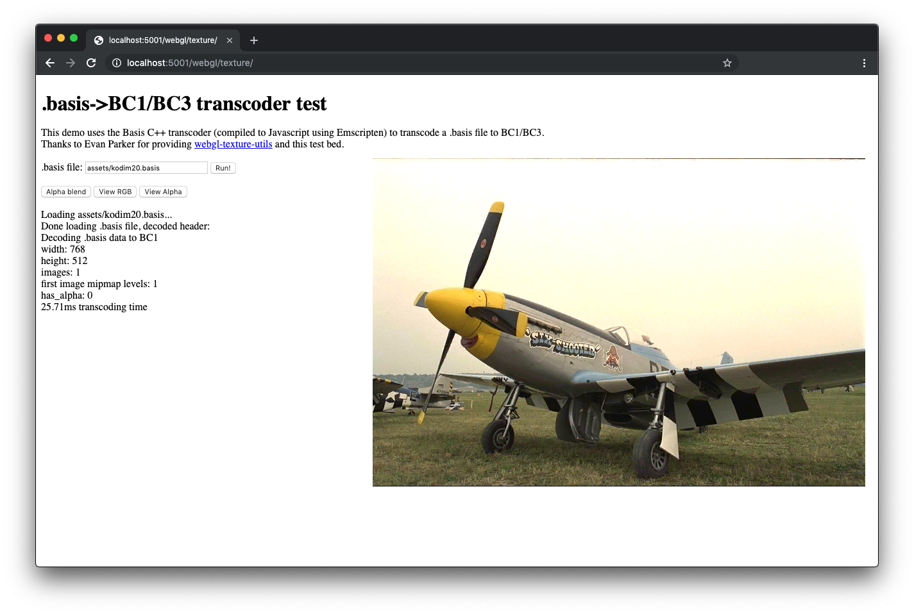
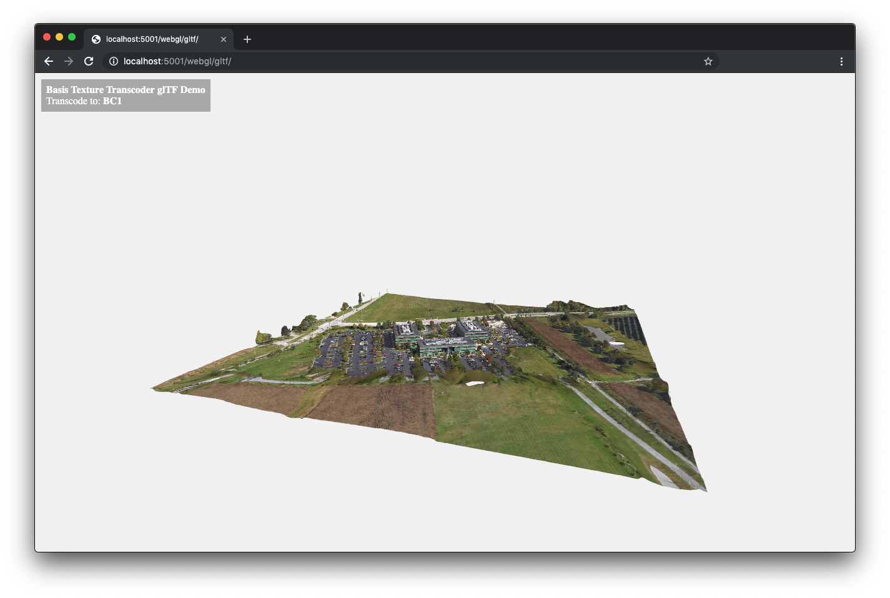

# basis_universal
Basis Universal GPU Texture and Texture Video Compression Codec

Basis Universal is a ["supercompressed"](http://gamma.cs.unc.edu/GST/gst.pdf) compressed GPU texture and [compressed texture video](http://gamma.cs.unc.edu/MPTC/) compression system that outputs a highly compressed intermediate file format (.basis) that can be quickly transcoded to a [very wide variety](https://github.com/BinomialLLC/basis_universal/wiki/OpenGL-texture-format-enums-table) of GPU compressed and uncompressed pixel formats: ASTC 4x4 L/LA/RGB/RGBA, PVRTC1 4bpp RGB/RGBA, PVRTC2 RGB/RGBA, BC7 mode 6 RGB, BC7 mode 5 RGB/RGBA, BC1-5 RGB/RGBA/X/XY, ETC1 RGB, ETC2 RGBA, ATC RGB/RGBA, ETC2 EAC R11 and RG11, FXT1 RGB, and uncompressed raster image formats 8888/565/4444. 

Basis files support non-uniform texture arrays, so cubemaps, volume textures, texture arrays, mipmap levels, video sequences, or arbitrary texture "tiles" can be stored in a single file. The compressor is able to exploit color and pattern correlations across the entire file, so multiple images with mipmaps can be stored very efficiently in a single file.

The system's bitrate depends on the quality setting and image content, but common usable bitrates are .3-1.25 bits/texel. .basis files are typically 10-25% smaller than using RDO texture compression of the internal texture data stored in the .basis file followed by LZMA. The current system is what we've been calling the "baseline" system, which is designed to reach all the GPU formats. The next major step is to extend the system to allow for much higher quality for the ASTC and BC7 texture formats. 

The transcoder has been fuzz tested using [zzuf](https://www.linux.com/news/fuzz-testing-zzuf).

So far, we've compiled the code using MSVS 2019, under Ubuntu x64 using cmake with either clang 3.8 or gcc 5.4, and emscripten 1.35 to asm.js. (Be sure to use this version or later of emcc, as earlier versions fail with internal errors/exceptions during compilation.) The compressor is multithreaded by default, but this can be disabled using the -no_multithreading command line option. The transcoder is currently single threaded.

A simple asm.js Texture Video demo is [here](http://binomial.biz/TextureVideoTest/).

### Important Usage Notes

**The "-q X" option controls the output quality.** The default is quality level 128. "-q 255" will increase quality quite a bit. If you want even higher quality, try "-max_selectors 16128 -max_endpoints 16128" instead of -q. -q internally tries to set the codebook sizes (or the # of quantization intervals for endpoints/selectors) for you. You need to experiment with the quality level on your content.

For tangent space normal maps, you should separate X into RGB and Y into Alpha, and provide the compressor with 32-bit/pixel input images. Or use the "-separate_rg_to_color_alpha" command line option which does this for you. The internal texture format that Basis Universal uses (ETC1S) doesn't handle tangent space normal maps encoded into RGB well. You need to separate the channels and recover Z in the pixel shader using z=sqrt(1-x^2-y^2).

### 3rd party code dependencies

The transcoder (in the "transcoder" directory) is a single .cpp source file library which has no 3rd party code dependencies.

The encoder uses [lodepng](https://lodev.org/lodepng/) for loading and saving PNG images, which is Copyright (c) 2005-2019 Lode Vandevenne. It uses the zlib license.

The encoder uses [tcuAstcUtil.cpp](https://chromium.googlesource.com/external/deqp/+/refs/heads/master/framework/common/tcuAstcUtil.cpp), from the [Android drawElements Quality Program (deqp) Testing Suite](https://source.android.com/devices/graphics/deqp-testing), for unpacking the transcoder's ASTC output for testing/validation purposes. This code is Copyright 2016 The Android Open Source Project, and uses the Apache 2.0 license. We have modified the code so it has no external dependencies, and disabled HDR support.

### Legal/IP/license stuff

Basis Universal uses texture compression formats or technologies created by several companies: ARM Holdings, AMD, Ericsson, Microsoft, and Imagination Technologies Limited. All are supported by various open standards or API's from [The Khronos Group](https://www.khronos.org/), such as OpenGL 4.5, OpenGL ES, or Vulkan. 

A few texture formats (such as AMD/ATI's ATC texture format, or PVRTC2) were not documented sufficiently by the originator of the format. In these cases, we relied on open source code references from other authors, or information in published articles/papers to implement support for those texture formats in our transcoder. These references are included here.

ASTC usage falls under ARM's [END USER LICENCE AGREEMENT FOR THE MALI ASTC SPECIFICATION AND SOFTWARE CODEC license agreement](https://github.com/ARM-software/astc-encoder/blob/master/LICENSE.md). 

PVRTC1/2: See the [PVRTC Specification and User Guide](https://www.imgtec.com/downloads/download-info/pvrtc-texture-compression-user-guide-2/). Imagination Technologies Limited, 23 Nov 2018. Also see the [Khronos Data Format Specification](https://www.khronos.org/registry/DataFormat/specs/1.3/dataformat.1.3.html). See [PVR Texture Compression Exploration](https://roartindon.blogspot.com/2014/08/pvr-texture-compression-exploration.html) and [PvrTcCompressor](https://bitbucket.org/jthlim/pvrtccompressor/src). Also see [Texture Compression Techniques](http://sv-journal.org/2014-1/06/en/index.php?lang=en#7-3).

ETC1 and ETC2 EAC: See the [Khronos Data Format Specification](https://www.khronos.org/registry/DataFormat/specs/1.3/dataformat.1.3.html) and the [OpenGL 4.5 Core Profile](https://www.khronos.org/registry/OpenGL/specs/gl/glspec45.core.pdf) Appendix C.

BC1-5,7: Part of Microsoft's Direct3D API technology. See [Texture Block Compression in Direct3D 11](https://docs.microsoft.com/en-us/windows/win32/direct3d11/texture-block-compression-in-direct3d-11). Also see the [squish library](https://github.com/Ethatron/squish-ccr).

ATC: See the OpenGL extension [GL_AMD_compressed_ATC_texture](https://www.khronos.org/registry/OpenGL/extensions/AMD/AMD_compressed_ATC_texture.txt). For low-level ATC texture format information, see [S3TConv](https://github.com/Triang3l/S3TConv) and the paper [A Method for Load-Time Conversion of DXTC Assets to ATC](http://www.guildsoftware.com/papers/2012.Converting.DXTC.to.ATC.pdf).

FXT1: See the OpenGL extension [GL_3DFX_texture_compression_FXT1](https://www.khronos.org/registry/OpenGL/extensions/3DFX/3DFX_texture_compression_FXT1.txt).

Also see [Intel® Open Source HD Graphics Programmers' Reference Manual (PRM)](https://01.org/sites/default/files/documentation/intel-gfx-bspec-osrc-chv-bsw-vol05-memory-views.pdf). This reference manual details how to encode FXT1, ETC1, ETC2, EAC, DXT/BC1-3, BC4/5/7, and ASTC.

### Release notes

9/26/19 release notes:
- Automatic global selector palettes are disabled by default, because searching the virtual selector codebook is very slow.
You can enable them by specifying -auto_global_sel_pal on the command line, for slightly smaller files on small textures/images.
- PVRTC2 RGB support added. This format looks great and transcoding is fast - approximately as good as BC1. It supports non-power of 2, non-square textures, and should be used instead of PVRTC1 whenever possible.
- PVRTC2 RGBA support added. This format looks OK if the texture has a very simple alpha channel (like simple opacity mask). The texture should use premulitplied alpha, otherwise on alpha=0 pixels the color channel may slightly leak into the alpha channel due to issues with the PVRTC2 format itself. Transcoding is fast unless the texture's alpha channel is very complex.
It's a tossup whether PVRTC1 or PVRTC2 would look better for alpha textures. 
- ETC2 EAC R11/RG11 (unsigned) support checked in. Thanks to Juan Linietsky for suggesting it.
- The format enum names have changed, but I tried to keep compatibility with old code. The actual values haven't changed so Javascript code should work without modifications. 
- We're now using "enum class transcoder_texture_format" instead of "enum transcoder_texture_format" in basisu_transcoder.h
- Fixed a couple encoder bugs (one assert in basisu_enc.h), and a uninitialized variable issue in the frontend. Neither issue would cause corrupted files or artifacts.
- FXT1 RGB support is checked in, for Intel/3DFX GPU's. Mostly for completeness and to test block sizes other than 4x4.
- The PVRTC1 wrap vs. clamp flag has been removed from the entire codebase, because PVRTC1 always uses wrap addressing when fetching the adjacent blocks (even when the user selects clamp UV addressing).

Milestone 2 (9/19/19) release notes:

- **Beware that the "transcoder_texture_format" enum names and their values are in flux** as we add new texture formats.
This issue particularly affects Javascript code. Passing the old enum values to the transcoder will cause bugs. 
We are adding a few more texture formats, renaming the enums and then stabilizing them on the next minor release (within a couple days or so).
- This is a major transcoder update. The encoder hasn't been modified at all. 
A minor update will be coming in a couple days which adds additional lower priority formats (notable PVRTC2 4bpp RGB) to the transcoder.
- When the "BASISD_SUPPORT_BC7" transcoder macro is set to 0, both mode 5 and mode 6 BC7 transcoders are disabled.
When cross compiling the transcoder for Web use to WebAssembly/asm.js, be sure to set BASISD_SUPPORT_BC7=0. You can also just disable the mode 6 transcoder by just setting BASISD_SUPPORT_BC7_MODE6_OPAQUE_ONLY=0.
The older BC7 mode-6 RGB function seriously bloats the transcoder's compiled size. (The mode-6 transcoder is of marginal value and might be disabled by default or just removed.) The new BC7 mode 5 RGB/RGBA transcoder uses substantially smaller lookup tables and provides basically the same quality as mode-6 for RGB (becaue we're starting with ETC1S texture data.)
Set BASISD_SUPPORT_BC7_MODE6_OPAQUE_ONLY to 0 when compiling on platforms which don't support BC7 well/at all, or if transcoder size is an issue.
- Added ATC RGB/RGBA, ASTC 4x4 L/LA/RGB/RGBA, BC7 mode 5 RGB/RGBA, and PVRTC1 4bpp RGBA support to the transcoder and KTX writer.
- Major perf. optimizations to all the transcoders. Transcoding to BC1 is approx. 2x faster when compiled native and executed on a Core i7. Similar perf. improvements should be seen when executed in WebAssembly. This was done by more closely coupling the .basis file decompression and format transcoding steps (before we unpacked to plain ETC1/ETC1S, then transcoded those bits, which was costly.)
- PVRTC1 4bpp RGB opaque is slightly higher quality 
- Added various uncompressed raster pixel formats to the transcoder. When outputting raw pixels, the transcoder writes to regular raster images, not blocks. 
No dithering or downsampling yet, but it's coming.
A couple of the parameters to basisu_transcoder::transcode_image_level() and  basisu_transcoder::transcode_slice() have new meanings when these methods are used with uncompressed raster pixel formats:
"output_blocks_buf_size_in_blocks_or_pixels" and "output_row_pitch_in_blocks_or_pixels". There's also a new parameter, "output_rows_in_pixels". When transcoding to uncompressed raster pixel formats, these parameters are in pixels, not blocks. The output buffer is also treated as a plain raster image, not a 2D array of compressed blocks. These parameters are sanity checked, and if they look fishy the transcoder will return an error.
- basisu command line tool's "-level" command line option changed to "-comp_level", to avoid confusion vs. the "-q" option. This option is NOT the same as the -q option, which directly controls the output quality. Most users shouldn't use this option. (See below.)

### Command Line Compression Tool

The command line tool used to create, validate, and transcode/unpack .basis files is named "basisu". Run basisu without any parameters for help. Note this tool uses the reference encoder.

To build basisu:

```
cmake CMakeLists.txt
make
```

To compress a sRGB image to .basis:

`basisu x.png`

Note that basisu defaults to sRGB colorspace metrics. If the input is a normal map, or some other type of non-sRGB (non-photographic) texture content, be sure to use -linear to avoid extra unnecessary artifacts.

To add automatically generated mipmaps to the .basis file, at a higher than default quality level (which ranges from [1,255]):

`basisu -mipmap -q 190 x.png`

There are several mipmap options that allow you to change the filter kernel, the filter colorspace for the RGB channels (linear vs. sRGB), the smallest mipmap dimension, etc. The tool also supports generating cubemap files, 2D/cubemap texture arrays, etc.

To create a slightly higher quality .basis file (one with better codebooks) at the default quality level (128) - note this is much slower to encode:

`basisu -comp_level 2 x.png`

To unpack a .basis file to multiple .png/.ktx files:

`basisu x.basis`

The mipmapped or cubemap .KTX files will be in a wide variety of compressed GPU texture formats (PVRTC1 4bpp, ETC1-2, BC1-5, BC7, etc.), and to my knowledge there is no single .KTX viewer tool that correctly and reliably supports every GPU texture format that we support. BC1-5 and BC7 files are viewable using AMD's Compressonator, ETC1/2 using Mali's Texture Compression Tool, and PVRTC1 using Imagination Tech's PVRTexTool. Links:

[Mali Texture Compression Tool](https://developer.arm.com/tools-and-software/graphics-and-gaming/graphics-development-tools/mali-texture-compression-tool)

[Compressonator](https://gpuopen.com/gaming-product/compressonator/)

[PVRTexTool](https://www.imgtec.com/developers/powervr-sdk-tools/pvrtextool/)

After compression, the compressor transcodes all slices in the output .basis file to validate that the file decompresses correctly. It also validates all header, compressed data, and slice data CRC16's.

For best quality, you must supply basisu with original uncompressed source images. Any other type of lossy compression applied before basisu (including ETC1/BC1-5, BC7, JPEG, etc.) will cause multi-generational artifacts to appear in the final output textures. 

For the maximum possible achievable quality with the current format and encoder (completely ignoring encoding speed!), use:

`basisu x.png -comp_level 5 -max_endpoints 16128 -max_selectors 16128 -no_selector_rdo -no_endpoint_rdo`

Level 5 is extremely slow, so unless you have a very powerful machine, levels 2-4 are recommended.

Note that "-no_selector_rdo -no_endpoint_rdo" are optional. Using them hurts rate distortion performance, but increases quality. An alternative is to use -selector_rdo_thresh X and -endpoint_rdo_thresh, with X ranging from [1,2] (higher=lower quality/better compression - see the tool's help text).

To compress small video sequences, say using tools like ffmpeg and VirtualDub:

`basisu -comp_level 1 -tex_type video -stats -debug -multifile_printf "pic%04u.png" -multifile_num 200 -multifile_first 1 -max_selectors 16128 -max_endpoints 16128 -endpoint_rdo_thresh 1.05 -selector_rdo_thresh 1.05`

The reference encoder will take a LONG time and a lot of CPU to encode video. The more cores your machine has, the better. Basis is intended for smaller videos of a few dozen seconds or so. If you are very patient and have a Threadripper or Xeon workstation, you should be able to encode up to a few thousand 720P frames. The "webgl_videotest" directory contains a very simple video viewer.

The .basis file will contain multiple images (all using the same global codebooks), which you can retrieve using the transcoder's image API. The system now supports [conditional replenisment](https://en.wikipedia.org/wiki/MPEG-1) (CR, or "skip blocks"). CR can reduce the bitrate of some videos (highly dependent on how dynamic the content is) by over 50%. For videos using CR, the images must be requested from the transcoder in sequence from first to last, and random access is only allowed to I-Frames. 

If you are doing rate distortion comparisons vs. other similar systems, be sure to experiment with increasing the endpoint RDO threshold (-endpoint_rdo_thresh X). This setting controls how aggressively the compressor's backend will combine together nearby blocks so they use the same block endpoint codebook vectors, for better coding efficiency. X defaults to a modest 1.5, which means the backend is allowed to increase the overall color distance by 1.5x while searching for merge candidates. The higher this setting, the better the compression, with the tradeoff of more block artifacts. Settings up to ~2.25 can work well, and make the codec more competitive. "-endpoint_rdo_thresh 1.75" is a good setting on many textures.

For video, level 1 should result in decent results on most clips. For less banding, level 2 can make a big difference. This is still an active area of development, and quality/encoding perf. will improve over time.

### Compression levels (advanced option)

The encoder supports multiple compression "effort" levels using the "-comp_level X" command line option, where X ranges from [0,5]. Note that most users shouldn't be messing around with -comp_level. The -q option is the main option to control the quality level of .basis files. -comp_level is mostly intended for harder to handle content such as texture video. It modifies a number of internal encoder configuration parameters, which slows it down a bunch but allows it to achieve slightly higher quality per output bit.

This option (along with -q or manually setting the codebook sizes) controls the tradeoff between encoding time and overall quality. The default is level 1, which is the sweet spot between encoding speed vs. overall quality. Here's a graph showing the encoding time and average quality across 59 images for each level:


This benchmark was done on a 20 core Xeon workstation. The results will be different on less powerful machines.

Level 0 is fast, but this level disables several backend optimizations so it will generate larger files. It will also be quite brittle on complex textures or artificial textures.

Note that -comp_level 2 is equivalent to the initial release's default, and -comp_level 4 is equivalent to the initial release's "-slower" option. Also, -slower is now equivalent to level 2 (not 4).

### More detailed examples

`basisu x.png`\
Compress sRGB image x.png to x.basis using default settings (multiple filenames OK)

`basisu -q 255 x.png`\
Compress sRGB image x.png to x.basis at max quality level achievable without  manually setting the codebook sizes (multiple filenames OK)

`basisu x.basis`\
Unpack x.basis to PNG/KTX files (multiple filenames OK)

`basisu -validate -file x.basis`\
Validate x.basis (check header, check file CRC's, attempt to transcode all slices)

`basisu -unpack -file x.basis`\
Validates, transcodes and unpacks x.basis to mipmapped .KTX and RGB/A .PNG files (transcodes to all supported GPU texture formats)

`basisu -q 255 -file x.png -mipmap -debug -stats`\
Compress sRGB x.png to x.basis at quality level 255 with compressor debug output/statistics

`basisu -linear -max_endpoints 16128 -max_selectors 16128 -file x.png`\
Compress non-sRGB x.png to x.basis using the largest supported manually specified codebook sizes

`basisu -linear -global_sel_pal -no_hybrid_sel_cb -file x.png`\
Compress a non-sRGB image, use virtual selector codebooks for improved compression (but slower encoding)

`basisu -linear -global_sel_pal -file x.png`\
Compress a non-sRGB image, use hybrid selector codebooks for slightly improved compression (but slower encoding)

`basisu -tex_type video -framerate 20 -multifile_printf "x%02u.png" -multifile_first 1 -multifile_count 20 -selector_rdo_thresh 1.05 -endpoint_rdo_thresh 1.05`\
Compress a 20 sRGB source image video sequence (x01.png, x02.png, x03.png, etc.) to x01.basis

`basisu -comp_level 2 -q 255 -file x.png -mipmap -y_flip`\
Compress a mipmapped x.basis file from an sRGB image named x.png, Y flip each source image, set encoder to level 2 for slightly higher quality (but slower encoding).

### WebGL test 

The "WebGL" directory contains two very simple WebGL demos that use the transcoder compiled to wasm with [emscripten](https://emscripten.org/). See more details [here](webgl/README.md).




### .basis baseline file format forwards and backwards compatibility

Short form: Old transcoders will always be able to read baseline compressed texture data written by new encoders. And new transcoders will always still be able to read old .basis files generated by old encoders.

We have no intentions of changing the baseline file format (i.e. the file format written by this encoder), apart from critical bug fixes. We will be extending the format in the future to add features to the system, but old transcoders will still be able to transcode baseline texture data from .basis files written using new transcoders. .basis files are intended for very wide distribution of compressed texture data, like .jpeg or .png, so backwards and forwards compatibility is critical.

So if you compile and ship the transcoder into an application today, we are making a guarantee to you that this transcoder will stay relevant/usable even as we enhance the system. To do this, the file format has the ability to be extended.

Note: The one exception to this promise are .basis textures marked as video. We will be changing how a key symbol is interpreted to introduce skip blocks (conditional replenishment) into the system.

### Encoder speed

Total time for basisu.exe to compress a 1024x1024 texture on a 7 year old 4-core 2.2GHz Core i7 laptop - timings are "without mipmaps/with mipmaps":

* -comp_level 0: 

-q 128: 2.2/3.5 secs

-q 255: 1.5/2.5 secs

* -comp_level 1:

-q 128: 4.1/6.2 secs

-q 255: 6.4/9.4 secs

### Transcoder details

The transcoder unpacks .basis files directly to various GPU texture formats, almost always without needing to decompress and recompress each block at the pixel level (which would be too slow and energy intensive in Javascript/WebAssembly). Small precomputed lookup tables are used to accelerate the direct conversion of the internal ETC1S format texture data to the desired output texture data. This new approach to GPU texture compression bypasses the need to recompress each block's pixels to the desired output format using Principle Component Anaylsis (PCA), or spend cycles determining the output selectors for each individual pixel. The ETC1S texture format is a strong subset of all the other block texture formats. The one exception is PVRTC1, where the transcoder needs to recompute the per-pixel selector ("modulation") values, but it does so using simple scalar operations.

To use .basis files in an application, you only need the files in the "transcoder" directory. The entire transcoder lives in a single .cpp file: transcoder/basisu_transcoder.cpp. If compiling with gcc/clang, be sure strict aliasing is disabled when compiling this file, as I have not tested either the encoder or transcoder with strict aliasing enabled: -fno-strict-aliasing (The Linux kernel is also compiled with this option.) The transcoder can also be cross compiled using emscripten (emcc), for web use.

To use the transcoder, #include "transcoder/basisu_transcoder.h". Call `basist::basisu_transcoder_init()` a single time (probably at startup). Also, ideally once at startup, you need to create a single instance of the `basist::etc1_global_selector_codebook` class, like this:

`basist::etc1_global_selector_codebook sel_codebook(basist::g_global_selector_cb_size, basist::g_global_selector_cb);`

Now you can use the transcoder, which is implemented in the "basisu_transcoder" class in transcoder/basisu_transcoder.h. The key methods are `start_decoding()`, `get_total_images()`, `get_image_info()`, `get_image_level_info()`, and `transcode_image_level()`. 

I will be simplifying the transcoder so the caller doesn't need to deal with etc1_global_selector_codebook's next. To get an idea how to use the API, you can check out WebGL/basis_wrappers.cpp.

`transcode_image_level()` and `transcode_slice()` are thread safe, i.e. you can decompress multiple images/slices from multiple threads. 

To get development error messages printed to stdout when something goes wrong inside the transcoder, set the BASISU_DEVEL_MESSAGES macro to 1 in basisu_transcoder.h and recompile.

### Shrinking the transcoder's compiled size

These transcoder macros control which formats are supported by the transcoder at compile-time:

- BASISD_SUPPORT_DXT1 (BC1)
- BASISD_SUPPORT_DXT5A (BC3/4/5)
- BASISD_SUPPORT_BC7
- BASISD_SUPPORT_BC7_MODE6_OPAQUE_ONLY
- BASISD_SUPPORT_BC7_MODE5
- BASISD_SUPPORT_PVRTC1
- BASISD_SUPPORT_ETC2_EAC_A8
- BASISD_SUPPORT_ASTC
- BASISD_SUPPORT_ATC
- BASISD_SUPPORT_ASTC_HIGHER_OPAQUE_QUALITY
- BASISD_SUPPORT_ETC2_EAC_RG11
- BASISD_SUPPORT_FXT1
- BASISD_SUPPORT_PVRTC2

Each format requires its own set of precomputed ETC1S conversion tables. Disabling a format that you know will never be utilized will reduce the compiled size of the transcoder. 

If you know your platform doesn't support BC7 or it's not necessary, be sure to set BASISD_SUPPORT_BC7=0. The tables for the mode 6 transcoder are very large (they bloat the compiled WebAssembly transcoder by around 400-500k). We'll probably be removing the mode 6 transcoder in a future update. 

The ATC format (which achieves nearly the same quality as BC1/BC3) is for Adreno mobile devices only, and most of these devices probably support one of the newer texture formats. On many platforms/devices/API's you can disable it.

### Quick Basis file details

Internally, Basis files are composed of a non-uniform texture array of one or more 2D ETC1S texture "slices". ETC1S is a simple subset of the ETC1 texture format popular on Android. ETC1S has no block flips, no 4x2 or 2x4 subblocks, and each block only uses 555 base colors. ETC1S is still 100% standard ETC1, so transcoding to ETC1 or the color block of ETC2 is a no-op. We chose ETC1S because it has the very valuable property that it can be quickly transcoded to almost any other GPU texture format at very high quality using only simple per-block operations with small 1D lookup tables. Transcoding ETC1S to BC1 usually only introduces around .3 dB Y PSNR quality loss, with less loss for ETC1S->BC7. Transcoding to PVRTC1 involves only simple block level operations to compute the endpoints, and simple per-pixel scalar operations to compute the modulation values.

Basis files have a single set of compressed global endpoint/selector codebooks in ETC1S format, which all slices utilize. The ETC1S texture data is compressed using vector quantization (VQ) separately on the endpoints and selectors, followed by DPCM/RLE/psuedo-MTF/canonical Huffman coding. Each ETC1S texture slice may be a different resolution. Mipmaps (if any) are always stored in order from largest to smallest level. The file format supports either storing the selector codebook directly (using DPCM+Huffman), or storing the selector codebook using a hierarchical virtual codebook scheme. 

Once the codebook and Huffman tables are decompressed, the slices are randomly accessible in any order. Opaque files always have one slice per image mipmap level, and files with alpha channels always have two slices per image mipmap level (even if some images in the file don't have alpha channels, i.e. alpha is all or nothing at the file level). The transcoder abstracts these details away into a simple "image" API, which is what most callers will use. An image is either one or more RGB slices (one per mipmap level), or one or more pairs of RGB/A slices (two per mipmap level). Internally, alpha slices are also stored in ETC1S format, like the color data, so selector correlations across color/alpha can be exploited. This also allows both RGB and alpha slices to be transcoded to opaque-only texture formats like ETC1, BC1, or PVRTC1 with no transparency.

We currently only support CPU transcoding, but GPU assisted transcoding/format conversion is also possible by uploading the decompressed codebooks as textures and using compute shaders to convert the ETC1S codebook block indices to the desired output texture or pixel format.

### Calling the encoder from C/C++

I'm going to provide a simple C-style API to call the encoder directly. For now, you can call the C++ interface in basisu_comp.cpp/.h. See struct basis_compressor_params and class basis_compressor. Almost the entire command line tool's functionality is in basis_compressor. This class supports 100% in-memory compression with no file I/O.

### GPU texture format support details

Here's a [table](https://github.com/BinomialLLC/basis_universal/wiki/OpenGL-texture-format-enums-table) showing the supported compressed texture formats and their corresponding OpenGL texture formats.

Internally, all ETC1S slices can be converted to any format, and the system is very flexible. The transcoder's image API supports converting alpha slices to color texture formats, which allows the user to transcode textures with alpha to two ETC1 images, etc.

ETC1 - The system's internal texture format is ETC1S, so outputting ETC1 texture data is a no-op. We only use differential encodings, each subblock uses the same base color (the differential color is always [0,0,0]), and flips are always enabled.

ETC2 - The color block will be ETC1S, and the alpha block is EAC. Conversion from ETC1S->EAC is very fast and nearly lossless.

BC1/DXT1 - ETC1S->BC1 conversion loses approx. .3-.5 dB Y PSNR relative to the source ETC1S data. We don't currently use 3 color (punchthrough) blocks, but we could easily add them. Conversion to BC1 is very fast.

BC3/DXT5 - The color block is BC1, the alpha block is BC4. ETC1S->BC4 is nearly lossless and very fast.

BC4/DXT5A - ETC1S->BC4 conversion is nearly lossless and very fast.

BC5/3DC/DXN - Two BC4 blocks. As the conversion from ETC1S->BC4 blocks is nearly lossless, we think this format (with large codebooks) will work well with high quality tangent space normal maps. Each channel gets its own ETC1S texture. Transcoding is very fast.

BC7 - There are two transcoders, one for mode 6 RGB, and another for mode 5 RGB/RGBA. The conversion from ETC1S->BC7 mode 6 is nearly lossless, but the tables are very large. It is highly recommended you disable BC7 entirely (BASISD_SUPPORT_BC7=0) or disable the mode 6 transcoder (BASISD_SUPPORT_BC7_MODE6_OPAQUE_ONLY=0) at compilation time on platforms (like WebAssembly) where the compiled transcoder size matters.

Transcoding to BC7 mode 5 is very fast, mode 6 is slightly slower.

PVRTC1 4bpp - There are two transcoders, one for RGB and another for RGBA. The conversion from ETC1S->PVRTC1 RGB is a two step process. The first step finds the RGB bounding boxes of each ETC1S block, which is fast (we don't need to process the entire block's pixels, just the 1-4 used block colors). The first pass occurs during ETC1S transcoding. The second pass computes the per-pixel 2-bpp modulation values, which is fast because we can do this in a luma-like colorspace using simple scalar (not full RGB) operations. The second pass is highly optimized, and threading it would be easy. Quality is roughly the same as PVRTexTool's "Normal (Good Quality)" setting. ETC1S->PVRTC1 loses the most quality - several Y dB PSNR. 

ETC1S->PVRTC1 RGBA is a three step process: first we unpack the ETC1S RGB slice, then the ETC1S A slice to a temp buffer, then we pack this data to PVRTC1 RGBA. The real-time transcoder is really only intended for relatively simple alpha channels, like opacity masks. If the output is too decorrelated or too complex opaque quality really suffers. We know how to improve PVRTC1 quality, but it would require another pass through the texture which would slow things down.

Interestingly, the low pass filtering-like artifacts due to PVRTC1's unique block endpoint interpolation help obscure ETC1S chroma artifacts. 

Currently, the PVRTC1 transcoder requires that the ETC1S texture's dimensions both be a power of two (but non-square is OK, although I believe iOS doesn't support that). We will be adding the ability to transcode non-pow2 ETC1S textures to larger pow2 PVRTC1 textures soon.

Note that for PVRTC1, the transcoder differs slightly in how it computes the memory size of compressed textures. Basis only writes (or requires) the output buffer to be total_blocks * bytes_per_block. But OpenGL requires extra padding for very small textures:

			 // https://www.khronos.org/registry/OpenGL/extensions/IMG/IMG_texture_compression_pvrtc.txt
			 const uint32_t width = (orig_width + 3) & ~3;
			 const uint32_t height = (orig_height + 3) & ~3;
			 const uint32_t size_in_bytes = (std::max(8U, width) * std::max(8U, height) * 4 + 7) / 8;
       
When you call the transcoder and pass it a buffer that's larger than required, these extra padding bytes will be set to 0.

PVRTC2 RGB - Fast and almost as high quality as BC1. It supports non-square, non-power of 2 textures.

PVRTC2 RGBA - This format is slower and much more complex than PVRTC2 RGB. It will only work well with textures using premultiplied alpha. The alpha channel should be relatively simple (like opacity maps).

ETC2 EAC R11/RG11 - R11 is roughly equivalent to BC4, and RG11 is like BC5. Transcoding is very fast and high quality.

ASTC 4x4 - The ASTC transcoder supports void extent (constant color) blocks and several different endpoint precision modes and encodings: L, LA, RGB or RGBA. To shrink the compiled size of the ASTC transcoder, set BASISD_SUPPORT_ASTC_HIGHER_OPAQUE_QUALITY to 0, which lowers endpoint precision slightly.

Note the ASTC transcoder assumes sRGB sampling won't be enabled when sampling the ASTC texture data. (ASTC decompression works slightly differently when sRGB reads are enabled vs. disabled.) Enabling sRGB reads will result in a tiny amount of higher error that is unlikely to be noticeable. This was a conscious decision we had to make because we could only afford to include one set of precomputed ETC1S->ASTC conversion tables into the transcoder. We may put in two tables into the next transcoder release and let the user decide what they want at compile and/or run-time.

ATI ATC - There are two transcoders, one for RGB (which is similar to BC1), and one for RGBA_INTERPOLATED_ALPHA (which is basically a BC4 block followed by an ATC block). This format is only useful on Adreno GPU's, so to cut down on the transcoder's size you can set BASISD_SUPPORT_ATC to 0 at compilation time if you know you'll never need ATC data. Quality is very similar to BC1/BC3.

RGB565, BGR564, ARGB 8888 and ARGB 4444 - Various uncompressed raw pixel formats. Internally the transcoder directly converts the ETC1S endpoint/selector data directly to uncompressed pixels. The output buffer is treated as a plain raster image, not as a 2D array of blocks. No dithering or downsampling is supported yet.

### How to use the system 

First, become familiar with the exact compressed texture formats your device hardware *and* rendering API support. Just because your device supports a particular format (like PVRTC2) doesn't mean your OS or API does (iOS doesn't support PVRTC2, even though their hardware did). On Android, ETC1/2 are popular. iOS supports PVRTC1 (pretty much always) and possibly ETC1/2 (but absolutely don't bet on it), and on desktop BC1-5/BC7 are king.

Also, become familiar with any texture size restrictions. For example, on iOS, you can only use square power of 2 texture dimensions for PVRTC1, and there's nothing Basis can do for you today that works around this limitation. (We will be supporting the ability to trancode smaller non-pow2 textures into larger power of 2 PVRTC1 textures soon.)

The primary issues that trip up mobile native/WebGL app developers: Older ETC1-only devices, which require some sort of annoying fallback to handle alpha textures. PVRTC1's requirement for square (on iOS) power of 2 texture dimensions (Android/iOS), and PVRTC1's unique artifacts compared to all the other formats also cause developer's issues.

ETC2 EAC RGBA and ASTC work around these issues, but these formats are still not available everywhere yet (especially WebGL on iOS, which still only supports PVRTC1 even on hardware that supports ETC1/2 or ASTC). Unfortunately PVRTC2 (which we're supporting next) was never supported on iOS, even on hardware that could handle it.

Here are the major texturing scenarios the system supports:

1. For color-only textures, you can transcode to whatever format your target device supports. Remember that PVRTC1 requires square power of 2 size textures, and there's nothing Basis can currently do to help you work around this limitation. (Basic supports non-square PVRTC1 textures, but iOS doesn't.) For devices which support both ASTC and PVRTC1, ASTC will be much higher quality. For devices supporting both PVRTC2 and ASTC, for most opaque textures you can probably use PVRTC2 which will conserve memory.

2. For alpha textures, you can create .basis files with alpha channels. To do this with the basisu compressor, either create 32-bit PNG files with alpha, or use two PNG files with the "-alpha_file" command line option to specify where the alpha data should come from. (For texture arrays, you can use multiple -file and -alpha_file command line options. Mipmap generation automatically supports alpha channels.) 

Now deploy alpha content like this:

ETC1-only devices/API's: Transcode to two ETC1 textures and sample and recombine them in a shader. You can either use one ETC1 texture that's twice as high/wide, or two separate ETC1 textures. Alternatly, you can transcode to a single 4444 or 8888 texture.

ETC2 devices/API's: Just transcode to ETC2 EAC RGBA. ETC2 EAC's alpha quality is similar to BC3, and very high.

PVRTC1 devices/API's: Use a single PVRTC1 RGBA texture. For more complex alpha channels, transcode to two PVRTC1 4bpp textures, and sample twice. The PVRTC1 encoder is a real-time encoder, so you'll need to evaluate it on your texture/image data. If the alpha data is too complex or decorrelated both RGB and A quality will seriously suffer. (Sorry - PVRTC1 is an unforgiving format.)

Devices/API's supporting only BC1-5: Use BC3, which the transcoder supports. BC3's quality  is very high.

Newer devices supporting BC7: Transcode to BC7 mode 5, which supports a high-quality alpha channel. Quality will be similar to BC3.

Devices/API's supporting ASTC: Just transcode to ASTC, which supports a variety of internal block encodings that will be automatically chosen by the transcoder for every block: L, LA, RGB, RGBA. If the device supports both PVRTC1/2 and ASTC, ASTC 4x4 will give you more reliable and much higher quality than PVRTC1/2, but it uses up twice as much RAM (8bpp vs 4bpp).

Device's/API's supprting ATC: Transcode to ATC_RGBA_INTERPOLATED_ALPHA. This format is basically equivalent to BC3.

Device's/API's supporting PVRTC2: The real-time PVRTC2 RGBA transcoder can only handle simple opacity maps. You'll need to experiment to see if it's high enough quality. For devices which support both PVRTC2 and ASTC, ASTC 4x4 is preferable for alpha content although it will require 2x as much memory.

3. For high quality tangent space normal maps, here's one suggested solution that should work well today:

Compress with the -normal_map flag, which disables a lot of stuff that has interfered with normal maps in the past. Also compress with -comp_level 2-4, which creates the highest quality codebooks. Use larger codebooks (use the -max_endpoints and -max_selectors options directly, with larger values).

Start with 2 component normalized XY tangent space normal maps (where XY range from [-1,1]) and encode them into two 8-bit channels (where XY is packed into [0,255]). Now put X in color, and Y in alpha, and compress that 32-bit PNG using basisu. The command line tool and encoder class support the option "-separate_rg_to_color_alpha" that swizzles 2 component RG normal maps to RRRG before compression, aiding this process.

ETC1 only devices/API's: Transcode to two ETC1 textures and sample them in a shader, or use an uncompressed format. You can either use one ETC1 texture that's twice as high/wide, or two separate ETC1 textures. The transcoder supports transcoding alpha slices to any color output format using a special flag: `basist::basisu_transcoder::cDecodeFlagsTranscodeAlphaDataToOpaqueFormats`. This will look great because each channel gets its own endpoints and selectors.

ETC2 devices/API's: Transcode to a single ETC2 EAC RGBA or a ETC2 EAC RG11 texture, sample once in shader. This should look great.

PVRTC1 devices/API's: Transcode to two PVRTC1 opaque textures (RGB to one, A to another, which the transcoder supports using the cDecodeFlagsTranscodeAlphaDataToOpaqueFormats flag) and sample each in the shader. This should look fairly good. Its doubtful the PVRTC1 RGBA transcoder could handle two complex channels of data well.

Devices/API's supporting BC1-5, BC6H, BC7: Transcode to a single BC5 textures, which used to be called "ATI 3DC". It has two high quality BC4 blocks in there, so it'll look great. You could also use BC7 mode 5, although BC5 will have slightly less error.

Devices/API's supporting ASTC: Just transcode to ASTC. The block transcoder will automatically encode to the "LA" format. 

### Special Transcoding Scenarios

1. Color-only .basis files don't have alpha slices, so here's what currently happens when you transcode them to various texture formats (we are open to feedback or adding more options here):

BC3/DXT5 or ETC2 EAC: The color data gets transcoded to output color, as you would expect. You'll get all-255 blocks in the output alpha blocks, because the transcoder doesn't have any alpha slice data to convert to the output format. (Alternately, we could convert a single channel of the color data (like G) to output alpha, and assume the user will swizzle in the shader, which could provide a tiny gain in ETC1S conversion quality. But now output alpha would require special interpretation and we would need to invoke the block transcoders twice.)

BC4/DXT5A: This format is usually interpreted as holding single channel red-only data. We invoke the ETC1S->BC4 transcoder, which takes the red channel of the color slice (which we assume is grayscale, but doesn't have to be) and converts that to BC4/DXT5A blocks. (We could allow the user to select the source channel, if that is useful.)

BC5/3DC: This format has two BC4 blocks, and is usually used for XY (red/green) tangent space normal maps. The first block (output red/or X) will have the R channel of the color slice (which we assume is actually grayscale, but doesn't have to be), and the output green channel (or Y) will have all-255 blocks. We could support converting the first two color components of the color ETC1S texture slice to BC5, but doing so doesn't seem to have any practical benefits (just use BC1 or BC7). Alternately we could support allowing the user to select a source channel other than red.

Note that you can directly control exactly how transcoding works at the block level by calling a lower level API, basisu_transcoder::transcode_slice(). The higher level API (transcode_image_level) uses this low-level API internally. find_slice() and get_file_info() return all the slice information you would need to call this lower level API. I would study transcode_image_level()'s implementation before using the slice API to get familiar with it. The slice API was written first.

2. To get uncompressed 16/32-bpp pixel data from a slice, call the transcoder with one of the uncompressed pixel formats. This will be faster than transcoding to ETC1S then unpacking the blocks yourself (on the CPU).

### Next Major Steps - Higher Quality!

Within the next couple months or so, we'll be adding ASTC 4x4 opaque and transparent (and maybe 6x6), PVRTC1 4bpp transparent, and BC7 transparent. Of these, PVRTC1 4bpp transparent will be the most challenging from a quality perspective, and ASTC will be the most challenging from a texture format perspective. The resulting quality will still be baseline ETC1S.

We'll be upgrading the system's quality to something halfway in between BC1 and BC7 (but more towards BC7 than BC1). We're going to enlarge the codebooks with optional extended data, add 2 partitions so blocks can use multiple color endpoints, and add higher precision selectors and endpoints. We may allow codebook entries to be split up (with extra per-block data indicating which split codebook entry to use), creating larger codebooks that only the extended texture data references. We're going to leverage what we learned building our state of the art vectorized BC7 encoder (Basis BC7), and our open source [bc7enc16](https://github.com/richgel999/bc7enc16) encoder, while creating this. We currently think just BC7 modes 1 and 6 (and the ASTC equivalents) will be enough.

We need a C-style API for the compressor class, and a bunch of compression/transcoding examples (native and WebGL). We also need to release a decent regression test.

### Improvements vs. our earlier work

Basis supports up to 16K codebooks for both endpoints and selectors for significantly higher quality textures, uses much higher quality codebook generators, the format uses a new prediction scheme for block endpoints (replicate one of 3 neighbors or use DPCM+Huffman from left neighbor), the format uses a selector history buffer, and RLE codes are implemented for all symbol types for high efficiency on simpler textures. The encoder also implements several new rate distortion optimization stages on both endpoint and selectors, and in Basis the encoder backend can call back into the frontend to reoptimize endpoints or selectors after the RDO stages modify the block codebook indices for better rate distortion performance. 

The file format also supports very large non-uniform texture arrays, making the system usable as an RDO backend in specialized block-based video encoders. Internally, the encoder only handles blocks and all later RDO stages which assume a fixed 2D raster order of the blocks can be optionally disabled.

### Special thanks
A huge thanks to Google for partnering with us and enabling this system to be open sourced.

Thanks to a number of companies or groups who have supported or helped out Binomial over the years: Intel, SpaceX, Netflix, Forgotten Empires, Microsoft, Polystream, Hothead Games, BioDigital, Magic Leap, Blizzard Entertainment, Insomniac Games, Rockstar Games, Facebook, Activision, the Khronos Group, and the organizers at CppCon.

Thanks to Dave Wilkinson (AMD/Khronos) for supporting us and giving us very valuable feedback while we developed Basis Universal.

Thanks to Chris Wein (Netflix), who showed us the path to Texture Video.

Thanks to Mike Dussault (SpaceX) for supporting Binomial in the early days.

Thanks to Matt Pritchard, formerly of Valve Software and Microsoft, for helping me with the computer hardware I used while building this system and its predecessor. 

Thanks to John Brooks at Blue Shift, Inc. for inspiring this work by showing me his Dreamcast texture compression system around 2002, and for releasing etc2comp. I first saw the subblock flip estimation approach (used in basisu_etc.cpp) in etc2comp.

Thanks to Colt McAnlis, for advertising one of my earlier open source texture compression libraries at GDC, and Won Chun, who originally suggested making a universal system.

Thanks to Chas Boyd (Microsoft), for inspiring us to work on texture compression full-time.

I first saw using precomputed tables for quickly computing optimal encodings of solid color blocks in ryg_dxt. The method that limits the canonical Huffman codelengths to a maximum codesize was used in Yoshizaki's lharc. The canonical Huffman codelength compression system is similar to Katz's Deflate method.

### Possible improvements
The codebook generation process is basically a high quality, but slow and brute force reference. It's possible to massively speed up codebook gen in several ways. One way is to not throw away the tree structures constructed during the creation of the initial codebooks. 

The way the -q (quality) option is converted to codebook sizes is very simple (fixed formulas), and could be improved. It has a tendency to plateau on some files.

The various Huffman codes could be divided up into groups (like Zstd), for much faster Huffman decoding in the transcoder. Also, larger slices could be divided up into multiple segments, and each segment transcoded using a different thread. Both of these changes would modify the format.

PVRTC1 modulation values could be determined using multiple threads and/or SIMD code.

PVRTC1 2bpp support wouldn't be hard to add.

The transcoder's BC7 tables are a bit large, and can be reduced, which would allow the transcoder to be downloaded more quickly.

3-bit selectors for alpha would greatly improve the quality of the alpha, but would break the file format and require extensive additions to the compressor/transcoder.

Fast 6x6 ASTC support may be possible.
