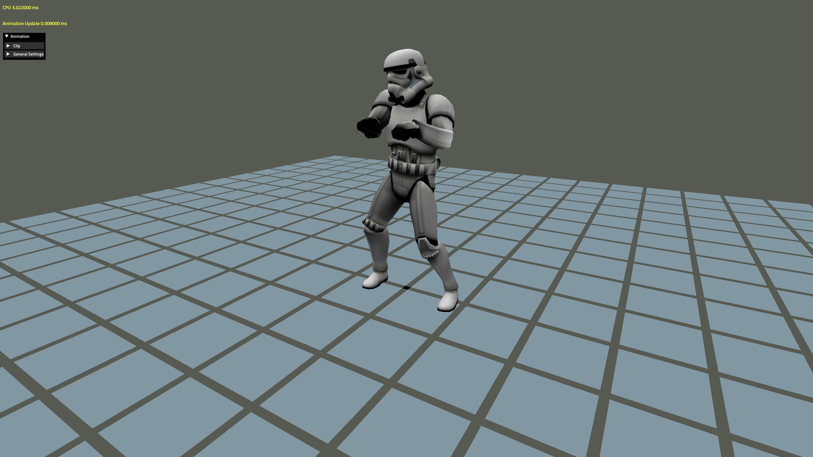
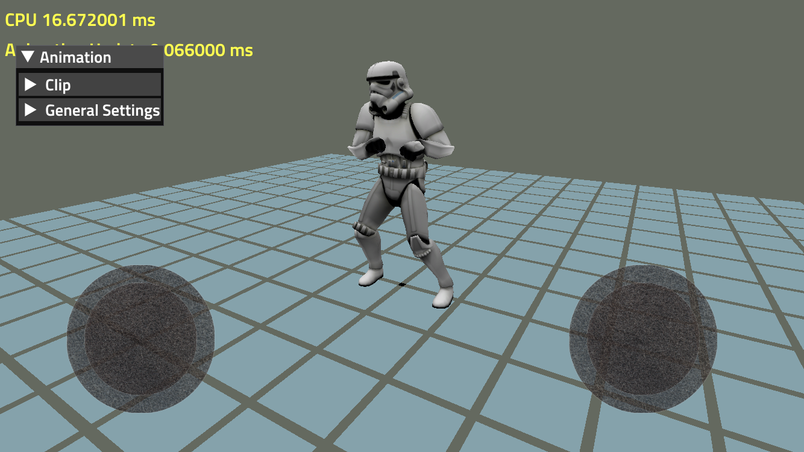
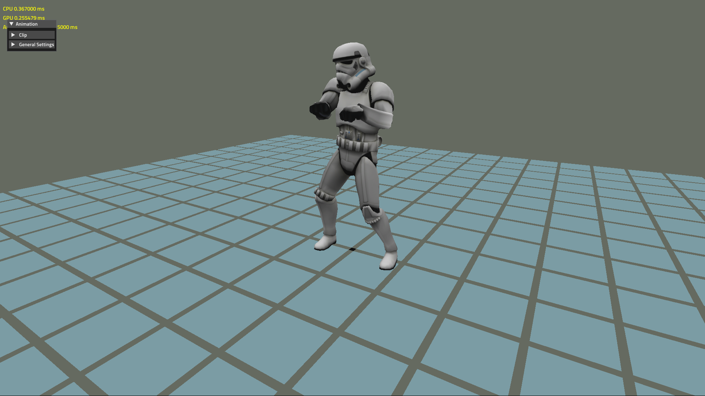
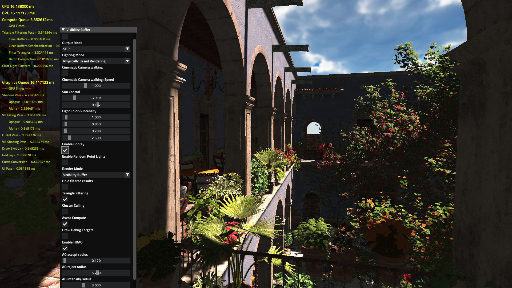
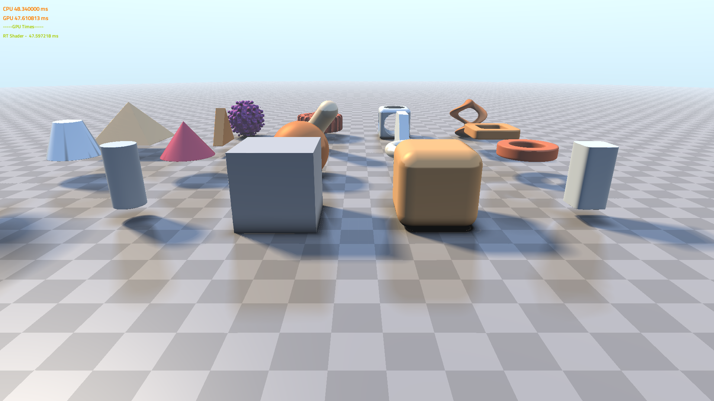
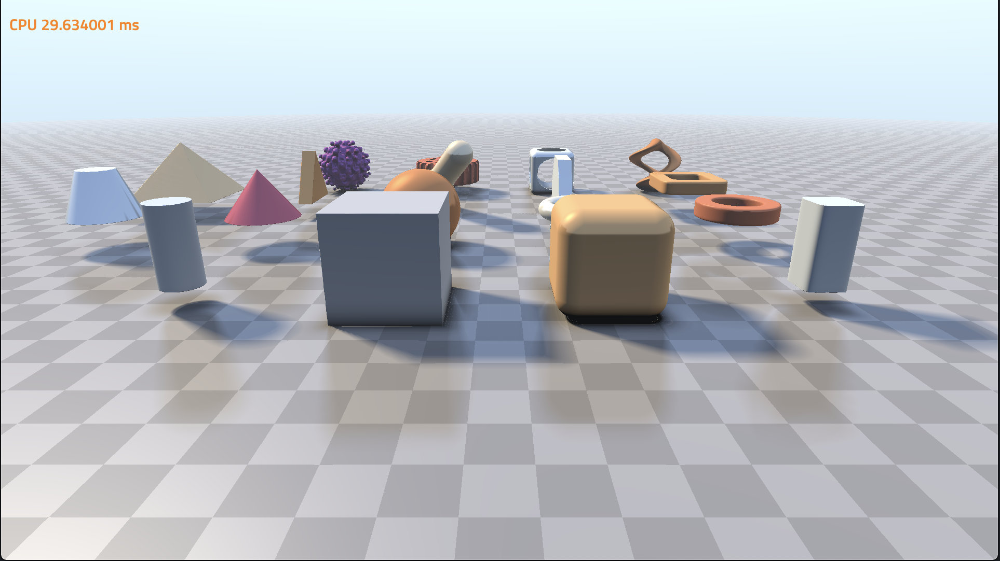
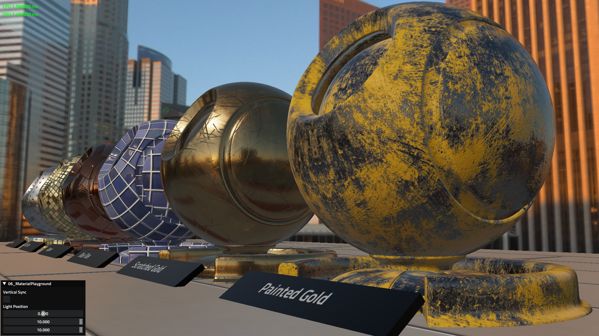
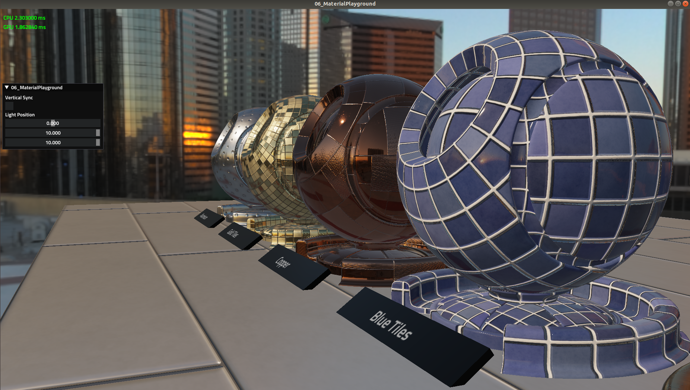
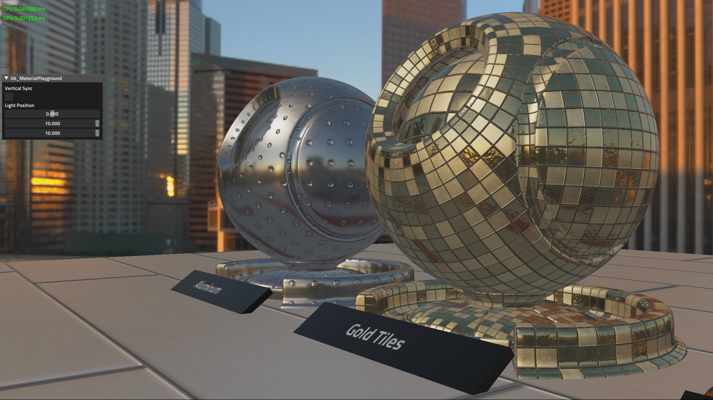
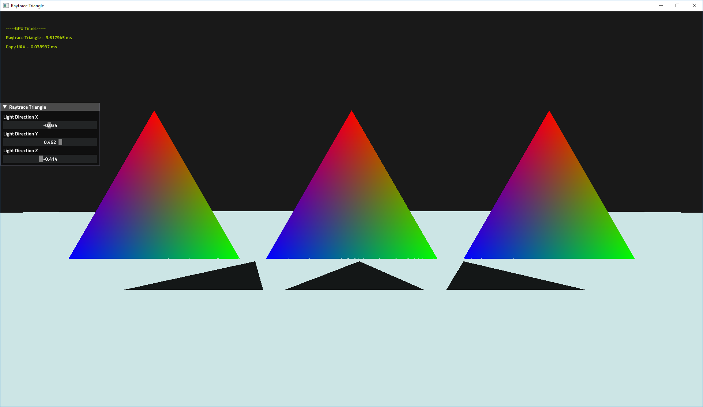

# 

The Forge is a cross-platform rendering framework supporting
- PC 
  * Windows 10 
     * with DirectX 12 / Vulkan 1.1
     * with DirectX Ray Tracing API
     * DirectX 11 Fallback Layer for Windows 7 support (not extensively tested)
  * Linux Ubuntu 18.04 LTS with Vulkan 1.1
- Android Pie with Vulkan 1.1
- macOS with Metal 2
- iOS with Metal 2
- XBOX One / XBOX One X (only available for accredited developers on request)
- PS4 (in development) (only available for accredited developers on request)

Particularly, The Forge supports cross-platform
- Descriptor management
- Multi-threaded resource loading
- Shader reflection
- Multi-threaded command buffer generation

Future plans are
- Unified shader generation -> check out an alpha version of the [Confetti Shader Translator](http://confettishadertranslator.azurewebsites.net). This shader translator is build with the purpose of supporting a higher-level shading language, which we call super HLSL or short sHLSL

The intended usage of The Forge is to enable developers to quickly build their own game engines. The Forge can provide the rendering layer for custom next-gen game engines. 

<a href="https://twitter.com/TheForge_FX?lang=en" target="_blank"> Join the channel at https://twitter.com/TheForge_FX?lang=en</a>
 
# Build Status 

* Windows 
* macOS 

# News

## Release 1.21 - December 1st, 2018 - Season Greetings with new Skinning Unit Test | Unified Vulkan Shaders
The team will soon go into winter hybernation mode ... which means many Confetti people will fly home over the holiday season to spend time with their loved ones. We will be back with more releases next year, probably in February. 

To send you season greetings, we extended our Ozz implementation by adding a new Skinning unit test:

PC Windows 10 DirectX 12 GeForce 950 Driver 411.63 with a resolution of 1080p

Linux Ubuntu 18.04.1 LTS Vulkan 1.1.92 RADEON 480 Driver 18.30 with a resolution of 1920x1080

iMac with AMD RADEON 580 (Part No. MNED2xx/A) with resolution of 1920x1080

iPhone 7 iOS 12.0.1 (16A404) with a resolution of 1334x750

XBOX One

- Vulkan: 
  - all three Vulkan platforms (Windows, Linux, Android) use now the same Vulkan shaders
  - Upgraded Linux and Windows SDK to 1.1.92.1
- The math library now supports more integer data types
- Updated assimp to use latest master + added projects instead of shipping binaries
- macOS / iOS
  - Added support for iOS Gestures (Not currently in use in the unit-tests)
  - Improved pixel projected reflections on Metal Platforms
  - Upgraded all the XCode projects to target Xcode 10.1 (10B61) and  iOS Version 12.0.1 (16A404) 
  - Started Testing additionally on A12 Devices Phone Xs Max (Model MT5D2LL/A)
- Numerous shader translator updates. Head over to [Confetti Shader Translator](http://confettishadertranslator.azurewebsites.net) check them out :-) It is getting more and more stable.

## Release 1.20 - November 15th, 2018 - Triangle Visibility Buffer with PBR | Ray Marching Unit Test | Font Rendering Dark Mode
* Triangle Visibility Buffer (PC, XBOX One, macOS, Linux will be supported in the next release): 
  * Added PBR art assets and PBR Lighting (please download the art assets again with the script see Install section below)
  * Added swapchain3 DirectX 12 HDR support (in the future swapchain4 and Vulkan HDR will be added) and additionally made sure the PBR art assets are HDR "enabled"
  * There is an automatic camera fly-through to make demos easier 
  * God rays were added for additional "awesomeness"
  * With the new PBR art assets and God rays (switchable), we still expect it to run faster than before on all target platforms

PC Windows 10 DirectX12 NVIDIA GeForce 1080 Driver 416.16 with a resolution of 3840x2160 in window mode (MSAA x2)  

PC Windows 10 Vulkan 1.1.85 NVIDIA GeForce 1080 Driver 416.16 with a resolution of 3840x2160 in window mode (MSAA x2)

Linux Ubuntu 18.04.1 LTS Vulkan 1.1.85 AMD RX480 resolution of 1920x1080 in window mode (MSAA x2)

iMac with AMD RADEON 580 (Part No. MNED2xx/A) 2560x1440 in window mode (MSAA x1)

Xbox One resolution of 1920x1080

* There is a new unit test provided by Mykhailo Parfeniuk, originally posted on ShaderToy by Inigo Quilez (https://www.shadertoy.com/view/Xds3zN and https://sopyer.github.io/b/post/vulkan-shader-sample/) that shows a ray marched scene with shadows, reflections and AO

PC Windows 10 Vulkan 1.1.85 GeForce 950 Driver 416.81 with a resolution of 1920x1080 in window mode:  

iMac with AMD RADEON 580 (Part No. MNED2xx/A) with resolution of 1920x1080 in window mode:  

Linux Vulkan 1.1.85 RADEON 480 Driver 18.30 with a resolution of 1920x1080 in window mode: 

* The font rendering unit test was upgraded
  * Added light and dark theme (... inspired by macOS here)
  * Added fit-to-screen functionality for arbitrary resolutions
  * Scene text is now docked to center

* There were many updates for iOS / macOS and XBOX One run-times and a few for Linux

## Release 1.19 - November 1st, 2018 - Material Playground
* Added more materials to the Material Playground. Therefore you want to download the Art folder again just for this release (see the Install section below on how to do this).
Here are shots of five of the supported platforms:

PC Windows 10 Vulkan 1.1.82.1 GeForce 1080 Driver 399.07 with a resolution of 1920x1080 in full-screen:  

Linux Vulkan 1.1.82.1 RADEON  480 Driver 18.30 with a resolution of 1920x1080 in full-screen: 

iMac with AMD RADEON 580 (Part No. MNED2xx/A) with resolution of 5120x2880 in full-screen:  

iPad (Model A1803) with iOS 12.0 and a resolution of 2048x1536 in full-screen:

XBOX One:

* Updated Fontstash library to the latest version and added .OTF font file support
* macOS / iOS Metal 2 we are working on applications running on those run-times, so there is a constant stream of improvmements coming in:
  * Sampler arrays
  * Enable some parts of GPU profiler code for debug markers, cpu timestamps on Metal runtime
  * File system bug fixes
  * Include headers fixes
  * Improved error and warnings in Metal shaders

See the release notes from previous releases in the [Release section](https://github.com/ConfettiFX/The-Forge/releases).

  
# PC Windows Requirements:

1. Windows 10 with latest update

2. Drivers
* AMD / NVIDIA - latest drivers should work. On Vulkan, at least NVIDIA Beta Driver 389.20 are required to support Linked Multi-GPU. 
* Intel - need to install the latest driver (currently Version: 25.20.100.6326, October 9th, 2018) [Intel® Graphics Driver for Windows® 10](https://downloadcenter.intel.com/download/28240/Intel-Graphics-Driver-for-Windows-10?product=80939). As mentioned before this driver still doesn't have full DirectX 12 and Vulkan support.

3. Visual Studio 2017 with Windows SDK / DirectX version 16299.91 (Fall Creators Update)
https://developer.microsoft.com/en-us/windows/downloads/sdk-archive

4. Vulkan [1.1.92.1](https://vulkan.lunarg.com/sdk/home)

5. Ray Tracing 
 * DirectX Raytracing Experimental SDK v0.09.01
 * Windows 10 RS4 builds more info at [DXR](http://aka.ms/DXR)

6. The Forge is currently tested on 
* AMD 5x, VEGA GPUs (various)
* NVIDIA GeForce 9x, 10x GPUs (various)
* Intel Skull Canyon

# macOS Requirements:

1. macOS: 10.14 (18A389)

2. XCode: 10.1 (10B61)

3. The Forge is currently tested on the following macOS devices:
* iMac with AMD RADEON 560 (Part No. MNDY2xx/A)
* iMac with AMD RADEON 580 (Part No. MNED2xx/A)
* MacBook Pro 13 inch (MacBookPro13,2) 
* Macbook Pro 13 inch (MacbookPro14,2)

In the moment we do not have access to an iMac Pro or Mac Pro. We can test those either with Team Viewer access or by getting them into the office and integrating them into our build system.
We will not test any Hackintosh configuration. 

# iOS Requirements:

1. iOS: 12.0.1 (16A404)

2. XCode: see macOS

To run the unit tests, The Forge requires an iOS device with an A9 or higher CPU (see [GPU Processors](https://developer.apple.com/library/content/documentation/DeviceInformation/Reference/iOSDeviceCompatibility/HardwareGPUInformation/HardwareGPUInformation.html) or see iOS_Family in this table [iOS_GPUFamily3_v3](https://developer.apple.com/metal/Metal-Feature-Set-Tables.pdf)). This is required to support the hardware tessellation unit test and the ExecuteIndirect unit test (requires indirect buffer support). The Visibility Buffer doesn't run on current iOS devices because the [texture argument buffer](https://developer.apple.com/documentation/metal/fundamental_components/gpu_resources/understanding_argument_buffers) on those devices is limited to 31 (see [Metal Feature Set Table](https://developer.apple.com/metal/Metal-Feature-Set-Tables.pdf) and look for the entry "Maximum number of entries in the texture argument table, per graphics or compute function") , while on macOS it is 128, which we need for the bindless texture array. 

We are currently testing on 
* iPhone 7 (Model A1778)
* iPad (Model A1803)
* iPhone Xs Max (Model MT5D2LL/A)

# PC Linux Requirements:

1. [Ubuntu 18.04 LTS](https://www.ubuntu.com/download/desktop) Kernel Version: 4.15.0-20-generic

2. GPU Drivers:
* [AMDGpu-Pro 18.30-641594](https://www.amd.com/en/support/graphics/radeon-500-series/radeon-rx-500-series/radeon-rx-580)
* [NVIDIA Linux x86_64/AMD64/EM64T 390.87](http://www.nvidia.com/object/unix.html) You can update using the command line too https://tecadmin.net/install-latest-nvidia-drivers-ubuntu/

3. Workspace file is provided for [codelite 12.0.6](https://codelite.org/)

4. Vulkan SDK Version: download the native Ubuntu Linux package for all the elements of the Vulkan SDK [LunarG Vulkan SDK Packages for Ubuntu 16.04 and 18.04](https://packages.lunarg.com/)

5. The Forge is currently tested on Ubuntu with the following GPUs:
 * AMD RADEON RX 480
 * AMD RADEON VEGA 56
 * NVIDIA GeForce GTX 950

Make sure VulkanSDK environment variables are configured correctly.
Please read the "Set up the Runtime Environment" and "Environment Variable Persistence" [https://vulkan.lunarg.com/doc/sdk/1.1.70.1/linux/getting_started.html](https://vulkan.lunarg.com/doc/sdk/1.1.70.1/linux/getting_started.html)

# Android Requirements:

1. Android Phone with Android Pie (9.x) for Vulkan 1.1 support

2. Android Studio with API level 28 and follow the instructions

3. We are currently testing on 
* [Essential Phone](https://en.wikipedia.org/wiki/Essential_Phone) with Android 9.0 - Build PPR1.181005.034

In the moment we only support the first two unit tests. We are waiting for devkits with more stable drivers before we bring over the other unit tests. The Essential phone uses an Adreno 540 GPU. Please check out [Vulkan Gpuinfo.org](http://vulkan.gpuinfo.org/) for the supported feature list of this GPU with Android 9.0.

# Install 
 * For PC Windows run PRE_BUILD.bat. It will download and unzip the art assets and install the shader builder extension for Visual Studio 2017.
 * For Linux and Mac run PRE_BUILD.command. If its the first time checking out the forge make sure the PRE_BUILD.command has the correct executable flag by running the following command
  chmod +x PRE_BUILD.command
  
    It will only download and unzip required Art Assets (No plugins/extensions install). 

# Unit Tests
There are the following unit tests in The Forge:

## 1. Transformation

This unit test just shows a simple solar system. It is our "3D game Hello World" setup for cross-platform rendering.

## 2. Compute

This unit test shows a Julia 4D fractal running in a compute shader. In the future this test will use several compute queues at once.

## 3. Multi-Threaded Rendering

This unit test shows how to generate a large number of command buffers on all platforms supported by The Forge. This unit test is based on [a demo by Intel called Stardust](https://software.intel.com/en-us/articles/using-vulkan-graphics-api-to-render-a-cloud-of-animated-particles-in-stardust-application).

## 4. ExecuteIndirect

This unit test shows the difference in speed between Instanced Rendering, using ExecuteIndirect with CPU update of the indirect argument buffers and using ExecuteIndirect with GPU update of the indirect argument buffers.
This unit test is based on [the Asteroids example by Intel](https://software.intel.com/en-us/articles/asteroids-and-directx-12-performance-and-power-savings).

Using ExecuteIndirect with GPU updates for the indirect argument buffers

Using ExecuteIndirect with CPU updates for the indirect argument buffers

Using Instanced Rendering

## 5. Font Rendering

This unit test shows the current state of our font rendering library that is based on several open-source libraries.

## 6. Material Playground

This unit test will show a wide range of game related materials in the future.

## 7. Hardware Tessellation

This unit test showcases the rendering of grass with the help of hardware tessellation.

## 8. Procedural 
In the spirit of the shadertoy examples this unit test shows a procedurally generated planet.

## 9. Light and Shadow Playground
This unit test shows various shadow and lighting techniques that can be chosen from a drop down menu. There will be more in the future.

## 9a. Hybrid Ray-Traced Shadows
This unit test was build by Kostas Anagnostou @KostasAAA to show how to ray trace shadows without using a ray tracing API like DXR / RTX. It should run on all GPUs (not just NVIDIA RTX GPUs) and the expectation is that it should run comparable with a DXR / RTX based version even on a NVIDIA RTX GPU. That means the users of your game do not have to buy a NVIDIA RTX GPU to enjoy HRT shadows :-)

## 10. Pixel-Projected Reflections
This unit test shows reflections that are ray traced. It is an implementation of the papers [Optimized pixel-projected reflections for planar reflectors](http://advances.realtimerendering.com/s2017/PixelProjectedReflectionsAC_v_1.92.pdf) and [IMPLEMENTATION OF OPTIMIZED PIXEL-PROJECTED REFLECTIONS FOR PLANAR REFLECTORS](https://github.com/byumjin/Jin-Engine-2.1/blob/master/%5BByumjin%20Kim%5D%20Master%20Thesis_Final.pdf)

## 11. Multi-GPU (Driver support only on PC Windows)
This unit test shows a typical VR Multi-GPU configuration. One eye is rendered by one GPU and the other eye by the other one.

## 12. The Forge switching between Vulkan and DirectX 12 during Run-time (Windows PC-only)
This unit test shows how to switch between the Vulkan and DirectX 12 graphics API during run-time. 

## 13. imGUI integration unit test
This unit test shows how the integration of imGui with a wide range of functionality.

## 14. Order-Independent Transparency unit test
This unit test compares various Order-Indpendent Transparency Methods.

## 15. Wave Intrinsics unit test
This unit test shows how to use the new wave intrinsics. In the moment it only supports Windows (DirectX 12 / Vulkan 1.1) and Linux with Vulkan 1.1. More platforms will be added.

## 16. Ray Tracing Unit Test for DXR
Ray Tracing API unit test, showing how to use DXR on Windows only.

## 17. Ozz Playback Animation
This unit test shows how to playback a clip on a rig.

## 18. Ozz Playback Blending
This unit test shows how to blend multiple clips and play them back on a rig.

## 19. Ozz Joint Attachment
This unit test shows how to attach an object to a rig which is being posed by an animation.

## 20. Ozz Partial Blending
This unit test shows how to blend clips having each only effect a certain portion of joints.

## 21. Ozz Additive Blending
This unit test shows how to introduce an additive clip onto another clip and play the result on a rig.

## 22. Ozz Baked Physics
This unit test shows how to use a scene of a physics interaction that has been baked into an animation and play it back on a rig.

## 23. Ozz Multi Threading
This unit test shows how to animate multiple rigs simultaneously while using multi-threading for the animation updates.

# Examples
There is an example implementation of the Triangle Visibility Buffer as covered in various conference talks. [Here](https://diaryofagraphicsprogrammer.blogspot.com/2018/03/triangle-visibility-buffer.html) is a blog entry that details the implementation in The Forge.

# Releases / Maintenance
Confetti will prepare releases when all the platforms are stable and running and push them to this GitHub repository. Up until a release, development will happen on internal servers. This is to sync up the console, mobile, macOS and PC versions of the source code.

# Products
We would appreciate it if you could send us a link in case your product uses The Forge. Here are the ones we received so far:

## StarVR One SDK
The Forge is used to build the StarVR One SDK:

## Torque 3D
The Forge is used as the rendering framework in Torque 3D:

# Open-Source Libraries
The Forge utilizes the following Open-Source libraries:
* [Assimp](https://github.com/assimp/assimp)
* [Bullet Physics](https://github.com/bulletphysics)
* [Fontstash](https://github.com/memononen/fontstash)
* [Vectormath](https://github.com/glampert/vectormath)
* [Nothings](https://github.com/nothings/stb) single file libs 
  * [stb.h](https://github.com/nothings/stb/blob/master/stb.h)
  * [stb_image.h](https://github.com/nothings/stb/blob/master/stb_image.h)
  * [stb_image_resize.h](https://github.com/nothings/stb/blob/master/stb_image_resize.h)
  * [stb_image_write.h](https://github.com/nothings/stb/blob/master/stb_image_write.h)
* [shaderc](https://github.com/google/shaderc)
* [SPIRV_Cross](https://github.com/KhronosGroup/SPIRV-Cross)
* [TinyEXR](https://github.com/syoyo/tinyexr)
* [TinySTL](https://github.com/mendsley/tinystl)
* [Vulkan Memory Allocator](https://github.com/GPUOpen-LibrariesAndSDKs/VulkanMemoryAllocator)
* [GeometryFX](https://gpuopen.com/gaming-product/geometryfx/)
* [WinPixEventRuntime](https://blogs.msdn.microsoft.com/pix/winpixeventruntime/)
* [Fluid Studios Memory Manager](http://www.paulnettle.com/)
* [volk Metaloader for Vulkan](https://github.com/zeux/volk)
* [gainput](https://github.com/jkuhlmann/gainput)
* [Shader Playground](https://github.com/tgjones/shader-playground)
* [hlslparser](https://github.com/Thekla/hlslparser)
* [ImGui](https://github.com/ocornut/imgui)
* [DirectX Shader Compiler](https://github.com/Microsoft/DirectXShaderCompiler)
* [Ozz Animation System](https://github.com/guillaumeblanc/ozz-animation)
