The Forge is a cross-platform rendering framework supporting
- Windows 10/11 
    * with DirectX 12 / Vulkan 1.1
    * with DXR / RTX Ray Tracing API
    * DirectX 11 fallback for older Windows platforms
* Steam Deck
    * with Vulkan 1.1
    * with VK_KHR_ray_query Ray Tracing API
- Android Pie or higher
  * with Vulkan 1.1
  * OpenGL ES 2.0 fallback for large scale business application frameworks
* Apple
    * iOS 14.1 / 17.0
    * iPad OS 14.1 / 17.0
    * macOS 11.0 / 14.0, with Intel and Apple silicon support
- Quest 2 using Vulkan 1.1
- XBOX One / XBOX One X / XBOX Series S/X *
- PS4 / PS4 Pro *
- PS5 *
- Switch using Vulkan 1.1 *

*(only available for accredited developers on request)


Particularly, the graphics layer of The Forge supports cross-platform
- Descriptor management. A description is on this [Wikipage](https://github.com/ConfettiFX/The-Forge/wiki/Descriptor-Management)
- Multi-threaded and asynchronous resource loading
- Shader reflection
- Multi-threaded command buffer generation

The Forge is used to provide the rendering layer for custom next-gen game engines. It is also used to provide building blocks to write your own game engine. It is like a "lego" set that allows you to use pieces to build a game engine quickly. The "lego" High-Level Features supported on all platforms are at the moment:
- Resource Loader capable to load textures, buffers and geometry data asynchronously
- [Lua Scripting System](https://www.lua.org/) - currently used for automatic testing and in 06_Playground to load models and textures and animate the camera and in several other unit tests to cycle through the options they offer during automatic testing.
- Animation System based on [Ozz Animation System](https://github.com/guillaumeblanc/ozz-animation)
- Consistent Math Library  based on an extended version of [Vectormath](https://github.com/glampert/vectormath) with NEON intrinsics for mobile platforms. It also supports now Double precision.
- Consistent Memory Managament: 
  * on GPU following [Vulkan Memory Allocator](https://github.com/GPUOpen-LibrariesAndSDKs/VulkanMemoryAllocator) and the [D3D12 Memory Allocator](https://github.com/GPUOpen-LibrariesAndSDKs/D3D12MemoryAllocator)
  * on CPU [Fluid Studios Memory Manager](http://www.paulnettle.com/)
- Input system with Gestures for Touch devices based on an extended version of [gainput](https://github.com/jkuhlmann/gainput)
- Fast Entity Component System based on [flecs](https://github.com/SanderMertens/flecs) 
- Cross-platform FileSystem C API, supporting disk-based files, memory streams, and files in zip archives
- UI system based on [Dear imGui](https://github.com/ocornut/imgui) extended for touch input devices
- Shader Translator using a superset of HLSL as the shader language, called The Forge Shading Language. There is a Wiki page on [The Forge Shading Language](https://github.com/ConfettiFX/The-Forge/wiki/The-Forge-Shading-Language-(FSL))
- Various implementations of high-end Graphics Effects as shown in the unit tests below

Please find a link and credits for all open-source packages used at the end of this readme.

<a href="https://discord.gg/hJS54bz" target="_blank"> Join the Discord channel at https://discord.gg/hJS54bz</a>

<a href="https://twitter.com/TheForge_FX?lang=en" target="_blank"> Join the channel at https://twitter.com/TheForge_FX?lang=en</a>

The Forge Interactive Inc. is a [Khronos member](https://www.khronos.org/members/list)
 


<!---
# Build Status 

[](https://github.com/ConfettiFX/The-Forge/actions/workflows/build_windows.yml)
[](https://github.com/ConfettiFX/The-Forge/actions/workflows/build_macos.yml)
[](https://github.com/ConfettiFX/The-Forge/actions/workflows/build_linux.yml)
[](https://github.com/ConfettiFX/The-Forge/actions/workflows/build_android.yml)
--->

# News

## Release 1.58 - June 17th, 2024 Behemoth | Compute-Driven Mega Particle System | Triangle Visibility Buffer 2.0 | 

### Announce trailer for Behemoth
We helped Skydance Interactive to optimize Behemoth last year. Click on the image below to see the announce trailer:


[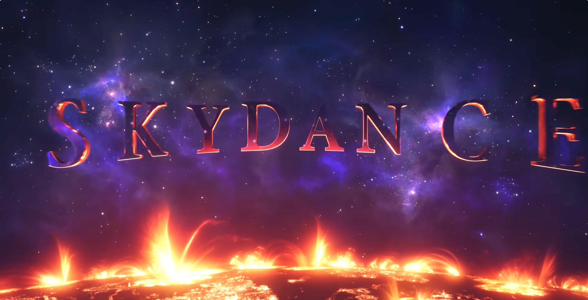](https://youtu.be/hTmjjzwSp-E?si=rj0G6yrqv5Cr6Gn9)


### Compute-Based Mega Particle System
This unit test was based on some of our research into software rasterization and GPU-driven rendering. A particle system completely running in very few compute shaders with one large buffer holding most of the data. Like with all things GPU-Driven, the trick is to execute one compute shader once on one buffer to reduce read / write memory bandwidth. Although this is not new wisdom, you will be surprised how many particle systems get this still wrong ... having compute shaders for each stage of the particle life time or even worse doing most of the particle work on the CPU.
This particle system was demoed last year in a few talks in September on a Samsung S22. Here are the slides:

http://www.conffx.com/WolfgangEngelParticleSystem.pptx 


It is meant to be used to implement next-gen Mega Particle systems in which we simulate always 100000th or millions of particles at once instead of the few dozen ones contemporary systems simulate. 

#### Android Samsung S22 1170x540 resolution
This screenshot shows 4 million firefly-like particles, with 10000 lights attached to them and a shadow for the directional light. Those numbers were thought to be not possible on mobile phones before.
 

#### Android Samsung S23 1170x540 resolution
Same setting as above but this time also with 8 Shadows from Point Lights additionally.


#### Android Samsung S24 1170x540 resolution
Same setting as above but this time also with 8 Shadows from Point Lights additionally.
 

#### PS5 running at 4K
 

#### Windows with AMD RX 6400 at 1080p
 


### Triangle Visibility Buffer 2.0
we have the new compute based TVB 2.0 approach now running on all platforms (on Android only S22). You can download slides from the I3D talk from

http://www.conffx.com/I3D-VisibilityBuffer2.pptx 


## Release 1.57 - May 8th, 2024 Visibility Buffer 2.0 Prototype | Visibility Buffer 1.0 One Draw call  

### Visibility Buffer Research - I3D talk

We are giving a talk about our latest Visibility Buffer research on I3D. Here is a short primer what it is about:

The original idea of the Triangle Visibility Buffer is based on an article by [[burns2013]. [schied15] and [schied16] extended what was described in the original article. Christoph Schied implemented a modern version with an early version of OpenGL (supporting MultiDrawIndirect) into The Forge rendering framework in September 2015. 
We ported this code to all platforms and simplified and extended it in the following years by adding a triangle filtering stage following [chajdas] and [wihlidal17] and a new way of shading.
Our on-going improvements simplified the approach incrementally and the architecture started to resemble what was described in the original article by [burns2013] again, leveraging the modern tools of the newer graphics APIs. 
In contrast to [burns2013], the actual storage of triangles in our implementation of a Visibility Buffer happens due to the triangle removal and draw compaction step with an optimal “massaged” data set.
By having removed overdraw in the Visibility Buffer and Depth Buffer, we run a shading approach that shades everything with one regular draw call. We called the shading stage Forward++ due to its resemblance to forward shading and its usage of a tiled light list for applying many lights. It was a step up from Forward+ that requires numerous draw calls.
We described all this in several talks at game industry conferences, for example on GDCE 2016 [engel16] and during XFest 2018, showing considerable performance gains due to reduced memory bandwidth compared to traditional G-buffer based rendering architectures. 
A blog post that was updated over the years for what we call now Triangle Visibility Buffer 1.0 (TVB 1.0) can be found here [engel18]. 

Over the last years we extended this original idea with a Order-Independent Transparency approach (it is more efficient to sort triangle IDs in a per-pixel linked list compared to storing layers of a G-Buffer), software VRS and then we developed a Visibility Buffer approach that doesn't require draw calls to fill the depth and Visibility Buffer and one that requires much less draw calls in parallel. 
This release offers -what we call- an updated Triangle Visibility Buffer 1.0 (TVB 1.0) and a prototype for the Triangle Visibility Buffer 2.0 (TVB 2.0).

The changes to TVB 1.0 are evolutionary. We used to map each mesh to an indirect draw element. This reuqired the use of DrawID to map back to the per-mesh data. When working on a game engine with a very high amount of draw calls, it imposed a limitation on the number of "draws" we could do, due to having only a limited number of bits available in the VB.
Additionally, instancing was implemented using a separate instanced draw for each instanced mesh. We refactored the data flow between the draws and the shade pass.
There is now no reliance on DrawID and instances are handled transparently using the same unified draw. This both simplifies the flow of data and allows us to draw more "instanced" meshes.
Apart from being able to use a very high-number of draw calls, the performance didn't change.

The new TVB 2.0 approach is revolutionary in a sense that it doesn't use draw calls anymore to fill the depth and visibility buffer. There are two compute shader invocations that filter triangles and eventually fill the depth and visibility buffer. 
Not using draw calls anymore, makes the whole code base more consistent and less convoluted -compared to TVB 1.0-. 

You can find now the new Visibilty Buffer 2 approach in 

The-Forge\Examples_3\Visibility_Buffer2

This is still in an early stage of development. We only support a limited number of platforms: Windows D3D12, PS4/5, XBOX, and macOS / iOS.


### Sanitized initRenderer
we cleaned up the whole initRenderer code. Merged GPUConfig into GraphicsConfig and unified naming. 

### Metal run-time improvements
We improved the Metal Validation Support. 

### Art
Everything related to Art assets is now in the Art folder.

### Bug fixes
Lots of fixes.

References:
[burns2013] Christopher A. Burns, Warren A. Hunt, "The Visibility Buffer: A Cache-Friendly Approach to Deferred Shading", 2013, Journal of Computer Graphics Techniques (JCGT) 2:2, Pages 55 - 69.

[schied2015] Christoph Schied, Carsten Dachsbacher, "Deferred Attribute Interpolation for Memory-Efficient Deferred Shading" , Kit Publication Website: http://cg.ivd.kit.edu/publications/2015/dais/DAIS.pdf

[schied16] Christoph Schied, Carsten Dachsbacher, "Deferred Attribute Interpolation Shading", 2016, GPU Pro 7, Pages 

[chajdas] Matthaeus Chajdas, GeometryFX, 2016, AMD Developer Website http://gpuopen.com/gaming-product/geometryfx/

[wihlidal17] Graham Wihlidal, "Optimizing the Graphics Pipeline with Compute", 2017, GPU Zen 1, Pages 277--320

[engel16] Wolfgang Engel, "4K Rendering Breakthrough: The Filtered and Culled Visibility Buffer", 2016, GDC Vault: https://www.gdcvault.com/play/1023792/4K-Rendering-Breakthrough-The-Filtered

[engel18] Wolfgang Engel, "Triangle Visibility Buffer", 2018, Wolfgang Engel's Diary of a Graphics Programmer Blog http://diaryofagraphicsprogrammer.blogspot.com/2018/03/triangle-visibility-buffer.html


## Release 1.56 - April 4th, 2024 I3D | Warzone Mobile | Visibility Buffer | Aura on macOS | Ephemeris on Switch | GPU breadcrumbs | Swappy in Android | Screen-space Shadows | Metal Debug Markers improved


### I3D 
We are sponsoring I3D again. Come by and say hi! We also will be giving a talk on the new development around Triangle Visibility Buffer.


[](https://i3dsymposium.org/2024/)


### Warzone Mobile launched
We work on Warzone Mobile since August 2020. The game launched on March 21, 2024.

 

 

### Visibility Buffer
We removed CPU cluster culling and simplified the animation data usage. Now traingle filtering only takes one dispatch each frame again.

### Swappy frame pacer is now vailable in Android/Vulkan
We integrated the [Swappy](https://developer.android.com/games/sdk/frame-pacing) frame pacer into the Android / Vulkan eco system. 


### GPUCfg system improved with more ids and less string compares
we did another pass on the GPUCfg system and now we can generate the vendor Ids and model Ids with a python script to keep the *_gpu.data list easily up to date for each platform. 
We removed most of the name comparisons and replaced them with the id comparisons which should speed up parsing time and is more specific.

### Screen-Space Shadows in UT9
We added to the number of shadow approaches in that unit test screen-space shadows. These are complementary to regular shadow mapping and add more detail. We also fixed a number of inconsistencies with the other shadow map approaches.

PS5 - Screen-Space Shadows on
 

PS5 - Screen-Space Shadows off
 

Nintendo Switch
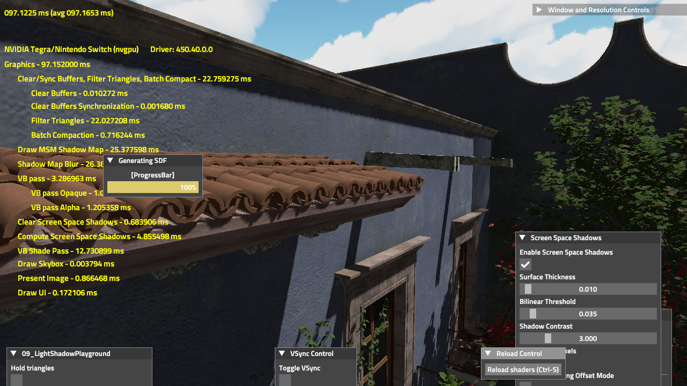 

PS4
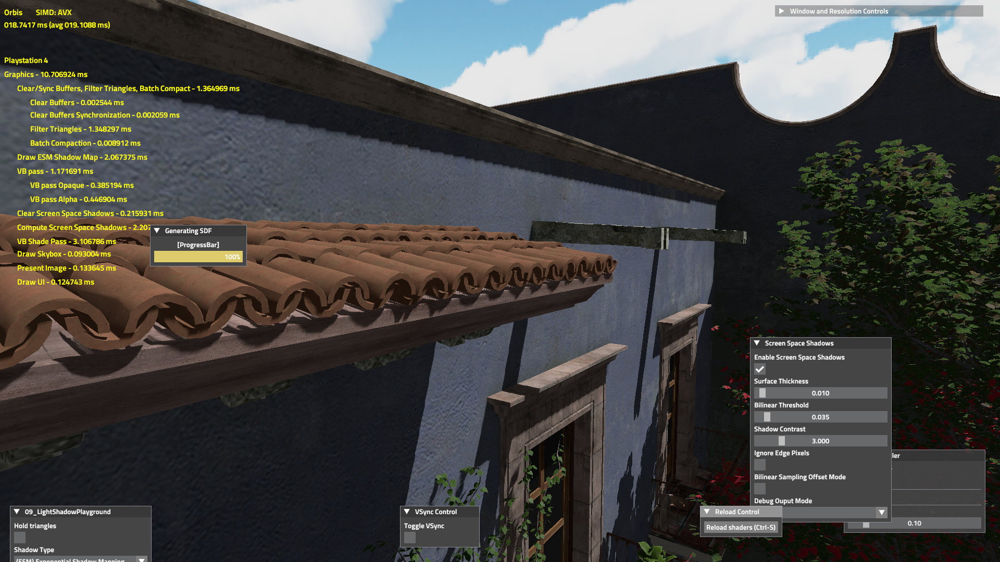 


### GPU breadcrumbs on all platforms
Now you can have GPU crash reports on all platforms. We skipped OpenGL ES and DX11 so ...

A simple example of a crash report is this:

2024-04-04 23:44:08 [MainThread     ] 09a_HybridRaytracing.cp:1685   ERR| [Breadcrumb] Simulating a GPU crash situation (RAYTRACE SHADOWS)...
2024-04-04 23:44:10 [MainThread     ] 09a_HybridRaytracing.cp:2428  INFO| Last rendering step (approx): Raytrace Shadows, crashed frame: 2

We will extend the reporting a bit more over time.


### Ephemeris now also runs on Switch ... 


## Release 1.55 - March 1st, 2024 - Ephemeris | gpu.data | Many bug fixes and smaller improvements

### Ephemeris 2.0 Update 
We improved Ephemeris again and support it now on more platforms. Updating some of the algorithms used and adding more features. 


[](https://vimeo.com/918128458)


Now we are supporting PC, XBOX'es, PS4/5, Android, Steamdeck, iOS (requires iPhone 11 or higher  (so far not Switch)


Ephemeris on XBOX Series X


Ephemeris on Android


Ephemeris on PS4


Ephemeris on PS5


### IGraphics.h 
We changed the graphics interface for cmdBindRenderTargets

```
// old
DECLARE_RENDERER_FUNCTION(void, cmdBindRenderTargets, Cmd* pCmd, uint32_t renderTargetCount, RenderTarget** ppRenderTargets, RenderTarget* pDepthStencil, const LoadActionsDesc* loadActions, uint32_t* pColorArraySlices, uint32_t* pColorMipSlices, uint32_t depthArraySlice, uint32_t depthMipSlice)
// new
DECLARE_RENDERER_FUNCTION(void, cmdBindRenderTargets, Cmd* pCmd, const BindRenderTargetsDesc* pDesc)
```
Instead of a long list of parameters we now provide a struct that gives us enough flexibility to pack more functionality in there.

### Variable Rate Shading
We added Variable Rate Shading to the Visibility Buffer OIT example test 15a. This way we have a better looking test scene with St. Miguel.

VRS allows rendering parts of the render target at different resolution based on the auto-generated VRS map, thus achieving higher performance with minimal quality loss. It is inspired by Michael Drobot's SIGGRAPH 2020 talk: https://research.activision.com/publications/2020-09/software-based-variable-rate-shading-in-call-of-duty--modern-war

The key idea behind the software-based approach is to render everything in 4xMS targets and use a stencil buffer as a VRS map. VRS map is automatically generated based on the local image gradients.
It could be used on a way wider range of platforms and devices than the hardware-based approach since the hardware VRS support is broken or not supported on many platforms. Because this software approach utilizes 2x2 tiles we could also achieve higher image quality compared to hardware-based VRS.

Shading rate view based on the color per 2x2 pixel quad:
- White – 1 sample (top left, always shaded);
- Blue – 2 horizontal samples;
- Red – 2 vertical samples;
- Green – all 4 samples;

PC
 

Debug Output with the original Image on PC
 

PC
 

Debug Output with the original Image on PC
 

Android
 

Debug Output with the original Image on Android
 

Android
 

Debug Output with the original Image on Android
 


Example 15a_VisibilityBufferOIT now has an additional option to toggle VRS - "Enable Variable Rate Shading"
The Debug view can now be toggled with the "Draw Debug Targets" option. This shows the auto-generated VRS map if VRS is enabled.

Limitations:
	Relies on programmable sample locations support – not widely supported on Android devices.

Supported platforms:
PS4, PS5, all XBOXes, Nintendo Switch, Android (Galaxy S23 and higher), Windows(Vulkan/DX12), macOS/iOS.


### gpu.data
You want to check out those files. They are now dedicated per supported platform. So it is easier for us to differ between different Playstations, XBOX'es, Switches, Android, iOS etc..

### Unlinked Multi GPU
The Unlinked Multi GPU example was broken on AMD 7x GPUs with Vulkan. We fixed it.

### Vulkan
we track GPU memory now and will extend this to other platforms.

### Vulkan mobile support
We support now the VK_EXT_ASTC_DECODE_MODE_EXTENSION_NAME extension

### Remote UI 
Various bug fixes to make this more stable. Still alpha ... will crash.


### Retired:
- 35 Variable Rate Shading ... this went into the Visibility Buffer OIT example 15a.
- Basis Library - after not having found any practical usage case, we removed Basis again.


## Release 1.54 - February 2nd, 2024 - Remote UI Control | Shader Server | Visibility Buffer | Asset Pipeline | GPU Config System | macOS/iOS | Lots more ...
Our last release was in October 2022. We were so busy that we lost track of time. In March 2023 we planned to make the next release. We started testing and fixing and improving code up until today. The amount of improvements coming back from the -most of the time- 8 - 10 projects we are working on where so many, it was hard to integrate all this, test it and then maintain it. To a certain degree our business has higher priority than making GitHub releases but we realize that letting a lot of time pass makes it substantially harder for us to get the whole code base back in shape, even with a company size of nearly 40 graphics programmers. So we cut down functional or unit tests, so that we have less variables. We also restructured large parts of our code base so that it is easier to maintain. One of the constant maintenance challenges were the macOS / iOS run-time (More about that below). 
We invested a lot in our testing environment. We have more consoles now for testing and we also have a much needed screenshot testing system. We outsource testing to external service providers more. We removed Linux as a stand-alone target but the native Steamdeck support should make up for this. 
We tried to be conservative about increasing API versions because we know on many platforms our target group will use older OS or API implementations. Nevertheless we were more adventurous this year then before. So we bumped up with a larger step than in previous years.
Our next release is planned for in about four weeks time. We still have work to do to bring up a few source code parts but now the increments are much smaller. 
In the meantime some of the games we worked on, or are still working on, shipped:

Forza Motorsport has launched in the meantime:

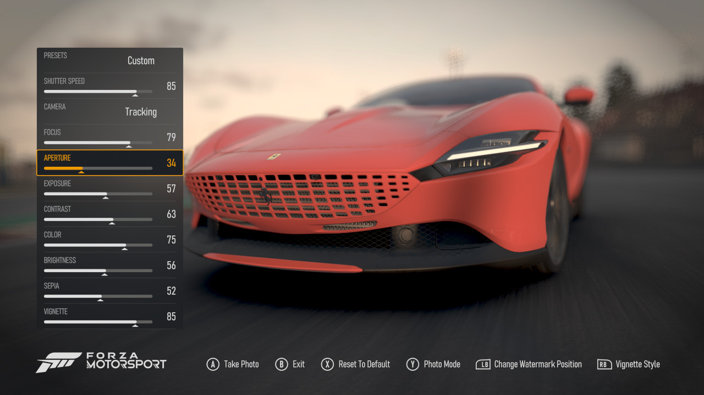

Starfield has launched:

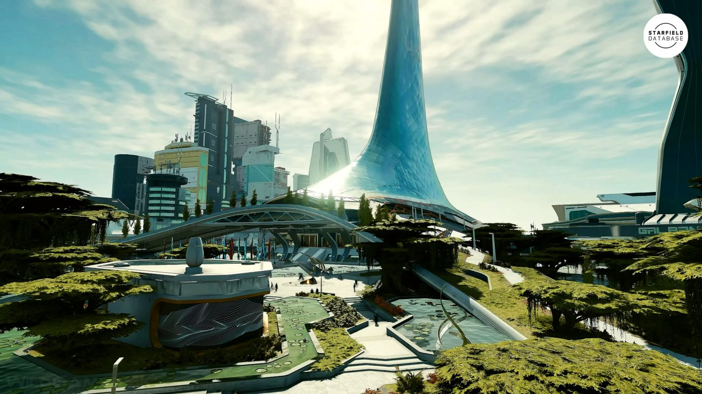

No Man Sky has launched on macOS:

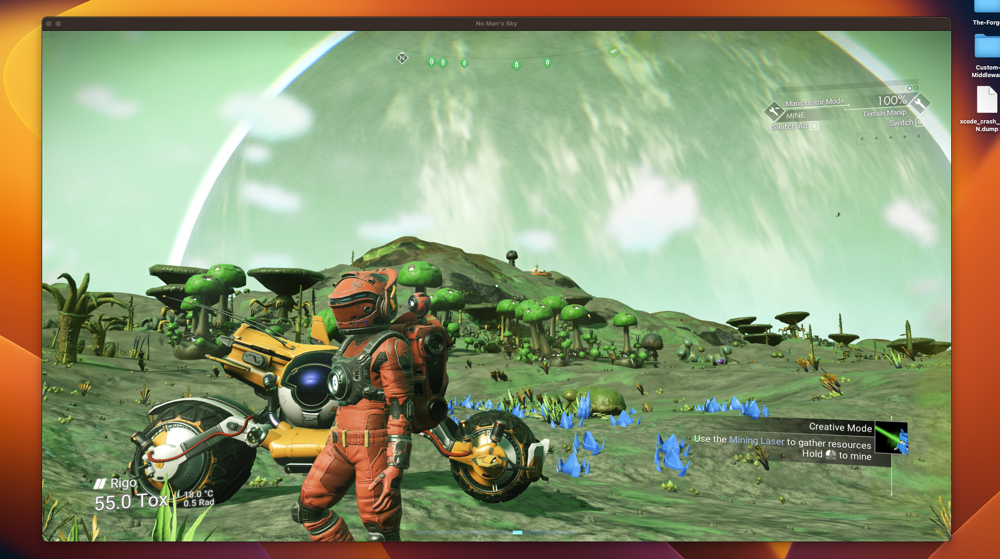
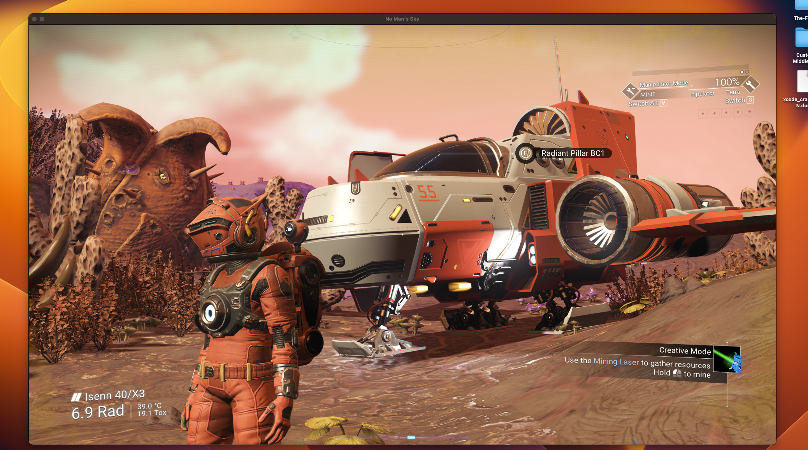


### Internal automated testing setup on our internal GitLab server 
- Our automated testing setup that tests all the platforms now takes 38 minutes for one run. At some point it was more. We revamped this substantially since the last release adding now screenshot comparisons and a few extra steps for static code analysis. 

### Visibility Buffer 
- the Visibility Buffer went through a lot of upgrades since October 2022. I think the most notable ones are:
  * Refactored the whole code so that it is easier to re-use in all our examples, there is now a dedicated Visibility Buffer directory holding this code
  * Animation of characters is now integrated (https://github.com/ConfettiFX/The-Forge/wiki/Triangle-Visibility-Buffer-Pre-Skinned-Animations)
  * Tangent and Bi-Tangent calculation is moved to the pixel shader and we removed the buffers


### Software Variable Rate Shading

This Unit test represents software-based variable rate shading (VRS) technique that allows rendering parts of the render target at different resolution based on the auto-generated VRS map, thus achieving higher performance with minimal quality loss. It is inspired by Michael Drobot's SIGGRAPH 2020 talk: https://docs.google.com/presentation/d/1WlntBELCK47vKyOTYI_h_fZahf6LabxS/edit?usp=drive_link&ouid=108042338473354174059&rtpof=true&sd=true

PC Windows (2560x1080):


Switch (1280x720):
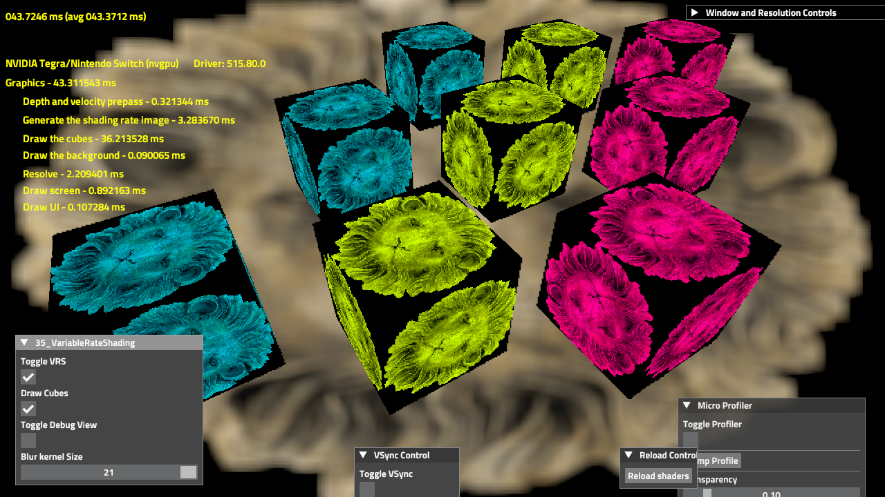

XBOX One S (1080p):
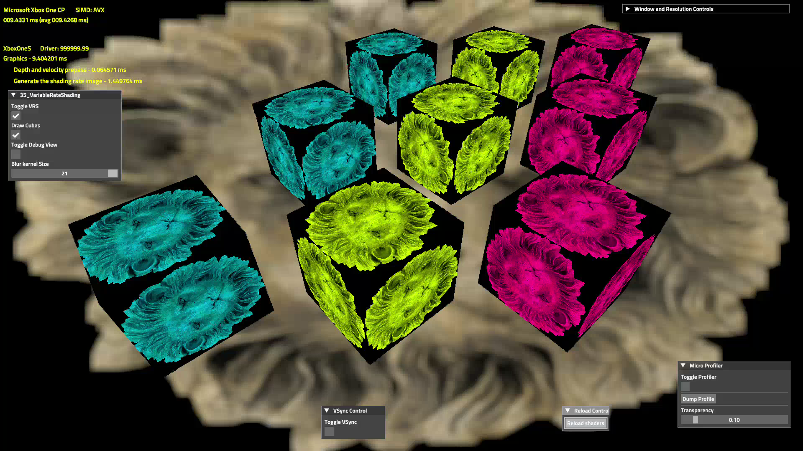

PS4 Pro (3840x2160):


The key idea behind the software-based approach is to render everything in 4xMS targets and use a stencil buffer as a VRS map. The VRS map is automatically generated based on the local image gradients.
The advantage of this approach is that it runs on a wider range of platforms and devices than the hardware-based approach since the hardware VRS support is broken or not supported on many platforms. Because this software approach utilizes 2x2 tiles we can also achieve higher image quality compared to hardware-based VRS.

Shading rate view based on the color per 2x2 pixel quad:
- White – 1 sample (top left, always shaded);
- Blue – 2 horizontal samples;
- Red – 2 vertical samples;
- Green – all 4 samples;

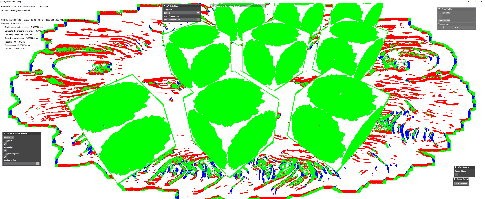

UI description:
- Toggle VRS – enable/disable VRS
- Draw Cubes – enable/disable dynamic objects in the scene
- Toggle Debug View – shows auto-generated VRS map if VRS is enabled
- Blur kernel Size – change blur kernel size of the blur applied to the background image to highlight performance benefits of the solution by making fragment shader heavy enough.
Limitations:
	Relies on programmable sample locations support – not widely supported on Android devices.

Supported platforms:

PS4, PS5, all XBOXes, Nintendo Switch, Android (Galaxy S23 and higher), Windows(Vulkan/DX12).
Implemented on MacOS/IOS, but doesn’t give expected performance benefits due to the issue with stencil testing on that platform

### Shader Server

To enable re-compilation of shaders during run-time we implemented a cross-platform shader server that allows to recompile shaders by pressing CTRL-S or a button in a dedicated menu.
You can find the documentation in the Wiki in the FSL section.

### Remote UI Control
When working remotely, on mobile or console  it can cumbersome to control the development UI.
We added a remote control application in Common_3\Tools\UIRemoteControl which allows control of all UI elements on all platforms.
It works as follows:
- Build and Launch the Remote Control App located in Common_3/Tools/UIRemoteControl
- When a unit test is started on the target application (i.e. consoles), it starts listening for connections on a part (8889 by default)
- In the Remote Control App, enter the target ip address and click connect


This is alpha software so expect it to crash ...


### VK_EXT_device_fault support
This extension allows developers to query for additional information on GPU faults which may have caused device loss, and to generate binary crash dumps.


### Ray Queries in Ray Tracing

We switched to Ray Queries for the common Ray Tracing APIs on all the platforms we support. The current Ray Tracing APIs increase the amount of memory necessary substantially, decrease performance and can't add much visually because the whole game has to run with lower resolution, lower texture resolution and lower graphics quality (to make up for this, upscalers were introduced that add new issues to the final image). 
Because Ray Tracing became a Marketing term valuable to GPU manufacturers, some game developers support now Ray Tracing to help increase hardware sales. So we are going with the flow here by offering those APIs.

macOS (1440x810)
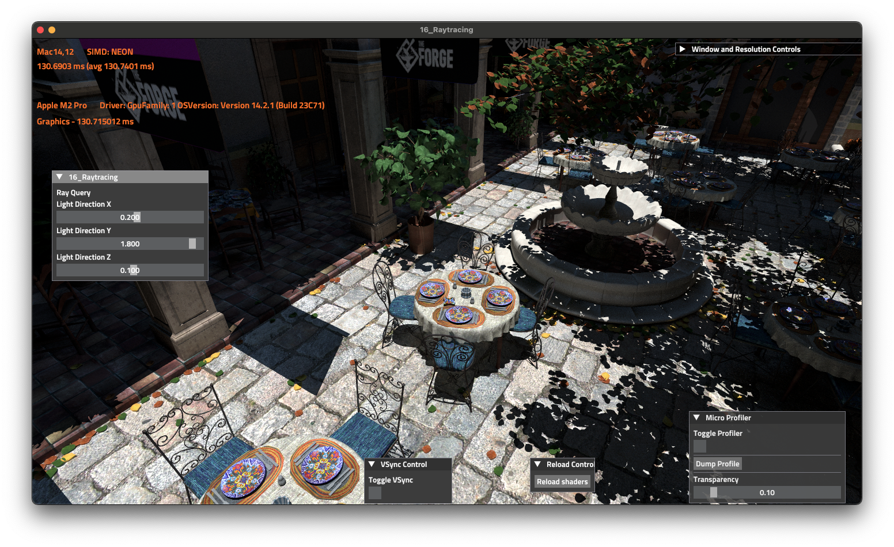

PS5 (3840x2160)


Windows 10 (2560x1080)


XBOX One Series X (1920x1080)
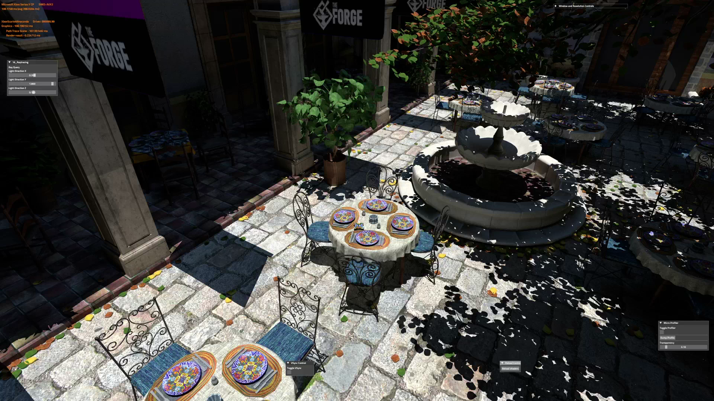

iPhone 11 (Model A2111) at resolution 896x414
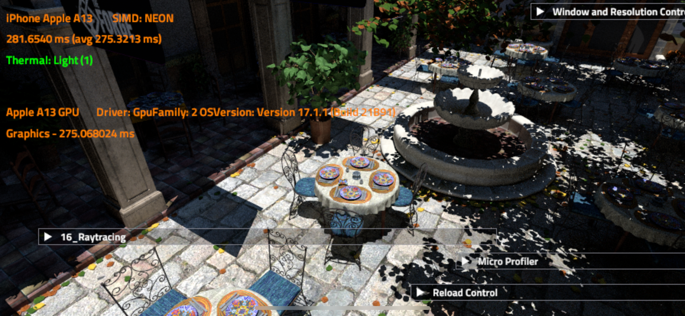

We do not have a denoiser for the Path Tracer.


### GPU Configuration System

This is a cross-platform system that can track GPU capabilities on all platforms and switch on and off features of a game for different platforms. To read a lot more about this follow the link below.

[GPU Configuration system](##-GPU-Config-System)


### New macOS / iOS run-time

We think the Metal API is a well balanced Graphics API that walks the path between low-level and high-level very well. We ran into one general problem with the Metal API for both platforms. It is hard to maintain the code base. There is an architectural problem that was probably introduced due to lack in experience in shipping games.
In essence what Apple decided to do is have calls like this:

https://developer.apple.com/documentation/swift/marking-api-availability-in-objective-c

Anything a hardware vendor describes as available and working might not be working with the next upgrade of the operating system, hardware or just the API or XCode. 
If you have a few hundred of those macros in your code, it becomes a lottery what works and what not on a variety of hardware. On some hardware one is broken, on the other hardware something else.
So there are two ways to deal with this: for every @available macro you start adding a #define to switch off or replace that code based on the underlying hardware and software platform. You would have to manually track if what the macro says is true on a wide range of platforms with different outcome.
So for example on macOS 10.13 running on a certain Macbook Pro (I make this up) with an Intel GPU it is broken but then a very similar Macbook Pro that has additionally a dedicated GPU actually runs it. Now you have to track what "class of Macbook Pro" we are talking about and if the Macbook Pro in question has an Intel or an AMD GPU. 
We track all this data already so that is not a problem. We know exactly what piece of hardware we are looking at (see above GPU Config system). 
The problem is that we have to guard every @available macro with some of this. From a QA standpoint that generates an explosion of QA requests. To cut down on the number of variables we decided to focus only on calls that are available in two different macOS and two different iOS versions. Here is the code in iOperatingSystem.h

```
// Support fixed set of OS versions in order to minimize maintenance efforts
// Two runtimes. Using IOS in the name as iOS versions are easier to remember
// Try to match the macOS version with the relevant features in iOS version
#define IOS14_API     API_AVAILABLE(macos(11.0), ios(14.1))
#define IOS14_RUNTIME @available(macOS 11.0, iOS 14.1, *)

#define IOS17_API     API_AVAILABLE(macos(14.0), ios(17.0))
#define IOS17_RUNTIME @available(macOS 14.0, iOS 17.0, *)
```


### Dynamic Rendering extension - VK_KHR_dynamic_rendering
We were one of the big proponents of the Dynamic Rendering extension. As game developers we took over part of the driver development by adopting Vulkan as a Graphics API. The cost of game production rose substantially due to that because our QA efforts had to be increased to deal with an API that is more lower level. 
One of the interesting findings that were made by many who adopted Vulkan in games is that a Vulkan run-time in most cases runs slower on the GPU compared to the DirectX 11 run-time. It is very hard to optimize a Vulkan run-time to run as fast as a DirectX 11 run-time on the GPU. This is due to parts of the responsibilities having shifted from the device driver writer to the game developer. The main advantage of using Vulkan is the lower CPU overhead. While older DirectX 11 drivers were so inefficiently programmed that they were bringing down high-end PC CPUs and did not allow anymore to run two GPUs in SLI / Crossfire (hence the practical death of multi-GPU support for games), Vulkan has a substantially lower CPU overhead. 
So that being said the one thing that shouldn't have been moved from the driver into the game developer space is the render pass concept. It is so close to the hardware that device driver writers can deal much better with it then game developers. In our measurements of tiled hardware renderers, using tiles never had a positive effect. We can imagine a device driver writer with direct access to the hardware can make tiles run much faster than we can.
This is why we embrace the dynamic rendering extension.


### Removed glTF loading from the resource loader
glTF is an art exchange format but not suitable to load game assets. There are mostly two reasons for this: it doesn't make sense to load one glTF file for each "model" and it also doesn't make sense to load one glTF file for a scene because that would not allow streaming. Generally the way we load art assets is in one large zipped file with one "fopen" call. To not use any other OS calls we load from this large file all the assets by looking into a look-up table, find the address in memory, run a pointer there and then copy the data into system memory (that was a simplified view but should suffice for this purpose). To allow streaming depending on the type of game, we pre-package art assets in meaningful ways so when we load on demand they are as expected.
glTF does not align with this concept or the fact that we compress data to fit into our internal caches. In other words it doesn't make sense to use glTF during run-time of a game.

The Asset Pipeline now loads and converts and optimizes glTF data into our internal format offline. This can be adjusted to the needs of any type of game and represents currently a proof-of-concept.


### Unified the art assets to St. Miguel
Today there is no point in using Sponza as a test scene anymore. One can argue that even St. Miguel does not fullfil that purpose. Nevertheless it is currently the best we got. We removed all Sponza art assets and replaced them with St. Miguel.


### Updated Wiki Documentation
We updated the Wiki documentation. Check it out. We know it could be more ...

- Retired functional / unit tests
  - 04_ExecuteIndirect - it is used now extensively in the Visibility Buffer ... we don't need that test anymore
  - 07_Tessellation - similar to geometry shaders, the tessellation shaders never really worked out. So we are removing the unit test
  - 18_VirtualTexture - similar to geometry shader and tessellation shader, this didn't seem to have worked out ... support became more spotty ... so better remove it
  - 33_YUV - looks like this never worked out and was only supported by a small amount of hardware / software combinations ... so not useful for game development
  - 37_PrecomputedVolumeDLUT - a very specific technique that didn't show any new abilities, so we removed it
  - 38_AmbientOcclusion_GTAO - the maintainer could not fix one bug in the implementation ... so we removed it until someone else can write a consistent implementation for all platforms


See the release notes from previous releases in the [Release section](https://github.com/ConfettiFX/The-Forge/releases).

  
# PC Windows Requirements:

1. Windows
    * Windows 10 1809 or higher
    * Windows 11

2. Latest GPU drivers
    * AMD: https://www.amd.com/en/support
    * Intel: https://www.intel.com/content/www/us/en/download-center/home.html
    * NVIDIA: https://www.nvidia.com/download/index.aspx

3. Visual Studio 2019 with Windows SDK 10.0.17763.0 (available in the Visual Studio Intaller)
    * Direct downloads are also available at https://developer.microsoft.com/en-us/windows/downloads/sdk-archive

4. The Forge now includes the Vulkan SDK 1.2.162, and does not require it to be separately installed on the system.

6. The Forge is currently tested on 
    * AMD 6500, 6700 XT and others (various)
    * NVIDIA GeForce 10x, 20x, 30x GPUs (various)


# macOS Requirements:

1. macOS & Xcode
    * macOS 11.0 with Xcode 14.3.1, or
    * macOS 14.0 with Xcode 15.0.1

2. The Forge is currently tested on the following macOS devices:
    * iMac Intel with AMD RADEON 580 (Part No. MNED2xx/A)
    * iMac with M1 macOS 11.6
    * Mac Mini M2 with MacOS 14.1


At this moment we do not have access to an iMac Pro or Mac Pro. We can test those either with Team Viewer access or by getting them into the office and integrating them into our build system.
We will not test any Hackintosh configuration. 


# iOS Requirements:

1. iOS 14.1 or 17.0

2. XCode: see macOS

To run the unit tests, The Forge requires an iOS device with an A9 or higher CPU (see [GPU Processors](https://developer.apple.com/library/content/documentation/DeviceInformation/Reference/iOSDeviceCompatibility/HardwareGPUInformation/HardwareGPUInformation.html) or see iOS_Family in this table [iOS_GPUFamily3_v3](https://developer.apple.com/metal/Metal-Feature-Set-Tables.pdf)). This is required to support the hardware tessellation unit test and the ExecuteIndirect unit test (requires indirect buffer support). 
The Visibility Buffer doesn't run on older iOS devices because the [texture argument buffer](https://developer.apple.com/documentation/metal/fundamental_components/gpu_resources/understanding_argument_buffers) on those devices is limited to 31 (see [Metal Feature Set Table](https://developer.apple.com/metal/Metal-Feature-Set-Tables.pdf) and look for the entry "Maximum number of entries in the texture argument table, per graphics or compute function") , while on macOS it is 128, which we need for the bindless texture array. 

We are currently testing on 
* iPhone 7 (Model A1778)
* iPhone Xs Max (Model MT5D2LL/A)


# iPad OS Requirements:

1. iPadOS 14.1 or 17.0

2. XCode: see macOS

We are currently testing on:
    * iPad 6th gen (Model A1893)
    * iPad Pro with M1 with 16.6


# Steam Deck Requirements:

A Steam Deck can be used to build and run a native Linux app using Vulkan.

We are currently testing on:
    * Steam Deck LCD 512GB
    * SteamOS 3.4.6
    * CodeLite 17.0.0
    * gcc 12.2.0


## Steam Deck Environment Setup:
1. Complete initial device setup to reach the main Steam Deck UI
2. Hold down power button and select "Desktop Mode"
3. Set password (and root password) through the settings UI under "Users" -> "Change Password"
4. Disable SteamOS root partition readonly mode with `sudo steamos-readonly disable`. 
    - This setting is used by the system to protect programs from modifying its environment. You can restore it using `sudo steamos-readonly enable`
5. Set up `pacman`:
    1. `sudo pacman-key --init`
    2. `sudo pacman-key --populate archlinux`
    3. `sudo pacman-key --populate holo`
    4. `sudo pacman-key --refresh-keys` (This command will take 15+ minutes to complete)
6. Install development tools:
    1. `sudo pacman -S glibc linux-api-headers git git-lfs base-devel libjpeg zlib curl libtiff libpng pcre2 expat libsecret gtk3 glib2 xz sdl fontconfig pango harfbuzz cairo gdk-pixbuf2 libx11 xorgproto atk freetype2 wayland libnotify qt5-base sqlite3 libssh linux-neptune-headers libarchive libxrandr libxrender systemd systemd-libs`
        * Many of these packages are only partially installed by default to reduce SteamOS installation size.
    2. `git lfs install`
    3. Update pacman file database: `sudo pacman -Fy`
        * `pacman -F <filename>` can be used to locate packages containing missing files, if you have additional dependencies for your project.
    4. Install `yay`:
        1. `mkdir /home/deck/.yay-install && cd /home/deck/.yay-install`
        2. `git clone https://aur.archlinux.org/yay-bin.git .`
        3. `makepkg -si`
    5. Install CodeLite: `yay -S codelite`
7. Setup The Forge:
    * Clone The-Forge and Custom-Middleware next to each other, open the UbuntuCodelite workspace for one of the example solutions, and run.


# Android Requirements:

1. Android Phone with Android Pie (9.x) for Vulkan 1.1 support
2. Visual Studio 2019
3. Android API level 23 or higher

At the moment, the Android run-time does not support the following unit tests due to -what we consider- driver bugs or lack of support:
    * 09a_HybridRayTracing
    * 11_LinkedMultiGPU
    * 11a_UnlinkedMultiGPU
    * 16_RayTracing 
    * Aura
    * Ephemeris

4. We are currently testing on 
* [Samsung S20 Ultra (Qualcomm Snapdragon 865 (Vulkan 1.1.120))](https://www.gsmarena.com/samsung_galaxy_s20_ultra_5g-10040.php) with Android 10. Please note that this version uses the Qualcomm based chipset compared to the European version that uses the Exynos chipset.
* [Samsung Galaxy Note9 (Qualcomm 845 Octa-Core (Vulkan 1.1.87))](https://www.samsung.com/us/business/support/owners/product/galaxy-note9-unlocked/) with Android 10.0. Please note this is the Qualcomm version only available in the US

## Setup Android Environment
- Download and install [.NET Core SDK 2.2](https://dotnet.microsoft.com/en-us/download/dotnet/thank-you/sdk-2.2.107-windows-x64-installer)
- Download and install [Android Game Development Extension (Version 23.1.82)](https://dl.google.com/android/agde/release/75/20230504-180905/AndroidGameDevelopmentExtension-2019-v23.1.82.vsix)
    - Further reading: ([AGDE Quickstart](https://developer.android.com/games/agde/quickstart))
- Download and extract [Java JDK 17.0.2](https://download.java.net/java/GA/jdk17.0.2/dfd4a8d0985749f896bed50d7138ee7f/8/GPL/openjdk-17.0.2_windows-x64_bin.zip)
    - Set the `JAVA_HOME` environment variable to the extracted `jdk-17.0.2` folder (which contains `bin`, `conf`, `include`, and other folders)
- After AGDE installation, open the SDK Manager from the toolbar and:
    - Install SDK
    - Install Android NDK r21e (21.4.7075529). The versions might not be visible so be sure to check the "Show Package Details" option.
    - Set `ANDROID_HOME` and `ANDROID_SDK_ROOT` environment variable to point at the installed SDK (usually `C:\Android`)

### Steps if You want to create a new Project

1) Create a new project
2) Project->Add Item->Android->Android APK
3) Setup the properties of the project for the Android-arm64-v8a platform, this can be done using one of two ways:

- You can copy the properties from any Unit Test.
- Use the already provided `.props` files
  - There are 2 `.props` files
    1. `Common_3/IDE/Visual Studio/TF_Shared.props` can be added to the project using the property manager
    2. `AGDEVersions.props` needs to be added manually into the project between the ` <Import Project="$(VCTargetsPath)\Microsoft.Cpp.Default.props" />` and `<Import Project="$(VCTargetsPath)\Microsoft.Cpp.props" />` lines (see Unit Tests for reference)

For link directories,
- `$(SolutionDir)$(Platform)\$(Configuration)\` (this is where we have all our libs. set it accordingly)
  - *NOTE* This can be avoided by adding our libs as references (Right-click project -> Add -> Reference -> Pick the ones you want to link -> Ok)

Notes:
- Add -lm to your project Linker Command Line options for if you get any undefined math operations error
- If you get error related to "cannot use 'throw' with exceptions disabled", Enable exceptions in C++ Project settings
- If you get error related to multiple instances of ioctl add BIONIC_IOCTL_NO_SIGNEDNESS_OVERLOAD in preprocessor definitions
- If you get errors related to neon support not enabled -Enable Advance SIMD to Yes -Set floating point ABI to softfp

# Quest 2 Requirements:
1. Follow the Android setup instructions specified above
2. Download OVR mobile sdk from oculus website.
    - https://developer.oculus.com/downloads/package/oculus-mobile-sdk/
    - Tested with ovr-mobile-sdk version 1.50
3. Place unzipped sdk in `The-Forge/Common_3/ThirdParty/OpenSource/ovr_sdk_mobile`
4. Run examples from `Examples_3/Unit_Tests/Quest_VisualStudio2019`. 
As a side note the following examples may not be current compatible with the Quest:
    * 05_FontRendering
    * 13_UserInterface
    * 17_EntityComponentSystem
    * 33_YUV


# Install 
 * For PC Windows run PRE_BUILD.bat. It will download and unzip the art assets and install the shader builder extension for Visual Studio 2019.
 * For Linux and Mac run PRE_BUILD.command.
  
    It will only download and unzip required Art Assets (No plugins/extensions install). 


# Unit Tests
There are the following unit tests in The Forge:

## 1. Transformation

This unit test just shows a simple solar system. It is our "3D game Hello World" setup for cross-platform rendering.

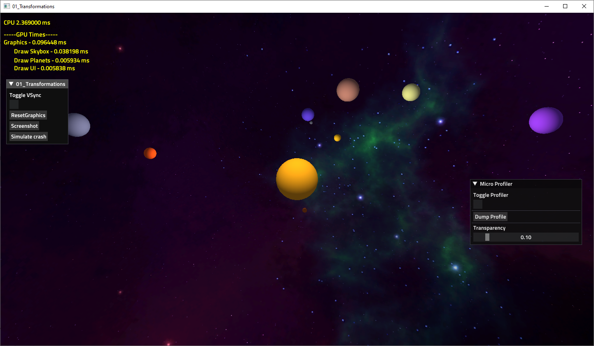


## 3. Multi-Threaded Rendering

This unit test shows how to generate a large number of command buffers on all platforms supported by The Forge. This unit test is based on [a demo by Intel called Stardust](https://software.intel.com/en-us/articles/using-vulkan-graphics-api-to-render-a-cloud-of-animated-particles-in-stardust-application).

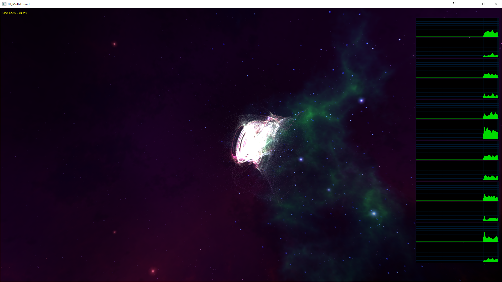


## 6. Material Playground

This unit test shows a range of game related materials:

Hair:
Many years ago in 2012 / 2013, we helped AMD and Crystal Dynamics with the development of TressFX for Tomb Raider. We also wrote an article about the implementation in GPU Pro 5 and gave a few joint presentations on conferences like FMX. At the end of last year we revisited TressFX. We took the current code in the GitHub repository, changed it a bit and ported it to The Forge. It now runs on PC with DirectX 12 / Vulkan, macOS and iOS with Metal 2 and on the XBOX One. We also created a few new hair assets so that we can showcase it. Here is a screenshot of our programmer art:


Metal:

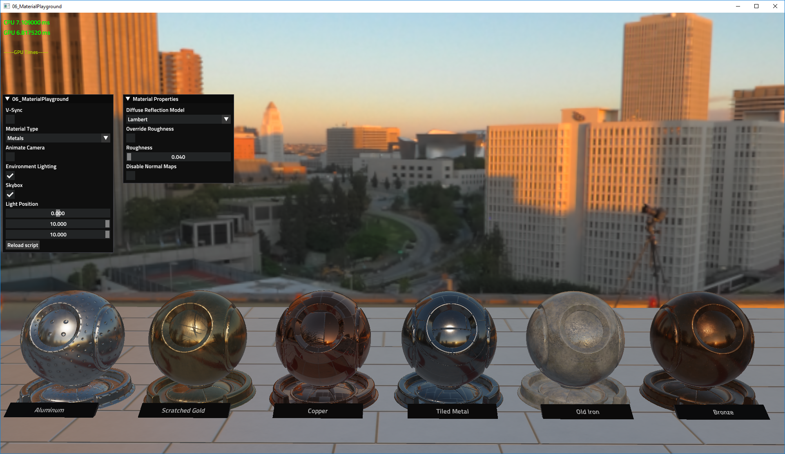

Wood:

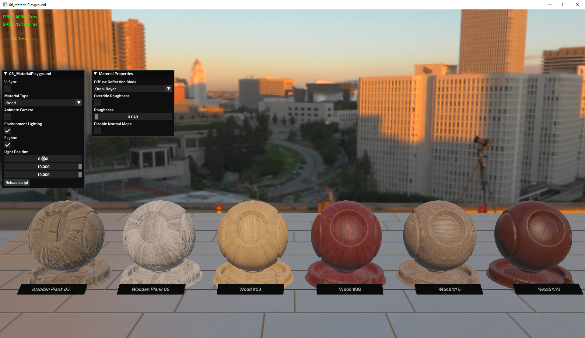


## 9. Light and Shadow Playground
This unit test shows various shadow and lighting techniques that can be chosen from a drop down menu. There will be more in the future.

 * Exponential Shadow Map - this is based on [Marco Salvi's](https://pixelstoomany.wordpress.com/category/shadows/exponential-shadow-maps/) @marcosalvi papers. This technique filters out the edge of the shadow map by approximating the shadow test using exponential function that involves three subjects: the depth value rendered by the light source, the actual depth value that is being tested against, and the constant value defined by the user to control the softness of the shadow
  * Adaptive Shadow Map with Parallax Correction Cache - this is based on the article "Parallax-Corrected Cached Shadow Maps" by Pavlo Turchyn in [GPU Zen 2](https://gpuzen.blogspot.com/2019/05/gpu-zen-2-parallax-corrected-cached.htm). It adaptively chooses which light source view to be used when rendering a shadow map based on a hiearchical grid structure. The grid structure is constantly updated depending on the user's point of view and it uses caching system that only renders uncovered part of the scene. The algorithm greatly reduce shadow aliasing that is normally found in traditional shadow map due to insufficient resolution. Pavlo Turchyn's paper from GPU Pro 2 added an additional improvement by implementing multi resolution filtering, a technique that approximates larger size PCF kernel using multiple mipmaps to achieve cheap soft shadow. He also describes how he integrated a Parallax Correction Cache to Adaptive Shadow Map, an algorithm that approximates moving sun's shadow on static scene without rendering tiles of shadow map every frame. The algorithm is generally used in an open world game to approximate the simulation of day & night’s shadow cycle more realistically without too much CPU/GPU cost.
  * Signed Distance Field Soft Shadow - this is based on [Daniel Wright's Siggraph 2015](http://advances.realtimerendering.com/s2015/DynamicOcclusionWithSignedDistanceFields.pdf) @EpicShaders presentation. To achieve real time SDF shadow, we store the distance to the nearest surface for every unique Meshes to a 3D volume texture atlas. The Mesh SDF is generated offline using triangle ray tracing, and half precision float 3D volume texture atlas is accurate enough to represent 3D meshes with SDF. The current implementation only supports rigid meshes and uniform transformations (non-uniform scale is not supported). An approximate cone intersection can be achieved  by measuring the closest distance of a passed ray to an occluder which gives us a cheap soft shadow when using SDF.

To achieve  high-performance, the playground runs on our signature rendering architecture called Triangle Visibility Buffer. The step that generates the SDF data also uses this architecture.

Click on the following screenshot to see a movie:

[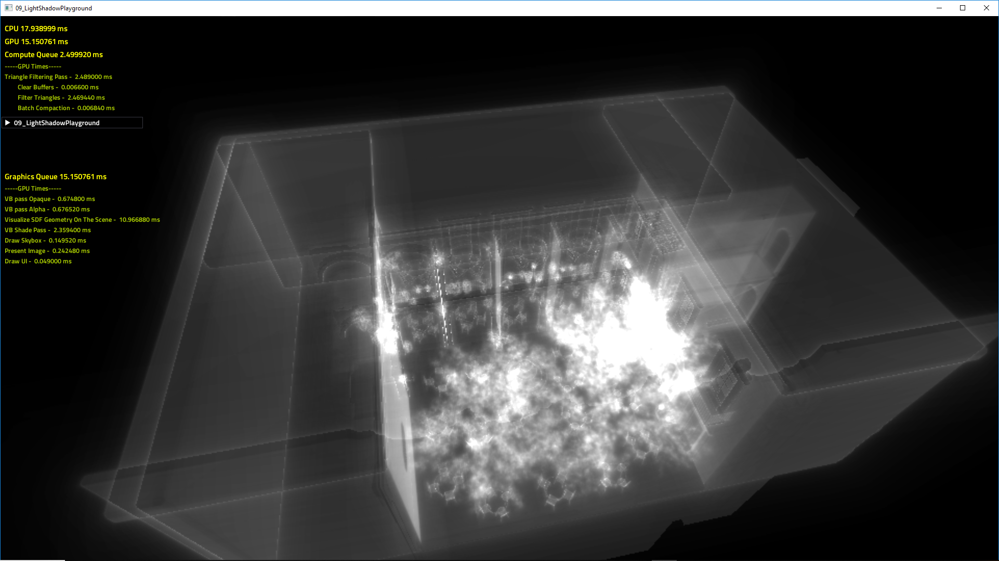](https://vimeo.com/352985038)

The following PC screenshots are taken on Windows 10 with a AMD RX550 GPU (driver 19.7.1) with a resolution of 1920x1080. 

Exponential Shadow Maps:


Adaptive Shadow Map with Parallax Correction Cache

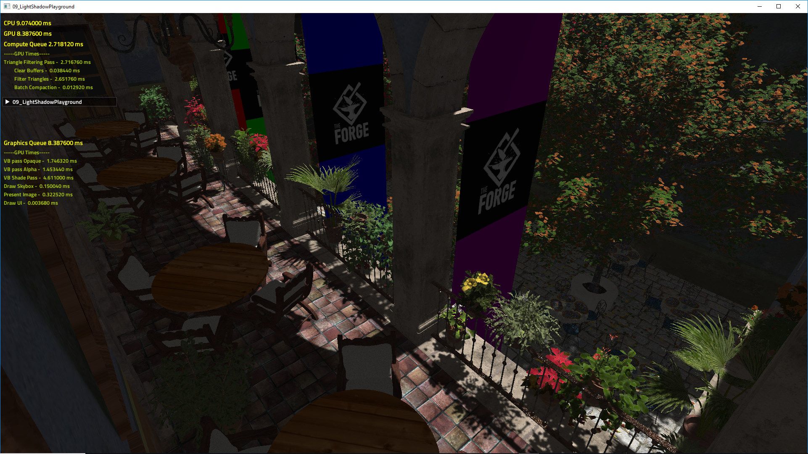

Signed Distance Field Soft Shadow:

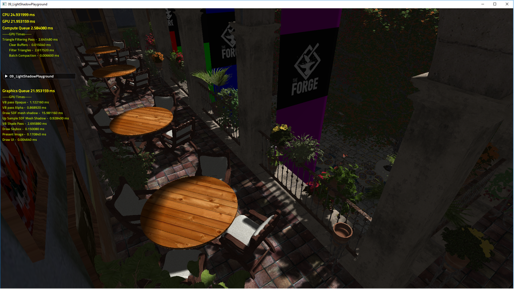

Signed Distance Field Soft Shadows - Debug Visualization


The following shots show Signed Distance Field Soft Shadows running on iMac with a AMD RADEON Pro 580

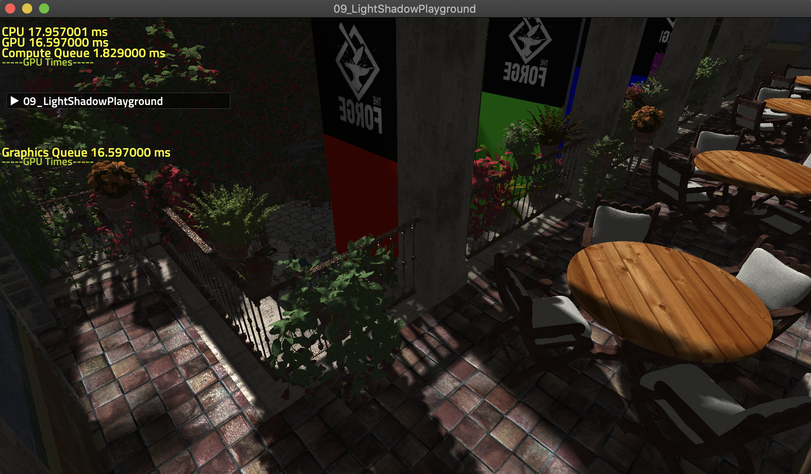


The following shots show Signed Distance Field Soft Shadows running on XBOX One:

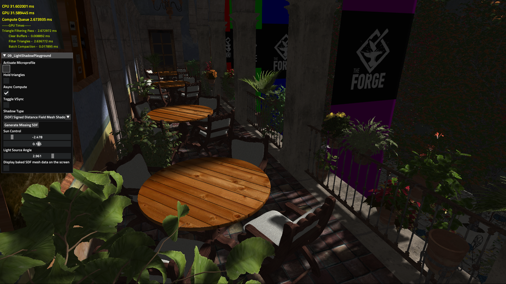

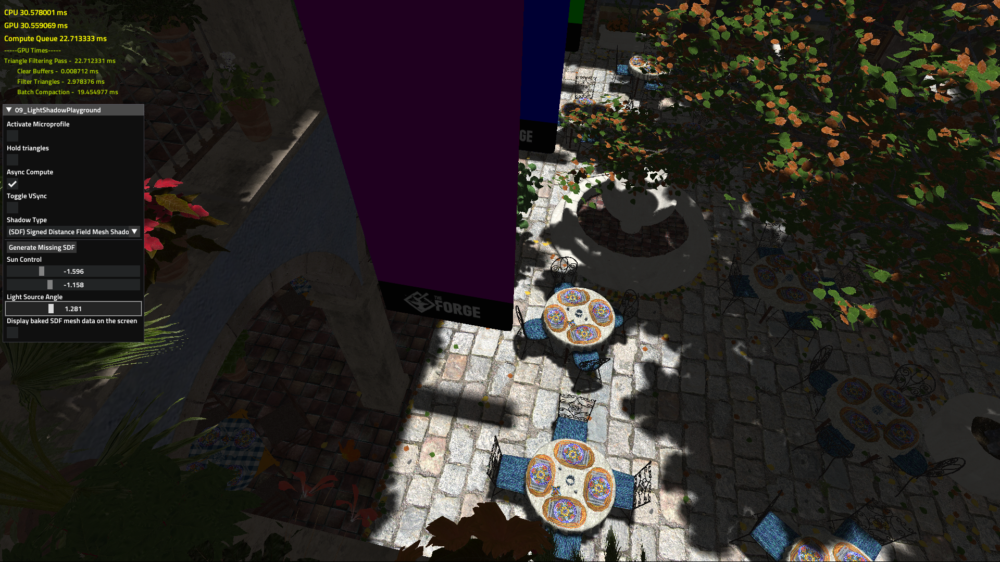

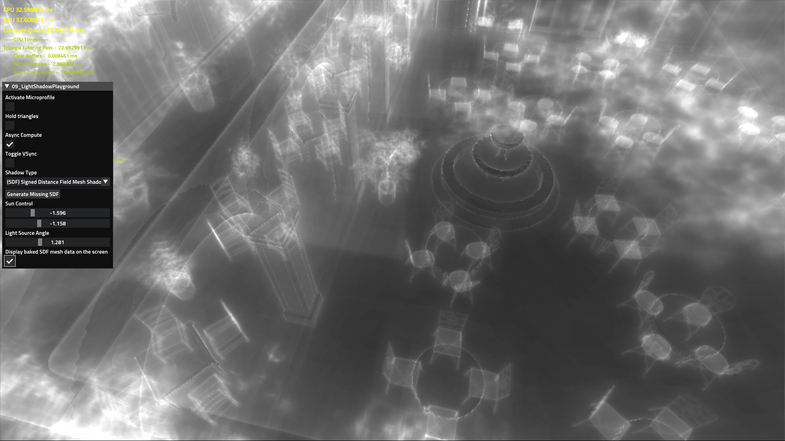

Readme for Signed Distance Field Soft Shadow Maps:

To generate the SDF Mesh data you should select “Signed Distance Field” as the selected shadow type in the Light and Shadow Playground. There is a button called “Generate Missing SDF” and once its clicked, it shows a progress bar that represents the remaining SDF mesh objects utilized for SDF data generation. This process is multithreaded, so the user can still move around the scene while waiting for the SDF process to be finished. This is a long process and it could consume up to 8+ hours depending on your CPU specs. To check how many SDF objects there are presently in the scene, you can mark the checkbox "Visualize SDF Geometry On The Scene".

This unit test also supports screen-space shadows. These are complementary to regular shadow mapping and add more detail. We also fixed a number of inconsistencies with the other shadow map approaches.

PS5 - Screen-Space Shadows on
 

PS5 - Screen-Space Shadows off
 

Nintendo Switch
 

PS4
 


## 9a. Hybrid Ray-Traced Shadows
This unit test was build by Kostas Anagnostou @KostasAAA to show how to ray trace shadows without using a ray tracing API like DXR / RTX. It should run on all GPUs (not just NVIDIA RTX GPUs) and the expectation is that it should run comparable with a DXR / RTX based version even on a NVIDIA RTX GPU. That means the users of your game do not have to buy a NVIDIA RTX GPU to enjoy HRT shadows :-)


<!---->

Mac M2 (1440x838)


PS4 Pro (3840x2160)


Switch (1280x720)
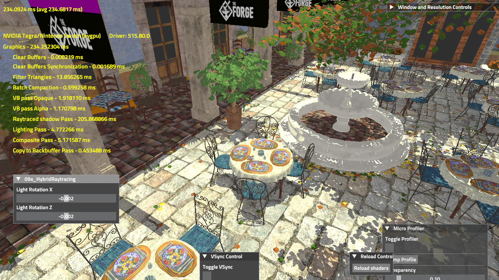

XBOX One Series S (1080p)
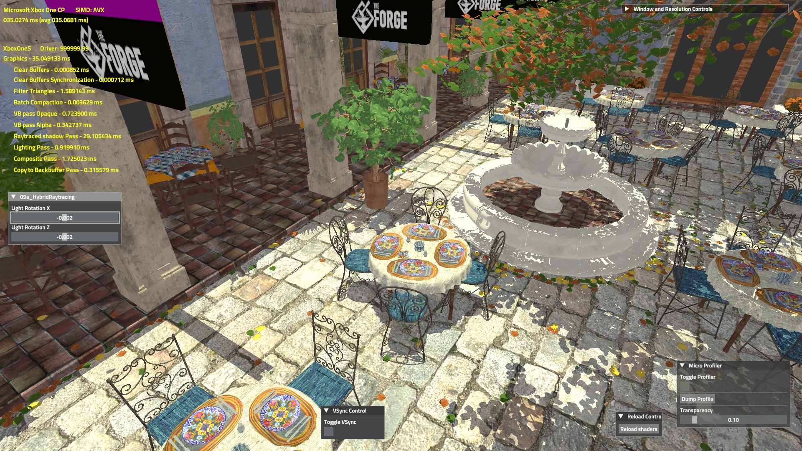

iPad Pro 12.9-inch (5th generation) (Model A2378) (2733x2048)


## 10. Screen-Space Reflections
This test offers two choices: you can pick either Pixel Projected Reflections or AMD's FX Stochastic Screen Space Reflection. We just made AMD's FX code cross-platform. It runs now on Windows, Linux, macOS, Switch, PS and XBOX.

Here are the screenshots of AMD's FX Stochastic Screen Space Reflections:

Windows 10 (2560x1080)


PS4 PRO (3840x2160)


Switch (1280x720)
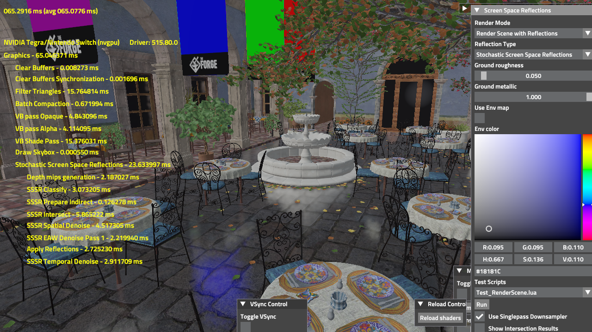

Mac M2 (1440x838)


XBOX One Series S (1080p)
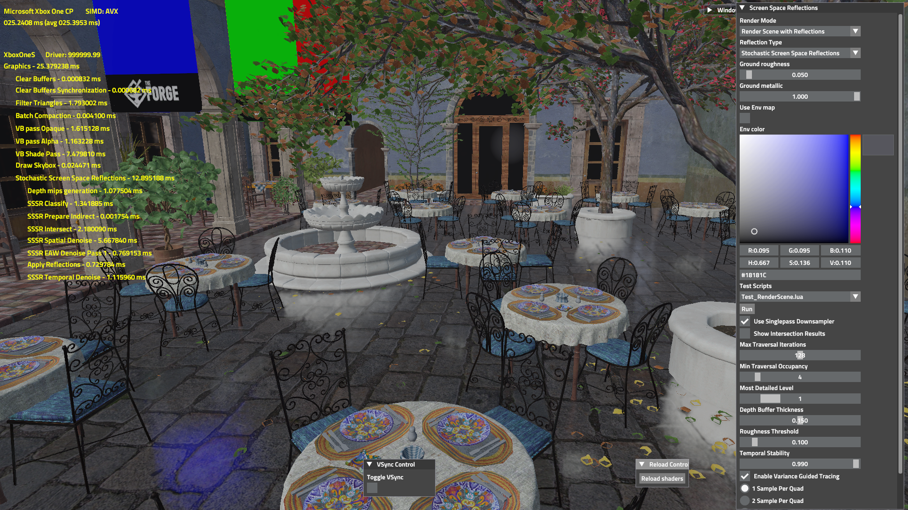

iPad Pro 12.9-inch (5th generation) (Model A2378) (1366x1024)

<!--
Windows final scene:
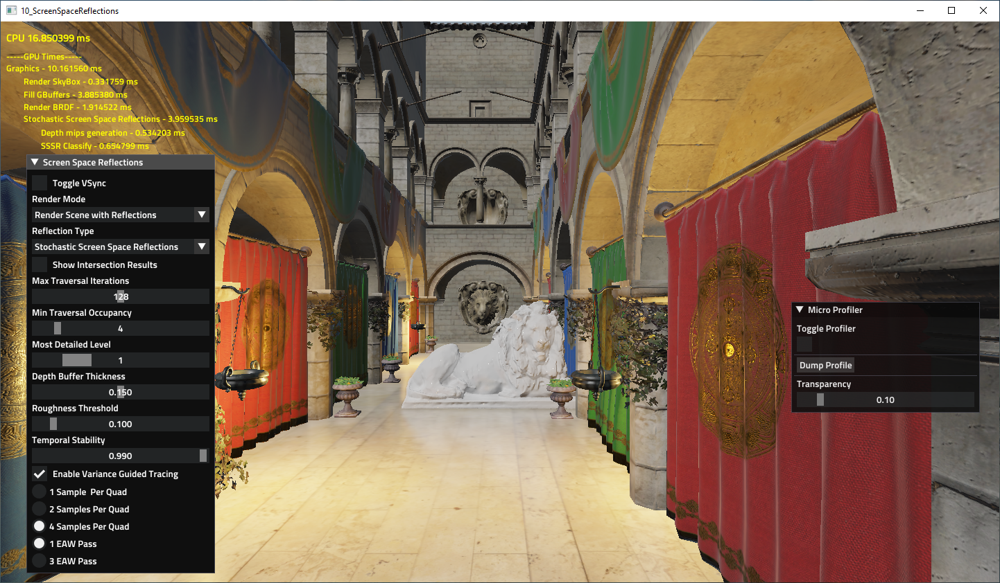

Without denoising:
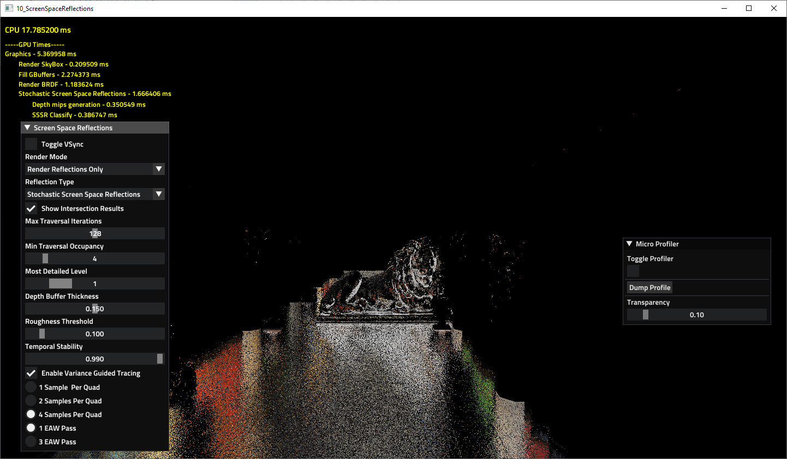

With denoising:
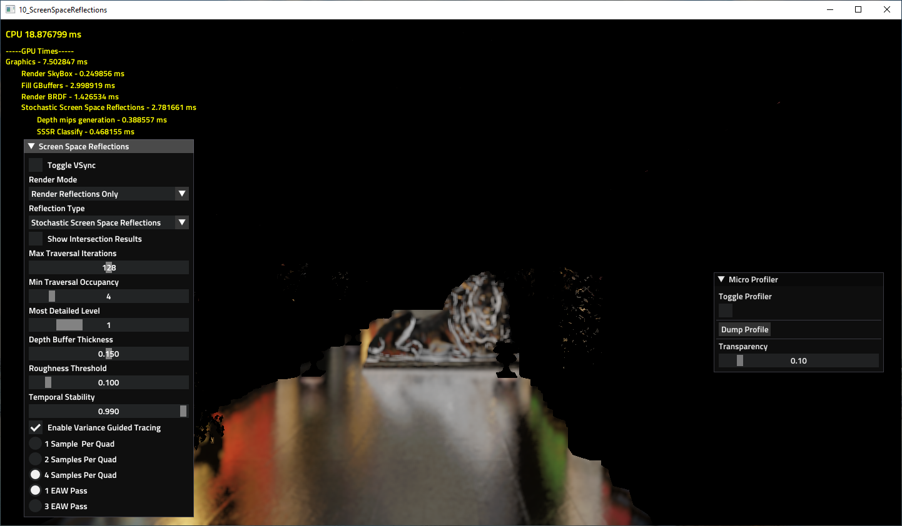

PS4:


macOS:


In case you pick Pixel-Projected Reflections, the application features an implementation of the papers [Optimized pixel-projected reflections for planar reflectors](http://advances.realtimerendering.com/s2017/PixelProjectedReflectionsAC_v_1.92.pdf) and [IMPLEMENTATION OF OPTIMIZED PIXEL-PROJECTED REFLECTIONS FOR PLANAR REFLECTORS](https://github.com/byumjin/Jin-Engine-2.1/blob/master/%5BByumjin%20Kim%5D%20Master%20Thesis_Final.pdf)

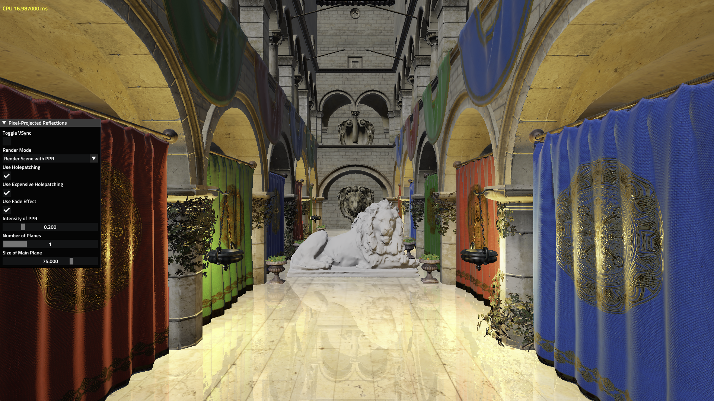
-->

## 11. Multi-GPU (Driver support only on PC Windows)
This unit test shows a typical VR Multi-GPU configuration. One eye is rendered by one GPU and the other eye by the other one.

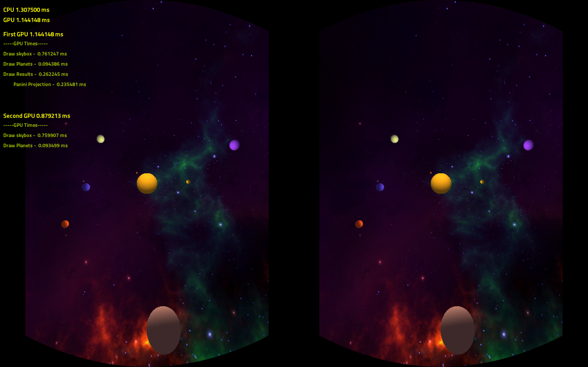

## 11a. Unlinked multiple GPUs (Driver support only on PC Windows)
For professional visualization applications, we now support unlinked multiple GPUs. A new renderer API is added to enumerate available GPUs. Renderer creation is extended to allow explicit GPU selection using the enumerated GPU list. Multiple Renderers can be created this way. The resource loader interface has been extended to support multiple Renderers. It is initialized with the list of all Renderers created. To select which Renderer (GPU) resources are loaded on, the NodeIndex used in linked GPU configurations is reused for the same purpose. Resources cannot be shared on multiple Renderers however, resources must be duplicated explicitly if needed. To retrieve generated content from one GPU to another (e.g. for presentation), a new resource loader operation is provided to schedule a transfer from a texture to a buffer. The target buffer should be mappable. This operation requires proper synchronization with the rendering work; a semaphore can be provided to the copy operation for that purpose. Available with Vulkan and D3D12. For other APIs, the enumeration API will not create a RendererContext which indicates lack of unlinked multi GPU support.

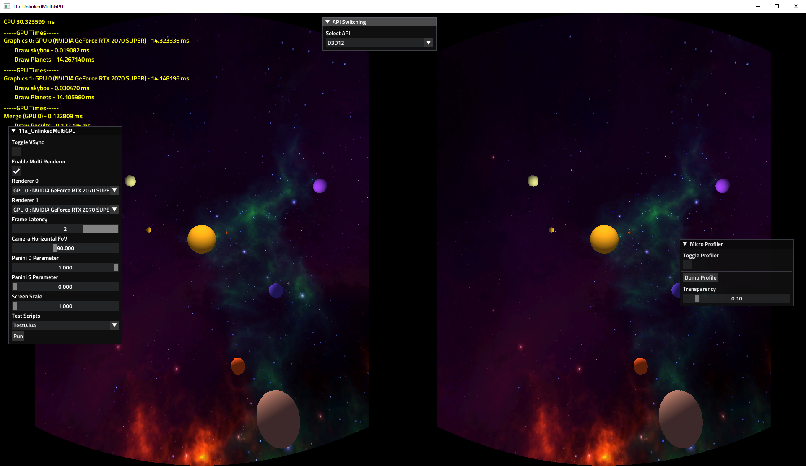

## 12. File System Test
This unit test showcases a cross-platform FileSystem C API, supporting disk-based files, memory streams, and files in zip archives. The API can be viewed in [IFileSystem.h](/Common_3/OS/Interfaces/IFileSystem.h), and all of the example code has been updated to use the new API.
   * The API is based around `Path`s, where each `Path` represents an absolute, canonical path string on a particular file system. You can query information about the files at `Path`s, open files as `FileStream`s, and copy files between different `Path`s.
   * The concept of `FileSystemRoot`s has been replaced by `ResourceDirectory`s. `ResourceDirectory`s are predefined directories where resources are expected to exist, and there are convenience functions to open files in resource directories. If your resources don’t exist within the default directory for a particular resource type, you can call `fsSetPathForResourceDirectory` to relocate the resource directory; see the unit tests for sample code on how to do this.
   
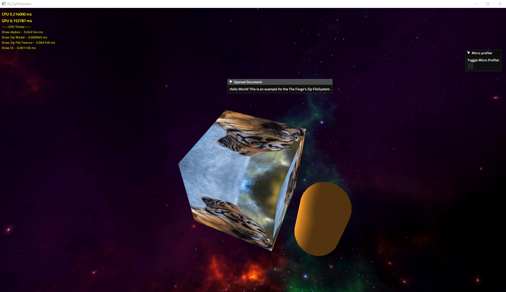


## 14. Wave Intrinsics
This unit test shows how to use the new wave intrinsics. Supporting Windows with DirectX 12 / Vulkan, Linux with Vulkan and macOS / iOS.

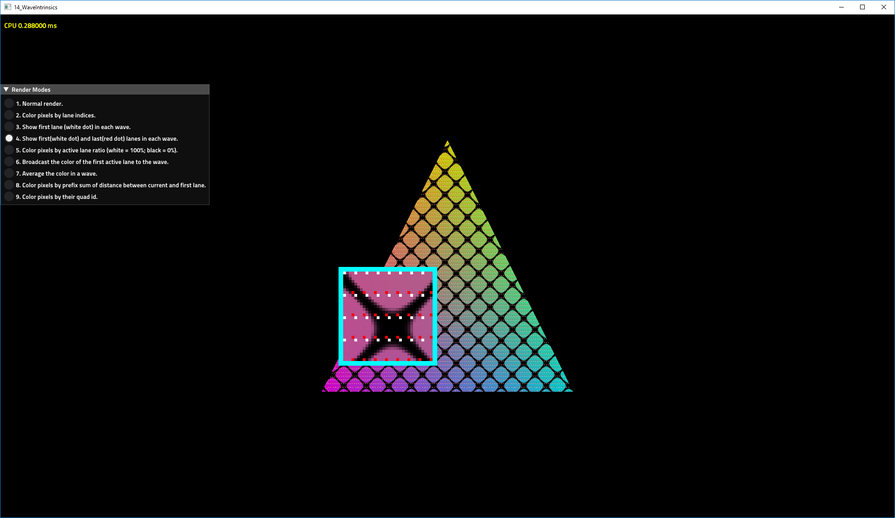

## 15. Order-Independent Transparency
This unit test compares various Order-Indpendent Transparency Methods. In the moment it shows:
- Alpha blended transparency
- Weighted blended Order Independent Transparency [Morgan McGuire Blog Entry 2014](http://casual-effects.blogspot.com/2014/03/weighted-blended-order-independent.html) and [Morgan McGuire Blog Entry 2015](http://casual-effects.blogspot.com/2015/03/implemented-weighted-blended-order.html)
- Weighted blended Order Independent Transparency by Volition [GDC 2018 Talk](https://www.gdcvault.com/play/1025400/Rendering-Technology-in-Agents-of)
- Adaptive Order Independent Transparency with Raster Order Views [paper by Intel, supports DirectX 11, 12 only](https://software.intel.com/en-us/articles/oit-approximation-with-pixel-synchronization-update-2014), and a [Primer](https://software.intel.com/en-us/gamedev/articles/rasterizer-order-views-101-a-primer)
- Phenomenological Transparency - Diffusion, Refraction, Shadows by [Morgan McGuire](https://casual-effects.com/research/McGuire2017Transparency/McGuire2017Transparency.pdf)
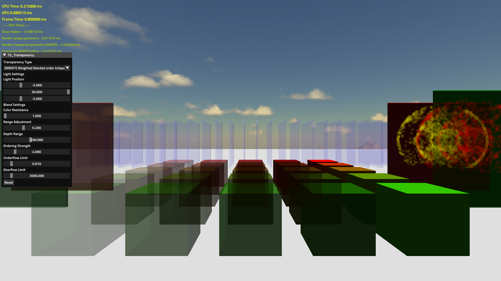

## 15a. Visibility Buffer OIT
This unit test shows how to handle per triangle order-independent transparency in an intuitive way in the Visibility Buffer context. The main idea is that a per-pixel linked list of triangle IDs is holding layers of transparency. This is occupies less memory and is more efficient than storing per-pixel information.

We also added Variable Rate Shading to this unit test. This way we have a better looking test scene with St. Miguel.

VRS allows rendering parts of the render target at different resolution based on the auto-generated VRS map, thus achieving higher performance with minimal quality loss. It is inspired by Michael Drobot's SIGGRAPH 2020 talk: https://docs.google.com/presentation/d/1WlntBELCK47vKyOTYI_h_fZahf6LabxS/edit?usp=drive_link&ouid=108042338473354174059&rtpof=true&sd=true

The key idea behind the software-based approach is to render everything in 4xMS targets and use a stencil buffer as a VRS map. VRS map is automatically generated based on the local image gradients.
It could be used on a way wider range of platforms and devices than the hardware-based approach since the hardware VRS support is broken or not supported on many platforms. Because this software approach utilizes 2x2 tiles we could also achieve higher image quality compared to hardware-based VRS.

Shading rate view based on the color per 2x2 pixel quad:
- White – 1 sample (top left, always shaded);
- Blue – 2 horizontal samples;
- Red – 2 vertical samples;
- Green – all 4 samples;

PC
 

Debug Output with the original Image on PC
 

PC
 

Debug Output with the original Image on PC
 

Android
 

Debug Output with the original Image on Android
 

Android
 

Debug Output with the original Image on Android
 


Example 15a_VisibilityBufferOIT now has an additional option to toggle VRS - "Enable Variable Rate Shading"
The Debug view can now be toggled with the "Draw Debug Targets" option. This shows the auto-generated VRS map if VRS is enabled.

Limitations:
	Relies on programmable sample locations support – not widely supported on Android devices.

Supported platforms:
PS4, PS5, all XBOXes, Nintendo Switch, Android (Galaxy S23 and higher), Windows(Vulkan/DX12), macOS/iOS.

## 16. Path Tracer - Ray Tracing
We switched to Ray Queries for the common Ray Tracing APIs on all the platforms we support. The current Ray Tracing APIs increase the amount of memory necessary substantially, decrease performance and can't add much visually because the whole game has to run with lower resolution, lower texture resolution and lower graphics quality (to make up for this, upscalers were introduced that add new issues to the final image). 
Because Ray Tracing became a Marketing term valuable to GPU manufacturers, some game developers support now Ray Tracing to help increase hardware sales. So we are going with the flow here by offering those APIs.

macOS (1440x810)


PS5 (1080p)


Windows 10 (2560x1080)


XBOX One Series X (1080p)


iPhone 11 (Model A2111) at resolution 896x414


We do not have a denoiser for the Path Tracer.


## 17. Entity Component System Test
This unit test shows how to use the high-performance entity component system in The Forge. 
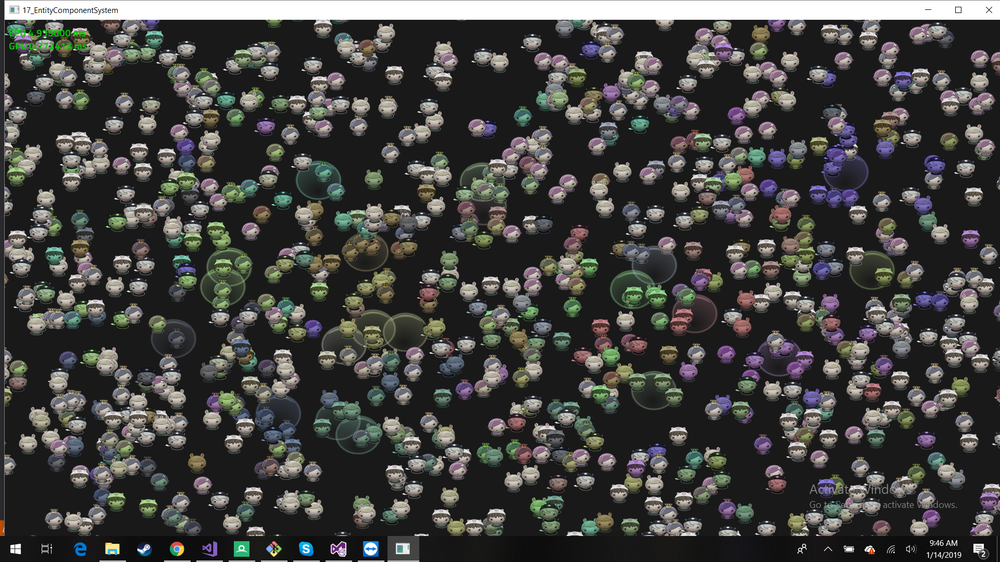

This unit test uses

[](https://github.com/SanderMertens/flecs)

Compared to our old ECS system our build times are now much better and the overall system runs faster:

```
CPU: intel i7-7700k
GPU: AMD Radeon RX570

Old ECS
Debug
Single Threaded: 90.0ms 
Multi Threaded 29.0ms

Release:
Single Threaded: 5.7ms
Multi Threaded: 2.3ms


flecs
Debug
Single Threaded: 23.0ms   
Multi Threaded 6.8ms

Release
Single Threaded 1.7ms
Multi Threaded 0.9ms
```


## 19. C Hot Reloading
This unit test showcases an implementation of code hot reloading in C, we've used and adapted the following GitHub library

[cr](https://github.com/fungos/cr)

 for this. 
 
 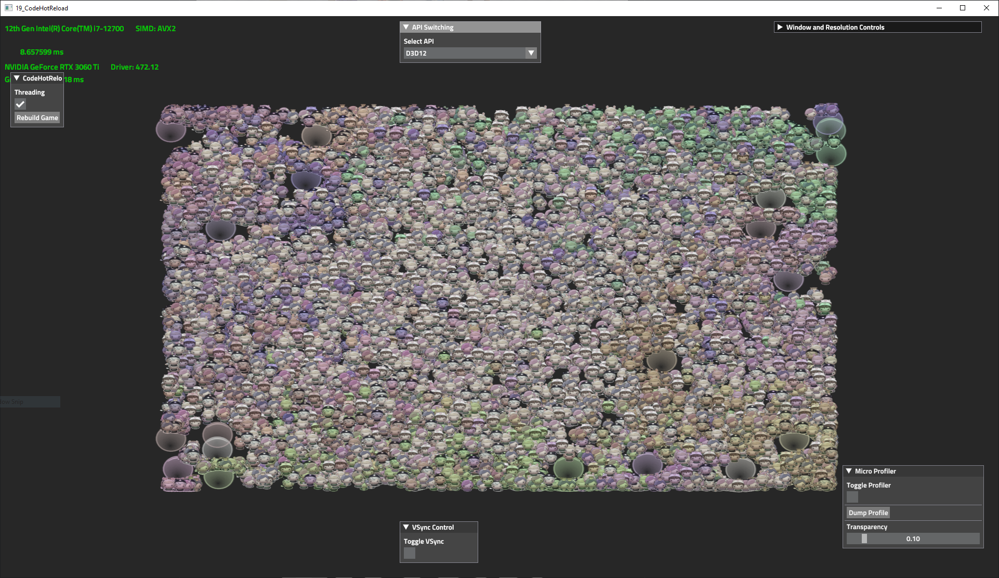
 
 The test contains two projects:
- 19_CodeHotReload_Main: generates the executable. All code in this project can't be hot-reloaded. This is the project you should set as startup project when running the program form an IDE.
- 19a_CodeHotReload_Game: for development platforms Windows/MacOS/Linux generates a dynamic library that is loaded by the Main project in runtime, when the dynamic library changes the Main program reloads the new code. For Android/IOS/Quest/Consoles this project is compiled and linked statically.

How to use it: While the Main project is running open 19_CodeHotReload_Game.cpp and perform some change, there are lines marked with `TRY_CODE_RELOAD` to make easy changes. Once the file is saved, you can rebuild the project and see the changes happen automatically.
- Windows/Linux: Click on the UI "RebuildGame" button.
- MacOS: Command+B on XCode to rebuild.

Note: In this implementation we can't call any functions from The Forge from the HotReloadable project (19a_CodeHotReload_Game), this is because we are compiling OS and Renderer as static libraries and linking them directly to the exe. Ideally these projects should be compiled as dynamic libraries in order to expose their functionality to the exe and hot reloadable dll. The reason we didn't implement it in this way is because all our other projects are already setup to use static libraries.


## 21. Animation
This unit test shows a wide range of animation tasks. We used Ozz to achieve those. The following shots were taken on an Android phone. 

Ozz Playback Animation
Here is how to playback a clip on a rig:


Ozz Playback Blending
This option shows how to blend multiple clips and play them back on a rig:


<!--
Ozz Joint Attachment
This option shows how to attach an object to a rig which is being posed by an animation.


-->

Ozz Partial Blending
This option shows how to blend clips having each only effect a certain portion of joints.


Ozz Additive Blending
This option shows how to introduce an additive clip onto another clip and play the result on a rig.


Ozz Baked Physics
This option shows how to use a scene of a physics interaction that has been baked into an animation and play it back on a rig.


Ozz Multi Threading
This option shows how to animate multiple rigs simultaneously while using multi-threading for the animation updates:


## 28. Ozz Skinning
This unit test shows how to use skinning with Ozz


 

## 36 AlgorithmsAndContainers
This unit test is used to make sure the string, dynamic array and hash map implementation is stable.


# Examples

## Triangle Visibility Buffer 1.0
This is an implementation of the Triangle Visibility Buffer that utilizes indirect draw calls. An early version of this example was covered in various conference talks. [Here](https://diaryofagraphicsprogrammer.blogspot.com/2018/03/triangle-visibility-buffer.html) is a blog entry that details the implementation in The Forge.

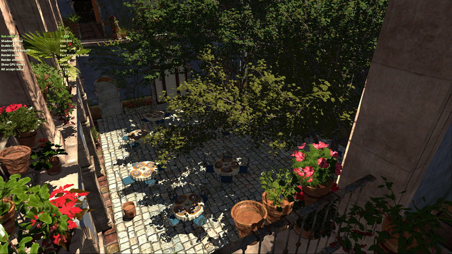


## Triangle Visibility Buffer 2.0
This is a more GPU Driven version of the Triangle Visibility Buffer. All the indirect draw calls are replaced by one large compute shader.


# Tools
Below are screenshots and descriptions of some of the tools we integrated.

## SAST Tools

[PVS-Studio](https://pvs-studio.com/pvs-studio/?utm_source=website&utm_medium=github&utm_campaign=open_source) - static analyzer for C, C++, C#, and Java code.

## Shader Server

To enable re-compilation of shaders during run-time we implemented a cross-platform shader server that allows to recompile shaders by pressing CTRL-S or a button in a dedicated menu.
You can find the documentation in the Wiki in the FSL section.

## Remote UI Control
When working remotely, on mobile or console  it can cumbersome to control the development UI.
We added a remote control application in Common_3\Tools\UIRemoteControl which allows control of all UI elements on all platforms.
It works as follows:
- Build and Launch the Remote Control App located in Common_3/Tools/UIRemoteControl
- When a unit test is started on the target application (i.e. consoles), it starts listening for connections on a part (8889 by default)
- In the Remote Control App, enter the target ip address and click connect


## MTuner
MTuner
MTuner was integrated into the Windows 10 runtime of The Forge following a request for more in-depth memory profiling capabilities by one of the developers we support. It has been adapted to work closely with our framework and its existing memory tracking capabilities to provide a complete picture of a given application’s memory usage. 

To use The Forge’s MTuner functionality, simply drag and drop the .MTuner file generated alongside your application’s executable into the MTuner host app, and you can immediately begin analyzing your program’s memory usage. The intuitive interface and exhaustive supply of allocation info contained in a single capture file makes it easy to identify usage patterns and hotspots, as well as tracking memory leaks down to the file and line number. The full documentation of MTuner can be found [here](link: https://milostosic.github.io/MTuner/).

Currently, this feature is only available on Windows 10, but support for additional platforms provided by The Forge is forthcoming.
Here is a screenshot of an example capture done on our first Unit Test, 01_Transformations:
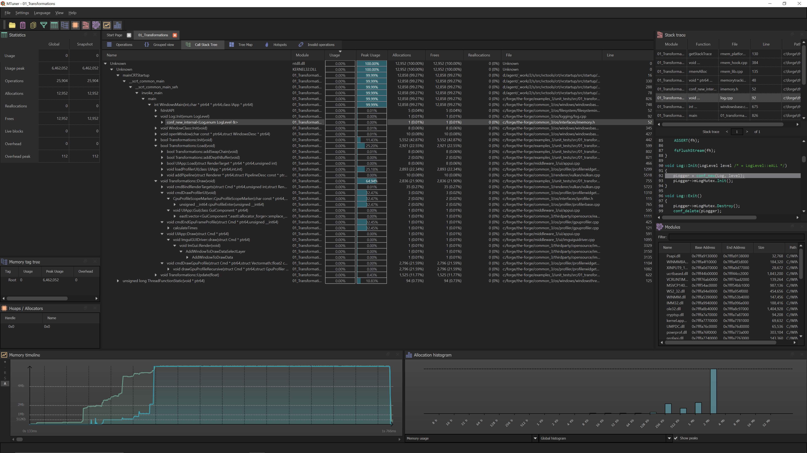 

## Ray Tracing Benchmark
Based on request we are providing a Ray Tracing Benchmark in 16_RayTracing. It allows you to compare the performance of three platforms: 
  * Windows with DirectX 12 DXR
  * Windows with Vulkan RTX
  * Linux with Vulkan RTX

  We will extend this benchmark to the non-public platforms we support to compare the PC performance with console performance. 
  The benchmark comes with batch files for all three platforms. Each run generates a HTML output file from the profiler that is integrated in TF. The default number of iterations is 64 but you can adjust that.  There is a Readme file in the 16_RayTracing folder that describes the options.

Windows DirectX 12 DXR, GeForce RTX 2070 Super, 3840x1600, NVIDIA Driver 441.99

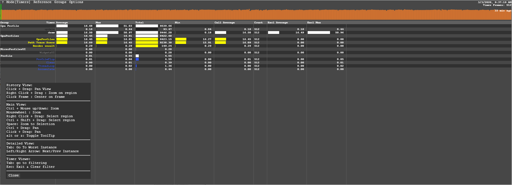 

Windows Vulkan RTX, GeForce RTX 2070 Super, 3840x1600, NVIDIA Driver 441.99

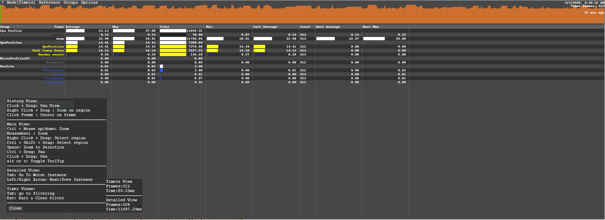 


## Microprofiler
We integrated the [Micro Profiler](https://github.com/zeux/microprofile) into our code base by replacing the proprietary UI with imGUI and simplified the usage. Now it is much more tightly and consistently integrated in our code base.

Here are screenshots of the Microprofiler running the Visibility Buffer on PC:

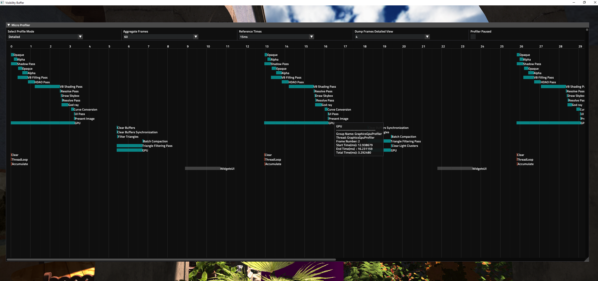

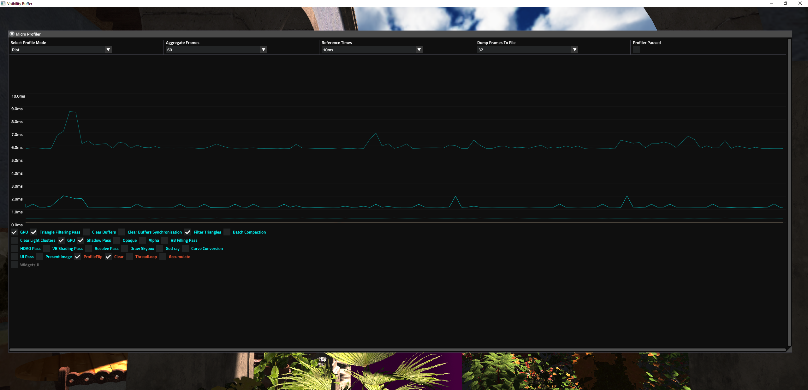

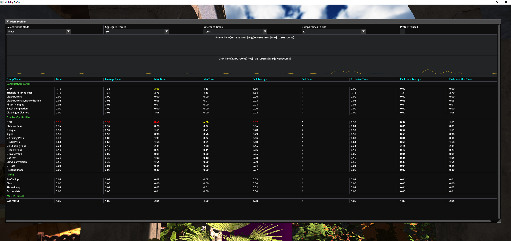

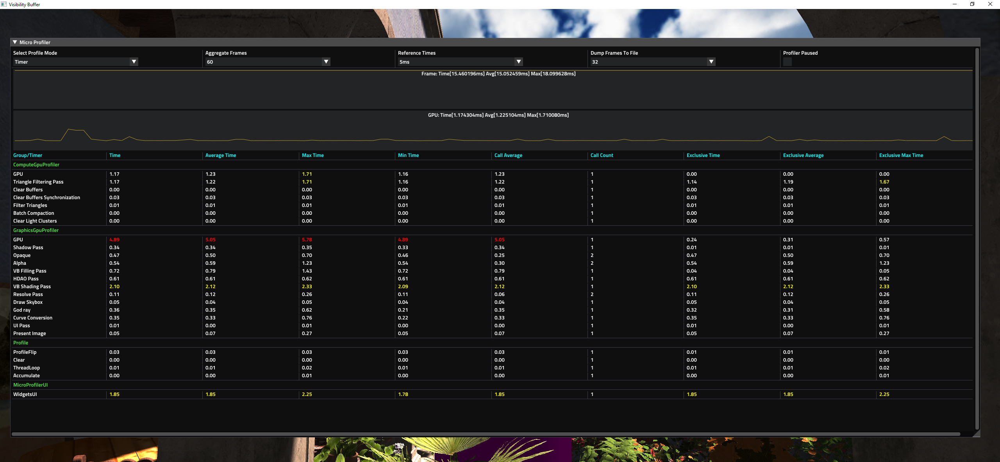

Here are screenshots of the Microprofiler running a unit test on iOS:

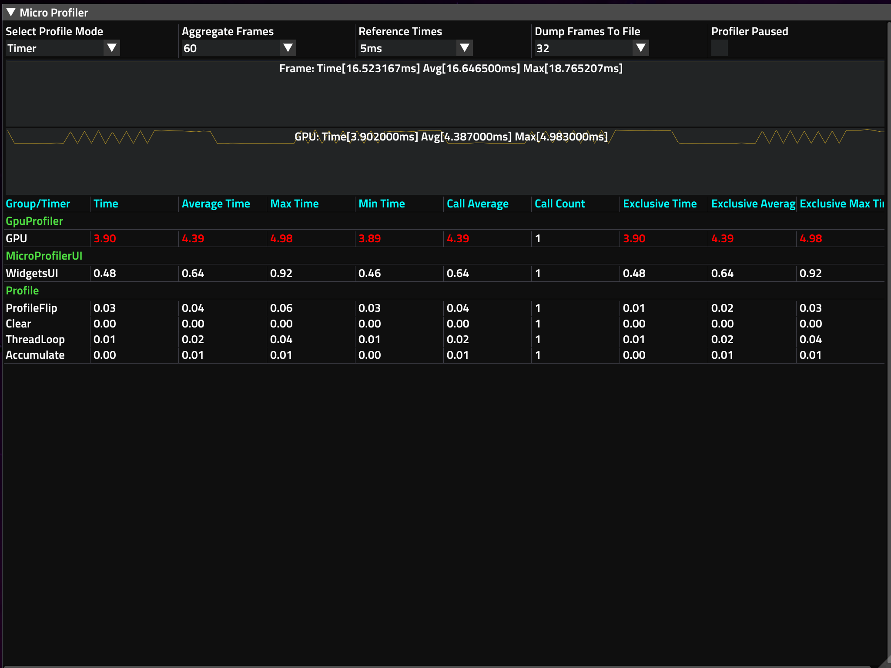

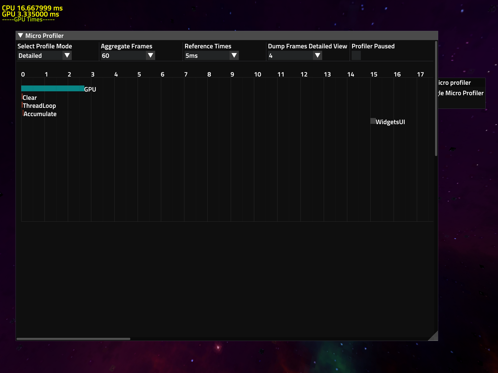

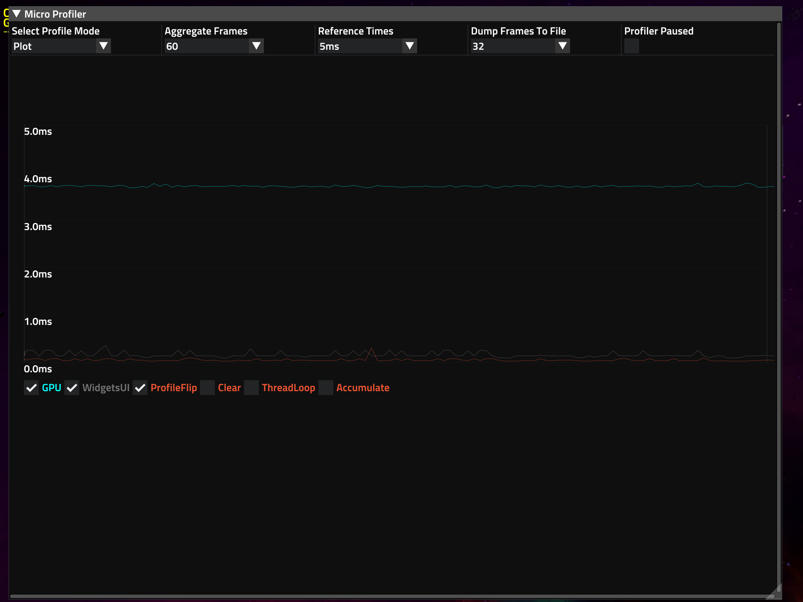

Check out the [Wikipage](https://github.com/ConfettiFX/The-Forge/wiki/Microprofiler---How-to-Use) for an explanation on how to use it.

## Shader Translator
We provide a shader translator, that translates one shader language -a superset of HLSL called Forge Shader Language (FLS) - to the target shader language of all our target platforms. That includes the console and mobile platforms as well.
It is written in Python. We expect this shader translator to be an easier to maintain solution for smaller game teams because it allows to add additional data to the shader source file with less effort. Such data could be for example a bucket classification or different shaders for different capability levels of the underlying platform, descriptor memory requirements or resource memory requirements in general, material info or just information to easier pre-compile pipelines.
The actual shader compilation will be done by the native compiler of the target platform.

 [How to use the Shader Translator](https://github.com/ConfettiFX/The-Forge/wiki/How-to-Use-The-Shader-Translator)

## GPU Config System
This is a general system that can track GPU capabilities on all platforms and switch on and off features of a game for different platforms. 

## Summary

- [GPU Configuration system](#GPU-Configuration-system)
  - [Hardware Capabilities](#Hardware-Capabilities)
  - [GPUPresetLevel](#gpupresetlevel)
  - [GPU Selection](#GPU-Selection)
  - [Driver Rejection](#Driver-Rejection)
  - [User Extended Settings](#User-Extended-Settings)

- [Open questions](#Open-questions)
- [List of available properties](#List-of-available-properties)

## GPU Configuration system

Our configuration system allows to:

- Access an exhaustive list of **hardware features** and **capabilities** (see Vulkan hardware capability viewer) 
- Give a **performance rating** to each available gpu (office, low, medium, high, ultra) 
- **Choose a specific gpu** when multiple are available
- Turn on and off certain hardware features (ex: **turn off raytracing support** for a specific vendor)
- Disable certain gpu **depending on the current driver version**
- Set application settings based on the current hardware (ex: disable certain game mechanics if there are no proper support for advanced transparency)

What it is not:

- A full feature configuration system you see in most game, ex: **Graphic Settings** panel
- TheForge is mainly designed to deal with hardware features, his goal is not to manage the specific settings of your application.

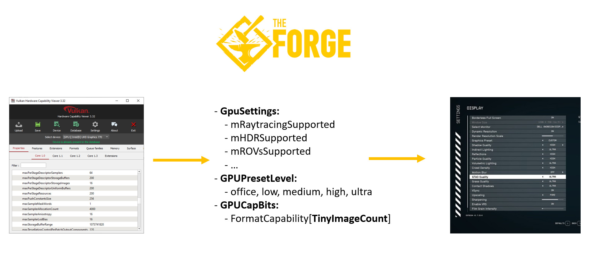

### Hardware Capabilities

TheForge lets you access various structures that store hardware information about the current device your application is using:

- GPUSettings: storing various flags that indicate the hardware features supported across different platform (**mHDRSupported**, **mTessellationSupported**, **mRaytracingSupported**, **mROVsSupported**, **mTessellationSupported**, **mVRAM**, **mWaveOpsSupportFlags**, ...)
  - The quality index assigned to the gpu is set inside the **mGpuVendorPreset** attribute
- GPUCapBits: storing the list of all the available texture formats (**TinyImageFormat_R32G32_UINT**, **TinyImageFormat_R32_SFLOAT**, **TinyImageFormat_ASTC_8x8_SRGB**, ...)
- RendererContext: storing features and extensions specific to each graphic API
  - GpuInfo attribute can be used to access the native interface directly (**IDXGIAdapter**, **VkPhysicalDeviceProperties2**, **MTLDevice**, ...) 

### GPUPresetLevel

A performance index is assigned to the current gpu during the initialization phases in *initRenderer(*). This value comes from reading the gpu.data file in the **RD_GPU_CONFIG** directory, previously set via **fsSetPathForResourceDir()**.

This file contains a list of available model of graphics card and their manufacturers. You can find the URLs that were used to create this database at the beginning of the file. Feel free to keep this list updated as needed. 

Consoles have been added inside this list:

- **Xbox:** the modelID is obtained by invoking **XsystemGetDevicetype**, which return a enum value you can find on the [msdn](https://learn.microsoft.com/en-us/gaming/gdk/_content/gc/reference/system/xsystem/enums/xsystemdevicetype) documentation page
- **Playstation:** use a proprietary platform macro to assign an identifier for each console
- **Nintendo Switch:** use the the model code of the nvidia tegra device
- **SteamDeck:** use the model code of the amd apu

If the model is missing you can use the **DefaultPresetLevel** property to assign a GPUPresetLevel to any unknown device. This can be usefull on a client machine or for testing your application's quality presets on multiple graphic cards.

*gpu.data:*

```
BEGIN_VENDOR_LIST;
intel; 0x163C, 0x8086, 0x8087;
nvidia; 0x10DE
amd; 0x1002, 0x1022;
qualcomm; 0x5143;
imagination technologies; 0x1010;
samsung; 0x144D;
arm; 0x13b5;
apple; 0x106b;
END_VENDOR_LIST;

BEGIN_DEFAULT_CONFIGURATION;
#if the current gpu doesn't exist in GPU_LIST use this instead
DefaultPresetLevel; Low;
END_DEFAULT_CONFIGURATION;

#VendorId; DeviceId; Classification; Name ; Revision ID (Can be null) ; Codename (can be null)
BEGIN_GPU_LIST;
# --- NVIDIA GPUs --- 
0x10de; 0x0045; Low; NVIDIA GeForce 6800 GT
0x10de; 0x0040; Low; NVIDIA GeForce 6800 Ultra
...
0x10de;	0x2860; Ultra; GeForce RTX 4070 Max-Q / Mobile;
0x10de;	0x2704; Ultra; GeForce RTX 4080;
...
# --- INTEL GPUs ---
0x8086; 0xA780; Medium; Intel(R) Xe Graphics
# --- XBOX ---
0x7a0d; 0x2; Low; Xbox One;
...
END_GPU_LIST;
```

### GPU Selection

When multiple devices are available it's possible to write a set of rules which can be used to select one device against an other. If there are no rules, the first gpu found will be used. Those rules are defined in the *gpu.cfg* file also located in the **RD_GPU_CONFIG** directory.

The rules are in **descending order**, and the first rule that gives a different result for two distinct gpu will make the final decision.

Each gpu are compared one against on another in their discovery order, once one is rejected it will no longer be used as a potential candidate. The discovery order of the gpu can affect the final outcome (imagine a list of rock, paper and scissor, the last remaining candidate will vary depending in the order they are processed)

The possible syntaxes for a rule is:

- *\<property\>;*

```
BEGIN_GPU_SELECTION;
GpuPresetLevel;
DirectXFeatureLevel;
VRAM;
END_GPU_SELECTION;
```

This will choose the gpu with the greatest **GpuPresetLevel**, if they are both equal it will pick the one with the greatest **DirectXFeatureLevel** on windows and finally, if they all return the same, it will pick the one with the maximum amount of **VRAM**.

- *\<property\> \<comparator\> \<value\>**,** \<property\> \<comparator\> \<value\>, ... ;*
```
BEGIN_GPU_SELECTION;
DirectXFeatureLevel < 11;
deviceid == PreferredGPU;
# Intel vendor: 0x8086 && 0x8087 && 0x163C
VendorID != 0x8086, VendorID != 0x8087, VendorID != 0x163C;
END_GPU_SELECTION;
```

This will first eliminate the gpu if the **DirectXFeatureLevel** is lower than 11, then it will use the special variable **PreferredGPU** to choose the gpu with the matching deviceid, if it is correctly set, and finally it will skip intel gpu.

You can combine those different syntax to come down with your own set of rule.

### Driver Rejection

If you want to reject a specific driver for a given manufacturer, you can add the following rule in **gpu.cfg**:

*\<vendorID\>; DriverVersion \<comparator\> \<driverVersion\>; \<reasonStr\>;*

```
BEGIN_DRIVER_REJECTION;
# amd: 0x1002, 0x1022
0x1002; DriverVersion <= 23.10.23.03; 09a unit test artefacts, pixelated and too bright, 15a flickers;
0x1022; DriverVersion <= 23.10.23.03; 09a unit test artefacts, pixelated and too bright, 15a flickers;
END_GPU_SETTINGS;
```

This will reject all amd drivers prior to 23.10.23.03. You can use this to inform your users that they should update their graphic driver.

Driver convention name:

- **Nvidia**: *\<Major\>.\<Minor\>* ex: **537.13**
- **AMD**: \<YEAR\>.\<MONTH\>.\<REVISION\> ex: **23.10.23.03**
- **Intel**:  we only use the **\<BUILD_NUMBER\>**, normally it's supposed to look like this *\<OS\>.0.\<BUILD_NUMBER\>* but Vulkan only return the last part, for instance, 31.0.101.5074 will become **101.5074** see [intel convention](https://www.intel.com/content/www/us/en/support/articles/000005654/graphics.html)

### Configuration Settings

It's possible to turn on and off certain hardware features and gpu properties using specific rules in **gpu.cfg**. This way you can disable functionalities on a specific set of devices. The rule syntax is the following:

*\<sourceProperty\>; \<compProperty\> \<comparator\> \<compValue\>, ... ; \<assignmentValue\>;*

```
BEGIN_GPU_SETTINGS;
# nvidia
maxRootSignatureDWORDS; vendorID == 0x10DE; 64;
# amd
maxRootSignatureDWORDS; vendorID == 0x1002; 13;
# disable tesselation support on arm system
tessellationsupported; vendorID == 0x13B5; 0;
END_GPU_SETTINGS;
```

This will set the maximum size of the **rootSignature** to 64x32bits DWORD on nvidia, and 13 on AMD graphic card. It will also disable tessellation shader on ARM system.

### User Extended Settings

It's possible to set application wide settings using gpu.cfg. First you will need to register your settings by filling the **ExtendedSettings** attribute of your **RendererDesc** instance. You will have to provide a string literal and an integer variable to store the setting's value:

``` c++
const char* gSettingNames[];
struct ConfigSettings gGpuSettings;
    
ExtendedSettings extendedSettings = {};
extendedSettings.mNumSettings = ESettings::Count;
extendedSettings.pSettings = (uint32_t*)&gGpuSettings;
extendedSettings.ppSettingNames = gSettingNames;

RendererDesc settings;
memset(&settings, 0, sizeof(settings));
settings.pExtendedSettings = &extendedSettings;
```

Once it's done you can add your rules in gpu.cfg, the syntax is the following one:

*\<settingName\>; \<property\> \<comparator\> \<comparisonValue\>, ... ; \<assignmentValue\>*

```
BEGIN_USER_SETTINGS;
EnableAOIT; RasterOrderViewSupport == 1; 1;
END_USER_SETTINGS;
```

This will set the **EnableAOIT** variable to 1 if the hardware supports [razterizer order views](https://learn.microsoft.com/en-us/windows/win32/direct3d11/rasterizer-order-views)

### Open questions

- Should we use \<VendorID\> or their string literals?
- Should we add || and && operator for configuring rule?
  - currently "," can be used as && operator
- Should we add the possibility to configure which graphic API we want to use?

### List of available properties

| Property name                     | Read  | Write |
| --------------------------------- | ----- | ----- |
| allowbuffertextureinsameheap      | :white_check_mark: | :white_check_mark:      |
| builtindrawid                     | :white_check_mark: | :white_check_mark:      |
| cubemaptexturearraysupported      | :white_check_mark: | :white_check_mark:      |
| tessellationindirectdrawsupported | :white_check_mark: | :white_check_mark:      |
| isheadless                        | :white_check_mark: | :white_check_mark:      |
| deviceid                          | :white_check_mark: | :x:   |
| directxfeaturelevel               | :white_check_mark: | :white_check_mark:      |
| geometryshadersupported           | :white_check_mark: | :white_check_mark:      |
| gpupresetlevel                    | :white_check_mark: | :white_check_mark:      |
| graphicqueuesupported             | :white_check_mark: | :white_check_mark:      |
| hdrsupported                      | :white_check_mark: | :white_check_mark:      |
| dynamicrenderingenabled           | :white_check_mark: | :white_check_mark:      |
| indirectcommandbuffer             | :white_check_mark: | :white_check_mark:      |
| indirectrootconstant              | :white_check_mark: | :white_check_mark:      |
| maxboundtextures                  | :white_check_mark: | :white_check_mark:      |
| maxrootsignaturedwords            | :white_check_mark: | :white_check_mark:      |
| maxvertexinputbindings            | :white_check_mark: | :white_check_mark:      |
| multidrawindirect                 | :white_check_mark: | :white_check_mark:      |
| occlusionqueries                  | :white_check_mark: | :white_check_mark:      |
| pipelinestatsqueries              | :white_check_mark: | :white_check_mark:      |
| primitiveidsupported              | :white_check_mark: | :white_check_mark:      |
| rasterorderviewsupport            | :white_check_mark: | :white_check_mark:      |
| raytracingsupported               | :white_check_mark: | :white_check_mark:      |
| rayquerysupported                 | :white_check_mark: | :white_check_mark:      |
| raypipelinesupported              | :white_check_mark: | :white_check_mark:      |
| softwarevrssupported              | :white_check_mark: | :white_check_mark:      |
| tessellationsupported             | :white_check_mark: | :white_check_mark:      |
| timestampqueries                  | :white_check_mark: | :white_check_mark:      |
| uniformbufferalignment            | :white_check_mark: | :white_check_mark:      |
| uploadbuffertexturealignment      | :white_check_mark: | :white_check_mark:      |
| uploadbuffertexturerowalignment   | :white_check_mark: | :white_check_mark:      |
| vendorid                          | :white_check_mark: | :x:   |
| vram                              | :white_check_mark: | :white_check_mark:      |
| wavelanecount                     | :white_check_mark: | :white_check_mark:      |
| waveopssupport                    | :white_check_mark: | :white_check_mark:      |

# Releases / Maintenance
The Forge Interactive Inc. will prepare releases when all the platforms are stable and running and push them to this GitHub repository. Up until a release, development will happen on internal server. This is to sync up the console, mobile, macOS and PC versions of the source code.

# Products
We would appreciate it if you could send us a link in case your product uses The Forge. Here are the ones we received so far or we contributed to:

## BuildBox
The game engine BuildBox is now using The Forge (click on image to go to the Steam Store): 

[](https://signup.buildbox.com/product/bb3)

## Lethis
The Game "Lethis Path of Progress" is now using The Forge (click on image to go to the Steam Store)

[](https://store.steampowered.com/app/359230/Lethis__Path_of_Progress/)

## Supergiant Games Hades
[Supergiant's Hades](https://www.supergiantgames.com/games/hades/) we are working with Supergiant since 2014. One of the on-going challenges was that their run-time was written in C#. At the beginning of last year, we suggested to help them in building a new cross-platform game engine in C/C++ from scratch with The Forge. The project started in April 2019 and the first version of this new engine launched in May this year. Hades was then released for Microsoft Windows, macOS, and Nintendo Switch on September 17, 2020. The game can run on all platforms supported by The Forge.

Here is a screenshot of Hades running on Switch:

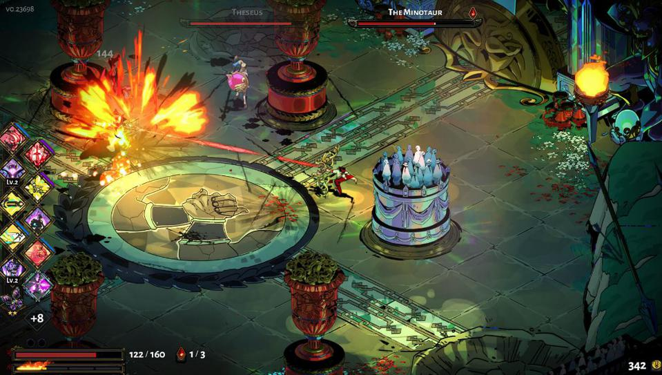

Here is an article by [Forbes](https://www.forbes.com/sites/davidthier/2020/09/27/you-need-to-play-the-game-at-the-top-of-the-nintendo-switch-charts/#6e9128ba2f80) about Hades being at the top of the Nintendo Switch Charts.
Hades is also a technology showcase for Intel's integrated GPUs on macOS and Windows. The target group of the game seems to often own those GPUs.

## Bethesda's Creation Engine
Bethesda based their rendering layer for their next-gen engine on The Forge. We helped integrate and optimize it. 
It always brings us pleasure to see The Forge running in AAA games like this:

[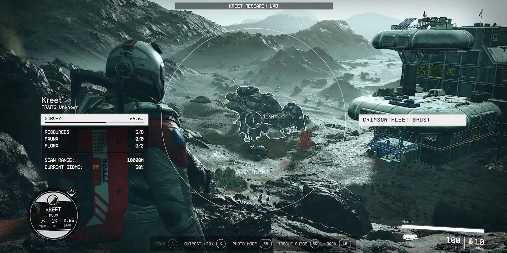](https://www.youtube.com/watch?v=ZHZOTFMyMyM)

We added The Forge to the Creation Engine in 2019.

Here is more info about this game engine:

[Todd Howard Teases Bethesda's New Game Engine Behind The Elder Scrolls 6 And Starfield](https://www.thegamer.com/starfield-the-elder-scrolls-6-new-game-engine/)

[Bethesda's overhauling its engine for Starfield and The Elder Scrolls 6](https://www.gamesradar.com/bethesda-engine-starfield-elder-scrolls-6/)


## No Man's Sky
The Forge made an appearance during the Apple developer conference 2022. We added it to the game "No Man's Sky" from Hello Games to bring this game up on macOS / iOS. For the Youtube video click on the image below and jump to 1:22:40

[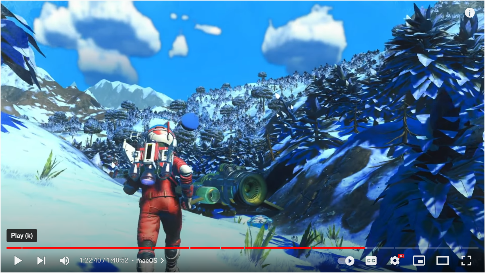](https://www.youtube.com/watch?v=q5D55G7Ejs8)

We helped to ship the macOS version of No Man's Sky.


## M²H - Stroke Therapy
M²H uses The Forge - [M²H](https://msquarehealthcare.com/) is a medical technology company. They have developed a physics-based video game therapy solution that is backed by leading edge neuroscience, powered by Artificial Intelligence and controlled by dynamic movement – all working in concert to stimulate vast improvement of cognitive and motor functions for patients with stroke and the aged.
The Forge provides the rendering layer for their application.
Here is a YouTube video on what they do:

[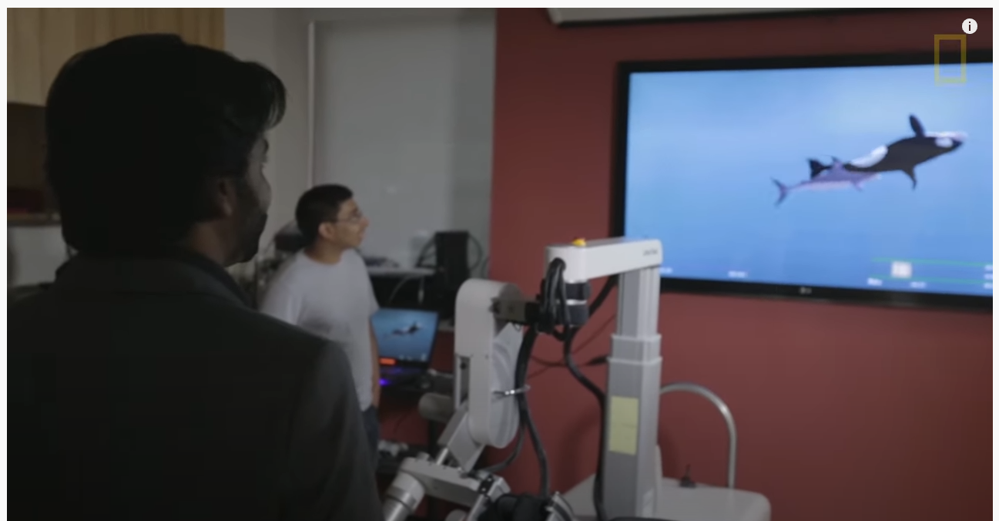](https://www.youtube.com/watch?v=l2Gr2Ts48e8&t=12s)

## StarVR One SDK
The Forge was used to build the StarVR One SDK from 2016 - 2017:

<a href="https://www.starvr.com" target="_blank">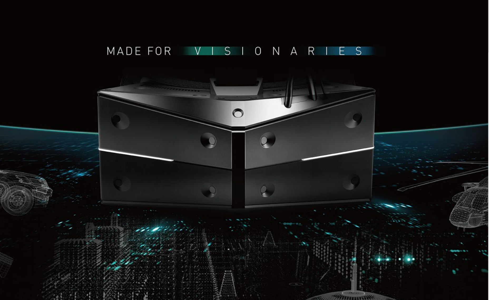</a>


## Torque 3D
The Forge will be used as the rendering framework in Torque 3D:

<a href="http://www.garagegames.com/products/torque-3d" target="_blank"></a>

## Star Wars Galaxies Level Editor
SWB is an editor for the 2003 game 'Star Wars Galaxies' that can edit terrains, scenes, particles and import/export models via FBX. The editor uses an engine called 'atlas' that will be made open source in the future. It focuses on making efficient use of the new graphics APIs (with help from The-Forge!), ease-of-use and terrain rendering.

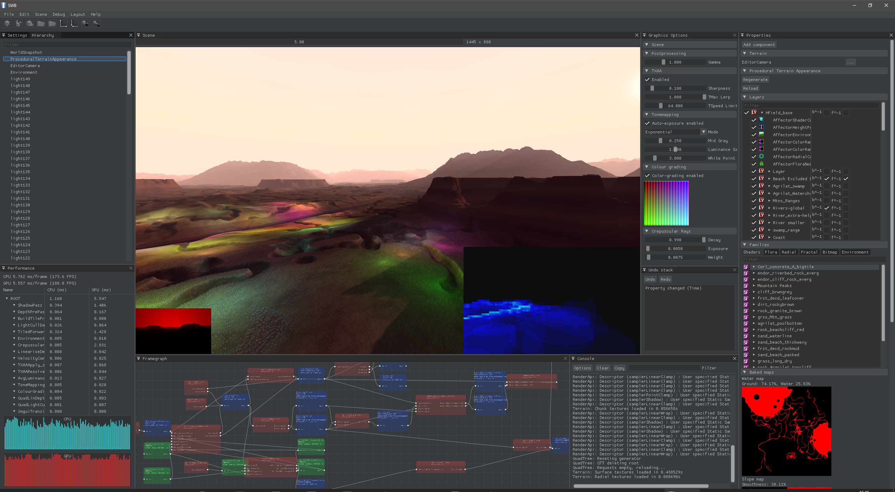

# Writing Guidelines
For contributions to The Forge we apply the following writing guidelines:
 * We limit all code to C++ 11 by setting the Clang and other compiler flags
 * We follow the [Orthodox C++ guidelines] (https://gist.github.com/bkaradzic/2e39896bc7d8c34e042b) minus C++ 14 support (see above)
 * Please note that we are going to move towards C99 usage more and more because this language makes it easier to develop high-performance applications in a team. With the increased call numbers of modern APIs and the always performance-detoriating C++ features, C++ is becoming more and more a productivity and run-time performance challenge. C is also a better starting point to port to other languages like RUST. In case any of those languages become common in development.

# User Group Meetings 
There will be a user group meeting during GDC. In case you want to organize a user group meeting in your country / town at any other point in time, we would like to support this. We could send an engineer for a talk.

# Support for Education 
Let us know if you are in need for eductional support.


# Open-Source Libraries
The Forge utilizes the following Open-Source libraries:
* [Fontstash](https://github.com/memononen/fontstash)
* [Vectormath](https://github.com/glampert/vectormath)
* [Nothings](https://github.com/nothings/stb) single file libs 
  * [stb.h](https://github.com/nothings/stb/blob/master/stb.h)
  * [stb_image.h](https://github.com/nothings/stb/blob/master/stb_image.h)
  * [stb_image_resize.h](https://github.com/nothings/stb/blob/master/stb_image_resize.h)
  * [stb_image_write.h](https://github.com/nothings/stb/blob/master/stb_image_write.h)
  * [stb_ds](https://github.com/nothings/stb/blob/master/stb_ds.h)
* [SPIRV_Cross](https://github.com/KhronosGroup/SPIRV-Cross)
* [Vulkan Memory Allocator](https://github.com/GPUOpen-LibrariesAndSDKs/VulkanMemoryAllocator)
* [D3D12 Memory Allocator](https://github.com/GPUOpen-LibrariesAndSDKs/D3D12MemoryAllocator)
* [WinPixEventRuntime](https://blogs.msdn.microsoft.com/pix/winpixeventruntime/)
* [Fluid Studios Memory Manager](http://www.paulnettle.com/)
* [volk Metaloader for Vulkan](https://github.com/zeux/volk)
* [gainput](https://github.com/jkuhlmann/gainput)
* [Dear ImGui](https://github.com/ocornut/imgui)
* [DirectX Shader Compiler](https://github.com/Microsoft/DirectXShaderCompiler)
* [Ozz Animation System](https://github.com/guillaumeblanc/ozz-animation)
* [Lua Scripting System](https://www.lua.org/)
* [TressFX](https://github.com/GPUOpen-Effects/TressFX)
* [MTuner](https://github.com/milostosic/MTuner) 
* [meshoptimizer](https://github.com/zeux/meshoptimizer)
* [TinyImageFormat](https://github.com/DeanoC/tiny_imageformat)
* [flecs](https://github.com/SanderMertens/flecs)
* [CPU Features](https://github.com/google/cpu_features)
* [HIDAPI](https://github.com/libusb/hidapi)
* [bstrlib](https://github.com/websnarf/bstrlib)
* [cr](https://github.com/fungos/cr)
