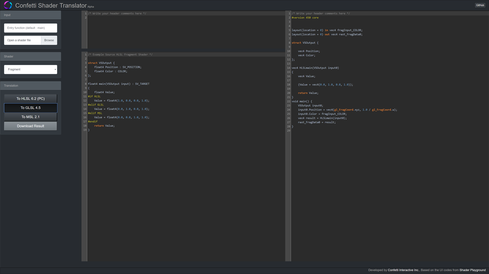

# 

The Forge is a cross-platform rendering framework supporting
- PC 
  * Windows 10 
     * with DirectX 12 / Vulkan
     * with DirectX Ray Tracing API
  * Linux Ubuntu 18.04 LTS with Vulkan
- macOS with Metal 2
- iOS with Metal 2
- Android with Vulkan (in development)
- XBOX One / XBOX One X (only available for accredited developers on request)
- PS4 (in development) (only available for accredited developers on request)

Particularly, The Forge supports cross-platform
- Descriptor management
- Multi-threaded resource loading
- Shader reflection
- Multi-threaded command buffer generation

Future plans are
- Unified shader generation check out an alpha version of the [Confetti Shader Translator](http://confettishadertranslator.azurewebsites.net)

The intended usage of The Forge is to enable developers to quickly build their own game engines. The Forge can provide the rendering layer for custom next-gen game engines. 

<a href="https://twitter.com/TheForge_FX?lang=en" target="_blank"> Join the channel at https://twitter.com/TheForge_FX?lang=en</a>
 
# Build Status 

* Windows 
* macOS 

# News

## Release 1.15 - September 7th, 2018 - Hybrid Ray Traced Shadows | DirectX 11 fallback layer | imGUI
* This is the biggest release so far :-)
* We added a new unit test -provided by Kostas Anagnostou @KostasAAA- that shows hybrid ray traced (HRT) shadows on  all supported GPUs; Windows / Linux / XBOX One / macOS and iOS. This unit test was build to show how to ray trace shadows without using a ray tracing API like DXR / RTX. It should run on all GPUs (not just NVIDIA RTX GPUs) and the expectation is that it should run comparable with a DXR / RTX based version even on a NVIDIA RTX GPU. Kostas wrote a blog post about the details at https://interplayoflight.wordpress.com/2018/09/04/hybrid-raytraced-shadows-part-2-performance-improvements/. 

PC Windows 10 Vulkan 1.1.82.1 GeForce 1080 Driver 398.82 with a resolution of 2560 * 1440 in full-screen:

iMac with AMD RADEON 580 (Part No. MNED2xx/A) with resolution of 2560x1440 in full-screen:

Here is a version running on a iPhone 7 with iOS 11.4.1 (15G77) and a resolution of 1334 x 750 in full-screen:

Please note there are no platform specific optimizations for macOS or iOS in the moment. The initial version was developed on PC and then just ported to the other platforms. We might optimize for the other platforms at some point.
Kostas plans to use the San Miguel Scene for this and then also merge it with the Light and Shadow Playground, so that you can pick different shadow techniques and compare them. He wants to implement HRT Reflections next. I wrote a short blog post about the development of this unit test at https://diaryofagraphicsprogrammer.blogspot.com/2018/09/ray-tracing-without-ray-tracing-api.html
* Improved the 09_LightShadowPlayground by calculating the SDF shadow in a more generic way
* Based on customer request and to support Windows 7, we added a DirectX 11 fallback code path. Because this API can not support all unit tests, it is only a choice on a select few
* IRenderer Cleanup for all platforms
  * removed several descriptor related structs, which enabled us to simplify the codebase
  * add render index draw start vertex
* We replaced NuklearUI with imGui; we are going to replace QT with imGui now for our internal tools, so trying to keep this consistent
* Created a new unit test for imGui #13 - it shows the current level of integration of imGui into The Forge

* Linux - changed to standard __linux__ define instead of user defined LINUX
* Vulkan 
  * supports now the descriptor update template extension: VK_KHR_DESCRIPTOR_UPDATE_TEMPLATE_EXTENSION_NAME
  * added ability to specify instance layers, instance, device extensions from app code
  * upgraded to Vulkan SDK 1.1.82.0
* The Torque 3D engine will use The Forge as its rendering layer in the future 

* macOS - one thing notable is that The Forge on macOS can be used with an XBOX controller with this driver: [360Controller](https://github.com/360Controller/360Controller)

## Release 1.14 - August 9th, 2018 - Early Alpha of the Shader Translator system | Refactored Texture / Rendertarget interface for all platforms
* After evaluating how to approach a unified shader generation system by looking at the DirectX Shader Compiler in GitHub and also implementing it into Lumberyard a whiles ago, we decided to follow a simpler approach by developing our own shader translator based on the work that was done by Thekla with the [hlslparser](https://github.com/Thekla/hlslparser). We are currently extending this shader translator to support a new super HLSL source language (platform specific #defines + material description) and translate that sHLSL into the most current respective shader languages of the target platforms, so that those shaders can then be compiled with the target platform compiler. There is an early alpha version available online at [Confetti Shader Translator](http://confettishadertranslator.azurewebsites.net) following the excellent approach of [Shader Playground](https://github.com/tgjones/shader-playground) as a base for our online approach (Thanks for your help tgjones!).
The main motivation to use the shader translator instead of the DirectX Shader Compiler is code maintenance. Maintaining our own code cut of the DirectX Shader Compiler would add too much overhead on the team and it would make it much harder to implement our super HLSL language. We will spend some time  testing this system. As soon as it is more reliable, there will be a Visual Studio extension and an extension for XCode to translate within the IDEs in the future.

* IRenderer Cleanup for all platforms (more cleanups to come)
  * Remove TextureType, RenderTargetType, TextureUsage, BufferUsage, BufferFeatureFlags
  * Expand DescriptorType enum to hold all descriptor usage patterns
  * Add ability to target mip slice UAV
* macOS 
  * upgraded to 10.14 Beta (18A353d)
  * XCode 10.0 beta (10L176w)
* iOS 11.4.1 (15G77)

## Release 1.13 - July 13th, 2018 - Unified Input System for all Platforms | New unit Test Light and Shadow Playground
* Added a unified input system based on Gainput to all platforms (https://github.com/jkuhlmann/gainput). The new input system substantially simplified input management on the application level over all platforms. We also simplified the camera controller. Added also new VirtualJoystick class in UI.
* Added a Light and Shadow Playground unit test. There are two types of shadows supported in the moment exponential shadows and SDF shadows. There is a switch to pick one of them during run-time. In the future there will be more complex lighting and shadow setups.

* There is now functionality to create views per mip / per slice for textures and render target through TextureUsage and RenderTargetUsage flags (typecast cube map to 2D texture array etc.)
* UIRenderer was removed and there is now a dedicated text rendering system different from UI rendering and no UI rendering interface anymore
* cmdbindVertexBuffer, cmdBindIndexBuffer now support offsets
* cmdBindRenderTargets now takes color array, mip slices, depth array and mip slice index
* The Pixel-Projected Reflections unit test now uses bindless textures on all platforms except for iOS as its too many to bind in one go.
* iOS: all unit tests run on our iOS test device; Visibility Buffer still doesn't as described below. 
* Moved the release notes from this page into the release section and added actual releases

See the release notes from previous releases in the [Release section](https://github.com/ConfettiFX/The-Forge/releases).

  
# PC Windows Requirements:

1. Windows 10 with latest update

2. Drivers
* AMD / NVIDIA - latest drivers should work. On Vulkan, at least NVIDIA Beta Driver 389.20 are required to support Linked Multi-GPU. 
* Intel - need to install the latest driver (currently 24.20.100.6094, May 22nd) [Intel® Graphics Driver for Windows® 10](https://downloadcenter.intel.com/download/27803/Intel-Graphics-Driver-for-Windows-10). As mentioned above this driver still doesn't have full DirectX 12 and Vulkan support.

3. Visual Studio 2017 with Windows SDK / DirectX version 16299.91 (Fall Creators Update)
https://developer.microsoft.com/en-us/windows/downloads/sdk-archive

4. Vulkan [1.1.82.1](https://vulkan.lunarg.com/sdk/home)

5. Ray Tracing 
 * DirectX Raytracing Experimental SDK v0.09.01
 * Windows 10 RS4 builds more info at [DXR](http://aka.ms/DXR)

6. The Forge is currently tested on 
* AMD 5x, VEGA GPUs (various)
* NVIDIA GeForce 9x, 10x GPUs (various)
* Intel Skull Canyon

# macOS Requirements:

1. macOS: 10.14 beta (18a384a)

2. XCode: 10.0 beta (10L176W) 

3. The Forge is currently tested on the following macOS devices:
* iMac with AMD RADEON 560 (Part No. MNDY2xx/A)
* iMac with AMD RADEON 580 (Part No. MNED2xx/A)
* MacBook Pro 13 inch (MacBookPro13,2) 
* Macbook Pro 13 inch (MacbookPro14,2)

In the moment we do not have access to an iMac Pro or Mac Pro. We can test those either with Team Viewer access or by getting them into the office and integrating them into our build system.
We will not test any Hackintosh configuration. 

# iOS Requirements:

1. iOS: 11.4.1 (15G77) 

2. XCode: see macOS

To run the unit tests, The Forge requires an iOS device with an A9 or higher CPU (see [GPU Processors](https://developer.apple.com/library/content/documentation/DeviceInformation/Reference/iOSDeviceCompatibility/HardwareGPUInformation/HardwareGPUInformation.html) or see iOS_Family in this table [iOS_GPUFamily3_v3](https://developer.apple.com/metal/Metal-Feature-Set-Tables.pdf)). This is required to support the hardware tessellation unit test and the ExecuteIndirect unit test (requires indirect buffer support). The Visibility Buffer doesn't run on current iOS devices because the [texture argument buffer](https://developer.apple.com/documentation/metal/fundamental_components/gpu_resources/understanding_argument_buffers) on those devices is limited to 31 (see [Metal Feature Set Table](https://developer.apple.com/metal/Metal-Feature-Set-Tables.pdf) and look for the entry "Maximum number of entries in the texture argument table, per graphics or compute function") , while on macOS it is 128, which we need for the bindless texture array. 

We are currently testing on 
* iPhone 7 (Model A1778)

# PC Linux Requirements:

1. [Ubuntu 18.04 LTS](https://www.ubuntu.com/download/desktop) Kernel Version: 4.15.0-20-generic

2. GPU Drivers:
* [AMDGpu-Pro 18.20 Early Preview](https://support.amd.com/en-us/kb-articles/Pages/Radeon-Software-for-Linux-18.20-Early-Preview-Release-Notes.aspx)
* [NVIDIA Linux x86_64/AMD64/EM64T 390.87](http://www.nvidia.com/object/unix.html) You can update using the command line too https://tecadmin.net/install-latest-nvidia-drivers-ubuntu/

3. Workspace file is provided for [codelite](https://codelite.org/)

4. Vulkan SDK Version: [1.1.82.1](https://vulkan.lunarg.com/sdk/home)

5. The Forge is currently tested on Ubuntu with the following GPUs:
 * AMD RADEON RX 480
 * AMD RADEON VEGA 56
 * NVIDIA GeForce GTX 950

Make sure VulkanSDK environment variables are configured correctly.
Please read the "Set up the Runtime Environment" and "Environment Variable Persistence" [https://vulkan.lunarg.com/doc/sdk/1.1.70.1/linux/getting_started.html](https://vulkan.lunarg.com/doc/sdk/1.1.70.1/linux/getting_started.html)

# Install 
For PC Windows run PRE_BUILD.bat. For the other platforms run the shell script. It will download and unzip the art assets and only on PC install the shader builder extension for Visual Studio.

# Unit Tests
There are the following unit tests in The Forge:

## 1. Transformation

This unit test just shows a simple solar system. It is our "3D game Hello World" setup for cross-platform rendering.

## 2. Compute

This unit test shows a Julia 4D fractal running in a compute shader. In the future this test will use several compute queues at once.

## 3. Multi-Threaded Rendering

This unit test shows how to generate a large number of command buffers on all platforms supported by The Forge. This unit test is based on [a demo by Intel called Stardust](https://software.intel.com/en-us/articles/using-vulkan-graphics-api-to-render-a-cloud-of-animated-particles-in-stardust-application).

## 4. ExecuteIndirect

This unit test shows the difference in speed between Instanced Rendering, using ExecuteIndirect with CPU update of the indirect argument buffers and using ExecuteIndirect with GPU update of the indirect argument buffers.
This unit test is based on [the Asteroids example by Intel](https://software.intel.com/en-us/articles/asteroids-and-directx-12-performance-and-power-savings).

Using ExecuteIndirect with GPU updates for the indirect argument buffers

Using ExecuteIndirect with CPU updates for the indirect argument buffers

Using Instanced Rendering

## 5. Font Rendering

This unit test shows the current state of our font rendering library that is based on several open-source libraries.

## 6. Material Playground

This unit test will show a wide range of game related materials in the future.

## 7. Hardware Tessellation

This unit test showcases the rendering of grass with the help of hardware tessellation.

## 8. Procedural 
In the spirit of the shadertoy examples this unit test shows a procedurally generated planet.

## 9. Light and Shadow Playground
This unit test shows various shadow and lighting techniques that can be chosen from a drop down menu. There will be more in the future.

## 9a. Hybrid Ray-Traced Shadows
This unit test was build by Kostas Anagnostou @KostasAAA to show how to ray trace shadows without using a ray tracing API like DXR / RTX. It should run on all GPUs (not just NVIDIA RTX GPUs) and the expectation is that it should run comparable with a DXR / RTX based version even on a NVIDIA RTX GPU. That means the users of your game do not have to buy a NVIDIA RTX GPU to enjoy HRT shadows :-)

## 10. Pixel-Projected Reflections
This unit test shows reflections that are ray traced. It is an implementation of the papers [Optimized pixel-projected reflections for planar reflectors](http://advances.realtimerendering.com/s2017/PixelProjectedReflectionsAC_v_1.92.pdf) and [IMPLEMENTATION OF OPTIMIZED PIXEL-PROJECTED REFLECTIONS FOR PLANAR REFLECTORS](https://github.com/byumjin/Jin-Engine-2.1/blob/master/%5BByumjin%20Kim%5D%20Master%20Thesis_Final.pdf)

## 11. Multi-GPU (Driver support only on PC Windows)
This unit test shows a typical VR Multi-GPU configuration. One eye is rendered by one GPU and the other eye by the other one.

## 12. The Forge switching between Vulkan and DirectX 12 during Run-time (Windows PC-only)
This unit test shows how to switch between the Vulkan and DirectX 12 graphics API during run-time. 

## 13. imGUI integration unit test
This unit test shows how the integration of imGui with a wide range of functionality.

# Examples
There is an example implementation of the Triangle Visibility Buffer as covered in various conference talks. [Here](https://diaryofagraphicsprogrammer.blogspot.com/2018/03/triangle-visibility-buffer.html) is a blog entry that details the implementation in The Forge.

# Releases / Maintenance
Confetti will prepare releases when all the platforms are stable and running and push them to this GitHub repository. Up until a release, development will happen on internal servers. This is to sync up the console, mobile, macOS and PC versions of the source code.

# Products
We would appreciate it if you could send us a link in case your product uses The Forge. Here are the ones we received so far:

## StarVR One SDK
The Forge is used to build the StarVR One SDK:

## Torque 3D
The Forge is used as the rendering framework in Torque 3D:

# Open-Source Libraries
The Forge utilizes the following Open-Source libraries:
* [Assimp](https://github.com/assimp/assimp)
* [Bullet Physics](https://github.com/bulletphysics)
* [Fontstash](https://github.com/memononen/fontstash)
* [Vectormath](https://github.com/glampert/vectormath)
* [Nothings](https://github.com/nothings/stb) single file libs 
  * [stb.h](https://github.com/nothings/stb/blob/master/stb.h)
  * [stb_image.h](https://github.com/nothings/stb/blob/master/stb_image.h)
  * [stb_image_resize.h](https://github.com/nothings/stb/blob/master/stb_image_resize.h)
  * [stb_image_write.h](https://github.com/nothings/stb/blob/master/stb_image_write.h)
* [Nuklear UI](https://github.com/vurtun/nuklear)
* [shaderc](https://github.com/google/shaderc)
* [SPIRV_Cross](https://github.com/KhronosGroup/SPIRV-Cross)
* [Task Scheduler](https://github.com/SergeyMakeev/TaskScheduler)
* [TinyEXR](https://github.com/syoyo/tinyexr)
* [TinySTL](https://github.com/mendsley/tinystl)
* [Vulkan Memory Allocator](https://github.com/GPUOpen-LibrariesAndSDKs/VulkanMemoryAllocator)
* [GeometryFX](https://gpuopen.com/gaming-product/geometryfx/)
* [WinPixEventRuntime](https://blogs.msdn.microsoft.com/pix/winpixeventruntime/)
* [Fluid Studios Memory Manager](http://www.paulnettle.com/)
* [volk Metaloader for Vulkan](https://github.com/zeux/volk)
* [gainput](https://github.com/jkuhlmann/gainput)
* [Shader Playground](https://github.com/tgjones/shader-playground)
* [hlslparser](https://github.com/Thekla/hlslparser)
* [ImGui](https://github.com/ocornut/imgui)
