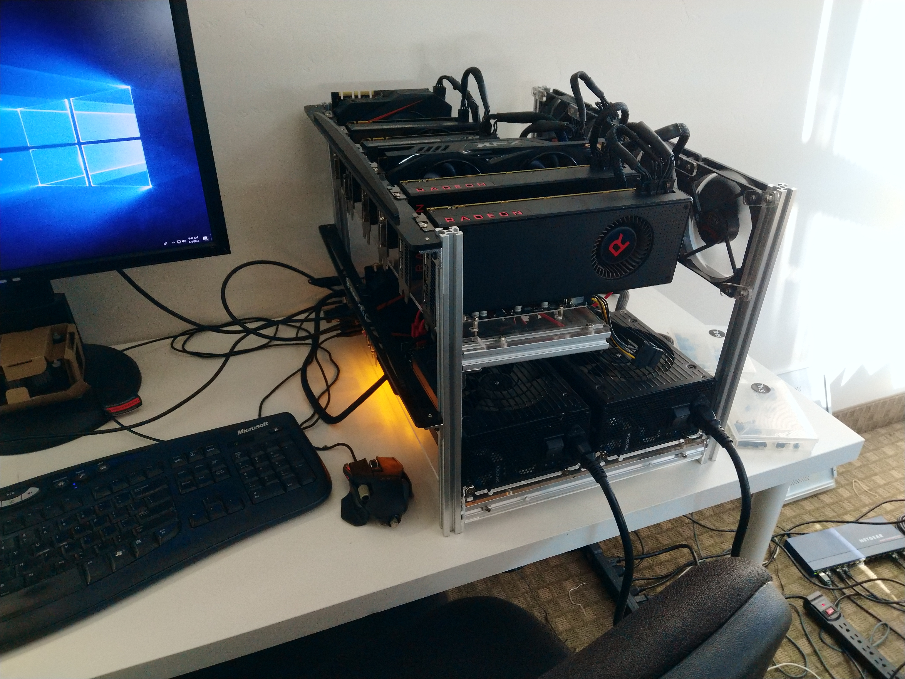
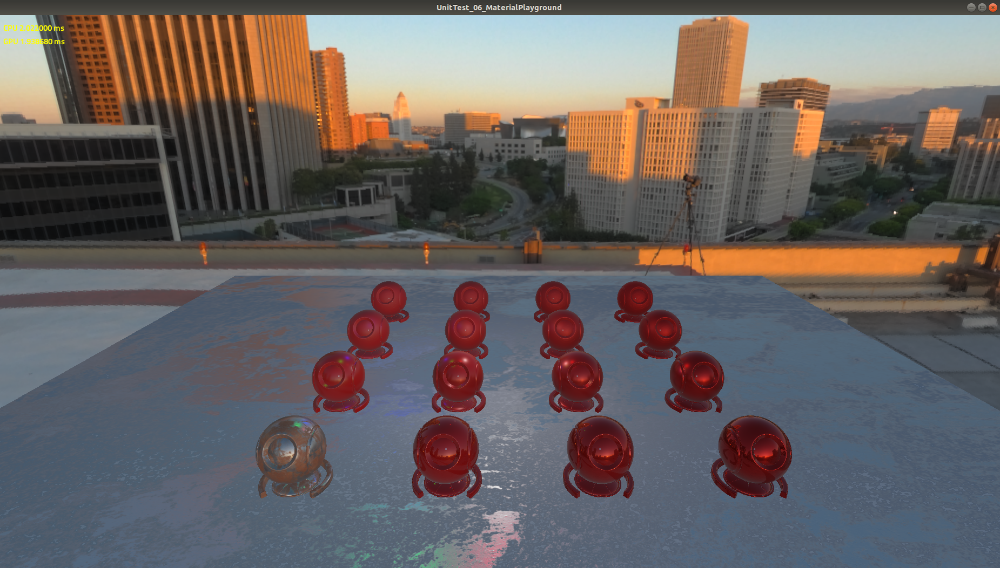

# 

The Forge is a cross-platform rendering framework supporting
- PC 
  * Windows 10 
     * with DirectX 12 / Vulkan
     * with DirectX Ray Tracing API
  * Linux Ubuntu 18.04 LTS with Vulkan
- macOS with Metal 2
- iOS with Metal 2
- Android with Vulkan (in development)
- XBOX One / XBOX One X (only available for accredited developers on request)
- PS4 (in development) (only available for accredited developers on request)

Particularly, The Forge supports cross-platform
- Descriptor management
- Multi-threaded resource loading
- Shader reflection
- Multi-threaded command buffer generation

Future plans are:
- Unified shader generation

The intended usage of The Forge is to enable developers to quickly build their own game engines. The Forge can provide the rendering layer for custom next-gen game engines. 

<a href="https://twitter.com/TheForge_FX?lang=en" target="_blank"> Join the channel at https://twitter.com/TheForge_FX?lang=en</a>
 
# Build Status

* Windows 
* macOS 

# News

## Release 1.11 - June 8th, 2018 - New Material Playground | New Vulkan extensions | GPU Workbench
* Replaced the PBR unit test with a Material Playground. In the future this Material Playground will be used in the same way games develop their materials on playgrounds like this. There should be materials like eye, skin, hair, various leather / metal / cloth etc.. This is work in progress.
* Updated assimp for all platforms to 4.1
* Vulkan (Windows & Linux): added the following extensions:
  * VK_KHR_EXTERNAL_SEMAPHORE_EXTENSION_NAME
  * VK_KHR_EXTERNAL_FENCE_EXTENSION_NAME
* macOS / iOS: upgraded to latest beta for testing
* We build a GPU testing PC that can cycle through seven different GPUs; four of them also in Crossfire/SLI. At some point we will publish an article how you can create one on your own. Here is a picture:

## Release 1.10 - May 25th, 2018 - Intel-GPU support on macOS / Windows | Generic GPU config system | New API switching on Windows
* Added a GPU tracking system that helps to switch on and off features and exclude certain GPUs from running The Forge. There is support on macOS and PC now, We will consider excluding machines based on performance with the GPU tracking system. The database is a simple text file that can be changed at any point in time
* PC Windows - based on user feedback, we changed the run-time switching functionality substantially from using two DLLs to being able to just be statically bound
* Intel-GPU support:
  * Intel updated their drivers for The Forge and the new driver fixed some of the issues we saw. The Vulkan run-time crashes and the DirectX 12 driver has problems with alpha testing. Please see the PC Windows requirement list below for driver version and tested hardware
  * The macOS version of The Forge supports now recent Intel-GPU based MacBook Pro machines. Please see the list of hardware we currently test on below. Fixed issue #28 "Visibility Buffer on MacBookPro13,1 not rendered correctly"

## Release 1.09 - May 17th, 2018 - Linux Unbuntu 18.04 LTS support 
* The Forge now supports Ubuntu 18.04 LTS and is tested with AMD and NVIDIA cards with latest drivers (see a description of our testing setup below)
* Vulkan (PC and Linux): 
  * added VK_EXT_DEBUG_UTILS_EXTENSION_NAME support but excluded it for debugging with RenderDoc because RenderDoc doesn't support the extension currently
  * VK_FEATURE_TEXTURE_ARRAY_DYNAMIC_INDEXING_ENABLED and VK_EXT_DESCRIPTOR_INDEXING_ENABLED are now both added
  * On AMD GPUs, VK_EXT_DESCRIPTOR_INDEXING_ENABLED should be used now by the AMD 18.20 preview driver; so the work around in the Visibility Buffer "shade" shaders should not be necessary anymore
* All variable names were normalized following the naming convention
* Issue fixed: #44 Use VK_EXT_debug_utils

## Release 1.08 - May 3rd, 2018 - The Forge in a DLL / New Vulkan Extension support / macOS/iOS clean up
 * We re-architected the rendering interface. If you use an older version, there are a lot of breaking changes in this update
   * replaced begin / endRender with cmdBindRendertargets
   * made the renderer compile into a DLL, so that you can have a Vulkan and a DirectX 12 DLL and switch between them during run-time. There is a new unit test showing this functionality. Removed more C++ constructs to make that happen
* DirectX 12: fixed bug in sampler comparison
* Vulkan (Windows and Linux): 
  * upgraded to Vulkan SDK 1.1.73.0 
  * added support for VK_EXT_descriptor_indexing and GL_EXT_nonuniform_qualifier
  * fixed minimize bug
* macOS / iOS: 
  * updated to macOS 10.13.5 Beta (17F59b) / iOS 11.3.1 (15E302)
  * modified FileSystem so that macOS resembles the windows version in its behaviour
  * logging is working now on macOS / iOS: fixed issue #26 "No logging on macOS". To access iOS Logs after the application finished. Open the Devices and Simulator window in XCode and download the container for the app. The log can be found in the Contents of the container, in Appdata/Documents folder
  * Threads on macOS and iOS were not being joined on destruction, now they are
  * Building for macOS now only outputs errors and warnings, reducing the output to only the important info
* NuklearUI: added a new tree branch system to enable tabs in the future

## Release 1.07 - April 19th, 2018 - Full-featured Linux Ubuntu 16.04.4 LTS Support 
 * Moved NuklearUI into the middleware folder; still WIP
 * Windows: 
    * First pass of Linked Multi-GPU support for DirectX 12 and Vulkan; new unit test only supported on Windows. Requires NVIDIA Beta Driver 389.20 or later for support on Vulkan. NVIDIA only, not tested on a set of AMD GPUs so far 
    * DXR:
      * Added support for local root signatures
      * Added new unit tests showing usage of local root signature and shadow rendering
      * Update FallbackLayer Release binaries
 * Linux: all the unit tests (except: 09) and the Visibility Buffer are now supported on the hardware and software configuration described below
 * macOS: upgraded to latest OS
 * Fixed issues:
   * #39 "Font Rendering"
   * #38 "Resources.aps"
   * #29 "Problem in ImageFormat::GetBytesPerPixel()"

## Release 1.06 - April 5th, 2018 - Linux Ubuntu 16.04.4 LTS Alpha Support and Ray Tracing Interface used by DirectX Ray Tracing (DXR)
 * Addded initial support for Ubuntu 16.04.4 LTS with the AMD Pro Driver and RADEON RX 480 / Vega. Please see the Linux requirement list below for the required software packages and hardware support. Known Issues:
   * Panini Projection not working in 04_ExecuteIndirect
   * In 03_MultiThread the CPU Graph is not drawing
   * Visibility Buffer is not implemented in the moment
 * Implemented a common interface for Ray Tracing and the first "user" is the DXR. There are now five simple unit tests for DXR. Please read our critical view on DXR [here](http://diaryofagraphicsprogrammer.blogspot.com/2018/04/ray-tracing-with-directx-ray-tracing.html).
 * Published a blog entry that offers details for the Triangle Visibility Buffer implementation in The Forge [here](https://diaryofagraphicsprogrammer.blogspot.com/2018/03/triangle-visibility-buffer.html).
 * Hiding the code for automated testing behind a #define
 * Changed the architecture for Load / Unload, now they are independent and graphics pipeline creation was moved to Load / Unload to cover render target format changes, MSAA changes etc.
 * Vulkan: 
   * Fixed a stencil op translation bug 
   * Updated the Vulkan Memory Allocator and the Volk meta loader open-source libraries to latest
   * Updated Vulkan to support Linux Ubuntu 16.04.4 LTS
   * Fix small primitive culling by sending correct sample count for shadow map viewport
   * Add barrier between light cluster clearing and compute to fix race condition on AMD cards in Visibility Buffer
and others
 * macOS / iOS
   * fixed issue #27: fixed the window name for 08_Procedural on macOS
   * upgraded to Xcode 9.3 (9E145), macOS 10.13.4 (17E199), iOS 11.3 (15E216)
 * XBOX One: smaller bug fixes, please check the log

## Release 1.05 - March 15th, 2018
 * Added a IMiddleware interface that is now used by Panini Projection. This will be refined and used by more middleware packages in the future
 * More unified math library compatible with the PS4 math library
 * PC Vulkan
   * Upgraded to Vulkan 1.1.70.1
   * We are now using volk -the metaloader for Vulkan- and load all Vulkan functions dynamically to bypass the loader overhead
   * Due to lack of support of "NonUniformResourceIndex" for Vulkan, we had to create an "interesting workaround" in the Visibility Buffer demo
* XBOX One: major update! Numerous changes and performance optimizations please check the log file of the internal repository

## Release 1.04 - February 23rd, 2018 - iOS Improvements
* Added code for our automated test framework
* Removed some old left-over code that was copied into the TinySTL code base. Now the whole codebase is more consistent with TinySTL
* Fixed some visual differences between APIs in the PBR example
* Separated the app interface load / init and unload / exit functions better in the whole code base
* Root signatures can be build for several sets of shaders while pipelines only have one shader set. This way you can use root signatures in several draw calls that will require similar settings except the shaders. We now reduced the number of root signatures in the Visibility Buffer to make that more obvious
* Move the shader cache directory to avoid any conflict
* PC
  * Made buffer / texture naming for PIX debugging more explicit
  * Changed the pipeline creation code to only require a few properties of the render target and not the whole render target
  * Vulkan: remove unnecessary lock in renderpass lookup
* iOS
  * Explicitly set the mCompleted value of a fence to false when submitting
  * Created the presentation command buffer from the main rendering queue to avoid the nil drawable issue on iOS
  * Removed unused CAMetalLayer
  * Removed util_bind_root_constant in favor of the setBytes function for rootConstant binding
  * Removed a bug in our fencing logic which was forcing to wait on all fences (ignoring their status)
* XBOX One: numerous changes and performance optimizations please check the log file of the internal repository

## Release 1.03 - February 14th, 2018 - iOS Alpha
First of all: thanks a lot for the amount of feedback and support we received from the community. I think the amount of code changes in this release is a reflection of the strong feeback. Keep it coming!
* Abstracted the application level by using the interface in IApp.h
* Refactored addShader, it now loads binary shaders and the interface is more abstract. This reduced the number of lines of code in every example. This is an intermediate step to achieving a more unified cross-platform shader system
* Upgraded the BRDF example to PBR
* Removed Panini projection feature to add it into the new Middleware_3 folder
* Added the Fluid Studio memory manager after getting permission from the original author
* Fixed all bugs in issue tracker
* First iOS support. Please see iOS software and hardware requirements below.
  * Added support for on-tile textures
  * In the moment there is no UI and the camera and the input system is basic. We are planning to add https://github.com/jkuhlmann/gainput in the future
* PC: 
  * Added a Visual Studio extension that allows to compile shaders with a right mouse click on the shader file (need to be installed from the Tools folder or by clicking on the PRE_BUILD.bat file)
  * Improved GPU recognition: in case a notebook has an integrated GPU and a discreete GPU: it will pick the discreete GPU under certain conditions
  * Now use raw mouse input to workaround the problems with the last Windows 10 update
  * Better synchronization between CPU and GPU  
  * Moved to Visual Studio 2017 and Windows SDK 16299.91 (Fall Creators Update) and Vulkan SDK 1.0.68
* XBOX One: numerous performance improvements (check the non-public repository history log)

Any rendering framework needs a test farm that makes sure it is running on all the devices and OS'es supported. Our current testing setup is based on Jenkins and only supports a rather narrow range of hardware devices. We will add more hardware devices over time; this also depends when and how we get ahold of them. Considering that the feature set of The Forge is forward looking with support for Vulkan, DirectX 12 and Metal 2, we will leave out a lot of older hardware. We already started a conversation with Intel and Apple about the challenges we have and we will get in touch with driver teams from Samsung, Qualcomm,Google, AMD, NVIDIA and others to provide feedback on drivers.

## Release 1.02 - January 31st, 2018
* Fixed all the issues mentioned in the issue tracker.
* Removed the NVX commands, we don't use them and they seem to confuse people.
* Dealing with multiple resolutions on PC is now a bit easier. We need to expose this in the GUI, so that you can switch in full-screen between -let's say- 1080p and 4k back and forth
* For macOS the procedural planet unit test works now too. That should bring macOS on par with PC on the macOS platforms we are currently testing. All unit tests and the Visibility Buffer work.
* We improved performance of the Visibility Buffer on macOS a bit more. Now if you have a comparable GPU on the PC, the performance should be on a similar level on macOS and PC.

## Release 1.01 - January 25th, 2018
* Mainly improved the performance of the macOS build. macOS is now using the same art assets as the PC and the performance of the triangle filtering compute shader is improved. 
* Reduced the size of the art assets because we only need one version of San Miguel for all platforms now. 
* macOS now runs the Hardware Tessellation unit test. 
* There is also now a new unit test that shows a procedurally generated planet.

## Release 1.0 - January 22nd, 2018
Very first release.

  
# PC Windows Requirements:

1. Windows 10 with latest update

2. Drivers
* AMD / NVIDIA - latest drivers should work. On Vulkan, at least NVIDIA Beta Driver 389.20 are required to support Linked Multi-GPU. 
* Intel - need to install the latest driver (currently 24.20.100.6094, May 22nd) [Intel® Graphics Driver for Windows® 10](https://downloadcenter.intel.com/download/27803/Intel-Graphics-Driver-for-Windows-10). As mentioned above this driver still doesn't have full DirectX 12 and Vulkan support.

3. Visual Studio 2017 with Windows SDK / DirectX version 16299.91 (Fall Creators Update)
https://developer.microsoft.com/en-us/windows/downloads/sdk-archive

4. Vulkan SDK 1.1.73.0
https://vulkan.lunarg.com/

5. Ray Tracing 
 * DirectX Raytracing Experimental SDK v0.09.01
 * Windows 10 RS4 builds more info at [DXR](http://aka.ms/DXR)

6. The Forge is currently tested on 
* AMD 5x, VEGA GPUs (various)
* NVIDIA GeForce 9x, 10x GPUs (various)
* Intel Skull Canyon

# macOS Requirements:

1. macOS: 10.14 Beta (18A293u)

2. XCode: 10.0 beta (10L176w) 

3. The Forge is currently tested on the following macOS devices:
* iMac with AMD RADEON 560 (Part No. MNDY2xx/A)
* iMac with AMD RADEON 580 (Part No. MNED2xx/A)
* MacBook Pro 13 inch (MacBookPro13,2) 
* Macbook Pro 13 inch (MacbookPro14,2)

In the moment we do not have access to an iMac Pro or Mac Pro. We can test those either with Team Viewer access or by getting them into the office and integrating them into our build system.
We will not test any Hackintosh configuration. 

# iOS Requirements:

1. iOS: 11.4 (15F79) 

2. XCode: see macOS

To run the unit tests, The Forge requires an iOS device with an A9 or higher CPU (see [GPU Processors](https://developer.apple.com/library/content/documentation/DeviceInformation/Reference/iOSDeviceCompatibility/HardwareGPUInformation/HardwareGPUInformation.html) or see iOS_Family in this table [iOS_GPUFamily3_v3](https://developer.apple.com/metal/Metal-Feature-Set-Tables.pdf)). This is required to support the hardware tessellation unit test and the ExecuteIndirect unit test (requires indirect buffer support). The Visibility Buffer doesn't run on current iOS devices because the [texture argument buffer](https://developer.apple.com/documentation/metal/fundamental_components/gpu_resources/understanding_argument_buffers) on those devices is limited to 31 (see [Metal Feature Set Table](https://developer.apple.com/metal/Metal-Feature-Set-Tables.pdf) and look for the entry "Maximum number of entries in the texture argument table, per graphics or compute function") , while on macOS it is 128, which we need for the bindless texture array. 

We are currently testing on 
* iPhone 7 (Model A1778)

# PC Linux Requirements:

1. [Ubuntu 18.04 LTS](https://www.ubuntu.com/download/desktop) Kernel Version: 4.15.0-20-generic

2. GPU Drivers:
* [AMDGpu-Pro 18.20 Early Preview](https://support.amd.com/en-us/kb-articles/Pages/Radeon-Software-for-Linux-18.20-Early-Preview-Release-Notes.aspx)
* [NVIDIA Linux x86_64/AMD64/EM64T 390.59 and 396.24](http://www.nvidia.com/object/unix.html)

3. Workspace file is provided for [codelite](https://codelite.org/)

4. Vulkan SDK Version: [1.1.73.0](https://vulkan.lunarg.com/sdk/home)

5. The Forge is currently tested on Ubuntu with the following GPUs:
 * AMD RADEON RX 480
 * AMD RADEON VEGA 56
 * NVIDIA GeForce GTX 950

Make sure VulkanSDK environment variables are configured correctly.
Please read the "Set up the Runtime Environment" and "Environment Variable Persistence" [https://vulkan.lunarg.com/doc/sdk/1.1.70.1/linux/getting_started.html](https://vulkan.lunarg.com/doc/sdk/1.1.70.1/linux/getting_started.html)

# Install 
For PC Windows run PRE_BUILD.bat. For the other platforms run the shell script. It will download and unzip the art assets and only on PC install the shader builder extension for Visual Studio.

# Unit Tests
There are the following unit tests in The Forge:

## 1. Transformation

This unit test just shows a simple solar system. It is our "3D game Hello World" setup for cross-platform rendering.

## 2. Compute

This unit test shows a Julia 4D fractal running in a compute shader. In the future this test will use several compute queues at once.

## 3. Multi-Threaded Rendering

This unit test shows how to generate a large number of command buffers on all platforms supported by The Forge. This unit test is based on [a demo by Intel called Stardust](https://software.intel.com/en-us/articles/using-vulkan-graphics-api-to-render-a-cloud-of-animated-particles-in-stardust-application).

## 4. ExecuteIndirect

This unit test shows the difference in speed between Instanced Rendering, using ExecuteIndirect with CPU update of the indirect argument buffers and using ExecuteIndirect with GPU update of the indirect argument buffers.
This unit test is based on [the Asteroids example by Intel](https://software.intel.com/en-us/articles/asteroids-and-directx-12-performance-and-power-savings).

Using ExecuteIndirect with GPU updates for the indirect argument buffers

Using ExecuteIndirect with CPU updates for the indirect argument buffers

Using Instanced Rendering

## 5. Font Rendering

This unit test shows the current state of our font rendering library that is based on several open-source libraries.

## 6. Material Playground

This unit test will show a wide range of game related materials in the future.

## 7. Hardware Tessellation

This unit test showcases the rendering of grass with the help of hardware tessellation.

## 8. Procedural 
In the spirit of the shadertoy examples this unit test shows a procedurally generated planet.

## 9. Multi-GPU (Driver support only on PC Windows)
This unit test shows a typical VR Multi-GPU configuration. One eye is rendered by one GPU and the other eye by the other one.

## 10. The Forge switching between Vulkan and DirectX 12 during Run-time (Windows PC-only)
This unit test shows how to switch between the Vulkan and DirectX 12 graphics API during run-time. 

# Examples
There is an example implementation of the Triangle Visibility Buffer as covered in various conference talks. [Here](https://diaryofagraphicsprogrammer.blogspot.com/2018/03/triangle-visibility-buffer.html) is a blog entry that details the implementation in The Forge.

# Releases / Maintenance
Confetti will prepare releases when all the platforms are stable and running and push them to this GitHub repository. Up until a release, development will happen on internal servers. This is to sync up the console, mobile, macOS and PC versions of the source code.

# Products
We would appreciate it if you could send us a link in case your product uses The Forge:

# Open-Source Libraries
The Forge utilizes the following Open-Source libraries:
* [Assimp](https://github.com/assimp/assimp)
* [Bullet Physics](https://github.com/bulletphysics)
* [Fontstash](https://github.com/memononen/fontstash)
* [Vectormath](https://github.com/glampert/vectormath)
* [Nothings](https://github.com/nothings/stb) single file libs 
  * [stb.h](https://github.com/nothings/stb/blob/master/stb.h)
  * [stb_image.h](https://github.com/nothings/stb/blob/master/stb_image.h)
  * [stb_image_resize.h](https://github.com/nothings/stb/blob/master/stb_image_resize.h)
  * [stb_image_write.h](https://github.com/nothings/stb/blob/master/stb_image_write.h)
* [Nuklear UI](https://github.com/vurtun/nuklear)
* [shaderc](https://github.com/google/shaderc)
* [SPIRV_Cross](https://github.com/KhronosGroup/SPIRV-Cross)
* [Task Scheduler](https://github.com/SergeyMakeev/TaskScheduler)
* [TinyEXR](https://github.com/syoyo/tinyexr)
* [TinySTL](https://github.com/mendsley/tinystl)
* [Vulkan Memory Allocator](https://github.com/GPUOpen-LibrariesAndSDKs/VulkanMemoryAllocator)
* [GeometryFX](https://gpuopen.com/gaming-product/geometryfx/)
* [WinPixEventRuntime](https://blogs.msdn.microsoft.com/pix/winpixeventruntime/)
* [Fluid Studios Memory Manager](http://www.paulnettle.com/)
* [volk Metaloader for Vulkan](https://github.com/zeux/volk)
