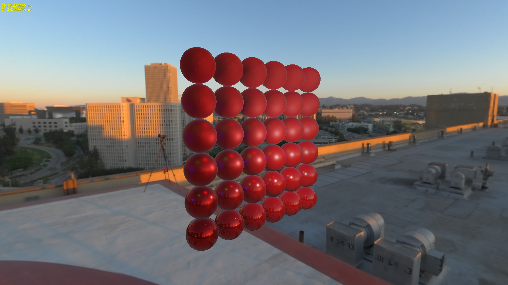

# The Forge
The Forge is a cross-platform rendering framework supporting
- PC with DirectX 12 / Vulkan
- macOS with Metal 2
- iOS with Metal 2
- Android with Vulkan (in development)
- XBOX One / XBOX One X (only available for accredited developers on request)
- PS4 (in development) (only available for accredited developers on request)

Particularly, The Forge supports cross-platform
- Descriptor management
- Multi-threaded resource loading
- Shader reflection
- Multi-threaded command buffer generation

Future plans are:
- Unified shader generation

The intended usage of The Forge is to enable developers to quickly build their own game engines. The Forge can provide the rendering layer for custom next-gen game engines. It was designed with -what we call in the moment- a next-gen rendering feature set in mind.
 
# Build Status

* Windows 
* macOS 

# News
## Release 1.04 - February 23rd, 2018 - iOS Improvements
* Added code for our automated test framework
* Removed some old left-over code that was copied into the TinySTL code base. Now the whole codebase is more consistent with TinySTL
* Fixed some visual differences between APIs in the PBR example
* Separated the app interface load / init and unload / exit functions better in the whole code base
* Root signatures can be build for several sets of shaders while pipelines only have one shader set. This way you can use root signatures in several draw calls that will require similar settings except the shaders. We now reduced the number of root signatures in the Visibility Buffer to make that more obvious
* Move the shader cache directory to avoid any conflict
* PC
  * Made buffer / texture naming for PIX debugging more explicit
  * Changed the pipeline creation code to only require a few properties of the render target and not the whole render target
  * Vulkan: remove unnecessary lock in renderpass lookup
* iOS
  * Explicitly set the mCompleted value of a fence to false when submitting
  * Created the presentation command buffer from the main rendering queue to avoid the nil drawable issue on iOS
  * Removed unused CAMetalLayer
  * Removed util_bind_root_constant in favor of the setBytes function for rootConstant binding
  * Removed a bug in our fencing logic which was forcing to wait on all fences (ignoring their status)
* XBOX One: numerous changes and performance optimizations please check the log file of the internal repository

## Release 1.03 - February 14th, 2018 - iOS Alpha
First of all: thanks a lot for the amount of feedback and support we received from the community. I think the amount of code changes in this release is a reflection of the strong feeback. Keep it coming!
* Abstracted the application level by using the interface in IApp.h
* Refactored addShader, it now loads binary shaders and the interface is more abstract. This reduced the number of lines of code in every example. This is an intermediate step to achieving a more unified cross-platform shader system
* Upgraded the BRDF example to PBR
* Removed Panini projection feature to add it into the new Middleware_3 folder
* Added the Fluid Studio memory manager after getting permission from the original author
* Fixed all bugs in issue tracker
* First iOS support. Please see iOS software and hardware requirements below.
  * Added support for on-tile textures
  * In the moment there is no UI and the camera and the input system is basic. We are planning to add https://github.com/jkuhlmann/gainput in the future
* PC: 
  * Added a Visual Studio extension that allows to compile shaders with a right mouse click on the shader file (need to be installed from the Tools folder or by clicking on the PRE_BUILD.bat file)
  * Improved GPU recognition: in case a notebook has an integrated GPU and a discreete GPU: it will pick the discreete GPU under certain conditions
  * Now use raw mouse input to workaround the problems with the last Windows 10 update
  * Better synchronization between CPU and GPU  
  * Moved to Visual Studio 2017 and Windows SDK 16299.91 (Fall Creators Update) and Vulkan SDK 1.0.68
* XBOX One: numerous performance improvements (check the non-public repository history log)

Any rendering framework needs a test farm that makes sure it is running on all the devices and OS'es supported. Our current testing setup is based on Jenkins and only supports a rather narrow range of hardware devices. We will add more hardware devices over time; this also depends when and how we get ahold of them. Considering that the feature set of The Forge is forward looking with support for Vulkan, DirectX 12 and Metal 2, we will leave out a lot of older hardware. We already started a conversation with Intel and Apple about the challenges we have and we will get in touch with driver teams from Samsung, Qualcomm,Google, AMD, NVIDIA and others to provide feedback on drivers.

## Release 1.02 - January 31st, 2018
* Fixed all the issues mentioned in the issue tracker.
* Removed the NVX commands, we don't use them and they seem to confuse people.
* Dealing with multiple resolutions on PC is now a bit easier. We need to expose this in the GUI, so that you can switch in full-screen between -let's say- 1080p and 4k back and forth
* For macOS the procedural planet unit test works now too. That should bring macOS on par with PC on the macOS platforms we are currently testing. All unit tests and the Visibility Buffer work.
* We improved performance of the Visibility Buffer on macOS a bit more. Now if you have a comparable GPU on the PC, the performance should be on a similar level on macOS and PC.

## Release 1.01 - January 25th, 2018
* Mainly improved the performance of the macOS build. macOS is now using the same art assets as the PC and the performance of the triangle filtering compute shader is improved. 
* Reduced the size of the art assets because we only need one version of San Miguel for all platforms now. 
* macOS now runs the Hardware Tessellation unit test. 
* There is also now a new unit test that shows a procedurally generated planet.

## Release 1.0 - January 22nd, 2018
Very first release.

  
# PC Requirements:

1. Windows 10 with latest update

2. NVIDIA 9x0 or higher or AMD 5x0 or higher GPU with the latest driver ...

3. Visual Studio 2017 with Windows SDK / DirectX version 16299.91 (Fall Creators Update)
https://developer.microsoft.com/en-us/windows/downloads/sdk-archive

4. Vulkan SDK 1.0.68 
https://vulkan.lunarg.com/

We are testing on a wide range of in-house AMD 5x and NVIDIA 9x and higher cards and drivers. We are currently not testing Intel GPU based hardware. We are planning to integrate an Intel GPU based system into our build system in the future.

# macOS Requirements:

1. macOS: 10.13.3 Beta (17D39a)

2. XCode: Version 9.2 (9C40b)

3. The Forge is currently tested on the following macOS devices:
* iMac with AMD RADEON 560 (Part No. MNDY2xx/A)
* iMac with AMD RADEON 580 (Part No. MNED2xx/A)

We are occasionally testing on Intel GPU based MacBooks but we are running into -what we believe- driver problems. We are going to address those challenges in the future. In the moment we do not have access to an iMac Pro or Mac Pro. We can test those either with Team Viewer access or by getting them into the office and integrating them into our build system.
We will not test any Hackintosh configuration. 

# iOS Requirements:

1. iOS: 11.2.5

2. XCode: see macOS

To run the unit tests, The Forge requires an iOS device with an A9 or higher CPU (see [GPU Processors](https://developer.apple.com/library/content/documentation/DeviceInformation/Reference/iOSDeviceCompatibility/HardwareGPUInformation/HardwareGPUInformation.html) or see iOS_Family in this table [iOS_GPUFamily3_v3](https://developer.apple.com/metal/Metal-Feature-Set-Tables.pdf)). This is required to support the hardware tessellation unit test and the ExecuteIndirect unit test (requires indirect buffer support). The Visibility Buffer doesn't run on current iOS devices because the [texture argument buffer](https://developer.apple.com/documentation/metal/fundamental_components/gpu_resources/understanding_argument_buffers) on those devices is limited to 31 (see [Metal Feature Set Table](https://developer.apple.com/metal/Metal-Feature-Set-Tables.pdf) and look for the entry "Maximum number of entries in the texture argument table, per graphics or compute function") , while on macOS it is 128, which we need for the bindless texture array. 

We are currently testing on 
* iPhone 7 (Model A1778)

# Install
Run PRE_BUILD.bat. It will download and unzip the art assets and install the shader builder extension for Visual Studio.

# Unit Tests
There are the following unit tests in The Forge:

## 1. Transformation

This unit test just shows a simple solar system. It is our "3D game Hello World" setup for cross-platform rendering.

## 2. Compute

This unit test shows a Julia 4D fractal running in a compute shader. In the future this test will use several compute queues at once.

## 3. Multi-Threaded Rendering

This unit test shows the usage of [the open source fiber-based Task Scheduler](https://github.com/SergeyMakeev/TaskScheduler) to generate a large number of command buffers on all platforms supported by The Forge. This unit test is based on [a demo by Intel called Stardust](https://software.intel.com/en-us/articles/using-vulkan-graphics-api-to-render-a-cloud-of-animated-particles-in-stardust-application).

## 4. ExecuteIndirect

This unit test shows the difference in speed between Instanced Rendering, using ExecuteIndirect with CPU update of the indirect argument buffers and using ExecuteIndirect with GPU update of the indirect argument buffers.
This unit test is based on [the Asteroids example by Intel](https://software.intel.com/en-us/articles/asteroids-and-directx-12-performance-and-power-savings).

Using ExecuteIndirect with GPU updates for the indirect argument buffers

Using ExecuteIndirect with CPU updates for the indirect argument buffers

Using Instanced Rendering

## 5. Font Rendering

This unit test shows the current state of our font rendering library that is based on several open-source libraries.

## 6. Physically-Based Rendering

The Physically-Based Rendering example shows the PBR model from this [Unreal Engine 4 paper](https://cdn2.unrealengine.com/Resources/files/2013SiggraphPresentationsNotes-26915738.pdf). 

## 7. Hardware Tessellation

This unit test showcases the rendering of grass with the help of hardware tessellation.

## 8. Procedural 
In the spirit of the shadertoy examples this unit test shows a procedurally generated planet.

# Examples
There is an example implementation of the Triangle Visibility Buffer as covered in various conference talks (e.g. <a href="http://www.conffx.com/Visibility_Buffer_GDCE.pdf" target="_blank">Triangle Visibility Buffer</a>).

# Releases / Maintenance
Confetti will prepare releases when all the platforms are stable and running and push them to this GitHub repository. Up until a release, development will happen on internal servers. This is to sync up the console, mobile, macOS and PC versions of the source code.
We are looking for people that want to become platform maintainers for certain platforms.

# Open-Source Libraries
The Forge utilizes the following Open-Source libraries:
* [Assimp](https://github.com/assimp/assimp)
* [Bullet Physics](https://github.com/bulletphysics)
* [Fontstash](https://github.com/memononen/fontstash)
* [Vectormath](https://github.com/glampert/vectormath)
* [Nothings](https://github.com/nothings/stb) single file libs 
  * [stb.h](https://github.com/nothings/stb/blob/master/stb.h)
  * [stb_image.h](https://github.com/nothings/stb/blob/master/stb_image.h)
  * [stb_image_resize.h](https://github.com/nothings/stb/blob/master/stb_image_resize.h)
  * [stb_image_write.h](https://github.com/nothings/stb/blob/master/stb_image_write.h)
* [Nuklear UI](https://github.com/vurtun/nuklear)
* [shaderc](https://github.com/google/shaderc)
* [SPIRV_Cross](https://github.com/KhronosGroup/SPIRV-Cross)
* [Task Scheduler](https://github.com/SergeyMakeev/TaskScheduler)
* [TinyEXR](https://github.com/syoyo/tinyexr)
* [TinySTL](https://github.com/mendsley/tinystl)
* [Vulkan Memory Allocator](https://github.com/GPUOpen-LibrariesAndSDKs/VulkanMemoryAllocator)
* [GeometryFX](https://gpuopen.com/gaming-product/geometryfx/)
* [WinPixEventRuntime](https://blogs.msdn.microsoft.com/pix/winpixeventruntime/)
* [Fluid Studios Memory Manager](http://www.paulnettle.com/)
