The Forge is a cross-platform rendering framework supporting
- PC 
  * Windows 10
     * with DirectX 12 / Vulkan 1.1
     * with DXR / RTX Ray Tracing API
     * DirectX 11 Fallback Layer for older Windows platforms
  * Linux Ubuntu 18.04 LTS with Vulkan 1.1 and RTX Ray Tracing API
- Android Pie or higher with 
  * Vulkan 1.1
  * OpenGL ES 2.0 fallback for large scale business application frameworks
- macOS / iOS / iPad OS with Metal 2.2, Intel and Apple processor support
- Quest 2 using Vulkan 1.1
- XBOX One / XBOX One X / XBOX Series S/X *
- PS4 / PS4 Pro *
- PS5 *
- Switch using Vulkan 1.1 *

*(only available for accredited developers on request)

Particularly, the graphics layer of The Forge supports cross-platform
- Descriptor management. A description is on this [Wikipage](https://github.com/ConfettiFX/The-Forge/wiki/Descriptor-Management)
- Multi-threaded and asynchronous resource loading
- Shader reflection
- Multi-threaded command buffer generation

The Forge can be used to provide the rendering layer for custom next-gen game engines. It is also meant to provide building blocks to write your own game engine. It is like a "lego" set that allows you to use pieces to build a game engine quickly. The "lego" High-Level Features supported on all platforms are at the moment:
- Resource Loader as shown in 10_PixelProjectedReflections, capable to load textures, buffers and geometry data asynchronously
- [Lua Scripting System](https://www.lua.org/) - currently used for automatic testing and in 06_Playground to load models and textures and animate the camera and in several other unit tests to cycle through the options they offer during automatic testing.
- Animation System based on [Ozz Animation System](https://github.com/guillaumeblanc/ozz-animation)
- Consistent Math Library  based on an extended version of [Vectormath](https://github.com/glampert/vectormath) with NEON intrinsics for mobile platforms. It also supports now Double precision.
- Consistent Memory Managament: 
  * on GPU following [Vulkan Memory Allocator](https://github.com/GPUOpen-LibrariesAndSDKs/VulkanMemoryAllocator) and the [D3D12 Memory Allocator](https://github.com/GPUOpen-LibrariesAndSDKs/D3D12MemoryAllocator)
  * on CPU [Fluid Studios Memory Manager](http://www.paulnettle.com/)
- Input system with Gestures for Touch devices based on an extended version of [gainput](https://github.com/jkuhlmann/gainput)
- Fast Entity Component System based on [flecs](https://github.com/SanderMertens/flecs) 
- Cross-platform FileSystem C API, supporting disk-based files, memory streams, and files in zip archives
- UI system based on [Dear imGui](https://github.com/ocornut/imgui) extended for touch input devices
- Shader Translator using a superset of HLSL as the shader language, called The Forge Shading Language. There is a Wiki page on [The Forge Shading Language](https://github.com/ConfettiFX/The-Forge/wiki/The-Forge-Shading-Language-(FSL))
- Various implementations of high-end Graphics Effects as shown in the unit tests below

Please find a link and credits for all open-source packages used at the end of this readme.

<a href="https://discord.gg/hJS54bz" target="_blank"> Join the Discord channel at https://discord.gg/hJS54bz</a>

<a href="https://twitter.com/TheForge_FX?lang=en" target="_blank"> Join the channel at https://twitter.com/TheForge_FX?lang=en</a>

The Forge Interactive Inc. is a [Khronos member](https://www.khronos.org/members/list)
 

# Build Status 


[](https://github.com/ConfettiFX/The-Forge/actions/workflows/build_windows.yml)
[](https://github.com/ConfettiFX/The-Forge/actions/workflows/build_macos.yml)
[](https://github.com/ConfettiFX/The-Forge/actions/workflows/build_linux.yml)
[](https://github.com/ConfettiFX/The-Forge/actions/workflows/build_android.yml)

# News

## Release 1.53 - October 5th, 2022 - Steamdeck Support | App life cycle changes | Shader Byte Code Offline Generation | GTAO Unit Test | Improved gradient calculation in Visibility Buffer | New C Containers | Reorg TF Directory Structure | Upgraded to newer ImGUI | The Forge Blog

The Starfield Official Gameplay Reveal Trailer is out. It always brings us pleasure to see The Forge running in AAA games like this:

[](https://www.youtube.com/watch?v=ZHZOTFMyMyM)

We added The Forge to the Creation Engine in 2019.

The Forge made an appearance during the Apple developer conference 2022. We added it to the game "No Man's Sky" from Hello Games to bring this game up on macOS / iOS. For the Youtube video click on the image below and jump to 1:22:40

[](https://www.youtube.com/watch?v=q5D55G7Ejs8)


- We switched our Linux OS to Manjaro to have an easier upgrade path to the Steamdeck. Please note the changed Linux requirements below.

- Shader byte code can now be generated offline.
  * Shader binaries are compiled through FSL
  * Introduced ShaderList files that determine all the binary shaders that FSL needs to produce. Defines, shader target and other specific configuration can be specified per shader binary declaration
  * Update all projects (UT, VB, Aura, Ephemeris) to use the new ShaderLists
  * Remove all ShaderStageLoadDesc::pMacros, shaders are compiled offline through ShaderLists
  * Remove all Renderer::pBuiltinShaderDefines, all configuration is done through FSL

- Over the last few projects we had always challenges with EASTL. So over the last 9 months we slowly removed it and replaced it by new C language based containers that prefer stack allocations over heap allocations.
There is a new unit test that helps us to test the new libraries.

For string management:
[bstrlib](https://github.com/websnarf/bstrlib)

For dynamic arrays and hash tables:
[stb_ds.h](https://github.com/nothings/stb/blob/master/stb_ds.h)

There is a new unit test to make sure those new containers are tested. It is called 36_AlgorithmsAndContainers

- We changed the App life cycle: modern APIs have so many ways to reset the driver or reload assets, so we made a more flexible "reload" mechanism that generalizes all the special cases we had in there before.
  * App extended with reload functionality by making use of ReloadDesc* parameter for the Load/Unload functions
  * define reload/reset descriptors structs
  * define reload/reset enum types
  * Updated OS base files regarding new structs
  * Able to reload shaders on all examples
This is a breaking change to all of our rendering interfaces.

- New Animation test that unifies most of the former animation tests into one. This way we can save some testing time in our Jenkins setup.


- We added a new unit test called 38_AmbientOcclusion_GTAO. It implements the paper "Practical Real-Time Strategies for Accurate Indirect Occlusion" by [Jorge Jimenez](https://www.activision.com/cdn/research/Practical_Real_Time_Strategies_for_Accurate_Indirect_Occlusion_NEW%20VERSION_COLOR.pdf) et. all.

macOS
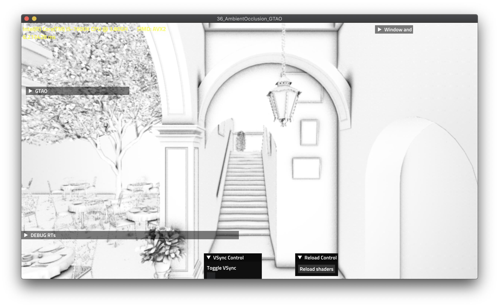

PC
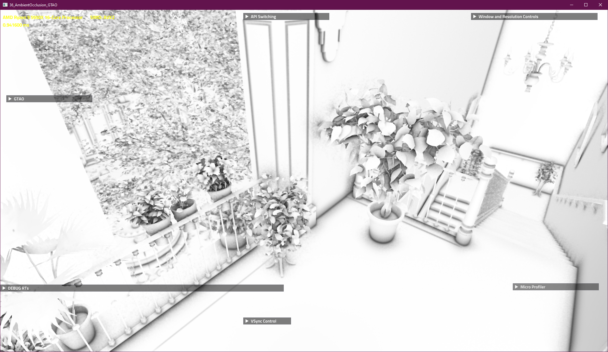

PS4


PS5


Switch
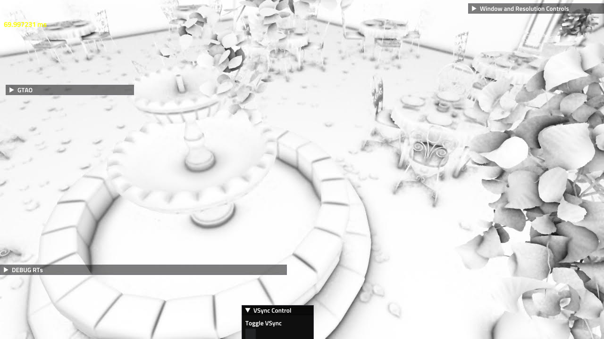

XBOX
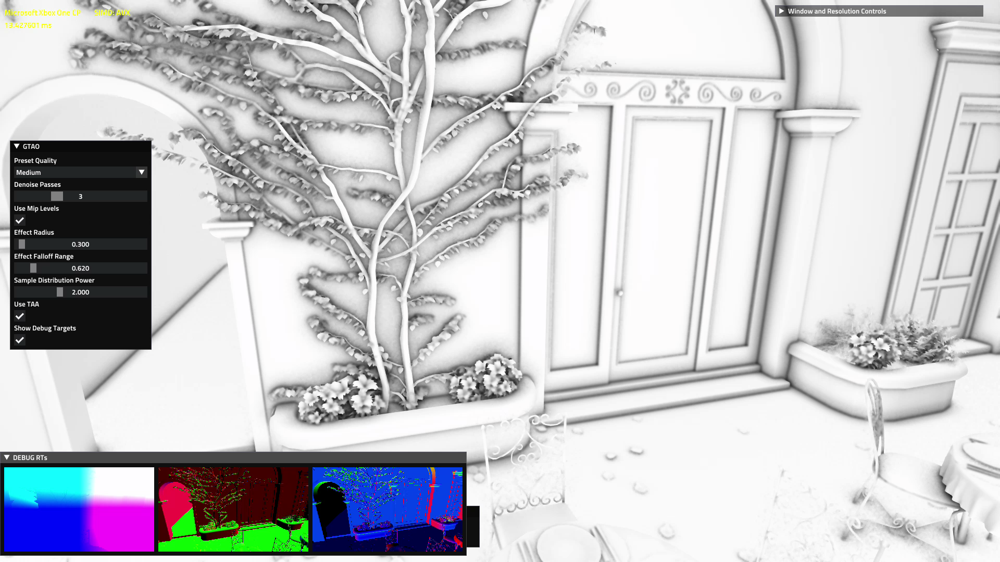


- We improved the gradient calculation in the Visibility Buffer. Thanks to Stephen Hill @self_shadow who brought this to our attention. 

- We reorganized the whole TF directory structure to allow development in more areas. Here is an image representing the new structure:

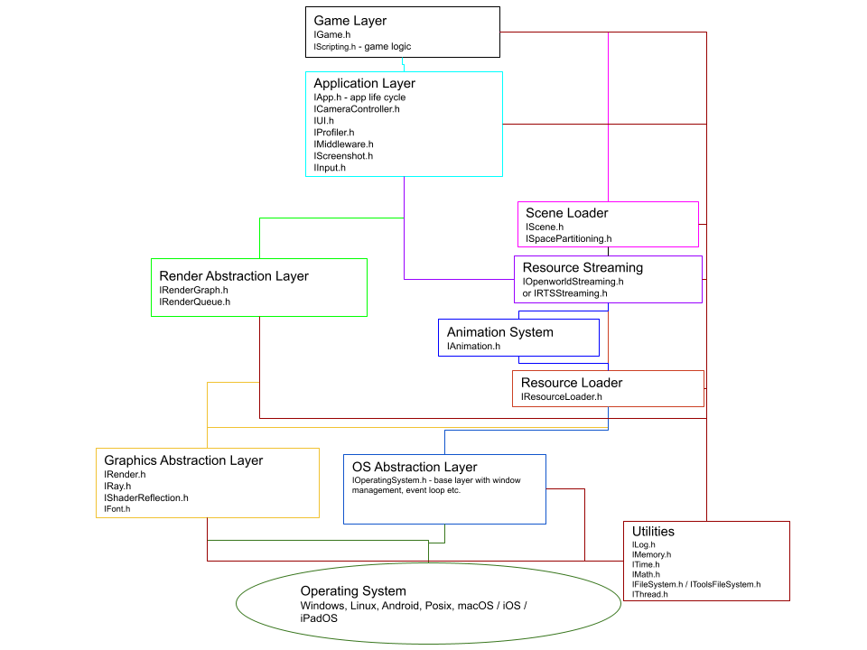

What is still missing is the "Render Abstraction Layer", "Scene Loader" and we have to populate the "Game Layer" more.

- We upgraded to ImGUI 1.88 to get access to the docking feature. In the process we improved the ImGUI integration substantially.

- We started a blog for The Forge at [The-Forge-Blog](https://github.com/ConfettiFX/The-Forge-Blog). We have no idea where we can find the time to write blog posts ... let's see what is happening ...

- Retired Unit/Functional Tests: 
  * 08_GltfViewer - generally glTF is not a model format that is applicable for game development. So we use it as an intermediate format in the Resource loader. In the future we might only use it in the offline asset pipline. The main idea is to extract the data and bring it into a form that is usable in games. Unfortunately many people thought that the glTF viewer is a good model to start with. So we want to guide them in the right diretion here by not offering direct access to a glTF reader anymore. 
  * Most of the animation unit tests are now merged into 21_Animations, to reduce our hardware testing time. Our Jenkins testing environment that tests all platforms before someone can merge code is taking too long.


## Release 1.52 - April 29th, 2022 - C Code Hot Reloading Unit Test | Visibility Buffer OIT | Pre-Computed DLUT Test | Unified Window and Resolution control | Android Vulkan Validation Layer | CPU Features | Upgraded Vulkan and DX GPU allocator | macOS / iOS improvements | Double precision Math Library | Impoved Input System with HID support

We are always looking for more graphics / engine programmers. We are also specifically looking for a consultant who can help us to scale up our hardware testing environment. 

The following list of changes is not fully representative of all the improvements we made, so it is just a selection:

- C Code Hot Reloading Unit Test - This unit test showcases an implementation of code hot reloading in C, we've used and adapted the following GitHub library

[cr](https://github.com/fungos/cr)

 for this. 
 
 
 
 The test contains two projects:
- 19_CodeHotReload_Main: generates the executable. All code in this project can't be hot-reloaded. This is the project you should set as startup project when running the program form an IDE.
- 19a_CodeHotReload_Game: for development platforms Windows/MacOS/Linux generates a dynamic library that is loaded by the Main project in runtime, when the dynamic library changes the Main program reloads the new code. For Android/IOS/Quest/Consoles this project is compiled and linked statically.

How to use it: While the Main project is running open 19_CodeHotReload_Game.cpp and perform some change, there are lines marked with `TRY_CODE_RELOAD` to make easy changes. Once the file is saved, you can rebuild the project and see the changes happen automatically.
- Windows/Linux: Click on the UI "RebuildGame" button.
- MacOS: Command+B on XCode to rebuild.

Note: In this implementation we can't call any functions from The Forge from the HotReloadable project (19a_CodeHotReload_Game), this is because we are compiling OS and Renderer as static libraries and linking them directly to the exe. Ideally these projects should be compiled as dynamic libraries in order to expose their functionality to the exe and hot reloadable dll. The reason we didn't implement it in this way is because all our other projects are already setup to use static libraries.


- Visibility Buffer Order-Independent Transparency - we added OIT by utilizing a per-pixel linked list to a Visibility Buffer (VB) rendering architecture. In case of Deferred Shading (DS), the per-pixel linked list holds per-pixel data. In case of VB it only holds the triangle index data. You can switch between DS and VB in this example. The VB version occupies substantially less memory and is faster. With memory bandwidth being the biggest challenge in graphics programming, this is not unexpected. Most people by now adopted the idea of VB in one or two ways but it doesn't hurt to show another advantage of the architecture.

Linux 1080p resolution
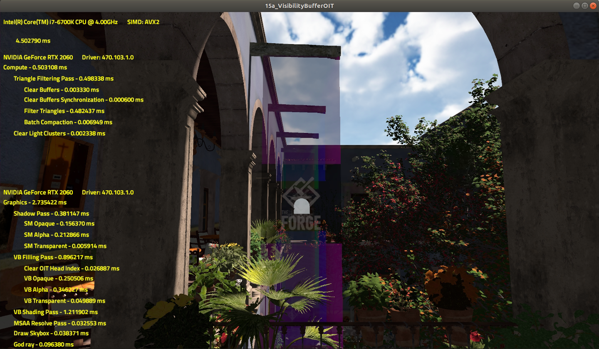

macOS 3200x1760 resolution


PS4 1080p resolution
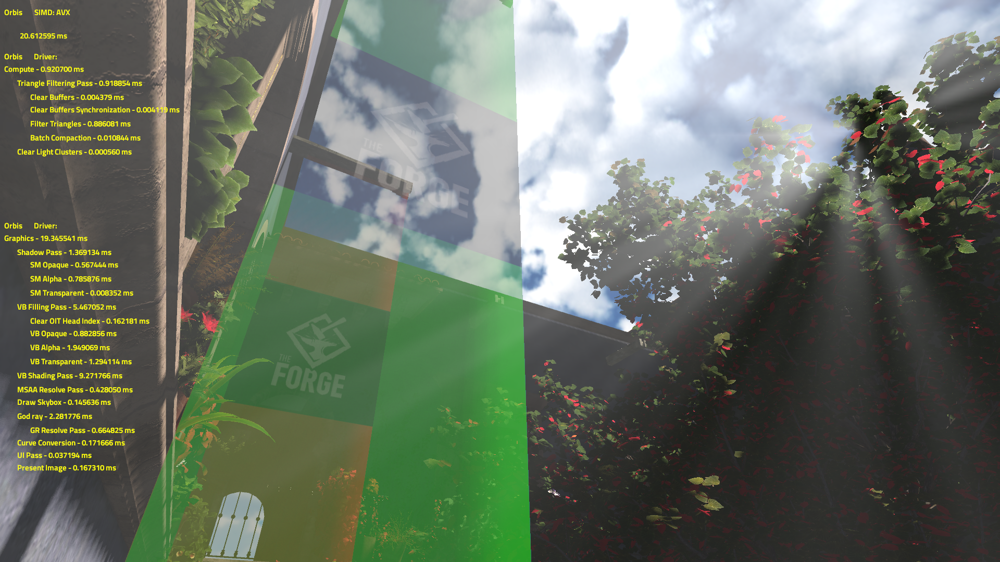

PS5 4k resolution


Windows 10 1080p resolution
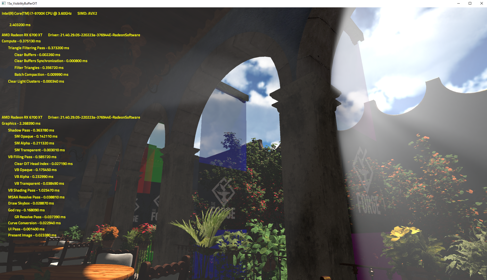

XBOX One (original) 1080p resolution
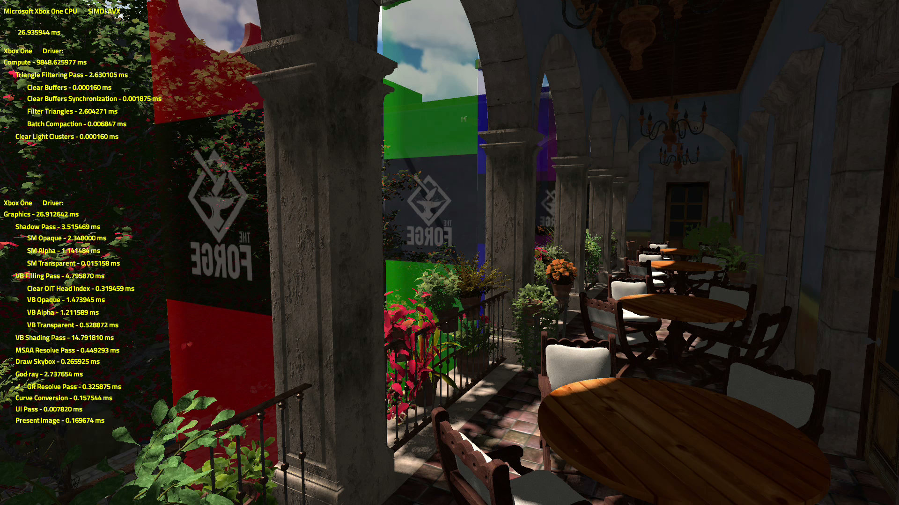

- Pre-Computed DLUT Test - this test implements pre-computing volume transmittance in Blender or Houdini for 6 directions and shading clouds/smoke based on the following tweets:

https://twitter.com/Vuthric/status/1286796950214307840

A detailed description can be found here: https://realtimevfx.com/t/smoke-lighting-and-texture-re-usability-in-skull-bones/5339


In this repository is a "dlut.blend" file that contains a minimal volumetric render setup. In order to generate DLUT image do the following steps:

   - Set the viewport shading to "Rendered"
   - Select the "Sun" object
   - Set the X rotation to 0 degrees
   - Press F12 to render the image and wait for a few minutes until it's done
   - Save the rendered image to "dlut_0.png"
   - Repeat steps 3-5 for 90, 180 and 270 degrees and save "dlut_90.png", "dlut_180.png" and "dlut_270.png"
   - Run the "combine_dlut.py" Python script or manually combine rendered images in your image editor of choice, each color channel should contain the red channel from the corresponding "dlut_*.png" image multiplied by the alpha channel of the same image. For example, green channel should contain the red channel from "dlut_90.png" multiplied by the alpha channel of "dlut_90.png"
   - Experiment and implement further ideas from the article above. Setting up a Mantaflow simulation in Blender and exporting animated smoke and simulation attributes like temperature can yield interesting results!

Resulting DLUT image should look like this:


The example program running on Android:

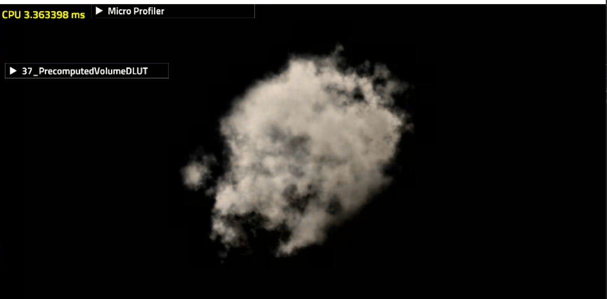

- Window Management - all the platforms that support the concept of having a windowed application have now a base file named {Platform}Window.cpp. There is now a common UI element that offers -if supported- multi-monitor support and various window settings. There are also LUA scripts that test the functionality in our Jenkins setup.

- Android Vulkan Validation layers: we added the validation layer from Khronos GitHub repo as they have stopped shipping the layer in the NDK. 

[Android Vulkan Validation Layers](https://github.com/KhronosGroup/Vulkan-ValidationLayers)

You can find them in ThirdParty/OpenSource/AndroidVulkanValidationLayers

- CPU / GPU Features - we integrated the following library to test CPU features during start-up. Now you will see a lot more information about the CPU in the upper left corner of a window.

[CPU Features](https://github.com/google/cpu_features)

This library is the stepping stone of utilizing more CPU instrinsics on various platforms. You can see its results in the screenshots above, showing the name of the CPU, the supported instruction set. We also show now the GPU name and the driver version that the GPU uses.

- Upgraded Vulkan and DX Allocators: following the updates to these open-source libraries on GitHub we upgraded our code base accordingly.

- macOS / iOS - while working with TF on various projects, we bring back improvements and lessons learned from those projects. You will find numerous macOS / iOS improvements in this release.

- For one of the business applications we worked on, we needed double precision Math. We extended the math library now accordingly with support.

- We also improved the input system with HID support, which is an on-going effort. So better controller support on more platforms ...

[HIDAPI](https://github.com/libusb/hidapi)

- Windows 7 - better Windows 7 support with DX11 and Vulkan ... still a bug in the Vulkan run-time with sRGB ...
- We upgraded the 06_MaterialPlayground with shadows:


- Retired unit test: we are going to retire many unit tests now because our automated testing cycle takes too long and heats up the "engine" room (see above passage on us looking for an consultant to scale up our testing environment). Today we retire:
  * 02_Compute
  * 05_FontRendering
  * 13_UserInterface - we might create a much more advanced one for tools development in the future
  * 16a_SphereTracing
  * 32_Windows - not necessary anymore with every unit test now offering windows management

- Resolved GitHub Issues:
  * [Toggle for 'setupAPISwitchingUI' in WindowsBase.cpp #252](https://github.com/ConfettiFX/The-Forge/issues/252)
  * [Windows 7 problems #249](https://github.com/ConfettiFX/The-Forge/issues/249)
  * [Asserts triggering in modified version of flecs when running with high uptime #245](https://github.com/ConfettiFX/The-Forge/issues/245)
  * [https://github.com/ConfettiFX/The-Forge/issues/220](https://github.com/ConfettiFX/The-Forge/issues/220)
  * [vk_removeBuffer takes a lot of CPU time when exit application #243](https://github.com/ConfettiFX/The-Forge/issues/243)


See the release notes from previous releases in the [Release section](https://github.com/ConfettiFX/The-Forge/releases).

  
# PC Windows Requirements:

1. Windows 10 

2. Drivers
* AMD / NVIDIA / Intel - latest drivers 

3. Visual Studio 2017 with Windows SDK / DirectX (you need to get it via the Visual Studio Intaller)
* Base version:
  * The minimum Windows 10 version is 1803.
  * The minimum SDK version is 1803 (10.0.17134.12).

* To use Raytracing:
  * The minimum Windows 10 version is 1809.
  * The minimum SDK version is 1809 (10.0.17763.0).

https://developer.microsoft.com/en-us/windows/downloads/sdk-archive


4. The Forge supports now as the min spec for the Vulkan SDK 1.1.82.0 and as the max spec  [1.2.162](https://vulkan.lunarg.com/sdk/home)

6. The Forge is currently tested on 
* AMD 6500, 6700 XT and others (various)
* NVIDIA GeForce 10x, 20x, 30x GPUs (various)


# macOS Requirements:

1. macOS min spec. 10.15.7

2. Xcode 12.1

3. The Forge is currently tested on the following macOS devices:
* iMac with AMD RADEON 580 (Part No. MNED2xx/A)
* iMac with M1 macOS 11.6

At this moment we do not have access to an iMac Pro or Mac Pro. We can test those either with Team Viewer access or by getting them into the office and integrating them into our build system.
We will not test any Hackintosh configuration. 


# iOS Requirements:

1. iOS 14.1

2. XCode: see macOS

To run the unit tests, The Forge requires an iOS device with an A9 or higher CPU (see [GPU Processors](https://developer.apple.com/library/content/documentation/DeviceInformation/Reference/iOSDeviceCompatibility/HardwareGPUInformation/HardwareGPUInformation.html) or see iOS_Family in this table [iOS_GPUFamily3_v3](https://developer.apple.com/metal/Metal-Feature-Set-Tables.pdf)). This is required to support the hardware tessellation unit test and the ExecuteIndirect unit test (requires indirect buffer support). The Visibility Buffer doesn't run on current iOS devices because the [texture argument buffer](https://developer.apple.com/documentation/metal/fundamental_components/gpu_resources/understanding_argument_buffers) on those devices is limited to 31 (see [Metal Feature Set Table](https://developer.apple.com/metal/Metal-Feature-Set-Tables.pdf) and look for the entry "Maximum number of entries in the texture argument table, per graphics or compute function") , while on macOS it is 128, which we need for the bindless texture array. 

We are currently testing on 
* iPhone 7 (Model A1778)
* iPhone Xs Max (Model MT5D2LL/A)


# iPad OS Requirements:

1. iPadOS 14

2. XCode: see macOS

We are currently testing on:
* iPad (Model A1893)
* iPad Pro with M1 with 14.7.1


# PC Linux Manjaro Requirements:

### Manjaro environment installation

> **_NOTE:_** The forge is tested only on proprietary graphics drivers (specifically the one mentioned below), please choose them when installing Manjaro.

- Update your pacman repos

```shell
 $ sudo pacman -Syyu 
 ``` 

- Install GCC version 12 (Main version supported by current The Forge linux version)

```shell
  $ sudo pacman -S base-devel 
  $ sudo pacman -S gcc12
```

- Install codelite version 15 from [AUR](https://aur.archlinux.org/packages/codelite-bin)

```shell
$ pamac build codelite-bin
```
> **Note:** if you get errors including gtk-devel packages conflicts you can try using yay to install codelite-bin package as it solves the conflicts found on some specific KDE installations, check yay [here](https://github.com/Jguer/yay), Potentially if you have errors with Pamac installation on Manjaro or if you're running another Arch based distro.


- Install VulkanSDK 1.2.162
  - Download VulkanSDK from [here](https://sdk.lunarg.com/sdk/download/1.2.162.0/linux/vulkansdk-linux-x86_64-1.2.162.0.tar.gz)
  - Create a common VulkanSDK directory and install it there,
  ```shell
    $ cd ~
    $ mkdir vulkan
    $ cd vulkan
  ```
  - Extract SDK
  ```shell
    $ tar xf $HOME/Downloads/vulkansdk-linux-x86-64-1.2.162.0.tar.gz
    ```
  - Setup runtime environment persistently
  ```shell
    $ sudo echo "source /home/forge/vulkan/1.2.162.0/setup-env.sh" > /etc/profile.d/vulkanRuntime.sh
  ```
  - Restart shell session
  - Test VulkanSDK installation 
  ```shell
    $ vkcube
  ```
- Open codelite at least once and use .workspace files provided with The Forge.
- Our Jenkins machine tests on an NVIDIA 2060 GPU with driver reversion 515.65.1.0


# Android Requirements:

1. Android Phone with Android Pie (9.x) for Vulkan 1.1 support
2. Visual Studio 2017
3. Android API level 23 or higher

At the moment, the Android run-time does not support the following unit tests due to -what we consider- driver bugs or lack of support:
* 09_LightShadowPlayground
* 09a_HybridRayTracing
* 11_MultiGPU
* 16_RayTracing 
* 16a_SphereTracing
* 18_VirtualTexture
* 32_Window
* 35_VariableRateShading
* Visibility Buffer 
* Aura
* Ephemeris

4. We are currently testing on 
* [Samsung S20 Ultra (Qualcomm Snapdragon 865 (Vulkan 1.1.120))](https://www.gsmarena.com/samsung_galaxy_s20_ultra_5g-10040.php) with Android 10. Please note that this version uses the Qualcomm based chipset compared to the European version that uses the Exynos chipset.
* [Samsung Galaxy Note9 (Qualcomm 845 Octa-Core (Vulkan 1.1.87))](https://www.samsung.com/us/business/support/owners/product/galaxy-note9-unlocked/) with Android 10.0. Please note this is the Qualcomm version only available in the US

## Setup Android Environment

- Download and install [.NET Core SDK 2.2](https://dotnet.microsoft.com/en-us/download/dotnet/thank-you/sdk-2.2.107-windows-x64-installer)
- Download and Install Android Game Development Extension (Version 21.1.51) ([AGDE Quickstart](https://developer.android.com/games/agde/quickstart?authuser=1))
- After AGDE installation, open the SDK Manager from the toolbar and:
    - Install SDK
    - Install Android NDK r21e (21.4.7075529)
    The versions might not be visible so be sure to check the "Show Package Details" option.
    - Set `ANDROID_SDK_ROOT` environment variable to point at the installed SDK
    - Use Java SDK jdk-11.0.14 - others might not work ...

### Steps if You want to create a new Project

1) Create a new project
2) Project->Add Item->Android->Android APK

3) Setup the properties of the project for the Android-arm64-v8a platform, this can be done using one of two ways:

- You can copy the properties from any Unit Test.
- Use the already provided `.props` files
  - There are 2 `.props` files
    1. `Android-arm64-v8a.props` can be added to the project using the property manager
    2. `AGDEVersions.props` needs to be added manually into the project between the ` <Import Project="$(VCTargetsPath)\Microsoft.Cpp.Default.props" />` and `<Import Project="$(VCTargetsPath)\Microsoft.Cpp.props" />` lines (see Unit Tests for reference)

For link directories,
- `$(SolutionDir)$(Platform)\$(Configuration)\` (this is where we have all our libs. set it accordingly)
  - *NOTE* This can be avoided by adding our libs as references (Right-click project -> Add -> Reference -> Pick the ones you want to link -> Ok)

Notes:
- Add -lm to your project Linker Command Line options for if you get any undefined math operations error
- If you get error related to "cannot use 'throw' with exceptions disabled", Enable exceptions in C++ Project settings
- If you get error related to multiple instances of ioctl add BIONIC_IOCTL_NO_SIGNEDNESS_OVERLOAD in preprocessor definitions
- If you get errors related to neon support not enabled -Enable Advance SIMD to Yes -Set floating point ABI to softfp

# Quest 2 Requirements:
1. Follow the Android setup instructions specified above
2. Download OVR mobile sdk from oculus website.
    - https://developer.oculus.com/downloads/package/oculus-mobile-sdk/
    - Tested with ovr-mobile-sdk version 1.50
3. Place unzipped sdk in `The-Forge/Common_3/ThirdParty/OpenSource/ovr_sdk_mobile`
4. Run examples from `Examples_3/Unit_Tests/Quest_VisualStudio2017`. 
As a side note the following examples may not be current compatible with the Quest:
* 04_ExecuteIndirect
* 05_FontRendering
* 08_GltfViewer
* 13_UserInterface
* 17_EntityComponentSystem
* 33_YUV


# Install 
 * For PC Windows run PRE_BUILD.bat. It will download and unzip the art assets and install the shader builder extension for Visual Studio 2017.
 * For Linux and Mac run PRE_BUILD.command. If its the first time checking out the forge make sure the PRE_BUILD.command has the correct executable flag by running the following command
  chmod +x PRE_BUILD.command
  
    It will only download and unzip required Art Assets (No plugins/extensions install). 

# Unit Tests
There are the following unit tests in The Forge:

## 1. Transformation

This unit test just shows a simple solar system. It is our "3D game Hello World" setup for cross-platform rendering.


## 3. Multi-Threaded Rendering

This unit test shows how to generate a large number of command buffers on all platforms supported by The Forge. This unit test is based on [a demo by Intel called Stardust](https://software.intel.com/en-us/articles/using-vulkan-graphics-api-to-render-a-cloud-of-animated-particles-in-stardust-application).


## 4. ExecuteIndirect

This unit test shows the difference in speed between Instanced Rendering, using ExecuteIndirect with CPU update of the indirect argument buffers and using ExecuteIndirect with GPU update of the indirect argument buffers.
This unit test is based on [the Asteroids example by Intel](https://software.intel.com/en-us/articles/asteroids-and-directx-12-performance-and-power-savings).

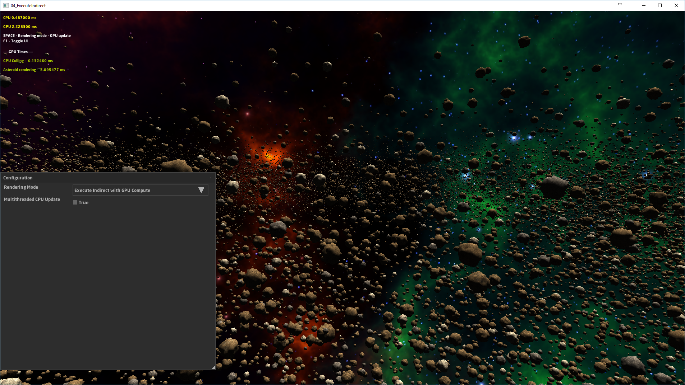
Using ExecuteIndirect with GPU updates for the indirect argument buffers

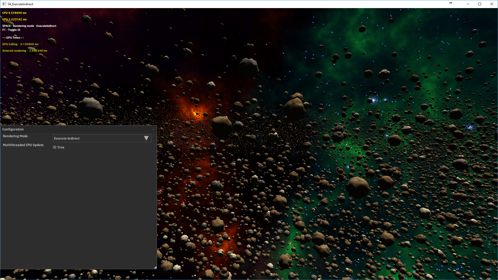
Using ExecuteIndirect with CPU updates for the indirect argument buffers

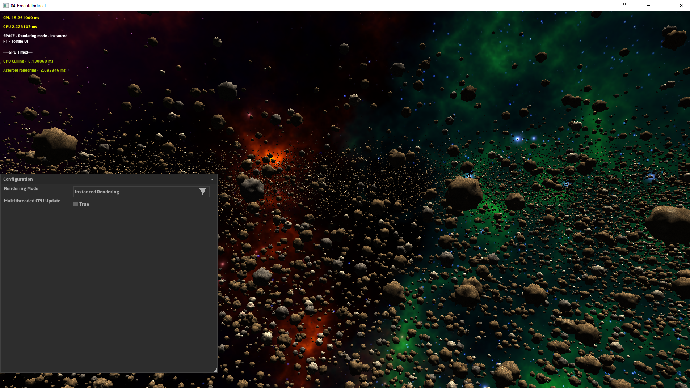
Using Instanced Rendering

## 6. Material Playground

This unit test shows a range of game related materials:

Hair:
Many years ago in 2012 / 2013, we helped AMD and Crystal Dynamics with the development of TressFX for Tomb Raider. We also wrote an article about the implementation in GPU Pro 5 and gave a few joint presentations on conferences like FMX. At the end of last year we revisited TressFX. We took the current code in the GitHub repository, changed it a bit and ported it to The Forge. It now runs on PC with DirectX 12 / Vulkan, macOS and iOS with Metal 2 and on the XBOX One. We also created a few new hair assets so that we can showcase it. Here is a screenshot of our programmer art:


Metal:


Wood:


## 7. Hardware Tessellation

This unit test showcases the rendering of grass with the help of hardware tessellation.

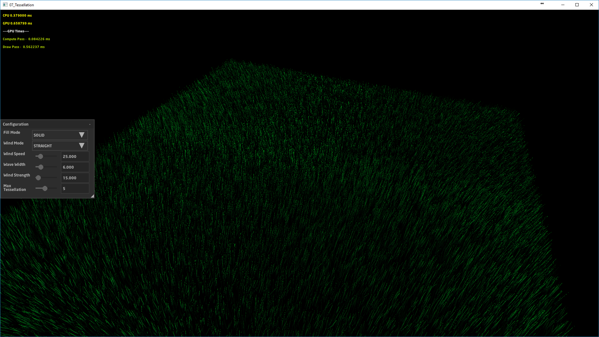


## 9. Light and Shadow Playground
This unit test shows various shadow and lighting techniques that can be chosen from a drop down menu. There will be more in the future.

 * Exponential Shadow Map - this is based on [Marco Salvi's](https://pixelstoomany.wordpress.com/category/shadows/exponential-shadow-maps/) @marcosalvi papers. This technique filters out the edge of the shadow map by approximating the shadow test using exponential function that involves three subjects: the depth value rendered by the light source, the actual depth value that is being tested against, and the constant value defined by the user to control the softness of the shadow
  * Adaptive Shadow Map with Parallax Correction Cache - this is based on the article "Parallax-Corrected Cached Shadow Maps" by Pavlo Turchyn in [GPU Zen 2](https://gpuzen.blogspot.com/2019/05/gpu-zen-2-parallax-corrected-cached.htm). It adaptively chooses which light source view to be used when rendering a shadow map based on a hiearchical grid structure. The grid structure is constantly updated depending on the user's point of view and it uses caching system that only renders uncovered part of the scene. The algorithm greatly reduce shadow aliasing that is normally found in traditional shadow map due to insufficient resolution. Pavlo Turchyn's paper from GPU Pro 2 added an additional improvement by implementing multi resolution filtering, a technique that approximates larger size PCF kernel using multiple mipmaps to achieve cheap soft shadow. He also describes how he integrated a Parallax Correction Cache to Adaptive Shadow Map, an algorithm that approximates moving sun's shadow on static scene without rendering tiles of shadow map every frame. The algorithm is generally used in an open world game to approximate the simulation of day & night’s shadow cycle more realistically without too much CPU/GPU cost.
  * Signed Distance Field Soft Shadow - this is based on [Daniel Wright's Siggraph 2015](http://advances.realtimerendering.com/s2015/DynamicOcclusionWithSignedDistanceFields.pdf) @EpicShaders presentation. To achieve real time SDF shadow, we store the distance to the nearest surface for every unique Meshes to a 3D volume texture atlas. The Mesh SDF is generated offline using triangle ray tracing, and half precision float 3D volume texture atlas is accurate enough to represent 3D meshes with SDF. The current implementation only supports rigid meshes and uniform transformations (non-uniform scale is not supported). An approximate cone intersection can be achieved  by measuring the closest distance of a passed ray to an occluder which gives us a cheap soft shadow when using SDF.

To achieve  high-performance, the playground runs on our signature rendering architecture called Triangle Visibility Buffer. The step that generates the SDF data also uses this architecture.

Click on the following screenshot to see a movie:

[](https://vimeo.com/352985038)

The following PC screenshots are taken on Windows 10 with a AMD RX550 GPU (driver 19.7.1) with a resolution of 1920x1080. 

Exponential Shadow Maps:


Adaptive Shadow Map with Parallax Correction Cache


Signed Distance Field Soft Shadow:


Signed Distance Field Soft Shadows - Debug Visualization


The following shots show Signed Distance Field Soft Shadows running on iMac with a AMD RADEON Pro 580


The following shots show Signed Distance Field Soft Shadows running on XBOX One:


Readme for Signed Distance Field Soft Shadow Maps:

To generate the SDF Mesh data you should select “Signed Distance Field” as the selected shadow type in the Light and Shadow Playground. There is a button called “Generate Missing SDF” and once its clicked, it shows a progress bar that represents the remaining SDF mesh objects utilized for SDF data generation. This process is multithreaded, so the user can still move around the scene while waiting for the SDF process to be finished. This is a long process and it could consume up to 8+ hours depending on your CPU specs. To check how many SDF objects there are presently in the scene, you can mark the checkbox "Visualize SDF Geometry On The Scene".

## 9a. Hybrid Ray-Traced Shadows
This unit test was build by Kostas Anagnostou @KostasAAA to show how to ray trace shadows without using a ray tracing API like DXR / RTX. It should run on all GPUs (not just NVIDIA RTX GPUs) and the expectation is that it should run comparable with a DXR / RTX based version even on a NVIDIA RTX GPU. That means the users of your game do not have to buy a NVIDIA RTX GPU to enjoy HRT shadows :-)


## 10. Screen-Space Reflections
This test offers two choices: you can pick either Pixel Projected Reflections or AMD's FX Stochastic Screen Space Reflection. We just made AMD's FX code cross-platform. It runs now on Windows, Linux, macOS, Switch, PS and XBOX.

Here are the screenshots of AMD's FX Stochastic Screen Space Reflections:

Windows final scene:


Without denoising:


With denoising:


PS4:


macOS:


In case you pick Pixel-Projected Reflections, the application features an implementation of the papers [Optimized pixel-projected reflections for planar reflectors](http://advances.realtimerendering.com/s2017/PixelProjectedReflectionsAC_v_1.92.pdf) and [IMPLEMENTATION OF OPTIMIZED PIXEL-PROJECTED REFLECTIONS FOR PLANAR REFLECTORS](https://github.com/byumjin/Jin-Engine-2.1/blob/master/%5BByumjin%20Kim%5D%20Master%20Thesis_Final.pdf)


## 11. Multi-GPU (Driver support only on PC Windows)
This unit test shows a typical VR Multi-GPU configuration. One eye is rendered by one GPU and the other eye by the other one.


## 11a. Unlinked multiple GPUs (Driver support only on PC Windows)
For professional visualization applications, we now support unlinked multiple GPUs. A new renderer API is added to enumerate available GPUs. Renderer creation is extended to allow explicit GPU selection using the enumerated GPU list. Multiple Renderers can be created this way. The resource loader interface has been extended to support multiple Renderers. It is initialized with the list of all Renderers created. To select which Renderer (GPU) resources are loaded on, the NodeIndex used in linked GPU configurations is reused for the same purpose. Resources cannot be shared on multiple Renderers however, resources must be duplicated explicitly if needed. To retrieve generated content from one GPU to another (e.g. for presentation), a new resource loader operation is provided to schedule a transfer from a texture to a buffer. The target buffer should be mappable. This operation requires proper synchronization with the rendering work; a semaphore can be provided to the copy operation for that purpose. Available with Vulkan and D3D12. For other APIs, the enumeration API will not create a RendererContext which indicates lack of unlinked multi GPU support.


## 12. File System Test
This unit test showcases a cross-platform FileSystem C API, supporting disk-based files, memory streams, and files in zip archives. The API can be viewed in [IFileSystem.h](/Common_3/OS/Interfaces/IFileSystem.h), and all of the example code has been updated to use the new API.
   * The API is based around `Path`s, where each `Path` represents an absolute, canonical path string on a particular file system. You can query information about the files at `Path`s, open files as `FileStream`s, and copy files between different `Path`s.
   * The concept of `FileSystemRoot`s has been replaced by `ResourceDirectory`s. `ResourceDirectory`s are predefined directories where resources are expected to exist, and there are convenience functions to open files in resource directories. If your resources don’t exist within the default directory for a particular resource type, you can call `fsSetPathForResourceDirectory` to relocate the resource directory; see the unit tests for sample code on how to do this.
   


## 14. Order-Independent Transparency
This unit test compares various Order-Indpendent Transparency Methods. In the moment it shows:
- Alpha blended transparency
- Weighted blended Order Independent Transparency [Morgan McGuire Blog Entry 2014](http://casual-effects.blogspot.com/2014/03/weighted-blended-order-independent.html) and [Morgan McGuire Blog Entry 2015](http://casual-effects.blogspot.com/2015/03/implemented-weighted-blended-order.html)
- Weighted blended Order Independent Transparency by Volition [GDC 2018 Talk](https://www.gdcvault.com/play/1025400/Rendering-Technology-in-Agents-of)
- Adaptive Order Independent Transparency with Raster Order Views [paper by Intel, supports DirectX 11, 12 only](https://software.intel.com/en-us/articles/oit-approximation-with-pixel-synchronization-update-2014), and a [Primer](https://software.intel.com/en-us/gamedev/articles/rasterizer-order-views-101-a-primer)
- Phenomenological Transparency - Diffusion, Refraction, Shadows by [Morgan McGuire](https://casual-effects.com/research/McGuire2017Transparency/McGuire2017Transparency.pdf)


## 15. Wave Intrinsics
This unit test shows how to use the new wave intrinsics. Supporting Windows with DirectX 12 / Vulkan, Linux with Vulkan and macOS / iOS.


## 16. Path Tracer - Ray Tracing
The new 16_Raytracing unit test shows a simple cross-platform path tracer. On iOS this path tracer requires A11 or higher. It is meant to be used in tools in the future and doesn't run in real-time.
To support the new path tracer, the Metal raytracing backend has been overhauled to use a sort-and-dispatch based approach, enabling efficient support for multiple hit groups and miss shaders. The most significant limitation for raytracing on Metal is that only tail recursion is supported, which can be worked around using larger per-ray payloads and splitting up shaders into sub-shaders after each TraceRay call; see the Metal shaders used for 16_Raytracing for an example on how this can be done.

macOS 1920x1080 AMD Pro Vega 64

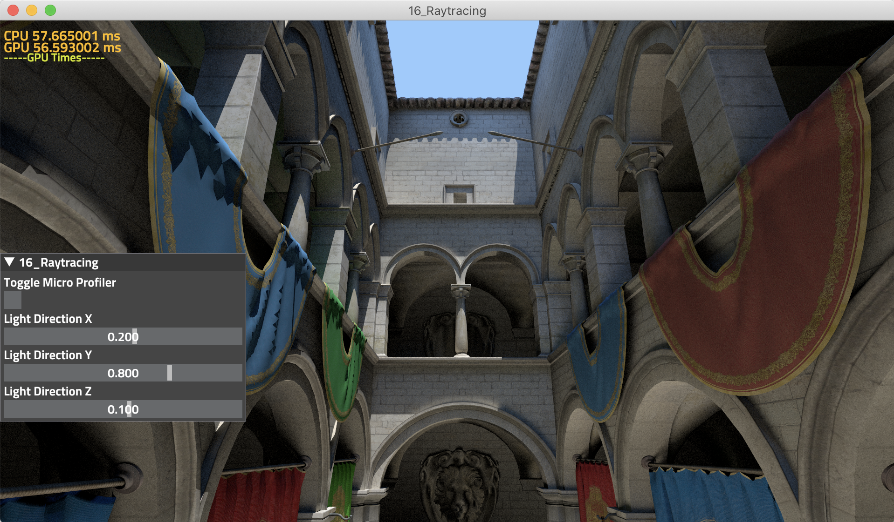

iOS iPhone X 812x375

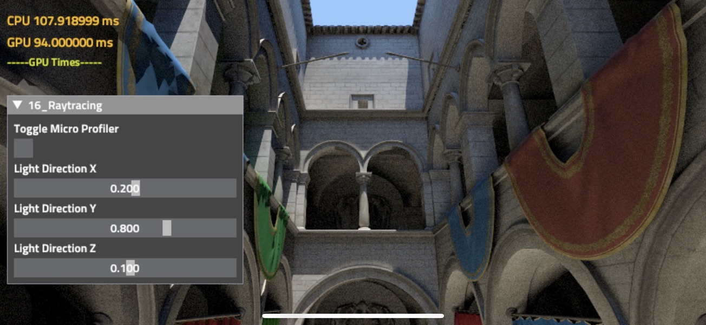

Windows 10 1080p NVIDIA RTX 2080 with DXR Driver version 441.12


Windows 10 1080p NVIDIA RTX 2080 with RTX Driver version 441.12


Linux 1080p NVIDIA RTX 2060 with RTX Driver version 435

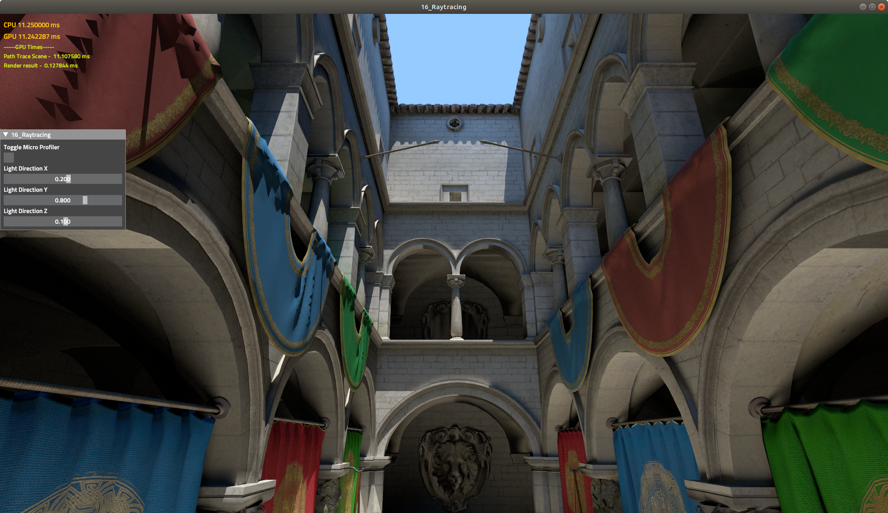


## 17. Entity Component System Test
This unit test shows how to use the high-performance entity component system in The Forge. 


This unit test uses

[](https://github.com/SanderMertens/flecs)

Compared to our old ECS system our build times are now much better and the overall system runs faster:

```
CPU: intel i7-7700k
GPU: AMD Radeon RX570

Old ECS
Debug
Single Threaded: 90.0ms 
Multi Threaded 29.0ms

Release:
Single Threaded: 5.7ms
Multi Threaded: 2.3ms


flecs
Debug
Single Threaded: 23.0ms   
Multi Threaded 6.8ms

Release
Single Threaded 1.7ms
Multi Threaded 0.9ms
```


## 18. Sparse Virtual Textures
The Forge has now support for Sparse Virtual Textures on Windows and Linux with DirectX 12 / Vulkan. Sparse texture (also known as "virtual texture", “tiled texture”, or “mega-texture”) is a technique to load huge size (such as 16k x 16k or more) textures in GPU memory.
It breaks an original texture down into small square or rectangular tiles to load only visible part of them.

The unit test 18_Virtual_Texture is using 7 sparse textures:
* Mercury: 8192 x 4096
* Venus: 8192 x 4096
* Earth: 8192 x 4096
* Moon: 16384 x 8192
* Mars: 8192 x 4096
* Jupiter: 4096 x 2048
* Saturn: 4096 x 4096

There is a unit test that shows a solar system where you can approach planets with Sparse Virtual Textures attached and the resolution of the texture will increase when you approach.

Linux 1080p NVIDIA RTX 2060 with RTX Driver version 435

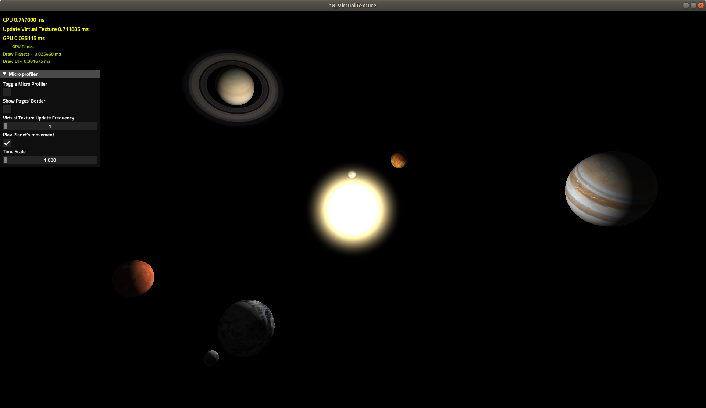 

Windows 10 1080p NVIDIA 1080 DirectX 12

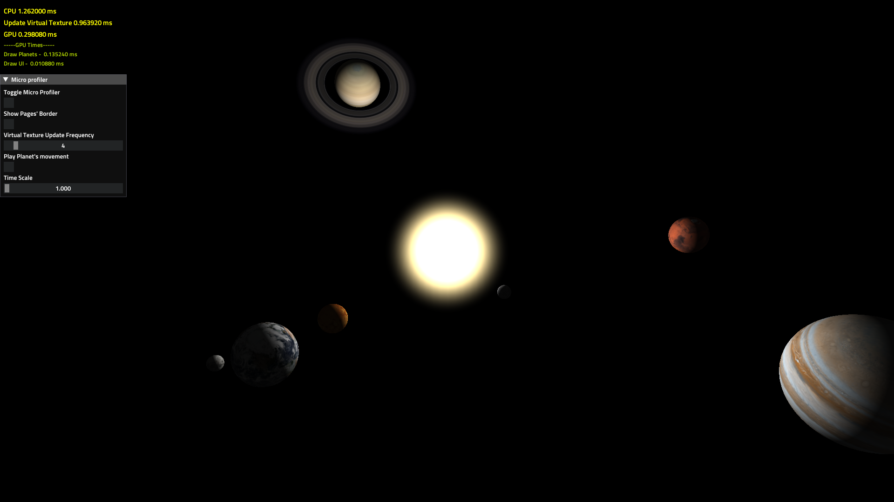 

Windows 10 1080p NVIDIA 1080 Vulkan

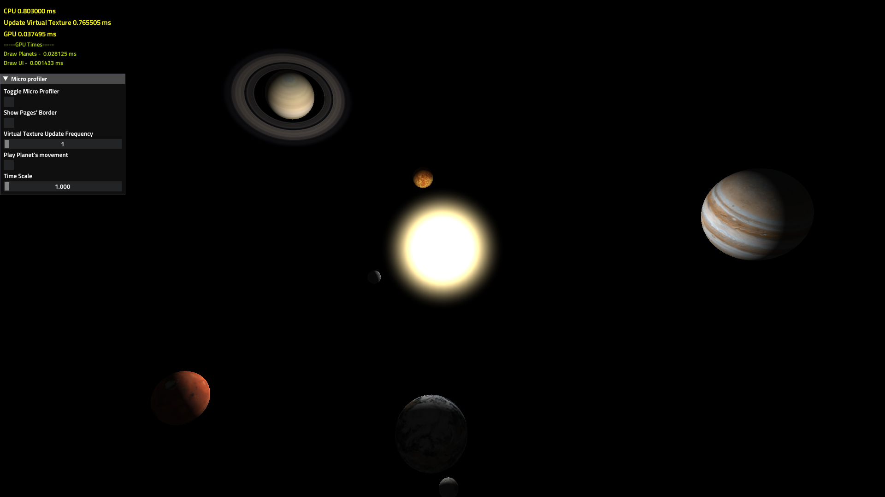 

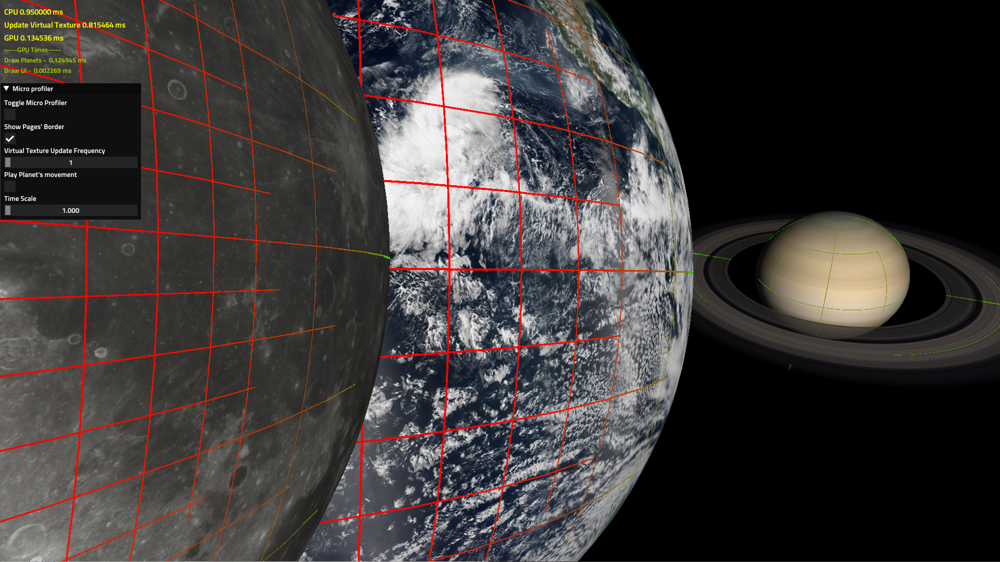 

## 19. C Hot Reloading
This unit test showcases an implementation of code hot reloading in C, we've used and adapted the following GitHub library

[cr](https://github.com/fungos/cr)

 for this. 
 
 
 
 The test contains two projects:
- 19_CodeHotReload_Main: generates the executable. All code in this project can't be hot-reloaded. This is the project you should set as startup project when running the program form an IDE.
- 19a_CodeHotReload_Game: for development platforms Windows/MacOS/Linux generates a dynamic library that is loaded by the Main project in runtime, when the dynamic library changes the Main program reloads the new code. For Android/IOS/Quest/Consoles this project is compiled and linked statically.

How to use it: While the Main project is running open 19_CodeHotReload_Game.cpp and perform some change, there are lines marked with `TRY_CODE_RELOAD` to make easy changes. Once the file is saved, you can rebuild the project and see the changes happen automatically.
- Windows/Linux: Click on the UI "RebuildGame" button.
- MacOS: Command+B on XCode to rebuild.

Note: In this implementation we can't call any functions from The Forge from the HotReloadable project (19a_CodeHotReload_Game), this is because we are compiling OS and Renderer as static libraries and linking them directly to the exe. Ideally these projects should be compiled as dynamic libraries in order to expose their functionality to the exe and hot reloadable dll. The reason we didn't implement it in this way is because all our other projects are already setup to use static libraries.


## 21. Animation

## 28. Ozz Skinning
This unit test shows how to use skinning with Ozz


## 35. Variable Shading Rate
 - Per tile Shading Rate
Generating a shading rate lookup texture on-the-fly. Used for drawing the color palette which makes up the background. The rate decreases the further the pixels are located from the center. We can see artifacts becoming visible at aggressive rates, such as 4X4. There is also a slider in the UI to modify the center of the circle.

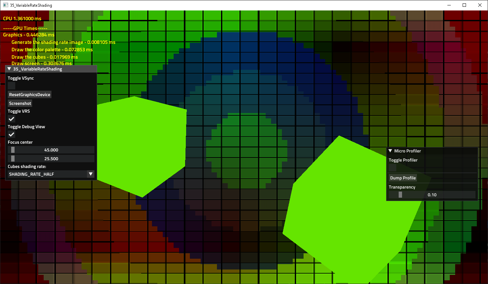

  - Per-draw Shading Rate:
The cubes are drawn by a different shading rate. They are following the Per-draw rate, which can be changed via the dropdown menu in the UI.
By using a combiner that overrides the screen rates, we ensure that cubes are drawn by an independent rate.

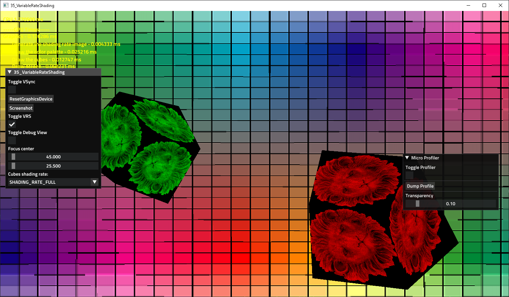
The cubes are using per-draw shading rate while the background is using per-tile shading rate.

  - Notes:
    - There is a debug view showing the shading rates and the tiles' size.
    - Per-tile method may not be available on certain GPUs even if they support the Per-draw method.
    - The tile size is enforced by the GPU and is readable, as shown in the example.
    - The shading rates available can vary based on the active GPU.

## 36 AlgorithmsAndContainers


## 37 Pre-Computed DLUT Test
This test implements pre-computing volume transmittance in Blender or Houdini for 6 directions and shading clouds/smoke based on the following tweets:

https://twitter.com/Vuthric/status/1286796950214307840

A detailed description can be found here: https://realtimevfx.com/t/smoke-lighting-and-texture-re-usability-in-skull-bones/5339


In this repository is a "dlut.blend" file that contains a minimal volumetric render setup. In order to generate DLUT image do the following steps:

   - Set the viewport shading to "Rendered"
   - Select the "Sun" object
   - Set the X rotation to 0 degrees
   - Press F12 to render the image and wait for a few minutes until it's done
   - Save the rendered image to "dlut_0.png"
   - Repeat steps 3-5 for 90, 180 and 270 degrees and save "dlut_90.png", "dlut_180.png" and "dlut_270.png"
   - Run the "combine_dlut.py" Python script or manually combine rendered images in your image editor of choice, each color channel should contain the red channel from the corresponding "dlut_*.png" image multiplied by the alpha channel of the same image. For example, green channel should contain the red channel from "dlut_90.png" multiplied by the alpha channel of "dlut_90.png"
   - Experiment and implement further ideas from the article above. Setting up a Mantaflow simulation in Blender and exporting animated smoke and simulation attributes like temperature can yield interesting results!

Resulting DLUT image should look like this:


The example program running on Android:


## 38 GTAO
This unit test implements the paper "Practical Real-Time Strategies for Accurate Indirect Occlusion" by [Jorge Jimenez](https://www.activision.com/cdn/research/Practical_Real_Time_Strategies_for_Accurate_Indirect_Occlusion_NEW%20VERSION_COLOR.pdf) et. all.

macOS


PC


PS4


PS5


Switch


XBOX


# Examples
There is an example implementation of the Triangle Visibility Buffer as covered in various conference talks. [Here](https://diaryofagraphicsprogrammer.blogspot.com/2018/03/triangle-visibility-buffer.html) is a blog entry that details the implementation in The Forge.


# Tools
Below are screenshots and descriptions of some of the tools we integrated.

## MTuner
MTuner
MTuner was integrated into the Windows 10 runtime of The Forge following a request for more in-depth memory profiling capabilities by one of the developers we support. It has been adapted to work closely with our framework and its existing memory tracking capabilities to provide a complete picture of a given application’s memory usage. 

To use The Forge’s MTuner functionality, simply drag and drop the .MTuner file generated alongside your application’s executable into the MTuner host app, and you can immediately begin analyzing your program’s memory usage. The intuitive interface and exhaustive supply of allocation info contained in a single capture file makes it easy to identify usage patterns and hotspots, as well as tracking memory leaks down to the file and line number. The full documentation of MTuner can be found [here](link: https://milostosic.github.io/MTuner/).

Currently, this feature is only available on Windows 10, but support for additional platforms provided by The Forge is forthcoming.
Here is a screenshot of an example capture done on our first Unit Test, 01_Transformations:
 

## Ray Tracing Benchmark
Based on request we are providing a Ray Tracing Benchmark in 16_RayTracing. It allows you to compare the performance of three platforms: 
  * Windows with DirectX 12 DXR
  * Windows with Vulkan RTX
  * Linux with Vulkan RTX

  We will extend this benchmark to the non-public platforms we support to compare the PC performance with console performance. 
  The benchmark comes with batch files for all three platforms. Each run generates a HTML output file from the profiler that is integrated in TF. The default number of iterations is 64 but you can adjust that.  There is a Readme file in the 16_RayTracing folder that describes the options.

Windows DirectX 12 DXR, GeForce RTX 2070 Super, 3840x1600, NVIDIA Driver 441.99

 

Windows Vulkan RTX, GeForce RTX 2070 Super, 3840x1600, NVIDIA Driver 441.99

 


## Microprofiler
We integrated the [Micro Profiler](https://github.com/zeux/microprofile) into our code base by replacing the proprietary UI with imGUI and simplified the usage. Now it is much more tightly and consistently integrated in our code base.

Here are screenshots of the Microprofiler running the Visibility Buffer on PC:


Here are screenshots of the Microprofiler running a unit test on iOS:


Check out the [Wikipage](https://github.com/ConfettiFX/The-Forge/wiki/Microprofiler---How-to-Use) for an explanation on how to use it.

## Shader Translator
We provide a shader translator, that translates one shader language -a superset of HLSL called Forge Shader Language (FLS) - to the target shader language of all our target platforms. That includes the console and mobile platforms as well.
It is written in Python. We expect this shader translator to be an easier to maintain solution for smaller game teams because it allows to add additional data to the shader source file with less effort. Such data could be for example a bucket classification or different shaders for different capability levels of the underlying platform, descriptor memory requirements or resource memory requirements in general, material info or just information to easier pre-compile pipelines.
The actual shader compilation will be done by the native compiler of the target platform.

 [How to use the Shader Translator](https://github.com/ConfettiFX/The-Forge/wiki/How-to-Use-The-Shader-Translator)


# Releases / Maintenance
The Forge Interactive Inc. will prepare releases when all the platforms are stable and running and push them to this GitHub repository. Up until a release, development will happen on internal servers. This is to sync up the console, mobile, macOS and PC versions of the source code.

# Products
We would appreciate it if you could send us a link in case your product uses The Forge. Here are the ones we received so far or we contributed to:

## BuildBox
The game engine BuildBox is now using The Forge (click on image to go to the Steam Store): 

[](https://signup.buildbox.com/product/bb3)

## Lethis
The Game "Lethis Path of Progress" is now using The Forge (click on image to go to the Steam Store)

[](https://store.steampowered.com/app/359230/Lethis__Path_of_Progress/)

## Supergiant Games Hades
[Supergiant's Hades](https://www.supergiantgames.com/games/hades/) we are working with Supergiant since 2014. One of the on-going challenges was that their run-time was written in C#. At the beginning of last year, we suggested to help them in building a new cross-platform game engine in C/C++ from scratch with The Forge. The project started in April 2019 and the first version of this new engine launched in May this year. Hades was then released for Microsoft Windows, macOS, and Nintendo Switch on September 17, 2020. The game can run on all platforms supported by The Forge.

Here is a screenshot of Hades running on Switch:


Here is an article by [Forbes](https://www.forbes.com/sites/davidthier/2020/09/27/you-need-to-play-the-game-at-the-top-of-the-nintendo-switch-charts/#6e9128ba2f80) about Hades being at the top of the Nintendo Switch Charts.
Hades is also a technology showcase for Intel's integrated GPUs on macOS and Windows. The target group of the game seems to often own those GPUs.

## Bethesda's Creation Engine
Bethesda based their rendering layer for their next-gen engine on The Forge. We helped integrate and optimize it. 
The Starfield Official Gameplay Reveal Trailer is out. It always brings us pleasure to see The Forge running in AAA games like this:

[](https://www.youtube.com/watch?v=ZHZOTFMyMyM)

We added The Forge to the Creation Engine in 2019.

Here is more info about this game engine:

[Todd Howard Teases Bethesda's New Game Engine Behind The Elder Scrolls 6 And Starfield](https://www.thegamer.com/starfield-the-elder-scrolls-6-new-game-engine/)

[Bethesda's overhauling its engine for Starfield and The Elder Scrolls 6](https://www.gamesradar.com/bethesda-engine-starfield-elder-scrolls-6/)


## No Man's Sky
The Forge made an appearance during the Apple developer conference 2022. We added it to the game "No Man's Sky" from Hello Games to bring this game up on macOS / iOS. For the Youtube video click on the image below and jump to 1:22:40

[](https://www.youtube.com/watch?v=q5D55G7Ejs8)


## M²H - Stroke Therapy
M²H uses The Forge - [M²H](https://msquarehealthcare.com/) is a medical technology company. They have developed a physics-based video game therapy solution that is backed by leading edge neuroscience, powered by Artificial Intelligence and controlled by dynamic movement – all working in concert to stimulate vast improvement of cognitive and motor functions for patients with stroke and the aged.
The Forge provides the rendering layer for their application.
Here is a YouTube video on what they do:

[](https://www.youtube.com/watch?v=l2Gr2Ts48e8&t=12s)

## StarVR One SDK
The Forge was used to build the StarVR One SDK from 2016 - 2017:

<a href="https://www.starvr.com" target="_blank"></a>


## Torque 3D
The Forge will be used as the rendering framework in Torque 3D:

<a href="http://www.garagegames.com/products/torque-3d" target="_blank"></a>

## Star Wars Galaxies Level Editor
SWB is an editor for the 2003 game 'Star Wars Galaxies' that can edit terrains, scenes, particles and import/export models via FBX. The editor uses an engine called 'atlas' that will be made open source in the future. It focuses on making efficient use of the new graphics APIs (with help from The-Forge!), ease-of-use and terrain rendering.


# Writing Guidelines
For contributions to The Forge we apply the following writing guidelines:
 * We limit all code to C++ 11 by setting the Clang and other compiler flags
 * We follow the [Orthodox C++ guidelines] (https://gist.github.com/bkaradzic/2e39896bc7d8c34e042b) minus C++ 14 support (see above)
 * Please note that we are going to move towards C99 usage more and more because this language makes it easier to develop high-performance applications in a team. With the increased call numbers of modern APIs and the always performance-detoriating C++ features, C++ is becoming more and more a productivity and run-time performance challenge. C is also a better starting point to port to other languages like RUST. In case any of those languages become common in development.

# User Group Meetings 
There will be a user group meeting during GDC. In case you want to organize a user group meeting in your country / town at any other point in time, we would like to support this. We could send an engineer for a talk.

# Support for Education 
In case your School / College / University uses The Forge for education, we would like to support this as well. We could send an engineer or help create material. So far the following schools use The Forge for teaching:

[Breda University of Applied Sciences](https://www.buas.nl) 
```
        Contact:
        Jeremiah van Oosten 
        Monseigneur Hopmansstraat 1
        4817 JT Breda
 ```
[Ontario Tech University](https://uoit.ca/) 
```
        Contact:
        Andrew Hogue
        Ontario Tech University
        SIRC 4th floor
        2000 Simcoe St N
        Oshawa, ON, L1H 7K4
 ```


# Open-Source Libraries
The Forge utilizes the following Open-Source libraries:
* [Fontstash](https://github.com/memononen/fontstash)
* [Vectormath](https://github.com/glampert/vectormath)
* [Nothings](https://github.com/nothings/stb) single file libs 
  * [stb.h](https://github.com/nothings/stb/blob/master/stb.h)
  * [stb_image.h](https://github.com/nothings/stb/blob/master/stb_image.h)
  * [stb_image_resize.h](https://github.com/nothings/stb/blob/master/stb_image_resize.h)
  * [stb_image_write.h](https://github.com/nothings/stb/blob/master/stb_image_write.h)
* [shaderc](https://github.com/google/shaderc)
* [SPIRV_Cross](https://github.com/KhronosGroup/SPIRV-Cross)
* [TinyEXR](https://github.com/syoyo/tinyexr)
* [Vulkan Memory Allocator](https://github.com/GPUOpen-LibrariesAndSDKs/VulkanMemoryAllocator)
* [D3D12 Memory Allocator](https://github.com/GPUOpen-LibrariesAndSDKs/D3D12MemoryAllocator)
* [GeometryFX](https://gpuopen.com/gaming-product/geometryfx/)
* [WinPixEventRuntime](https://blogs.msdn.microsoft.com/pix/winpixeventruntime/)
* [Fluid Studios Memory Manager](http://www.paulnettle.com/)
* [volk Metaloader for Vulkan](https://github.com/zeux/volk)
* [gainput](https://github.com/jkuhlmann/gainput)
* [Dear ImGui](https://github.com/ocornut/imgui)
* [DirectX Shader Compiler](https://github.com/Microsoft/DirectXShaderCompiler)
* [Ozz Animation System](https://github.com/guillaumeblanc/ozz-animation)
* [Lua Scripting System](https://www.lua.org/)
* [TressFX](https://github.com/GPUOpen-Effects/TressFX)
* [Micro Profiler](https://github.com/zeux/microprofile)
* [MTuner](https://github.com/milostosic/MTuner) 
* [EASTL](https://github.com/electronicarts/EASTL/)
* [meshoptimizer](https://github.com/zeux/meshoptimizer)
* [Basis Universal Texture Support](https://github.com/binomialLLC/basis_universal)
* [TinyImageFormat](https://github.com/DeanoC/tiny_imageformat)
* [minizip ng](https://github.com/zlib-ng/minizip-ng)
* [flecs](https://github.com/SanderMertens/flecs)
* [Android Vulkan Validation Layers](https://github.com/KhronosGroup/Vulkan-ValidationLayers)
* [CPU Features](https://github.com/google/cpu_features)
* [HIDAPI](https://github.com/libusb/hidapi)
* [cf](https://github.com/fungos/cr)
* [bstrlib](https://github.com/websnarf/bstrlib)
* [stb_ds](https://github.com/nothings/stb/blob/master/stb_ds.h)
* [cr](https://github.com/fungos/cr)
