# 

The Forge is a cross-platform rendering framework supporting
- PC 
  * Windows 10 
     * with DirectX 12 / Vulkan 1.1
     * with DirectX Ray Tracing API
     * DirectX 11 Fallback Layer for Windows 7 support (not extensively tested)
  * Linux Ubuntu 18.04 LTS with Vulkan 1.1
- Android Pie with Vulkan 1.1
- macOS with Metal 2
- iOS with Metal 2
- XBOX One / XBOX One X (only available for accredited developers on request)
- PS4 (in development) (only available for accredited developers on request)

Particularly, the graphics layer of The Forge supports cross-platform
- Descriptor management
- Multi-threaded and asynchronous resource loading
- Shader reflection
- Multi-threaded command buffer generation

The Forge can be used to provide the rendering layer for custom next-gen game engines. It is also meant to provide building blocks to write your own game engine. It is like a "lego" set that allows you to use pieces to build a game engine quickly. The "lego" High-Level Features supported on all platforms are at the moment:
- Asynchronous Resource loading with a resource loader task system as shown in 10_PixelProjectedReflections
- [Lua Scripting System](https://www.lua.org/) - currently used in 06_Playground to load models and textures and animate the camera
- Animation System based on [Ozz Animation System](https://github.com/guillaumeblanc/ozz-animation)
- Consistent Math Library  based on an extended version of [Vectormath](https://github.com/glampert/vectormath)
- Extended version of [TinySTL](https://github.com/mendsley/tinystl)
- For loading art assets we have a modified and integrated version of [Assimp](https://github.com/assimp/assimp)
- Consistent Memory Managament: on GPU following [Vulkan Memory Allocator](https://github.com/GPUOpen-LibrariesAndSDKs/VulkanMemoryAllocator)
- Input system with Gestures for Touch devices based on an extended version of [gainput](https://github.com/jkuhlmann/gainput)
- Very fast Entity Component System based on [ENTT](https://github.com/skypjack/entt)
- UI system based on [imGui](https://github.com/ocornut/imgui) with a dedicated unit test extended for touch input devices
- Various implementations of high-end Graphics Effects as shown in the unit tests below

Please find a link and credits for all open-source packages used at the end of this readme.


Future plans are
- Unified shader generation -> check out an alpha version of the [Confetti Shader Translator](http://confettishadertranslator.azurewebsites.net). This shader translator is build with the purpose of supporting a higher-level shading language, which we call super HLSL or short sHLSL


<a href="https://twitter.com/TheForge_FX?lang=en" target="_blank"> Join the channel at https://twitter.com/TheForge_FX?lang=en</a>
 
# Build Status 

* Windows [](https://ci.appveyor.com/project/wolfgangfengel/the-forge/branch/master)
* macOS [](https://travis-ci.org/ConfettiFX/The-Forge)

# News

## Release 1.26 - April 3rd, 2019 - Vulkan Ray Tracing for Windows & Linux
- Ray Tracing with the Vulkan API (Vulkan SDK 1.1.101.0) is now working on Windows and Ubuntu through our unified Ray Tracing interface in IRay.h:

PC Ubuntu Vulkan RTX, GeForce RTX 2070, Driver Version 418.56 1080p
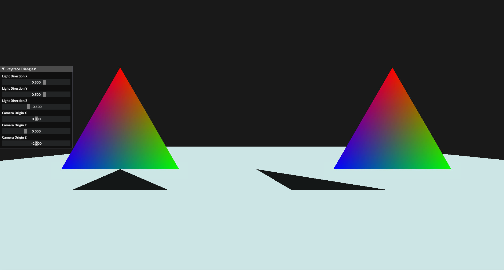

PC Windows 10 RS5, DirectX12, GeForce RTX 2070, Driver version 418.81 1080p:
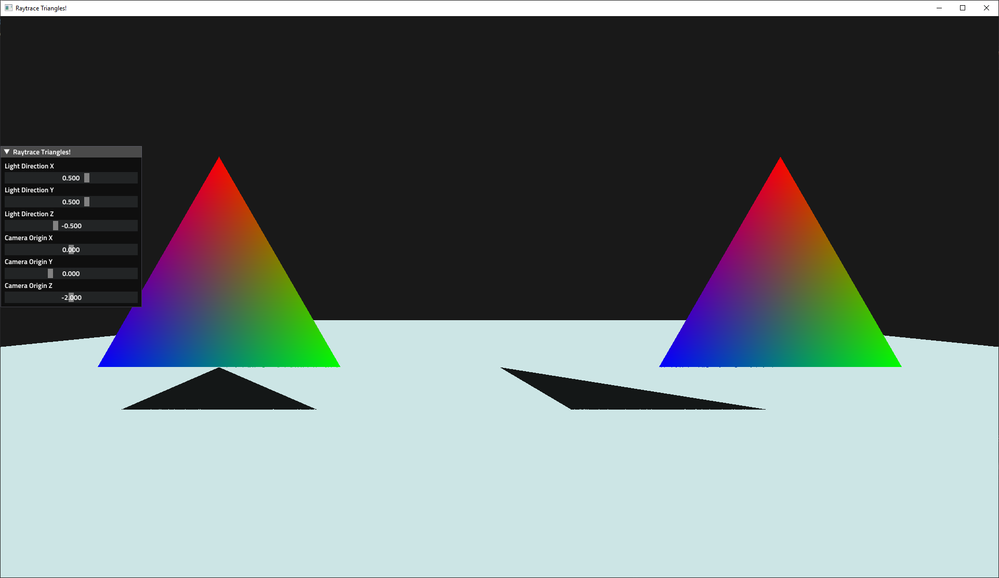

Mac Mini with Intel Core i5 3GHz cpu with integrated graphics Intel UHD Graphics 630 (Part No. MRTT2RU/A) with resolution 3440x1440:
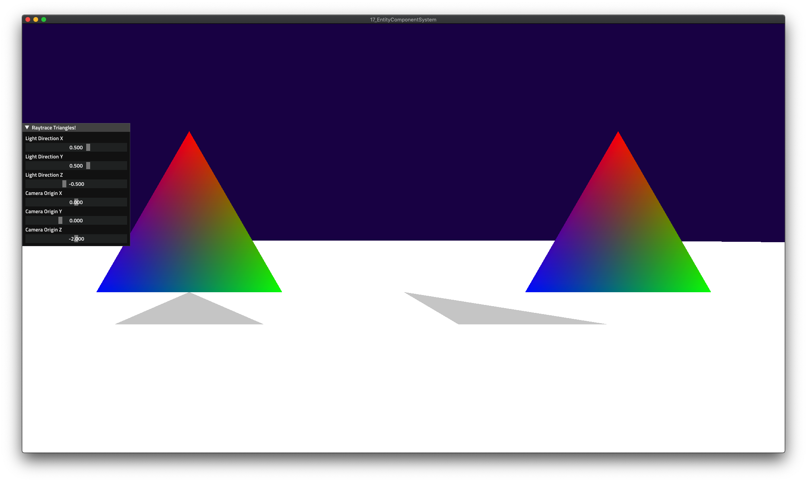

iPad 6th Generation iOS 12.1.3 (16D39) with a resolution of 2048x1536
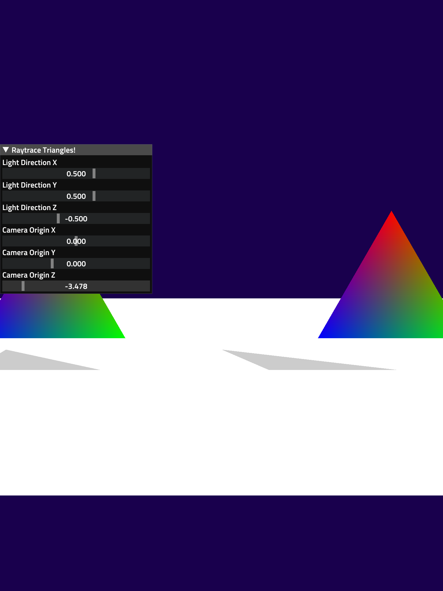

- New Descriptor Memory Management System: we did a second pass over that system and improved performance and memory consumption further. Now we can group individual descriptor bindors into a single one. A lot of bug and memory leak fixes were done as well.
- Async / Sync Resource Loading system: instead of allocating additional memory, it uses now fixed size memory and splits resources for upload
- Unified UniformRingBuffer and MeshRingBuffer into GPURingBuffer
- Vulkan: we implemented now something close to the official recommendation how to convert "Vsync on/off" to Vulkan parameters (in pseudocode) (thanks to Adam Sawicki
@Reg__):
```cpp
if mEnableVsync:
    Try to find among available present modes, in this order: FIFO_RELAXED, FIFO
else:
    Try to find among available present modes, in this order: IMMEDIATE, MAILBOX, FIFO (we prefer here FIFO_RELAXED instead)

if chosen mode == IMMEDIATE:
    imageCount = (Fullscreen ? 2 : 3)
else if chosen mode == MAILBOX:
    imageCount = 3
else if chosen mode == FIFO or FIFO_RELAXED:
    imageCount = 2
imageCount = max(VkSurfaceCapabilitiesKHR::minImageCount, min(imageCount, VkSurfaceCapabilitiesKHR::maxImageCount))
```

## Release 1.25 - March 15th, 2019 - New Descriptor Memory Management System | Refactored Input System

- The purpose of the DescriptorBinder approach is to allocate all memory descriptor space at load time (streaming is also considered load time), instead of doing it on-demand at runtime, as it is commonly done. This is done in an effort to allow applications to have better control over memory footprint overhead, which is especially important on mobile targets, and to improve performance by avoiding runtime memory allocations.
The system will use shader reflection to determine the appropriate descriptor layouts in combination with descriptor update frequency knowledge. This knowledge will come from the client domain or from content editor tools.
With this information, we are able to allocate all necessary descriptor memory up-front, giving more control to the application about the memory footprint. This is one of the initiatives leading up to the new version of The Forge.
Read more [Descriptor Management](https://github.com/ConfettiFX/The-Forge/wiki/Descriptor-Management)

- The input system was refactored and streamlined. This is mostly a rewrite of the code layer above [gainput](https://github.com/jkuhlmann/gainput).
  - IOperatingSystem.h: getMousePosition, getKeyDown, getKeyUp, getJoystickButtonDown, getJoystickButtonUp were removed
  - InputSystem.h: 
    - KeyMappingDescription - changed now every axis should be defined as separate entry
    - IsButtonPressed, IsButtonTriggered, IsButtonReleased, MapKey, SetActiveInputMap,  GetButtonData,  GetDisplayWidth, GetDisplayHeight, were removed
    - New functions GetBoolInput, GetFloatInput. KeyMappingDescription  for new function require directly specifying intended action(released, pressed, triggered) via DEFINE_DEVICE_ACTION macro
    - For InputEventHandler old style definition is used

## Release 1.24 - March 1st, 2019 - Asynchronous Resource Loading | Micro Profiler
- The Forge now allows to asynchronously load resources on all platforms. There are two ways to do this:
  - use addResource/updateResource with boolean parameter called batch set to true, and later wait for completion with waitBatchCompleted (used in 01_Transformations, 03_MultiThread, 06_MaterialPlayground, 09_LightShadowPlayground, 09a_HybridRaytracing, 12_RendererRumtimeSwitch, 15_Transparency)
  - use addResource with SyncToken parameter and check for completion with isTokenCompleted or wait for completion with waitTokenCompleted (used in 10_PixelProjectedReflections)
addResource/updateResource with boolean parameter set to false are the old blocking versions.
Let us know what you think of this system.
- We integrated zeux's [Micro Profiler](https://github.com/zeux/microprofile) into The Forge. So far it supports DirectX 11, 12 and Vulkan. We are still working on Metal and Android support.

Chrome
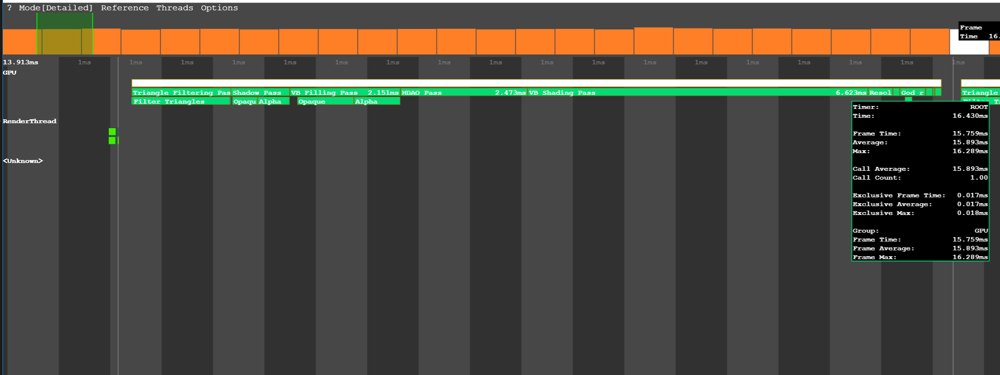

Visibility Buffer on PC Windows 10
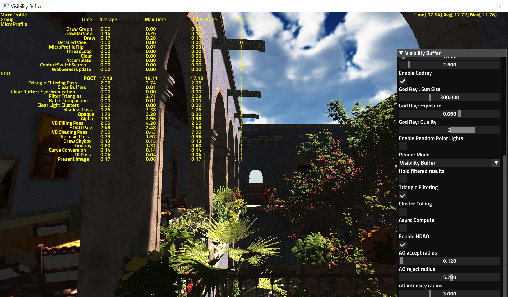

Linux Ubuntu
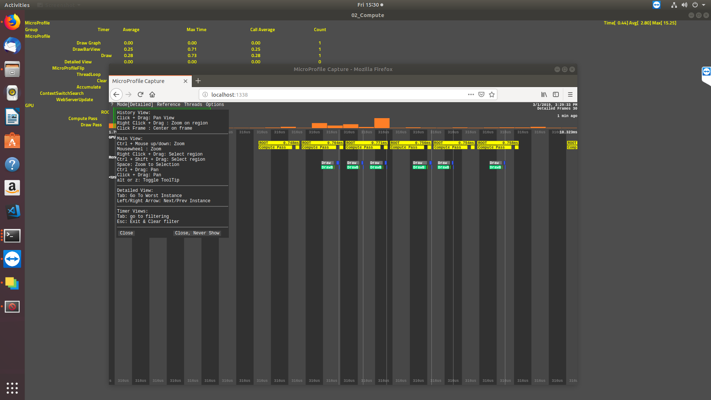

- Better integration of Ray Tracing into the renderer; still Vulkan RTX is work in progress
- Fixed Vulkan instance extension bug: "InstanceLayers loop is wrong in CreateInstance" issue #92


See the release notes from previous releases in the [Release section](https://github.com/ConfettiFX/The-Forge/releases).

  
# PC Windows Requirements:

1. Windows 10 RS5 with latest update for DXR support


2. Drivers
* AMD / NVIDIA - latest drivers 
* Intel - need to install the latest driver (currently Version: 25.20.100.6326, October 9th, 2018) [Intel® Graphics Driver for Windows® 10](https://downloadcenter.intel.com/download/28240/Intel-Graphics-Driver-for-Windows-10?product=80939). As mentioned before this driver still doesn't have full DirectX 12 and Vulkan support.


3. Visual Studio 2017 with Windows SDK / DirectX version 17763.132 
https://developer.microsoft.com/en-us/windows/downloads/sdk-archive

4. Vulkan [1.1.101.0](https://vulkan.lunarg.com/sdk/home)

6. The Forge is currently tested on 
* AMD 5x, VEGA GPUs (various)
* NVIDIA GeForce 9x, 10x. 20x GPUs (various)
* Intel Skull Canyon


# macOS Requirements:

1. macOS Mojave 10.14.4 beta (18E174f)

2. Xcode 10.2 beta (10P82s)

3. The Forge is currently tested on the following macOS devices:
* iMac with AMD RADEON 560 (Part No. MNDY2xx/A)
* iMac with AMD RADEON 580 (Part No. MNED2xx/A)
* MacBook Pro 13 inch (MacBookPro13,2) 
* Macbook Pro 13 inch (MacbookPro14,2)

In the moment we do not have access to an iMac Pro or Mac Pro. We can test those either with Team Viewer access or by getting them into the office and integrating them into our build system.
We will not test any Hackintosh configuration. 


# iOS Requirements:

1. iOS 12.2 beta (16E5181f)

2. XCode: see macOS

To run the unit tests, The Forge requires an iOS device with an A9 or higher CPU (see [GPU Processors](https://developer.apple.com/library/content/documentation/DeviceInformation/Reference/iOSDeviceCompatibility/HardwareGPUInformation/HardwareGPUInformation.html) or see iOS_Family in this table [iOS_GPUFamily3_v3](https://developer.apple.com/metal/Metal-Feature-Set-Tables.pdf)). This is required to support the hardware tessellation unit test and the ExecuteIndirect unit test (requires indirect buffer support). The Visibility Buffer doesn't run on current iOS devices because the [texture argument buffer](https://developer.apple.com/documentation/metal/fundamental_components/gpu_resources/understanding_argument_buffers) on those devices is limited to 31 (see [Metal Feature Set Table](https://developer.apple.com/metal/Metal-Feature-Set-Tables.pdf) and look for the entry "Maximum number of entries in the texture argument table, per graphics or compute function") , while on macOS it is 128, which we need for the bindless texture array. 

We are currently testing on 
* iPhone 7 (Model A1778)
* iPad (Model A1893)
* iPhone Xs Max (Model MT5D2LL/A)


# PC Linux Requirements:

1. [Ubuntu 18.04 LTS](https://www.ubuntu.com/download/desktop) Kernel Version: 4.15.0-20-generic

2. GPU Drivers:
* [AMDGpu-Pro 18.30-641594](https://www.amd.com/en/support/graphics/radeon-500-series/radeon-rx-500-series/radeon-rx-580)
* [NVIDIA Linux x86_64/AMD64/EM64T 418.56](http://www.nvidia.com/object/unix.html) You can update using the command line too https://tecadmin.net/install-latest-nvidia-drivers-ubuntu/

3. Workspace file is provided for [codelite 12.0.6](https://codelite.org/)

4. Vulkan SDK Version: download the native Ubuntu Linux package for all the elements of the Vulkan SDK [LunarG Vulkan SDK Packages for Ubuntu 16.04 and 18.04](https://packages.lunarg.com/)

5. The Forge is currently tested on Ubuntu with the following GPUs:
 * AMD RADEON RX 480
 * AMD RADEON VEGA 56
 * NVIDIA GeForce 2070 RTX


# Android Requirements:

1. Android Phone with Android Pie (9.x) for Vulkan 1.1 support

2. Android Studio with API level 28 and follow the instructions

3. We are currently testing on 
* [Essential Phone](https://en.wikipedia.org/wiki/Essential_Phone) with Android 9.0 - Build PPR1.181005.034

In the moment we only support the first two unit tests. We are waiting for devkits with more stable drivers before we bring over the other unit tests. The Essential phone uses an Adreno 540 GPU. Please check out [Vulkan Gpuinfo.org](http://vulkan.gpuinfo.org/) for the supported feature list of this GPU with Android 9.0.


# Install 
 * For PC Windows run PRE_BUILD.bat. It will download and unzip the art assets and install the shader builder extension for Visual Studio 2017.
 * For Linux and Mac run PRE_BUILD.command. If its the first time checking out the forge make sure the PRE_BUILD.command has the correct executable flag by running the following command
  chmod +x PRE_BUILD.command
  
    It will only download and unzip required Art Assets (No plugins/extensions install). 

# Unit Tests
There are the following unit tests in The Forge:

## 1. Transformation

This unit test just shows a simple solar system. It is our "3D game Hello World" setup for cross-platform rendering.


## 2. Compute

This unit test shows a Julia 4D fractal running in a compute shader. In the future this test will use several compute queues at once.


## 3. Multi-Threaded Rendering

This unit test shows how to generate a large number of command buffers on all platforms supported by The Forge. This unit test is based on [a demo by Intel called Stardust](https://software.intel.com/en-us/articles/using-vulkan-graphics-api-to-render-a-cloud-of-animated-particles-in-stardust-application).


## 4. ExecuteIndirect

This unit test shows the difference in speed between Instanced Rendering, using ExecuteIndirect with CPU update of the indirect argument buffers and using ExecuteIndirect with GPU update of the indirect argument buffers.
This unit test is based on [the Asteroids example by Intel](https://software.intel.com/en-us/articles/asteroids-and-directx-12-performance-and-power-savings).


Using ExecuteIndirect with GPU updates for the indirect argument buffers


Using ExecuteIndirect with CPU updates for the indirect argument buffers


Using Instanced Rendering

## 5. Font Rendering

This unit test shows the current state of our font rendering library that is based on several open-source libraries.

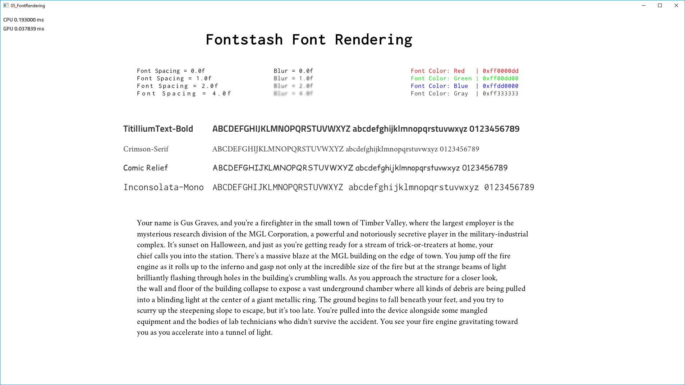

## 6. Material Playground

This unit test shows a range of game related materials:

Hair:


Metal:


Wood:


## 7. Hardware Tessellation

This unit test showcases the rendering of grass with the help of hardware tessellation.


## 8. Procedural 
In the spirit of the shadertoy examples this unit test shows a procedurally generated planet.

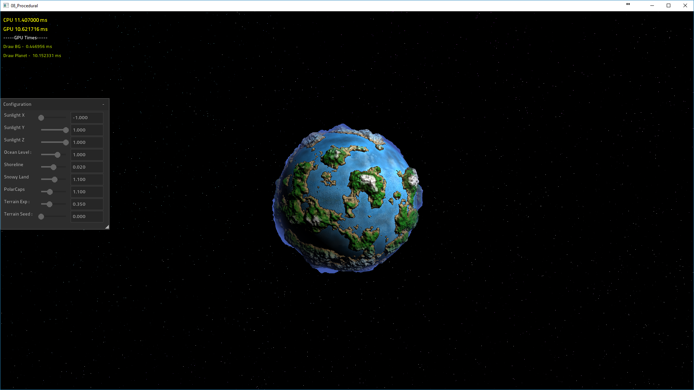

## 9. Light and Shadow Playground
This unit test shows various shadow and lighting techniques that can be chosen from a drop down menu. There will be more in the future.

iMac with AMD RADEON 580 (Part No. MNED2xxA) with resolution of 5120x2880:
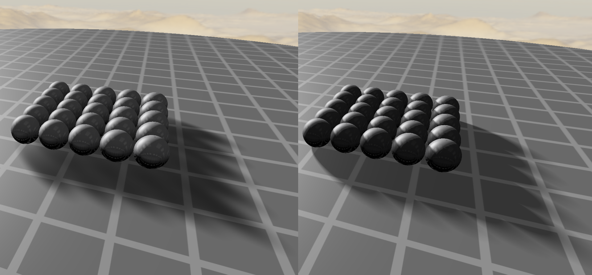

iPhone 7 iOS 12.1.4 (16D57) with a resolution of 1334x750:
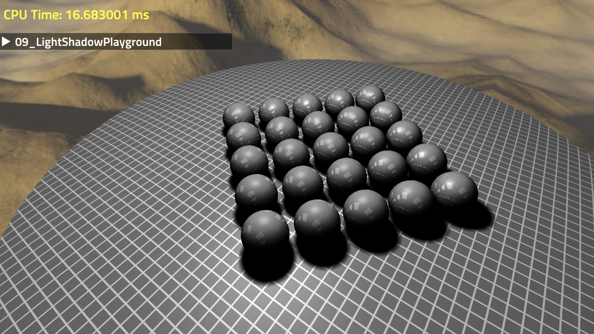

Linux Ubuntu 18.04.1 LTS Vulkan 1.1.92 RADEON 480 Driver 18.30 with a resolution of 1920x1080:
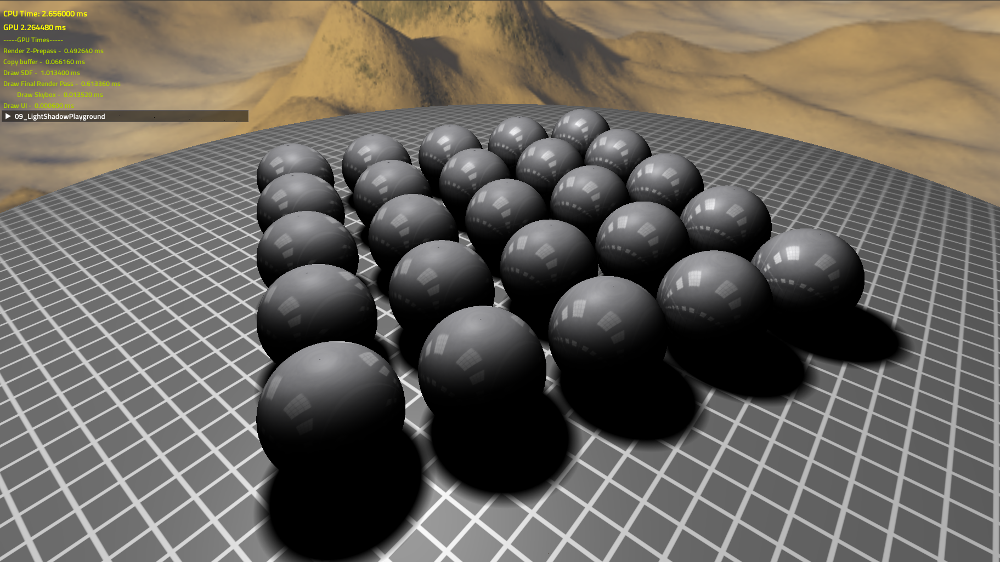

## 9a. Hybrid Ray-Traced Shadows
This unit test was build by Kostas Anagnostou @KostasAAA to show how to ray trace shadows without using a ray tracing API like DXR / RTX. It should run on all GPUs (not just NVIDIA RTX GPUs) and the expectation is that it should run comparable with a DXR / RTX based version even on a NVIDIA RTX GPU. That means the users of your game do not have to buy a NVIDIA RTX GPU to enjoy HRT shadows :-)


## 10. Pixel-Projected Reflections
This unit test shows reflections that are ray traced. It is an implementation of the papers [Optimized pixel-projected reflections for planar reflectors](http://advances.realtimerendering.com/s2017/PixelProjectedReflectionsAC_v_1.92.pdf) and [IMPLEMENTATION OF OPTIMIZED PIXEL-PROJECTED REFLECTIONS FOR PLANAR REFLECTORS](https://github.com/byumjin/Jin-Engine-2.1/blob/master/%5BByumjin%20Kim%5D%20Master%20Thesis_Final.pdf)


## 11. Multi-GPU (Driver support only on PC Windows)
This unit test shows a typical VR Multi-GPU configuration. One eye is rendered by one GPU and the other eye by the other one.


## 12. The Forge switching between Vulkan and DirectX 12 during Run-time (Windows PC-only)
This unit test shows how to switch between the Vulkan and DirectX 12 graphics API during run-time. 

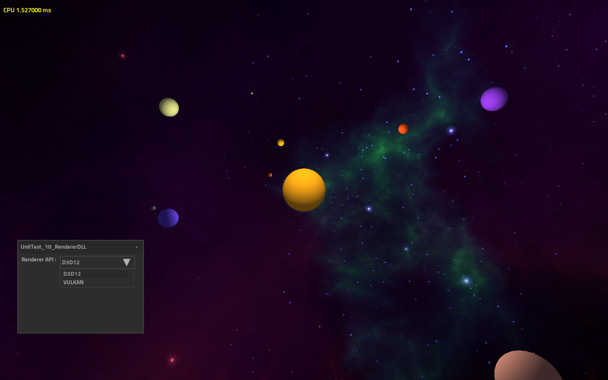

## 13. imGUI integration unit test
This unit test shows how the integration of imGui with a wide range of functionality.

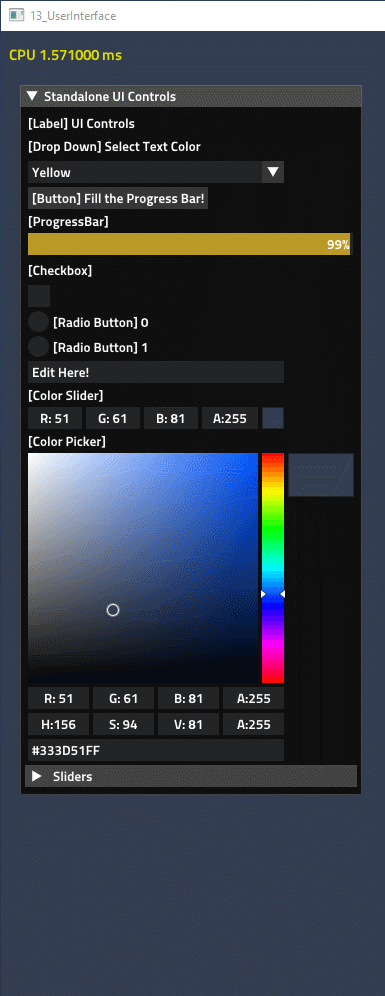


## 14. Order-Independent Transparency unit test
This unit test compares various Order-Indpendent Transparency Methods. In the moment it shows:
- Alpha blended transparency
- Weighted blended Order Independent Transparency (Morgan McGuire Blog Entry 2014)[http://casual-effects.blogspot.com/2014/03/weighted-blended-order-independent.html] and (Morgan McGuire Blog Entry 2015)[http://casual-effects.blogspot.com/2015/03/implemented-weighted-blended-order.html]
- Weighted blended Order Independent Transparency by Volition (GDC 2018 Talk)[https://www.gdcvault.com/play/1025400/Rendering-Technology-in-Agents-of]
- Adaptive Order Independent Transparency with Raster Order Views (paper by Intel, supports DirectX 11, 12 only)[https://software.intel.com/en-us/articles/oit-approximation-with-pixel-synchronization-update-2014], and a (Primer)[https://software.intel.com/en-us/gamedev/articles/rasterizer-order-views-101-a-primer]
- Phenomenological Transparency - Diffusion, Refraction, Shadows by (Morgan McGuire)[https://casual-effects.com/research/McGuire2017Transparency/McGuire2017Transparency.pdf]


## 15. Wave Intrinsics unit test
This unit test shows how to use the new wave intrinsics. Supporting Windows with DirectX 12 / Vulkan, Linux with Vulkan and macOS / iOS.


## 16. Ray Tracing Unit Test
Ray Tracing API unit test, showing how the cross-platfrom Ray Tracing Interface running on Windows, Ubuntu with Vulkan RTX, macOS and iOS

PC Windows 10 RS5, DirectX12, GeForce RTX 2070, Driver version 418.81 1080p:


PC Ubuntu Vulkan RTX, GeForce RTX 2070, Driver Version 418.56 1080p


Mac Mini with Intel Core i5 3GHz cpu with integrated graphics Intel UHD Graphics 630 (Part No. MRTT2RU/A) with resolution 3440x1440:


iPad 6th Generation iOS 12.1.3 (16D39) with a resolution of 2048x1536


## 16a. Sphere Tracing
This unit test was originally posted on ShaderToy by Inigo Quilez (https://www.shadertoy.com/view/Xds3zN and https://sopyer.github.io/b/post/vulkan-shader-sample/). It shows how a scene is ray marched with shadows, reflections and AO

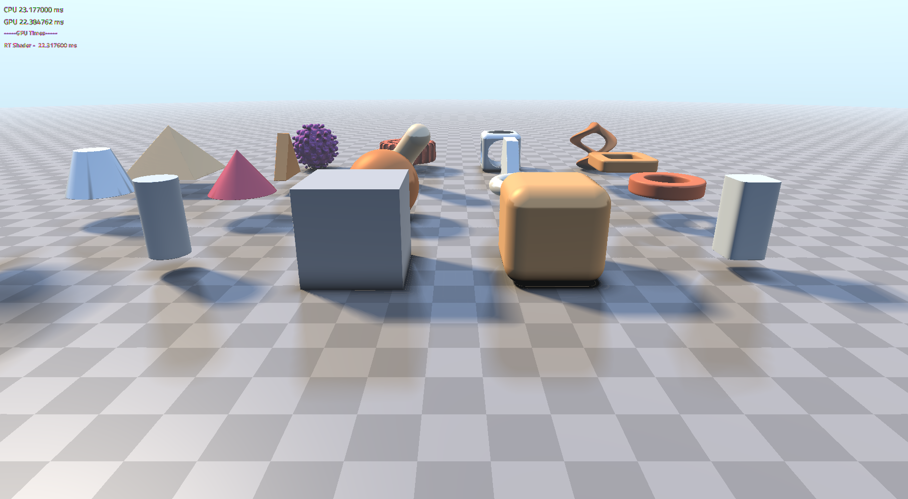

## 17. ENTT - Entity Component System Test
This unit test shows how to use a high-performance entity component system in The Forge.


## 18. Ozz Playback Animation
This unit test shows how to playback a clip on a rig.

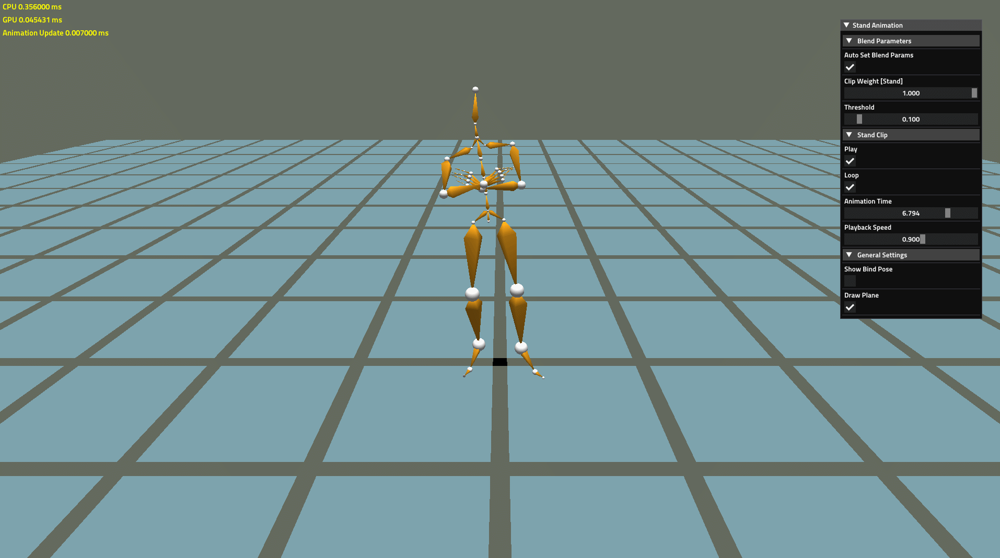

## 19. Ozz Playback Blending
This unit test shows how to blend multiple clips and play them back on a rig.

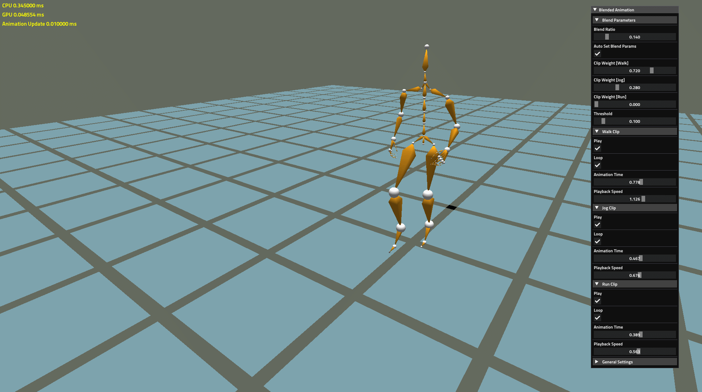

## 20. Ozz Joint Attachment
This unit test shows how to attach an object to a rig which is being posed by an animation.

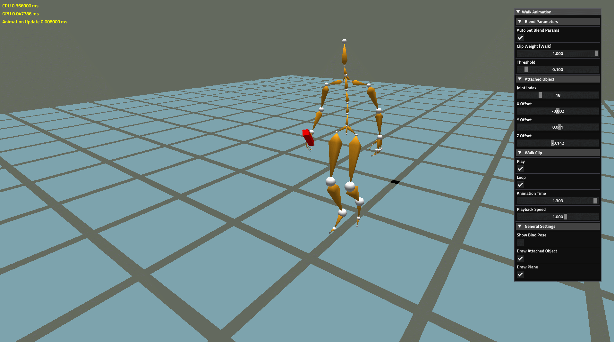

## 21. Ozz Partial Blending
This unit test shows how to blend clips having each only effect a certain portion of joints.

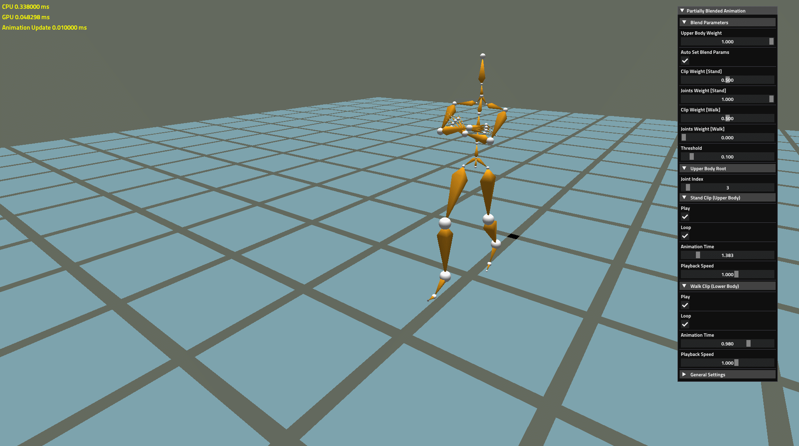

## 22. Ozz Additive Blending
This unit test shows how to introduce an additive clip onto another clip and play the result on a rig.

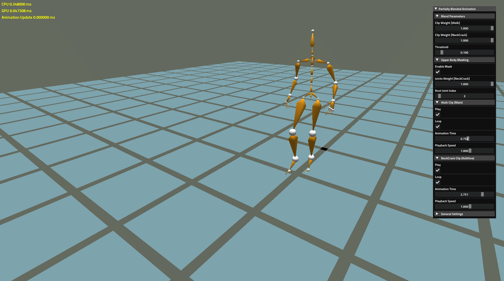

## 23. Ozz Baked Physics
This unit test shows how to use a scene of a physics interaction that has been baked into an animation and play it back on a rig.


## 24. Ozz Multi Threading
This unit test shows how to animate multiple rigs simultaneously while using multi-threading for the animation updates.


## 25. Ozz Skinning
This unit test shows how to use skinning with Ozz


# Examples
There is an example implementation of the Triangle Visibility Buffer as covered in various conference talks. [Here](https://diaryofagraphicsprogrammer.blogspot.com/2018/03/triangle-visibility-buffer.html) is a blog entry that details the implementation in The Forge.


# Releases / Maintenance
Confetti will prepare releases when all the platforms are stable and running and push them to this GitHub repository. Up until a release, development will happen on internal servers. This is to sync up the console, mobile, macOS and PC versions of the source code.

# Products
We would appreciate it if you could send us a link in case your product uses The Forge. Here are the ones we received so far:

## StarVR One SDK
The Forge is used to build the StarVR One SDK:

<a href="https://www.starvr.com" target="_blank"></a>

## Torque 3D
The Forge is used as the rendering framework in Torque 3D:

<a href="http://www.garagegames.com/products/torque-3d" target="_blank"></a>


# Open-Source Libraries
The Forge utilizes the following Open-Source libraries:
* [Assimp](https://github.com/assimp/assimp)
* [Bullet Physics](https://github.com/bulletphysics)
* [Fontstash](https://github.com/memononen/fontstash)
* [Vectormath](https://github.com/glampert/vectormath)
* [Nothings](https://github.com/nothings/stb) single file libs 
  * [stb.h](https://github.com/nothings/stb/blob/master/stb.h)
  * [stb_image.h](https://github.com/nothings/stb/blob/master/stb_image.h)
  * [stb_image_resize.h](https://github.com/nothings/stb/blob/master/stb_image_resize.h)
  * [stb_image_write.h](https://github.com/nothings/stb/blob/master/stb_image_write.h)
* [shaderc](https://github.com/google/shaderc)
* [SPIRV_Cross](https://github.com/KhronosGroup/SPIRV-Cross)
* [TinyEXR](https://github.com/syoyo/tinyexr)
* [TinySTL](https://github.com/mendsley/tinystl)
* [Vulkan Memory Allocator](https://github.com/GPUOpen-LibrariesAndSDKs/VulkanMemoryAllocator)
* [GeometryFX](https://gpuopen.com/gaming-product/geometryfx/)
* [WinPixEventRuntime](https://blogs.msdn.microsoft.com/pix/winpixeventruntime/)
* [Fluid Studios Memory Manager](http://www.paulnettle.com/)
* [volk Metaloader for Vulkan](https://github.com/zeux/volk)
* [gainput](https://github.com/jkuhlmann/gainput)
* [Shader Playground](https://github.com/tgjones/shader-playground)
* [hlslparser](https://github.com/Thekla/hlslparser)
* [imGui](https://github.com/ocornut/imgui)
* [DirectX Shader Compiler](https://github.com/Microsoft/DirectXShaderCompiler)
* [Ozz Animation System](https://github.com/guillaumeblanc/ozz-animation)
* [ENTT](https://github.com/skypjack/entt)
* [Lua Scripting System](https://www.lua.org/)
* [TressFX](https://github.com/GPUOpen-Effects/TressFX)
* [Micro Profiler](https://github.com/zeux/microprofile)

