The Forge is a cross-platform rendering framework supporting
- PC 
  * Windows 10 
     * with DirectX 12 / Vulkan 1.1
     * with DirectX Ray Tracing API
     * DirectX 11 Fallback Layer for Windows 7 support (not extensively tested)
  * Linux Ubuntu 18.04 LTS with Vulkan 1.1 and RTX Ray Tracing API
- Android Pie with Vulkan 1.1
- macOS / iOS / iPad OS with Metal 2.2
- XBOX One / XBOX One X (only available for accredited developers on request)
- PS4 / PS4 Pro (only available for accredited developers on request)
- PS5 (in development) (only available for accredited developers on request)
- Switch (only available for accredited developers on request)
- Google Stadia (in development) (only available for accredited developers on request)

Particularly, the graphics layer of The Forge supports cross-platform
- Descriptor management. A description is on this [Wikipage](https://github.com/ConfettiFX/The-Forge/wiki/Descriptor-Management)
- Multi-threaded and asynchronous resource loading
- Shader reflection
- Multi-threaded command buffer generation

The Forge can be used to provide the rendering layer for custom next-gen game engines. It is also meant to provide building blocks to write your own game engine. It is like a "lego" set that allows you to use pieces to build a game engine quickly. The "lego" High-Level Features supported on all platforms are at the moment:
- Resource Loader as shown in 10_PixelProjectedReflections, capable to load textures, buffers and geometry data asynchronously
- [Lua Scripting System](https://www.lua.org/) - currently used in 06_Playground to load models and textures and animate the camera
- Animation System based on [Ozz Animation System](https://github.com/guillaumeblanc/ozz-animation)
- Consistent Math Library  based on an extended version of [Vectormath](https://github.com/glampert/vectormath) with NEON intrinsics for mobile platforms
- Extended version of [EASTL](https://github.com/electronicarts/EASTL/)
- Consistent Memory Managament: 
  * on GPU following [Vulkan Memory Allocator](https://github.com/GPUOpen-LibrariesAndSDKs/VulkanMemoryAllocator)
  * on CPU [Fluid Studios Memory Manager](http://www.paulnettle.com/)
- Input system with Gestures for Touch devices based on an extended version of [gainput](https://github.com/jkuhlmann/gainput)
- Fast Entity Component System based on our internally developed ECS
- Cross-platform FileSystem C API, supporting disk-based files, memory streams, and files in zip archives
- UI system based on [imGui](https://github.com/ocornut/imgui) with a dedicated unit test extended for touch input devices
- Audio based on integrating [SoLoud](https://github.com/jarikomppa/soloud)
- Shader Translator using a superset of HLSL as the shader language. There is a Wiki page on [how to use the Shader Translator](https://github.com/ConfettiFX/The-Forge/wiki/How-to-Use-The-Shader-Translator)
- Various implementations of high-end Graphics Effects as shown in the unit tests below

Please find a link and credits for all open-source packages used at the end of this readme.

<a href="https://discord.gg/hJS54bz" target="_blank"> Join the Discord channel at https://discord.gg/hJS54bz</a>

<a href="https://twitter.com/TheForge_FX?lang=en" target="_blank"> Join the channel at https://twitter.com/TheForge_FX?lang=en</a>

The Forge Interactive Inc. is a [Khronos member](https://www.khronos.org/members/list)
 

# Build Status 

* Windows [](https://ci.appveyor.com/project/wolfgangfengel/the-forge/branch/master)
* macOS [](https://travis-ci.org/ConfettiFX/The-Forge)

# News

## Release 1.41 - March 5th, 2020 - Path Tracing Benchmark | CPU Cacheline alignment | Improved Profiler | D3D12 Memory Allocator
* Based on request we are providing a Path Tracing Benchmark in 16_RayTracing. It allows you to compare the performance of three platforms: 
  * Windows with DirectX 12 DXR
  * Windows with Vulkan RTX
  * Linux with Vulkan RTX

  We believe that every benchmarking tool should be open-source, so that everyone can see what the source code is doing. We will extend this benchmark to the non-public platforms we support to compare the PC performance with console performance. 
  The benchmark comes with batch files for all three platforms. Each run generates a HTML output file from the microprofiler that is integrated in TF. The default number of iterations is 64 but you can adjust that.  There is a Readme file in the 16_RayTracing folder that describes the options.

Windows DirectX 12 DXR, GeForce RTX 2070 Super, 3840x1600, NVIDIA Driver 441.99

 

Windows Vulkan RTX, GeForce RTX 2070 Super, 3840x1600, NVIDIA Driver 441.99

 

Linux Vulkan RTX, Geforce RTX 2060, 1920x1080, NVIDIA Driver 435.21

 

We will adjust the output of the benchmark to what users request.

* With this release we also aligned the whole renderer interface better to 64 byte CPU cache lines. We trimmed down all the structs substantially and removed many. This is a breaking change for the renderer interface and a major change to the whole code base.
* DirectX 12
  * [D3D12 Memory Allocator](https://github.com/GPUOpen-LibrariesAndSDKs/D3D12MemoryAllocator): we are using now AMD's D3D12 memory allocator for DirectX after having used the Vulkan equivalent for more than two years. We also extended it to support Multi-GPU.
  * We upgraded to the latest dxgi factory interface in DirectX 12
* Microprofiler: because we need the microprofiler to offer the QA department help in reporting performance problems for some of the games that will be shipping with TF (and the benchmark mentioned above), we did another pass on its functionality and ease of use, especially on console platforms. The idea is that QA can quickly and easily store a screenshot or HTML file in a bug report. This is still work in progress and with every shipping game will probably be improved.
* Now that GDC 2020 was postponed, we will also postpone our GDC related activities. The user meeting and our GDC talk will be postponed until the next GDC happens. If there is a need we can also do a user meeting in an online conference room or in Discord in a private area. Let us know.
* Renamed CustomMiddleware to Custom-Middleware back ...


## Release 1.40 - February 20th, 2020 - Resource Loader | glTF as Geometry Container | GDC Talk | User Group Meeting
This release took much longer than expected ... :-) 
* We are going to give a talk at GDC during the GPU Summit day. It will cover our skydome system Ephemeris 2: [GDC 2020 Ephemeris](https://twitter.com/TheForge_FX/status/1227728118883860480)
* We will also have a user group meeting during GDC: [The Forge User Group](https://twitter.com/TheForge_FX/status/1229478866621583361)
* A new resource loader can now stream textures, buffers and additionally geometry (extracted from glTF) asynchronously. We replaced assimp with this loader to save compile time and space on GitHub. We still use assimp for our internal tools. Here are the underlying design principles of the resource loader:
  * Generally glTF is just a geometry container for us. We do not apply any of the underlying principles like material or mesh or scene management that it offers because they are not tailored to our needs. The resource loader only loads a glTF file, extract its geometry and stores this data (including hair and ozz animation system data) in a vertex and index buffer stream.
  * All texture loading and material loading is the responsibility of the app. Scene partitioning or material support is not used from glTF. Those remain on the App level. Each app has its own lighting and material models and it shouldn't be restricted to the very limiting architecture of glTF
  * There is no glTF code in any of the unit tests or app examples with the exception of the glTF viewer. The resource loader loads geometry just with a addResource call as it loads textures and buffers ... it can generate a vertex and index buffer stream with offset values for draw calls or for ExecuteIndirect ...
* All model art assets were converted to glTF
* libzip was replaced with [zip](https://github.com/kuba--/zip) because it is easier to maintain.
* Console support: at the end of last year before our three week break, we made the PS4 and Switch run-times ready to ship games (we will see first games shipping this year). We also started on the PS5 and XBOX One Series X support. You need to be an acredited developer to receive the source code for any consoles. We will be asking the console owner for permission before we would provide you with any source code. That means you have to be part of their developer program.
* Improved Windows 7 support: one of the games TF is launching with requires Windows 7 support. This means we are now testing the Windows 7 run-time more rigourously and committed fixes with this release
* Math library: added missing vec2 functions
* Updated copyright statement
* Resolved issues on GitHub:
  * issue 162 - 13_UserInterface - Crash
  * issue 161 - 18_VirtualTexture breaks with dx and vk: only fairly decent cards support virtual textures. We added tracking support in the *.cfg system and throw an error message when the GPU doesn't support the feature.
  * issue 124 - Missing KeyKpAdd mapping

## Release 1.39 - November 26th - Sparse Virtual Texture Support | Stormland
The Forge has now support for Sparse Virtual Textures on Windows and Linux with DirectX 12 / Vulkan. Sparse texture (also known as "virtual texture", “tiled texture”, or “mega-texture”) is a technique to load huge size (such as 16k x 16k or more) textures in GPU memory.
It breaks an original texture down into small square or rectangular tiles to load only visible part of them.

The unit test 18_Virtual_Texture is using 7 sparse textures:
* Mercury: 8192 x 4096
* Venus: 8192 x 4096
* Earth: 8192 x 4096
* Moon: 16384 x 8192
* Mars: 8192 x 4096
* Jupiter: 4096 x 2048
* Saturn: 4096 x 4096

There is a unit test that shows a solar system where you can approach planets with Sparse Virtual Textures attached and the resolution of the texture will increase when you approach.

Linux 1080p NVIDIA RTX 2060 Vulkan Driver version 435

 

Windows 10 1080p AMD RX550 DirectX 12 Driver number: Adrenaline software 19.10.1

 

Windows 10 1080p NVIDIA 1080 Vulkan Driver number: 418.81

 

 


Ephemeris 2 - the game Stormland from Insomniac was released. This game is using a custom version of Ephemeris 2. We worked for more than six months on this project.

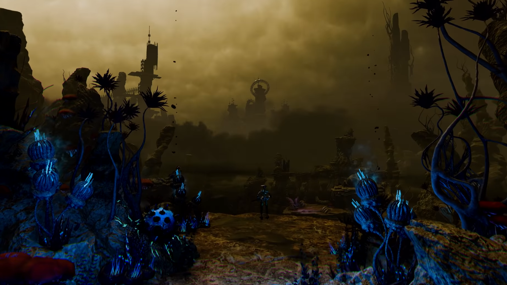 

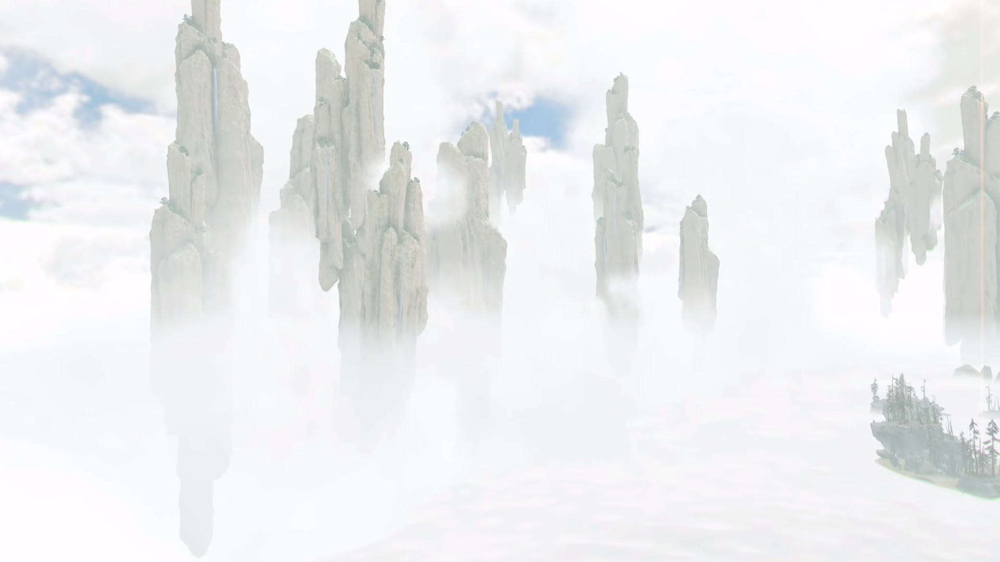 

 

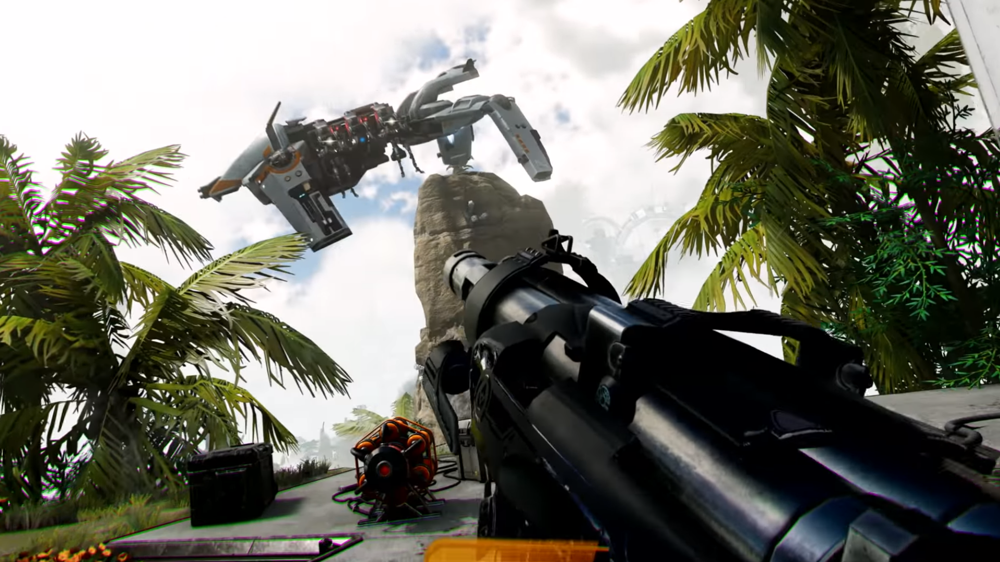 

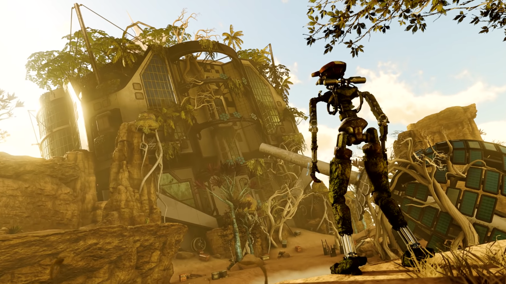 

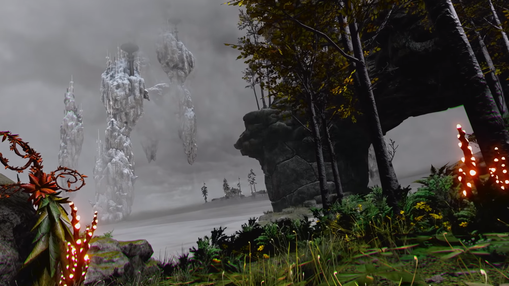 

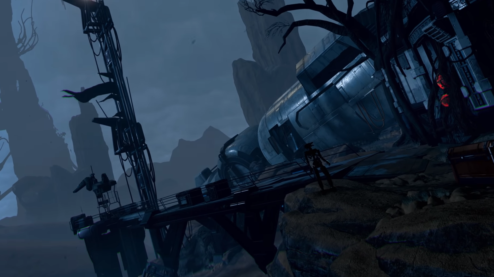 

Head over to [Custom Middleware](https://github.com/ConfettiFX/Custom-Middleware) to check out the source code.


See the release notes from previous releases in the [Release section](https://github.com/ConfettiFX/The-Forge/releases).

  
# PC Windows Requirements:

1. Windows 10 

2. Drivers
* AMD / NVIDIA / Intel - latest drivers 

3. Visual Studio 2017 with Windows SDK / DirectX version 17763.132 (you need to get it via the Visual Studio Intaller)
https://developer.microsoft.com/en-us/windows/downloads/sdk-archive

4. The Forge supports now as the min spec for the Vulkan SDK 1.1.82.0 and as the max spec  [1.1.114](https://vulkan.lunarg.com/sdk/home)

6. The Forge is currently tested on 
* AMD 5x, VEGA GPUs (various)
* NVIDIA GeForce 9x, 10x. 20x GPUs (various)
* Intel Skull Canyon


# macOS Requirements:

1. macOS 10.15 beta 8 (19A558d)

2. Xcode 11.0 (11A419c)

3. The Forge is currently tested on the following macOS devices:
* iMac with AMD RADEON 560 (Part No. MNDY2xx/A)
* iMac with AMD RADEON 580 (Part No. MNED2xx/A)
* MacBook Pro 13 inch (MacBookPro13,2) 
* Macbook Pro 13 inch (MacbookPro14,2)

In the moment we do not have access to an iMac Pro or Mac Pro. We can test those either with Team Viewer access or by getting them into the office and integrating them into our build system.
We will not test any Hackintosh configuration. 


# iOS Requirements:

1. iOS 13.1 beta 3 (17A5837a)

2. XCode: see macOS

To run the unit tests, The Forge requires an iOS device with an A9 or higher CPU (see [GPU Processors](https://developer.apple.com/library/content/documentation/DeviceInformation/Reference/iOSDeviceCompatibility/HardwareGPUInformation/HardwareGPUInformation.html) or see iOS_Family in this table [iOS_GPUFamily3_v3](https://developer.apple.com/metal/Metal-Feature-Set-Tables.pdf)). This is required to support the hardware tessellation unit test and the ExecuteIndirect unit test (requires indirect buffer support). The Visibility Buffer doesn't run on current iOS devices because the [texture argument buffer](https://developer.apple.com/documentation/metal/fundamental_components/gpu_resources/understanding_argument_buffers) on those devices is limited to 31 (see [Metal Feature Set Table](https://developer.apple.com/metal/Metal-Feature-Set-Tables.pdf) and look for the entry "Maximum number of entries in the texture argument table, per graphics or compute function") , while on macOS it is 128, which we need for the bindless texture array. 

We are currently testing on 
* iPhone 7 (Model A1778)
* iPhone Xs Max (Model MT5D2LL/A)


# iPad OS Requirements:

1. iPadOS 13.1 beta 3 (17A5837a)

2. XCode: see macOS

We are currently testing on:
* iPad (Model A1893)


# PC Linux Requirements:

1. [Ubuntu 18.04 LTS](https://www.ubuntu.com/download/desktop) Kernel Version: 4.15.0-20-generic

2. GPU Drivers:
  * AMD GPUs: we are testing on the [Mesa RADV driver](https://launchpad.net/~paulo-miguel-dias/+archive/ubuntu/pkppa/)
  * NVIDIA GPUs: we are testing with the [NVIDIA driver](http://www.nvidia.com/object/unix.html)

3. Workspace file is provided for [codelite 12.0.6](https://codelite.org/)

4. Vulkan SDK Version 1.1.101: download the native Ubuntu Linux package for all the elements of the Vulkan SDK [LunarG Vulkan SDK Packages for Ubuntu 16.04 and 18.04](https://packages.lunarg.com/)


5. The Forge is currently tested on Ubuntu with the following GPUs:
 * AMD RADEON RX 480
 * AMD RADEON VEGA 56
 * NVIDIA GeForce 2070 RTX


# Android Requirements:

1. Android Phone with Android Pie (9.x) for Vulkan 1.1 support

2. Visual Studio 2017 with support for Android API level 28

At the moment, the Android run-time does not support the following unit tests due to -what we consider- driver bugs:
* 04_ExecuteIndirect
* 07_Tesselation 
* 08_Procedural
* 09a_HybridRayTracing
* 10_PixelProjectedReflections
* 12_RendererRuntimeSwitch
* 14_WaveIntrinsics
* 15_Transparency 
* 16_RayTracing 
* 16a_SphereTracing
* Visibility Buffer 

3. We are currently testing on 
* [Samsung S10 Galaxy (Qualcomm Adreno 640 Graphics Cardv(Vulkan 1.1.87))](https://www.samsung.com/us/mobile/galaxy-s10/) with Android 9.0. Please note this is the version with the Qualcomm based chipset.
* [Essential Phone](https://en.wikipedia.org/wiki/Essential_Phone) with Android 9.0 - Build PPR1.181005.034


# Install 
 * For PC Windows run PRE_BUILD.bat. It will download and unzip the art assets and install the shader builder extension for Visual Studio 2017.
 * For Linux and Mac run PRE_BUILD.command. If its the first time checking out the forge make sure the PRE_BUILD.command has the correct executable flag by running the following command
  chmod +x PRE_BUILD.command
  
    It will only download and unzip required Art Assets (No plugins/extensions install). 

# Unit Tests
There are the following unit tests in The Forge:

## 1. Transformation

This unit test just shows a simple solar system. It is our "3D game Hello World" setup for cross-platform rendering.


## 2. Compute

This unit test shows a Julia 4D fractal running in a compute shader. In the future this test will use several compute queues at once.


## 3. Multi-Threaded Rendering

This unit test shows how to generate a large number of command buffers on all platforms supported by The Forge. This unit test is based on [a demo by Intel called Stardust](https://software.intel.com/en-us/articles/using-vulkan-graphics-api-to-render-a-cloud-of-animated-particles-in-stardust-application).


## 4. ExecuteIndirect

This unit test shows the difference in speed between Instanced Rendering, using ExecuteIndirect with CPU update of the indirect argument buffers and using ExecuteIndirect with GPU update of the indirect argument buffers.
This unit test is based on [the Asteroids example by Intel](https://software.intel.com/en-us/articles/asteroids-and-directx-12-performance-and-power-savings).


Using ExecuteIndirect with GPU updates for the indirect argument buffers


Using ExecuteIndirect with CPU updates for the indirect argument buffers


Using Instanced Rendering

## 5. Font Rendering

This unit test shows the current state of our font rendering library that is based on several open-source libraries.


## 6. Material Playground

This unit test shows a range of game related materials:

Hair:
Many years ago in 2012 / 2013, we helped AMD and Crystal Dynamics with the development of TressFX for Tomb Raider. We also wrote an article about the implementation in GPU Pro 5 and gave a few joint presentations on conferences like FMX. At the end of last year we revisited TressFX. We took the current code in the GitHub repository, changed it a bit and ported it to The Forge. It now runs on PC with DirectX 12 / Vulkan, macOS and iOS with Metal 2 and on the XBOX One. We also created a few new hair assets so that we can showcase it. Here is a screenshot of our programmer art:


Metal:


Wood:


## 7. Hardware Tessellation

This unit test showcases the rendering of grass with the help of hardware tessellation.


## 8. glTF Model Viewer
A cross-platform glTF model viewer that optimizes the vertex and index layout for the underlying platform and picks the right texture format for the underlying platform. We integrated Arseny Kapoulkine @zeuxcg excellent [meshoptimizer](https://github.com/zeux/meshoptimizer) and use the same PBR as used in the Material Playground unit test.
This modelviewer can also utilize Binomials [Basis Universal Texture Support](https://github.com/binomialLLC/basis_universal) as an option to load textures. Support was added to the Image class as a "new image format". So you can pick basis like you can pick DDS or KTX. For iOS / Android we go directly to ASTC because Basis doesn't support ASTC at the moment.

glTF model viewer running on iPad with 2048x1536 resolution

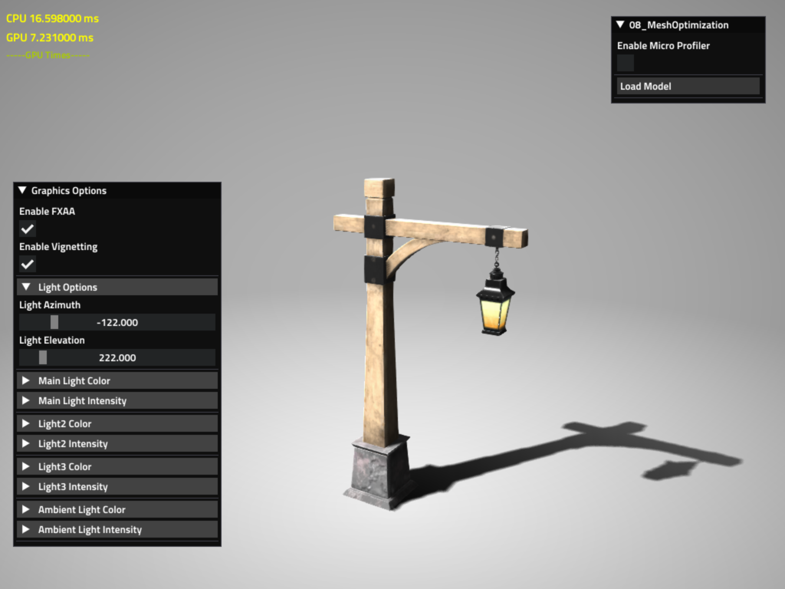

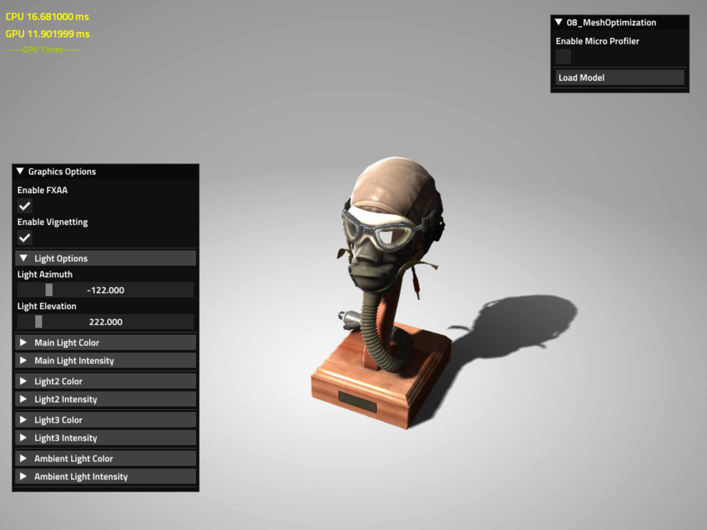

glTF model viewer running on Samsung Galaxy S10 with Vulkan with 1995x945 resolution

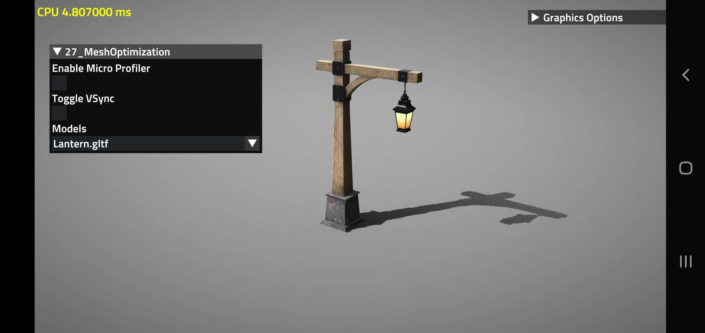


glTF model viewer running on Ubuntu AMD RX 480 with Vulkan with 1920x1080 resolution

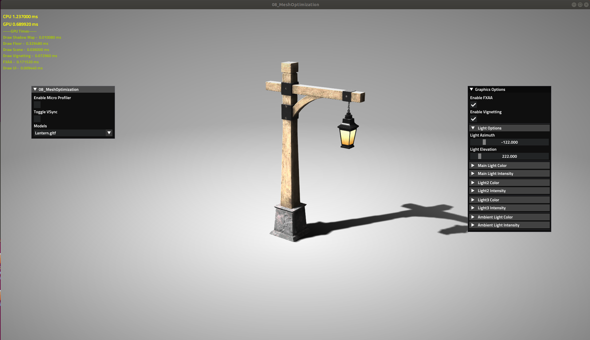

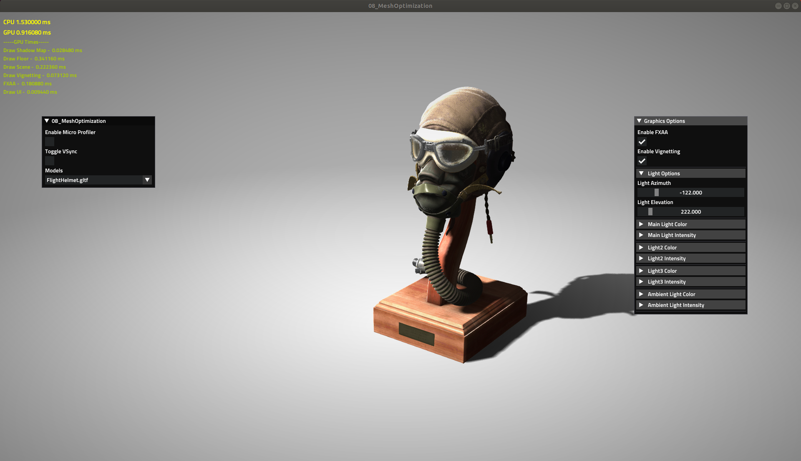

## 9. Light and Shadow Playground
This unit test shows various shadow and lighting techniques that can be chosen from a drop down menu. There will be more in the future.

 * Exponential Shadow Map - this is based on [Marco Salvi's](https://pixelstoomany.wordpress.com/category/shadows/exponential-shadow-maps/) @marcosalvi papers. This technique filters out the edge of the shadow map by approximating the shadow test using exponential function that involves three subjects: the depth value rendered by the light source, the actual depth value that is being tested against, and the constant value defined by the user to control the softness of the shadow
  * Adaptive Shadow Map with Parallax Correction Cache - this is based on the article "Parallax-Corrected Cached Shadow Maps" by Pavlo Turchyn in [GPU Zen 2](https://gpuzen.blogspot.com/2019/05/gpu-zen-2-parallax-corrected-cached.htm). It adaptively chooses which light source view to be used when rendering a shadow map based on a hiearchical grid structure. The grid structure is constantly updated depending on the user's point of view and it uses caching system that only renders uncovered part of the scene. The algorithm greatly reduce shadow aliasing that is normally found in traditional shadow map due to insufficient resolution. Pavlo Turchyn's paper from GPU Pro 2 added an additional improvement by implementing multi resolution filtering, a technique that approximates larger size PCF kernel using multiple mipmaps to achieve cheap soft shadow. He also describes how he integrated a Parallax Correction Cache to Adaptive Shadow Map, an algorithm that approximates moving sun's shadow on static scene without rendering tiles of shadow map every frame. The algorithm is generally used in an open world game to approximate the simulation of day & night’s shadow cycle more realistically without too much CPU/GPU cost.
  * Signed Distance Field Soft Shadow - this is based on [Daniel Wright's Siggraph 2015](http://advances.realtimerendering.com/s2015/DynamicOcclusionWithSignedDistanceFields.pdf) @EpicShaders presentation. To achieve real time SDF shadow, we store the distance to the nearest surface for every unique Meshes to a 3D volume texture atlas. The Mesh SDF is generated offline using triangle ray tracing, and half precision float 3D volume texture atlas is accurate enough to represent 3D meshes with SDF. The current implementation only supports rigid meshes and uniform transformations (non-uniform scale is not supported). An approximate cone intersection can be achieved  by measuring the closest distance of a passed ray to an occluder which gives us a cheap soft shadow when using SDF.

To achieve  high-performance, the playground runs on our signature rendering architecture called Triangle Visibility Buffer. The step that generates the SDF data also uses this architecture.

Click on the following screenshot to see a movie:

[](https://vimeo.com/352985038)

The following PC screenshots are taken on Windows 10 with a AMD RX550 GPU (driver 19.7.1) with a resolution of 1920x1080. 

Exponential Shadow Maps:


Adaptive Shadow Map with Parallax Correction Cache


Signed Distance Field Soft Shadow:


Signed Distance Field Soft Shadows - Debug Visualization


The following shots show Signed Distance Field Soft Shadows running on iMac with a AMD RADEON Pro 580


The following shots show Signed Distance Field Soft Shadows running on XBOX One:


Readme for Signed Distance Field Soft Shadow Maps:

To generate the SDF Mesh data you should select “Signed Distance Field” as the selected shadow type in the Light and Shadow Playground. There is a button called “Generate Missing SDF” and once its clicked, it shows a progress bar that represents the remaining SDF mesh objects utilized for SDF data generation. This process is multithreaded, so the user can still move around the scene while waiting for the SDF process to be finished. This is a long process and it could consume up to 8+ hours depending on your CPU specs. To check how many SDF objects there are presently in the scene, you can mark the checkbox "Visualize SDF Geometry On The Scene".

## 9a. Hybrid Ray-Traced Shadows
This unit test was build by Kostas Anagnostou @KostasAAA to show how to ray trace shadows without using a ray tracing API like DXR / RTX. It should run on all GPUs (not just NVIDIA RTX GPUs) and the expectation is that it should run comparable with a DXR / RTX based version even on a NVIDIA RTX GPU. That means the users of your game do not have to buy a NVIDIA RTX GPU to enjoy HRT shadows :-)


## 10. Pixel-Projected Reflections
This unit test shows reflections that are ray traced. It is an implementation of the papers [Optimized pixel-projected reflections for planar reflectors](http://advances.realtimerendering.com/s2017/PixelProjectedReflectionsAC_v_1.92.pdf) and [IMPLEMENTATION OF OPTIMIZED PIXEL-PROJECTED REFLECTIONS FOR PLANAR REFLECTORS](https://github.com/byumjin/Jin-Engine-2.1/blob/master/%5BByumjin%20Kim%5D%20Master%20Thesis_Final.pdf)


## 11. Multi-GPU (Driver support only on PC Windows)
This unit test shows a typical VR Multi-GPU configuration. One eye is rendered by one GPU and the other eye by the other one.


## 12. File System Test
This unit test showcases a cross-platform FileSystem C API, supporting disk-based files, memory streams, and files in zip archives. The API can be viewed in [IFileSystem.h](/Common_3/OS/Interfaces/IFileSystem.h), and all of the example code has been updated to use the new API.
   * The API is based around `Path`s, where each `Path` represents an absolute, canonical path string on a particular file system. You can query information about the files at `Path`s, open files as `FileStream`s, and copy files between different `Path`s.
   * The concept of `FileSystemRoot`s has been replaced by `ResourceDirectory`s. `ResourceDirectory`s are predefined directories where resources are expected to exist, and there are convenience functions to open files in resource directories. If your resources don’t exist within the default directory for a particular resource type, you can call `fsSetPathForResourceDirectory` to relocate the resource directory; see the unit tests for sample code on how to do this.
   


## 13. imGUI integration unit test
This unit test shows how the integration of imGui with a wide range of functionality.


## 14. Order-Independent Transparency unit test
This unit test compares various Order-Indpendent Transparency Methods. In the moment it shows:
- Alpha blended transparency
- Weighted blended Order Independent Transparency [Morgan McGuire Blog Entry 2014](http://casual-effects.blogspot.com/2014/03/weighted-blended-order-independent.html) and [Morgan McGuire Blog Entry 2015](http://casual-effects.blogspot.com/2015/03/implemented-weighted-blended-order.html)
- Weighted blended Order Independent Transparency by Volition [GDC 2018 Talk](https://www.gdcvault.com/play/1025400/Rendering-Technology-in-Agents-of)
- Adaptive Order Independent Transparency with Raster Order Views [paper by Intel, supports DirectX 11, 12 only](https://software.intel.com/en-us/articles/oit-approximation-with-pixel-synchronization-update-2014), and a [Primer](https://software.intel.com/en-us/gamedev/articles/rasterizer-order-views-101-a-primer)
- Phenomenological Transparency - Diffusion, Refraction, Shadows by [Morgan McGuire](https://casual-effects.com/research/McGuire2017Transparency/McGuire2017Transparency.pdf)


## 15. Wave Intrinsics unit test
This unit test shows how to use the new wave intrinsics. Supporting Windows with DirectX 12 / Vulkan, Linux with Vulkan and macOS / iOS.


## 16. Path Tracer - Ray Tracing Unit Test
The new 16_Raytracing unit test shows a simple cross-platform path tracer. On iOS this path tracer requires A11 or higher. It is meant to be used in tools in the future and doesn't run in real-time.
To support the new path tracer, the Metal raytracing backend has been overhauled to use a sort-and-dispatch based approach, enabling efficient support for multiple hit groups and miss shaders. The most significant limitation for raytracing on Metal is that only tail recursion is supported, which can be worked around using larger per-ray payloads and splitting up shaders into sub-shaders after each TraceRay call; see the Metal shaders used for 16_Raytracing for an example on how this can be done.

macOS 1920x1080 AMD Pro Vega 64


iOS iPhone X 812x375


Windows 10 1080p NVIDIA RTX 2080 with DXR Driver version 441.12


Windows 10 1080p NVIDIA RTX 2080 with RTX Driver version 441.12


Linux 1080p NVIDIA RTX 2060 with RTX Driver version 435


## 16a. Sphere Tracing
This unit test was originally posted on ShaderToy by [Inigo Quilez](https://www.shadertoy.com/view/Xds3zN) and [Sopyer](https://sopyer.github.io/b/post/vulkan-shader-sample/). It shows how a scene is ray marched with shadows, reflections and AO


## 17. Entity Component System Test
This unit test shows how to use the high-performance entity component system in The Forge. This unit test is based on a ECS system that we developed internally for tools.


## 18. Sparse Virtual Textures
The Forge has now support for Sparse Virtual Textures on Windows and Linux with DirectX 12 / Vulkan. Sparse texture (also known as "virtual texture", “tiled texture”, or “mega-texture”) is a technique to load huge size (such as 16k x 16k or more) textures in GPU memory.
It breaks an original texture down into small square or rectangular tiles to load only visible part of them.

The unit test 18_Virtual_Texture is using 7 sparse textures:
* Mercury: 8192 x 4096
* Venus: 8192 x 4096
* Earth: 8192 x 4096
* Moon: 16384 x 8192
* Mars: 8192 x 4096
* Jupiter: 4096 x 2048
* Saturn: 4096 x 4096

There is a unit test that shows a solar system where you can approach planets with Sparse Virtual Textures attached and the resolution of the texture will increase when you approach.

Linux 1080p NVIDIA RTX 2060 with RTX Driver version 435

 

Windows 10 1080p NVIDIA 1080 DirectX 12

 

Windows 10 1080p NVIDIA 1080 Vulkan

 

 


## 21. Ozz Playback Animation
This unit test shows how to playback a clip on a rig.


## 22. Ozz Playback Blending
This unit test shows how to blend multiple clips and play them back on a rig.


## 23. Ozz Joint Attachment
This unit test shows how to attach an object to a rig which is being posed by an animation.


## 24. Ozz Partial Blending
This unit test shows how to blend clips having each only effect a certain portion of joints.


## 25. Ozz Additive Blending
This unit test shows how to introduce an additive clip onto another clip and play the result on a rig.


## 26. Ozz Baked Physics
This unit test shows how to use a scene of a physics interaction that has been baked into an animation and play it back on a rig.


## 27. Ozz Multi Threading
This unit test shows how to animate multiple rigs simultaneously while using multi-threading for the animation updates.


## 28. Ozz Skinning
This unit test shows how to use skinning with Ozz


## 29. Ozz Inverse Kinematic
This unit test shows how to use a Aim and a Two bone IK solvers

Aim IK


Two Bone IK
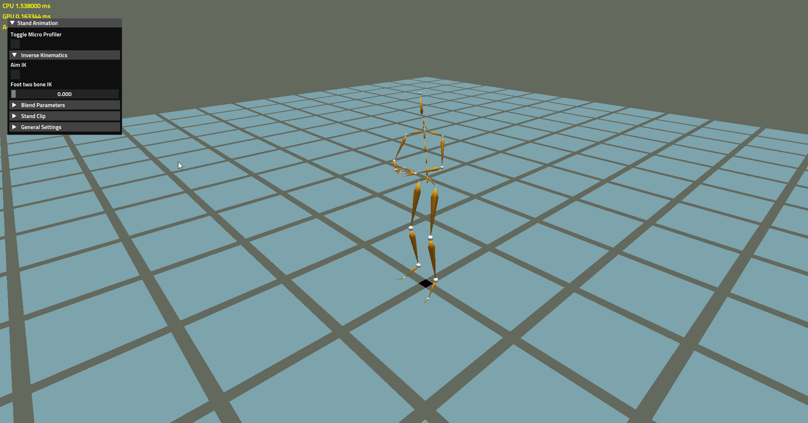

## 31. Audio Integration of SoLoud
We integrated SoLoad. Here is a unit test that allow's you make noise ...

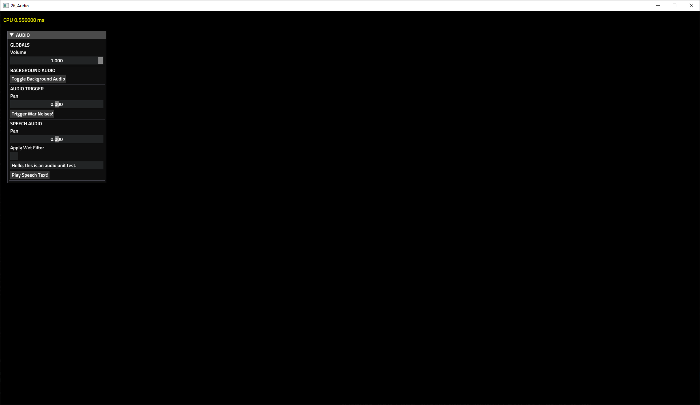


# Examples
There is an example implementation of the Triangle Visibility Buffer as covered in various conference talks. [Here](https://diaryofagraphicsprogrammer.blogspot.com/2018/03/triangle-visibility-buffer.html) is a blog entry that details the implementation in The Forge.


# Tools
Below are screenshots and descriptions of some of the tools we integrated.

## Ray Tracing Benchmark
Based on request we are providing a Ray Tracing Benchmark in 16_RayTracing. It allows you to compare the performance of three platforms: 
  * Windows with DirectX 12 DXR
  * Windows with Vulkan RTX
  * Linux with Vulkan RTX

  We will extend this benchmark to the non-public platforms we support to compare the PC performance with console performance. 
  The benchmark comes with batch files for all three platforms. Each run generates a HTML output file from the profiler that is integrated in TF. The default number of iterations is 64 but you can adjust that.  There is a Readme file in the 16_RayTracing folder that describes the options.

Windows DirectX 12 DXR, GeForce RTX 2070 Super, 3840x1600, NVIDIA Driver 441.99

 

Windows Vulkan RTX, GeForce RTX 2070 Super, 3840x1600, NVIDIA Driver 441.99

 


## Microprofiler
We integrated the [Micro Profiler](https://github.com/zeux/microprofile) into our code base by replacing the proprietary UI with imGUI and simplified the usage. Now it is much more tightly and consistently integrated in our code base.

Here are screenshots of the Microprofiler running the Visibility Buffer on PC:


Here are screenshots of the Microprofiler running a unit test on iOS:


Check out the [Wikipage](https://github.com/ConfettiFX/The-Forge/wiki/Microprofiler---How-to-Use) for an explanation on how to use it.

## Shader Translator
We provide a shader translator, that translates one shader language -a superset of HLSL called Forge Shader Language (FLS) - to the target shader language of all our target platforms. That includes the console and mobile platforms as well.
We expect this shader translator to be an easier to maintain solution for smaller game teams because it allows to add additional data to the shader source file with less effort. Such data could be for example a bucket classification or different shaders for different capability levels of the underlying platform, descriptor memory requirements or resource memory requirements in general, material info or just information to easier pre-compile pipelines.
The actual shader compilation will be done by the native compiler of the target platform.

 [How to use the Shader Translator](https://github.com/ConfettiFX/The-Forge/wiki/How-to-Use-The-Shader-Translator)


# Releases / Maintenance
Confetti will prepare releases when all the platforms are stable and running and push them to this GitHub repository. Up until a release, development will happen on internal servers. This is to sync up the console, mobile, macOS and PC versions of the source code.

# Products
We would appreciate it if you could send us a link in case your product uses The Forge. Here are the ones we received so far:

## StarVR One SDK
The Forge is used to build the StarVR One SDK:

<a href="https://www.starvr.com" target="_blank"></a>

## Torque 3D
The Forge is used as the rendering framework in Torque 3D:

<a href="http://www.garagegames.com/products/torque-3d" target="_blank"></a>

## Star Wars Galaxies Level Editor
SWB is an editor for the 2003 game 'Star Wars Galaxies' that can edit terrains, scenes, particles and import/export models via FBX. The editor uses an engine called 'atlas' that will be made open source in the future. It focuses on making efficient use of the new graphics APIs (with help from The-Forge!), ease-of-use and terrain rendering.


# Writing Guidelines
For contributions to The Forge we apply the following writing guidelines:
 * We limit all code to C++ 11 by setting the Clang and other compiler flags
 * We follow the [Orthodox C++ guidelines] (https://gist.github.com/bkaradzic/2e39896bc7d8c34e042b) minus C++ 14 support (see above)

# User Group Meetings 
There will be a user group meeting during GDC. In case you want to organize a user group meeting in your country / town at any other point in time, we would like to support this. We could send an engineer for a talk.

# Support for Education 
In case your School / College / University uses The Forge for education, we would like to support this as well. We could send an engineer or help create material. So far the following schools use The Forge for teaching:

[Breda University of Applied Sciences](https://www.buas.nl) 
```
        Contact:
        Jeremiah van Oosten 
        Monseigneur Hopmansstraat 1
        4817 JT Breda
 ```
[Ontario Tech University](https://uoit.ca/) 
```
        Contact:
        Andrew Hogue
        Ontario Tech University
        SIRC 4th floor
        2000 Simcoe St N
        Oshawa, ON, L1H 7K4
 ```


# Open-Source Libraries
The Forge utilizes the following Open-Source libraries:
* [Fontstash](https://github.com/memononen/fontstash)
* [Vectormath](https://github.com/glampert/vectormath)
* [Nothings](https://github.com/nothings/stb) single file libs 
  * [stb.h](https://github.com/nothings/stb/blob/master/stb.h)
  * [stb_image.h](https://github.com/nothings/stb/blob/master/stb_image.h)
  * [stb_image_resize.h](https://github.com/nothings/stb/blob/master/stb_image_resize.h)
  * [stb_image_write.h](https://github.com/nothings/stb/blob/master/stb_image_write.h)
* [shaderc](https://github.com/google/shaderc)
* [SPIRV_Cross](https://github.com/KhronosGroup/SPIRV-Cross)
* [TinyEXR](https://github.com/syoyo/tinyexr)
* [Vulkan Memory Allocator](https://github.com/GPUOpen-LibrariesAndSDKs/VulkanMemoryAllocator)
* [D3D12 Memory Allocator](https://github.com/GPUOpen-LibrariesAndSDKs/D3D12MemoryAllocator)
* [GeometryFX](https://gpuopen.com/gaming-product/geometryfx/)
* [WinPixEventRuntime](https://blogs.msdn.microsoft.com/pix/winpixeventruntime/)
* [Fluid Studios Memory Manager](http://www.paulnettle.com/)
* [volk Metaloader for Vulkan](https://github.com/zeux/volk)
* [gainput](https://github.com/jkuhlmann/gainput)
* [hlslparser](https://github.com/Thekla/hlslparser)
* [imGui](https://github.com/ocornut/imgui)
* [DirectX Shader Compiler](https://github.com/Microsoft/DirectXShaderCompiler)
* [Ozz Animation System](https://github.com/guillaumeblanc/ozz-animation)
* [Lua Scripting System](https://www.lua.org/)
* [TressFX](https://github.com/GPUOpen-Effects/TressFX)
* [Micro Profiler](https://github.com/zeux/microprofile)
* [MTuner](https://github.com/milostosic/MTuner) 
* [EASTL](https://github.com/electronicarts/EASTL/)
* [SoLoud](https://github.com/jarikomppa/soloud)
* [meshoptimizer](https://github.com/zeux/meshoptimizer)
* [Basis Universal Texture Support](https://github.com/binomialLLC/basis_universal)
* [TinyImageFormat](https://github.com/DeanoC/tiny_imageformat)
* [zip](https://github.com/kuba--/zip)
